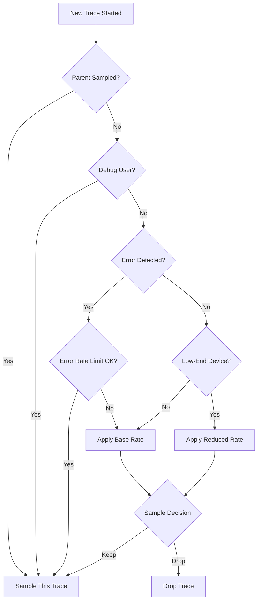

# How to Configure OpenTelemetry Sampling for Mobile Apps to Reduce Data Volume

Author: [nawazdhandala](https://www.github.com/nawazdhandala)

Tags: OpenTelemetry, Mobile, Sampling, iOS, Android, Data Volume

Description: Learn how to implement effective OpenTelemetry sampling strategies for mobile applications to reduce telemetry costs while maintaining visibility into critical user experiences and performance issues.

Mobile applications generate massive amounts of telemetry data. Every network request, database query, and UI interaction can produce spans and events. With thousands or millions of active users, sending every trace to your observability backend becomes prohibitively expensive and can drain device batteries. Sampling solves this problem by intelligently selecting which traces to keep while maintaining statistical validity.

## Understanding the Mobile Telemetry Challenge

Mobile apps face unique constraints compared to backend services. Device battery life, network data usage, and storage limitations mean you can't simply send everything to your backend. Additionally, mobile users expect apps to be responsive and efficient. Heavy telemetry overhead can degrade the very performance you're trying to measure.

Consider an app with 100,000 daily active users, each generating 1,000 spans per session. That's 100 million spans per day. At even a fraction of a cent per span ingested, costs spiral quickly. More importantly, this volume makes analysis difficult. Sampling reduces data volume while preserving the ability to identify issues and understand user behavior.

## Types of Sampling Strategies

OpenTelemetry supports multiple sampling strategies, each with different tradeoffs. Understanding these helps you choose the right approach for your mobile app.

**Head-based sampling** makes the decision to keep or drop a trace at the start, when the root span is created. This decision propagates to all child spans through context. Head sampling is simple and efficient for mobile devices since the decision happens once.

**Tail-based sampling** examines the entire trace after completion before deciding to keep it. This allows smarter decisions based on error status, duration, or other characteristics, but requires buffering complete traces on the device.

**Probability sampling** keeps a fixed percentage of traces randomly. A 10% sample rate means each trace has a 10% chance of being recorded.

**Rate limiting** ensures you don't exceed a maximum number of spans per time period, regardless of traffic volume.

For mobile apps, head-based sampling is typically the best choice due to its low overhead and immediate decision making.

## Implementing Probability-Based Sampling in iOS

Here's how to implement basic probability sampling in an iOS app using the OpenTelemetry Swift SDK:

```swift
import OpenTelemetryApi
import OpenTelemetrySdk

class MobileTelemetryConfiguration {
    static func createTracerProvider(sampleRate: Double) -> TracerProviderSdk {
        // Validate sample rate is between 0 and 1
        let validatedRate = min(max(sampleRate, 0.0), 1.0)

        // Create a probability sampler
        // This sampler will keep validatedRate percentage of traces
        let sampler = Samplers.probability(probability: validatedRate)

        // Configure the tracer provider with the sampler
        let tracerProvider = TracerProviderBuilder()
            .with(sampler: sampler)
            .with(resource: createMobileResource())
            .add(spanProcessor: createSpanProcessor())
            .build()

        return tracerProvider
    }

    private static func createMobileResource() -> Resource {
        // Add mobile-specific resource attributes
        return Resource(attributes: [
            ResourceAttributes.serviceName.rawValue: AttributeValue.string("MyMobileApp"),
            ResourceAttributes.serviceVersion.rawValue: AttributeValue.string(getAppVersion()),
            ResourceAttributes.deviceModelIdentifier.rawValue: AttributeValue.string(getDeviceModel()),
            ResourceAttributes.osName.rawValue: AttributeValue.string("iOS"),
            ResourceAttributes.osVersion.rawValue: AttributeValue.string(getOSVersion())
        ])
    }

    private static func createSpanProcessor() -> SpanProcessor {
        // Use batch processor to reduce network calls
        let exporter = createExporter()
        return BatchSpanProcessor(spanExporter: exporter)
    }
}
```

## Implementing Dynamic Sampling Based on Context

Static sampling rates work, but smart sampling adapts to context. Sample more aggressively during normal operation and capture more data when errors occur or for specific user segments.

```swift
import OpenTelemetryApi
import OpenTelemetrySdk

// Custom sampler that adjusts based on multiple factors
class AdaptiveMobileSampler: Sampler {
    private let baseSampleRate: Double
    private let errorSampleRate: Double
    private let debugUsers: Set<String>

    var description: String {
        return "AdaptiveMobileSampler(base: \(baseSampleRate), error: \(errorSampleRate))"
    }

    init(baseSampleRate: Double, errorSampleRate: Double, debugUsers: Set<String> = []) {
        self.baseSampleRate = baseSampleRate
        self.errorSampleRate = errorSampleRate
        self.debugUsers = debugUsers
    }

    func shouldSample(
        parentContext: SpanContext?,
        traceId: TraceId,
        name: String,
        kind: SpanKind,
        attributes: [String: AttributeValue],
        parentLinks: [SpanData.Link]
    ) -> SamplingResult {
        // Always sample if parent was sampled (preserve trace integrity)
        if let parent = parentContext, parent.traceFlags.sampled {
            return SamplingResult(decision: .recordAndSample)
        }

        // Check if this is a debug user
        if let userId = attributes["user.id"],
           case .string(let id) = userId,
           debugUsers.contains(id) {
            return SamplingResult(decision: .recordAndSample)
        }

        // Check if this trace involves an error
        // This is indicated by error-related span names or attributes
        let isError = name.lowercased().contains("error") ||
                     name.lowercased().contains("exception") ||
                     attributes.keys.contains("error")

        let sampleRate = isError ? errorSampleRate : baseSampleRate

        // Use trace ID for deterministic sampling
        // This ensures all spans in a trace get the same decision
        let traceIdValue = traceId.rawValue
        let threshold = UInt64(Double(UInt64.max) * sampleRate)

        // Hash the trace ID to get a deterministic value
        let hash = traceIdValue.reduce(UInt64(0)) { result, byte in
            result &* 31 &+ UInt64(byte)
        }

        let shouldSample = hash < threshold

        return SamplingResult(
            decision: shouldSample ? .recordAndSample : .drop,
            attributes: [
                "sampling.rate": AttributeValue.double(sampleRate),
                "sampling.type": AttributeValue.string(isError ? "error" : "base")
            ]
        )
    }
}
```

## Android Adaptive Sampling Implementation

Here's the equivalent adaptive sampling for Android applications:

```kotlin
import io.opentelemetry.api.common.Attributes
import io.opentelemetry.api.trace.SpanKind
import io.opentelemetry.context.Context
import io.opentelemetry.sdk.trace.samplers.Sampler
import io.opentelemetry.sdk.trace.samplers.SamplingResult

/**
 * Adaptive sampler for mobile applications that adjusts sampling based on:
 * - Base sample rate for normal operations
 * - Higher rate for errors and exceptions
 * - Full sampling for debug users
 * - Device performance characteristics
 */
class AdaptiveMobileSampler(
    private val baseSampleRate: Double = 0.1,
    private val errorSampleRate: Double = 0.5,
    private val debugUsers: Set<String> = emptySet(),
    private val lowEndDeviceSampleRate: Double = 0.05
) : Sampler {

    override fun shouldSample(
        parentContext: Context,
        traceId: String,
        name: String,
        spanKind: SpanKind,
        attributes: Attributes,
        parentLinks: List<io.opentelemetry.api.trace.Link>
    ): SamplingResult {
        // Check if parent was sampled
        val parentSpan = io.opentelemetry.api.trace.Span.fromContext(parentContext)
        if (parentSpan.spanContext.isSampled) {
            return SamplingResult.recordAndSample()
        }

        // Check for debug user
        val userId = attributes.get(io.opentelemetry.semconv.resource.attributes.ResourceAttributes.USER_ID)
        if (userId != null && debugUsers.contains(userId)) {
            return SamplingResult.recordAndSample()
        }

        // Determine if this is an error trace
        val isError = name.contains("error", ignoreCase = true) ||
                     name.contains("exception", ignoreCase = true) ||
                     attributes.asMap().keys.any { it.key.contains("error") }

        // Adjust for device performance
        val deviceSampleRate = if (isLowEndDevice()) {
            lowEndDeviceSampleRate
        } else if (isError) {
            errorSampleRate
        } else {
            baseSampleRate
        }

        // Deterministic sampling based on trace ID
        val shouldSample = shouldSampleTraceId(traceId, deviceSampleRate)

        return if (shouldSample) {
            SamplingResult.create(
                io.opentelemetry.sdk.trace.samplers.SamplingDecision.RECORD_AND_SAMPLE,
                Attributes.builder()
                    .put("sampling.rate", deviceSampleRate)
                    .put("sampling.type", if (isError) "error" else "base")
                    .put("device.tier", if (isLowEndDevice()) "low" else "normal")
                    .build()
            )
        } else {
            SamplingResult.drop()
        }
    }

    private fun shouldSampleTraceId(traceId: String, rate: Double): Boolean {
        // Use the first 8 bytes of trace ID for deterministic sampling
        val traceIdLong = traceId.substring(0, 16).toLongOrNull(16) ?: 0L
        val threshold = (Long.MAX_VALUE * rate).toLong()
        return Math.abs(traceIdLong) < threshold
    }

    private fun isLowEndDevice(): Boolean {
        // Check device characteristics
        val activityManager = android.app.ActivityManager()
        return activityManager.isLowRamDevice ||
               Runtime.getRuntime().availableProcessors() <= 4
    }

    override fun getDescription(): String {
        return "AdaptiveMobileSampler{base=$baseSampleRate, error=$errorSampleRate}"
    }
}
```

## Implementing User-Tier Based Sampling

Different user segments may require different sampling rates. Premium users or beta testers might warrant higher sampling for better support.

```swift
import OpenTelemetryApi

class UserTierSampler: Sampler {
    enum UserTier {
        case free
        case premium
        case beta
        case internal

        var sampleRate: Double {
            switch self {
            case .free: return 0.01      // 1% of free users
            case .premium: return 0.10   // 10% of premium users
            case .beta: return 0.50      // 50% of beta users
            case .internal: return 1.0   // 100% of internal users
            }
        }
    }

    private let userTierProvider: () -> UserTier

    var description: String {
        return "UserTierSampler"
    }

    init(userTierProvider: @escaping () -> UserTier) {
        self.userTierProvider = userTierProvider
    }

    func shouldSample(
        parentContext: SpanContext?,
        traceId: TraceId,
        name: String,
        kind: SpanKind,
        attributes: [String: AttributeValue],
        parentLinks: [SpanData.Link]
    ) -> SamplingResult {
        // Honor parent sampling decision
        if let parent = parentContext, parent.traceFlags.sampled {
            return SamplingResult(decision: .recordAndSample)
        }

        let userTier = userTierProvider()
        let sampleRate = userTier.sampleRate

        // Deterministic sampling based on trace ID
        let traceIdValue = traceId.rawValue
        let threshold = UInt64(Double(UInt64.max) * sampleRate)
        let hash = traceIdValue.reduce(UInt64(0)) { result, byte in
            result &* 31 &+ UInt64(byte)
        }

        let shouldSample = hash < threshold

        return SamplingResult(
            decision: shouldSample ? .recordAndSample : .drop,
            attributes: [
                "sampling.rate": AttributeValue.double(sampleRate),
                "user.tier": AttributeValue.string("\(userTier)")
            ]
        )
    }
}
```

## Rate-Limited Sampling for Cost Control

To strictly control costs, implement rate limiting that caps the maximum number of spans per time window:

```kotlin
import io.opentelemetry.sdk.trace.samplers.Sampler
import io.opentelemetry.sdk.trace.samplers.SamplingResult
import java.util.concurrent.atomic.AtomicInteger
import java.util.concurrent.atomic.AtomicLong

/**
 * Rate-limiting sampler that ensures no more than maxSpansPerSecond
 * are sampled, providing strict cost control for mobile telemetry.
 */
class RateLimitingSampler(
    private val maxSpansPerSecond: Int,
    private val fallbackSampler: Sampler
) : Sampler {

    private val spansThisSecond = AtomicInteger(0)
    private val currentSecond = AtomicLong(System.currentTimeMillis() / 1000)

    override fun shouldSample(
        parentContext: Context,
        traceId: String,
        name: String,
        spanKind: SpanKind,
        attributes: Attributes,
        parentLinks: List<io.opentelemetry.api.trace.Link>
    ): SamplingResult {
        // Honor parent sampling decisions
        val parentSpan = io.opentelemetry.api.trace.Span.fromContext(parentContext)
        if (parentSpan.spanContext.isSampled) {
            return SamplingResult.recordAndSample()
        }

        // Check current time window
        val now = System.currentTimeMillis() / 1000

        // Reset counter if we're in a new second
        if (currentSecond.compareAndSet(currentSecond.get(), now)) {
            // We're still in the same second
        } else {
            // New second, reset counter
            spansThisSecond.set(0)
        }

        // Check if we're under the rate limit
        val currentCount = spansThisSecond.incrementAndGet()
        if (currentCount <= maxSpansPerSecond) {
            // Under limit, sample this span
            return SamplingResult.create(
                io.opentelemetry.sdk.trace.samplers.SamplingDecision.RECORD_AND_SAMPLE,
                Attributes.builder()
                    .put("sampling.type", "rate_limited")
                    .put("sampling.rate_limit", maxSpansPerSecond)
                    .build()
            )
        }

        // Over limit, fall back to lower sampling rate
        return fallbackSampler.shouldSample(
            parentContext,
            traceId,
            name,
            spanKind,
            attributes,
            parentLinks
        )
    }

    override fun getDescription(): String {
        return "RateLimitingSampler{maxPerSecond=$maxSpansPerSecond, fallback=${fallbackSampler.description}}"
    }
}
```

## Sampling Strategy Decision Flow

Here's how different sampling strategies work together:



## Configuration Best Practices

When configuring sampling for mobile apps, start with these baseline rates and adjust based on your specific needs:

**Free tier users**: 1-5% sampling provides statistical validity while minimizing cost. With large user bases, this still captures thousands of traces daily.

**Paid users**: 10-25% sampling gives better visibility for support and debugging without overwhelming your backend.

**Beta testers**: 50-100% sampling helps identify issues before general release.

**Error traces**: Always sample at higher rates (50-100%) for traces containing errors. These are your most valuable signals for reliability.

**Critical operations**: Payment flows, authentication, and other critical paths should be sampled at 100% or close to it. The cost is justified by the business impact.

**Background operations**: Reduce sampling for background sync, prefetch, and other non-user-facing operations.

Monitor your sampling effectiveness by tracking the sampled vs. dropped span ratio and adjusting rates to balance cost and visibility.

## Measuring Sampling Impact

Track these metrics to ensure your sampling strategy works effectively:

```swift
class SamplingMetrics {
    static func recordSamplingDecision(sampled: Bool, reason: String) {
        let counter = sampled ? "spans.sampled" : "spans.dropped"
        // Increment your metrics counter
        MetricsManager.shared.increment(counter, tags: ["reason": reason])
    }

    static func calculateSamplingRate() -> Double {
        let sampled = MetricsManager.shared.getCount("spans.sampled")
        let dropped = MetricsManager.shared.getCount("spans.dropped")
        let total = sampled + dropped

        guard total > 0 else { return 0.0 }
        return Double(sampled) / Double(total)
    }
}
```

Effective sampling transforms mobile observability from prohibitively expensive to sustainable. By sampling intelligently based on user tier, error status, and device characteristics, you maintain visibility into critical issues while controlling costs. The key is finding the right balance for your specific application and user base.
