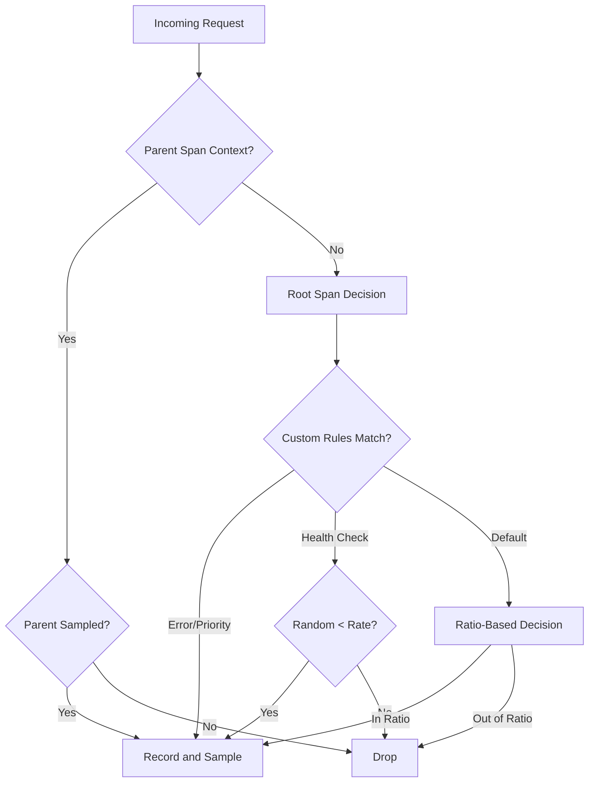

# How to Configure OpenTelemetry Sampling Strategies in Spring Boot Applications

Author: [nawazdhandala](https://www.github.com/nawazdhandala)

Tags: OpenTelemetry, Sampling, Spring Boot, Java, Performance, Configuration

Description: Learn how to implement and configure different OpenTelemetry sampling strategies in Spring Boot to optimize trace collection, reduce overhead, and control observability costs.

Sampling is one of the most critical aspects of distributed tracing in production environments. When your Spring Boot application handles thousands of requests per second, collecting every single trace becomes impractical and expensive. OpenTelemetry provides flexible sampling strategies that help you balance observability needs with performance and cost constraints.

Understanding why sampling matters starts with recognizing the overhead of trace collection. Every traced operation adds CPU cycles for context propagation, memory for span storage, and network bandwidth for exporting data. In high-throughput systems, this overhead compounds quickly. Sampling allows you to make intelligent decisions about which traces to collect while still maintaining visibility into system behavior.

## Understanding OpenTelemetry Sampling

OpenTelemetry distinguishes between two types of sampling decisions: head-based sampling and tail-based sampling. Head-based sampling makes decisions at the start of a trace, before any spans are created. This approach is computationally efficient but lacks context about how the trace will develop. Tail-based sampling waits until the trace completes before deciding whether to keep it, allowing for smarter decisions based on trace characteristics like errors or latency.

The SDK provides several built-in samplers that cover common use cases. The AlwaysOnSampler collects every trace, useful for development but impractical in production. The AlwaysOffSampler drops everything, occasionally useful for temporarily disabling tracing. The TraceIdRatioBased sampler keeps a consistent percentage of traces based on trace ID, ensuring distributed consistency. The ParentBased sampler respects sampling decisions from parent spans, maintaining consistency across service boundaries.

## Basic Sampling Configuration

Start by adding the necessary dependencies to your Spring Boot project. The OpenTelemetry SDK autoconfigure module handles most of the heavy lifting.

```xml
<dependency>
    <groupId>io.opentelemetry</groupId>
    <artifactId>opentelemetry-sdk-extension-autoconfigure</artifactId>
    <version>1.35.0</version>
</dependency>
<dependency>
    <groupId>io.opentelemetry.instrumentation</groupId>
    <artifactId>opentelemetry-spring-boot-starter</artifactId>
    <version>2.1.0-alpha</version>
</dependency>
```

Configure basic ratio-based sampling in your application.yml. This configuration samples 10% of all traces.

```yaml
otel:
  traces:
    sampler:
      # Use ratio-based sampling to collect 10% of traces
      type: traceidratio
      arg: 0.1
  service:
    name: payment-service
  exporter:
    otlp:
      endpoint: http://localhost:4318
```

For more control, implement custom sampling logic using the Java SDK directly. Create a configuration class that defines your sampling strategy.

```java
package com.oneuptime.config;

import io.opentelemetry.api.trace.SpanKind;
import io.opentelemetry.sdk.trace.samplers.Sampler;
import io.opentelemetry.sdk.autoconfigure.spi.ConfigProperties;
import io.opentelemetry.sdk.autoconfigure.spi.traces.ConfigurableSamplerProvider;
import org.springframework.context.annotation.Bean;
import org.springframework.context.annotation.Configuration;

@Configuration
public class SamplingConfiguration {

    /**
     * Create a parent-based sampler that respects upstream sampling decisions
     * while applying ratio-based sampling for root spans
     */
    @Bean
    public Sampler customSampler() {
        // Sample 20% of root spans, but always respect parent decisions
        return Sampler.parentBased(
            Sampler.traceIdRatioBased(0.2)
        );
    }
}
```

## Advanced Sampling Strategies

Real production environments often require sophisticated sampling logic based on request characteristics. You might want to always sample error traces while applying aggressive sampling to successful health checks.

Create a custom sampler that implements business logic for sampling decisions.

```java
package com.oneuptime.sampling;

import io.opentelemetry.api.common.Attributes;
import io.opentelemetry.api.trace.SpanKind;
import io.opentelemetry.context.Context;
import io.opentelemetry.sdk.trace.data.LinkData;
import io.opentelemetry.sdk.trace.samplers.Sampler;
import io.opentelemetry.sdk.trace.samplers.SamplingResult;
import io.opentelemetry.semconv.SemanticAttributes;

import java.util.List;

/**
 * Custom sampler that applies different sampling rates based on
 * endpoint patterns, HTTP status codes, and span characteristics
 */
public class RuleBasedSampler implements Sampler {

    private final Sampler defaultSampler;
    private final double healthCheckSampleRate;
    private final double errorSampleRate;

    public RuleBasedSampler(
            double defaultRate,
            double healthCheckRate,
            double errorRate) {
        this.defaultSampler = Sampler.traceIdRatioBased(defaultRate);
        this.healthCheckSampleRate = healthCheckRate;
        this.errorSampleRate = errorRate;
    }

    @Override
    public SamplingResult shouldSample(
            Context parentContext,
            String traceId,
            String name,
            SpanKind spanKind,
            Attributes attributes,
            List<LinkData> parentLinks) {

        // Always sample errors regardless of other rules
        Long statusCode = attributes.get(SemanticAttributes.HTTP_STATUS_CODE);
        if (statusCode != null && statusCode >= 400) {
            return SamplingResult.recordAndSample();
        }

        // Apply reduced sampling for health check endpoints
        String httpTarget = attributes.get(SemanticAttributes.HTTP_TARGET);
        if (httpTarget != null &&
            (httpTarget.equals("/health") || httpTarget.equals("/actuator/health"))) {
            double random = Math.random();
            if (random < healthCheckSampleRate) {
                return SamplingResult.recordAndSample();
            }
            return SamplingResult.drop();
        }

        // Sample high-value endpoints more aggressively
        if (httpTarget != null && httpTarget.startsWith("/api/payment")) {
            return SamplingResult.recordAndSample();
        }

        // Fall back to default sampling strategy
        return defaultSampler.shouldSample(
            parentContext, traceId, name, spanKind, attributes, parentLinks
        );
    }

    @Override
    public String getDescription() {
        return "RuleBasedSampler{default=0.1, healthCheck=0.01, errors=1.0}";
    }
}
```

Wire up the custom sampler in your configuration.

```java
package com.oneuptime.config;

import com.oneuptime.sampling.RuleBasedSampler;
import io.opentelemetry.sdk.trace.samplers.Sampler;
import org.springframework.beans.factory.annotation.Value;
import org.springframework.context.annotation.Bean;
import org.springframework.context.annotation.Configuration;

@Configuration
public class AdvancedSamplingConfiguration {

    @Value("${sampling.default.rate:0.1}")
    private double defaultRate;

    @Value("${sampling.healthcheck.rate:0.01}")
    private double healthCheckRate;

    @Value("${sampling.error.rate:1.0}")
    private double errorRate;

    /**
     * Configure rule-based sampler with different rates for different
     * types of requests
     */
    @Bean
    public Sampler ruleSampler() {
        return Sampler.parentBased(
            new RuleBasedSampler(defaultRate, healthCheckRate, errorRate)
        );
    }
}
```

## Environment-Specific Sampling

Different environments have different observability needs. Development environments benefit from complete trace collection, while production requires selective sampling to manage costs.

Create a configuration that adapts sampling strategy based on active Spring profiles.

```java
package com.oneuptime.config;

import io.opentelemetry.sdk.trace.samplers.Sampler;
import org.springframework.context.annotation.Bean;
import org.springframework.context.annotation.Configuration;
import org.springframework.context.annotation.Profile;

@Configuration
public class EnvironmentSamplingConfiguration {

    /**
     * Development environment: capture all traces for debugging
     */
    @Bean
    @Profile("dev")
    public Sampler devSampler() {
        return Sampler.alwaysOn();
    }

    /**
     * Staging environment: high sampling rate for pre-production testing
     */
    @Bean
    @Profile("staging")
    public Sampler stagingSampler() {
        return Sampler.parentBased(
            Sampler.traceIdRatioBased(0.5)
        );
    }

    /**
     * Production environment: conservative sampling with parent-based decisions
     */
    @Bean
    @Profile("prod")
    public Sampler prodSampler() {
        return Sampler.parentBased(
            Sampler.traceIdRatioBased(0.1)
        );
    }
}
```

## Sampling Decision Flow

Understanding how sampling decisions propagate through your distributed system helps you design effective strategies.



## Dynamic Sampling with Spring Boot Actuator

For production systems, the ability to adjust sampling rates without restarting services proves invaluable. Implement dynamic sampling configuration using Spring Boot properties.

```java
package com.oneuptime.sampling;

import io.opentelemetry.api.common.Attributes;
import io.opentelemetry.api.trace.SpanKind;
import io.opentelemetry.context.Context;
import io.opentelemetry.sdk.trace.data.LinkData;
import io.opentelemetry.sdk.trace.samplers.Sampler;
import io.opentelemetry.sdk.trace.samplers.SamplingResult;
import org.springframework.boot.context.properties.ConfigurationProperties;
import org.springframework.cloud.context.config.annotation.RefreshScope;
import org.springframework.stereotype.Component;

import java.util.List;
import java.util.concurrent.atomic.AtomicReference;

/**
 * Dynamic sampler that can update sampling rates at runtime
 * when configuration is refreshed
 */
@Component
@RefreshScope
@ConfigurationProperties(prefix = "sampling")
public class DynamicSampler implements Sampler {

    private final AtomicReference<Sampler> delegate = new AtomicReference<>();

    private double rate = 0.1;

    public void setRate(double rate) {
        this.rate = rate;
        this.delegate.set(Sampler.traceIdRatioBased(rate));
    }

    public double getRate() {
        return rate;
    }

    @Override
    public SamplingResult shouldSample(
            Context parentContext,
            String traceId,
            String name,
            SpanKind spanKind,
            Attributes attributes,
            List<LinkData> parentLinks) {

        Sampler currentSampler = delegate.get();
        if (currentSampler == null) {
            currentSampler = Sampler.traceIdRatioBased(rate);
            delegate.set(currentSampler);
        }

        return currentSampler.shouldSample(
            parentContext, traceId, name, spanKind, attributes, parentLinks
        );
    }

    @Override
    public String getDescription() {
        return String.format("DynamicSampler{rate=%.3f}", rate);
    }
}
```

Add configuration properties that can be updated via Spring Cloud Config or similar systems.

```yaml
sampling:
  rate: 0.1

management:
  endpoints:
    web:
      exposure:
        include: refresh,health,info
```

## Testing Sampling Strategies

Validate your sampling configuration with integration tests that verify sampling behavior under different conditions.

```java
package com.oneuptime.sampling;

import io.opentelemetry.api.common.AttributeKey;
import io.opentelemetry.api.common.Attributes;
import io.opentelemetry.api.trace.SpanKind;
import io.opentelemetry.context.Context;
import io.opentelemetry.sdk.trace.samplers.SamplingResult;
import io.opentelemetry.sdk.trace.samplers.SamplingDecision;
import io.opentelemetry.semconv.SemanticAttributes;
import org.junit.jupiter.api.Test;

import java.util.Collections;

import static org.junit.jupiter.api.Assertions.*;

/**
 * Tests for rule-based sampling behavior
 */
class RuleBasedSamplerTest {

    @Test
    void shouldAlwaysSampleErrors() {
        RuleBasedSampler sampler = new RuleBasedSampler(0.1, 0.01, 1.0);

        Attributes attributes = Attributes.of(
            SemanticAttributes.HTTP_STATUS_CODE, 500L,
            SemanticAttributes.HTTP_TARGET, "/api/users"
        );

        SamplingResult result = sampler.shouldSample(
            Context.root(),
            "trace-id-123",
            "GET /api/users",
            SpanKind.SERVER,
            attributes,
            Collections.emptyList()
        );

        assertEquals(SamplingDecision.RECORD_AND_SAMPLE, result.getDecision());
    }

    @Test
    void shouldReduceSamplingForHealthChecks() {
        RuleBasedSampler sampler = new RuleBasedSampler(0.1, 0.0, 1.0);

        Attributes attributes = Attributes.of(
            SemanticAttributes.HTTP_STATUS_CODE, 200L,
            SemanticAttributes.HTTP_TARGET, "/health"
        );

        SamplingResult result = sampler.shouldSample(
            Context.root(),
            "trace-id-456",
            "GET /health",
            SpanKind.SERVER,
            attributes,
            Collections.emptyList()
        );

        assertEquals(SamplingDecision.DROP, result.getDecision());
    }

    @Test
    void shouldSamplePaymentEndpoints() {
        RuleBasedSampler sampler = new RuleBasedSampler(0.1, 0.01, 1.0);

        Attributes attributes = Attributes.of(
            SemanticAttributes.HTTP_STATUS_CODE, 200L,
            SemanticAttributes.HTTP_TARGET, "/api/payment/process"
        );

        SamplingResult result = sampler.shouldSample(
            Context.root(),
            "trace-id-789",
            "POST /api/payment/process",
            SpanKind.SERVER,
            attributes,
            Collections.emptyList()
        );

        assertEquals(SamplingDecision.RECORD_AND_SAMPLE, result.getDecision());
    }
}
```

## Monitoring Sampling Effectiveness

Track how your sampling strategy performs in production by exposing metrics about sampling decisions.

```java
package com.oneuptime.metrics;

import io.micrometer.core.instrument.Counter;
import io.micrometer.core.instrument.MeterRegistry;
import io.opentelemetry.api.common.Attributes;
import io.opentelemetry.api.trace.SpanKind;
import io.opentelemetry.context.Context;
import io.opentelemetry.sdk.trace.data.LinkData;
import io.opentelemetry.sdk.trace.samplers.Sampler;
import io.opentelemetry.sdk.trace.samplers.SamplingResult;
import org.springframework.stereotype.Component;

import java.util.List;

/**
 * Wrapper sampler that tracks sampling decisions as metrics
 */
@Component
public class MonitoredSampler implements Sampler {

    private final Sampler delegate;
    private final Counter sampledCounter;
    private final Counter droppedCounter;

    public MonitoredSampler(Sampler delegate, MeterRegistry meterRegistry) {
        this.delegate = delegate;
        this.sampledCounter = Counter.builder("traces.sampled")
            .description("Number of traces sampled")
            .register(meterRegistry);
        this.droppedCounter = Counter.builder("traces.dropped")
            .description("Number of traces dropped by sampling")
            .register(meterRegistry);
    }

    @Override
    public SamplingResult shouldSample(
            Context parentContext,
            String traceId,
            String name,
            SpanKind spanKind,
            Attributes attributes,
            List<LinkData> parentLinks) {

        SamplingResult result = delegate.shouldSample(
            parentContext, traceId, name, spanKind, attributes, parentLinks
        );

        // Track the decision in metrics
        if (result.getDecision().isSampled()) {
            sampledCounter.increment();
        } else {
            droppedCounter.increment();
        }

        return result;
    }

    @Override
    public String getDescription() {
        return "MonitoredSampler{delegate=" + delegate.getDescription() + "}";
    }
}
```

Proper sampling configuration requires understanding your application's traffic patterns, cost constraints, and observability requirements. Start conservative with low sampling rates and increase selectively for high-value endpoints. Always sample errors to maintain visibility into failures. Use parent-based sampling to maintain consistency across service boundaries. Monitor your sampling metrics to ensure the strategy achieves the right balance between observability and efficiency.
