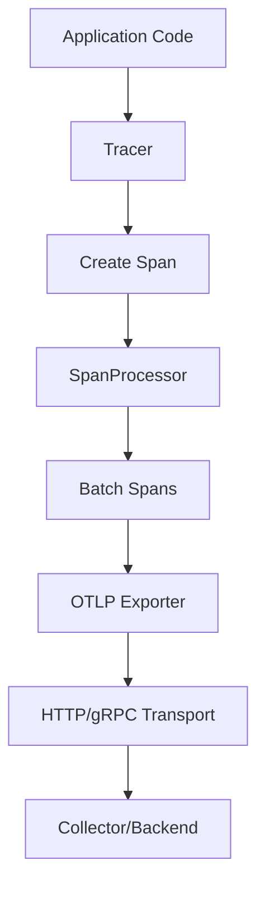

# How to Use opentelemetry-sdk and opentelemetry-exporter-otlp Gems

Author: [nawazdhandala](https://www.github.com/nawazdhandala)

Tags: OpenTelemetry, Ruby, SDK, OTLP, Gems, Exporter

Description: Comprehensive guide to configuring and using the core OpenTelemetry SDK and OTLP exporter gems for custom instrumentation in Ruby applications.

The OpenTelemetry SDK is the engine that creates, processes, and exports telemetry data from your Ruby applications. While instrumentation libraries handle automatic tracing for frameworks and libraries, the SDK provides the foundation they all build on. Understanding the SDK means you can customize every aspect of how your application generates and exports traces.

The OTLP (OpenTelemetry Protocol) exporter is the standard way to send telemetry data from your application to collectors and backends. It supports both HTTP and gRPC transports, handles batching and retries, and works with any OTLP-compatible backend. Together, these gems give you complete control over observability in your Ruby applications.

## Core Concepts of the SDK

The OpenTelemetry SDK consists of several key components that work together:

**TracerProvider**: Factory for creating tracers. Each application should have one TracerProvider configured at startup.

**Tracer**: Creates spans. You get tracers from the provider, identified by instrumentation library name and version.

**Span**: Represents a single operation. Contains timing, attributes, events, and links to other spans.

**SpanProcessor**: Processes spans as they're created and ended. Handles batching and export.

**Exporter**: Sends span data to a backend. The OTLP exporter is the most common choice.



## Installing the Required Gems

Add both gems to your Gemfile:

```ruby
# Gemfile

# Core SDK with trace API implementation
gem 'opentelemetry-sdk'

# OTLP exporter for sending traces
gem 'opentelemetry-exporter-otlp'

# Optional: API gem (usually pulled in as dependency)
gem 'opentelemetry-api'
```

Run bundle install:

```bash
bundle install
```

The SDK gem includes everything needed to create and manage spans. The exporter gem provides the transport layer for sending data.

## Basic SDK Configuration

Start with a minimal configuration to understand how the pieces fit together:

```ruby
# config/telemetry.rb

require 'opentelemetry/sdk'
require 'opentelemetry/exporter/otlp'

# Configure the SDK
OpenTelemetry::SDK.configure do |c|
  # Set service name (required for meaningful traces)
  c.service_name = 'my-ruby-app'

  # Create an OTLP exporter
  exporter = OpenTelemetry::Exporter::OTLP::Exporter.new(
    endpoint: 'http://localhost:4318/v1/traces'
  )

  # Add a span processor that uses the exporter
  processor = OpenTelemetry::SDK::Trace::Export::BatchSpanProcessor.new(exporter)
  c.add_span_processor(processor)
end

# Get the configured tracer provider
tracer_provider = OpenTelemetry.tracer_provider

# Create a tracer for your application
tracer = tracer_provider.tracer('my-app', '1.0.0')
```

Now you can create spans:

```ruby
# Example usage
tracer.in_span('operation_name') do |span|
  span.set_attribute('key', 'value')

  # Your business logic
  result = perform_work

  span.set_attribute('result', result)
end
```

## Configuring the OTLP Exporter

The OTLP exporter supports extensive configuration for different deployment scenarios:

```ruby
# config/telemetry.rb

require 'opentelemetry/sdk'
require 'opentelemetry/exporter/otlp'

# Create exporter with full configuration
exporter = OpenTelemetry::Exporter::OTLP::Exporter.new(
  # Endpoint URL (include path for HTTP, omit for gRPC)
  endpoint: ENV.fetch('OTEL_EXPORTER_OTLP_ENDPOINT', 'http://localhost:4318/v1/traces'),

  # Headers for authentication or metadata
  headers: {
    'Authorization' => "Bearer #{ENV['OTEL_AUTH_TOKEN']}",
    'X-Custom-Header' => 'custom-value'
  },

  # Timeout for export requests (seconds)
  timeout: 10,

  # Compression (gzip or none)
  compression: 'gzip',

  # SSL/TLS options for HTTPS endpoints
  ssl_verify_mode: OpenSSL::SSL::VERIFY_PEER
)

OpenTelemetry::SDK.configure do |c|
  c.service_name = 'my-app'

  # Use the configured exporter
  c.add_span_processor(
    OpenTelemetry::SDK::Trace::Export::BatchSpanProcessor.new(exporter)
  )
end
```

## HTTP vs gRPC Transport

The OTLP exporter supports both HTTP and gRPC transports. The endpoint format determines which is used:

**HTTP/Protobuf** (default):
```ruby
# HTTP transport with full path
endpoint: 'http://collector:4318/v1/traces'

# HTTPS with authentication
endpoint: 'https://api.example.com/v1/traces'
```

**gRPC**:
```ruby
# gRPC requires a different gem
gem 'opentelemetry-exporter-otlp-grpc'

require 'opentelemetry/exporter/otlp/grpc'

exporter = OpenTelemetry::Exporter::OTLP::Exporter.new(
  endpoint: 'grpc://collector:4317',  # gRPC uses port 4317 by default
  insecure: false  # Use TLS
)
```

HTTP is simpler and works through most firewalls and proxies. gRPC is more efficient for high-volume scenarios but requires more network configuration.

## Resource Attributes and Service Information

Resources describe the entity producing telemetry. They include service name, version, environment, and other identifying information:

```ruby
# config/telemetry.rb

OpenTelemetry::SDK.configure do |c|
  # Simple service name
  c.service_name = 'payment-service'

  # Or create a full resource with multiple attributes
  c.resource = OpenTelemetry::SDK::Resources::Resource.create({
    # Standard semantic conventions
    'service.name' => 'payment-service',
    'service.version' => ENV.fetch('APP_VERSION', 'unknown'),
    'service.namespace' => ENV.fetch('NAMESPACE', 'production'),
    'service.instance.id' => ENV.fetch('HOSTNAME', Socket.gethostname),

    # Deployment information
    'deployment.environment' => ENV.fetch('RAILS_ENV', 'development'),

    # Cloud provider attributes (if applicable)
    'cloud.provider' => 'aws',
    'cloud.region' => ENV['AWS_REGION'],
    'cloud.availability_zone' => ENV['AWS_AVAILABILITY_ZONE'],

    # Container/orchestration
    'container.id' => ENV['CONTAINER_ID'],
    'k8s.namespace.name' => ENV['K8S_NAMESPACE'],
    'k8s.pod.name' => ENV['K8S_POD_NAME'],

    # Custom attributes
    'team.name' => 'platform',
    'cost.center' => 'engineering'
  })

  # Rest of configuration...
end
```

These resource attributes appear on every span, making it easy to filter and group traces by service, environment, or deployment.

## Span Processors: Batch vs Simple

The span processor controls when and how spans are exported. Two processors are commonly used:

**BatchSpanProcessor** (recommended for production):
```ruby
# Collects spans and exports them in batches
processor = OpenTelemetry::SDK::Trace::Export::BatchSpanProcessor.new(
  exporter,

  # Maximum queue size before dropping spans
  max_queue_size: 2048,

  # How many spans to export at once
  max_export_batch_size: 512,

  # Delay between exports (milliseconds)
  schedule_delay: 5000,

  # Timeout for export operations (milliseconds)
  exporter_timeout: 30000
)

OpenTelemetry::SDK.configure do |c|
  c.add_span_processor(processor)
end
```

**SimpleSpanProcessor** (useful for development and debugging):
```ruby
# Exports each span immediately when it ends
processor = OpenTelemetry::SDK::Trace::Export::SimpleSpanProcessor.new(exporter)

OpenTelemetry::SDK.configure do |c|
  c.add_span_processor(processor)
end
```

Batch processing reduces overhead and network traffic. Simple processing helps debugging since spans appear immediately, but it adds latency to every operation.

## Implementing Custom Span Processors

You can create custom processors for special requirements like filtering, sampling, or enrichment:

```ruby
# lib/custom_span_processor.rb

class CustomSpanProcessor
  def initialize
    @processed_count = 0
  end

  # Called when a span starts
  def on_start(span, parent_context)
    # Add custom logic here
    # Example: Add a custom attribute to all spans
    span.set_attribute('processor.custom', true)
  end

  # Called when a span ends
  def on_finish(span)
    @processed_count += 1

    # Filter spans based on attributes
    if should_drop_span?(span)
      return  # Don't export this span
    end

    # Enrich span with additional data
    enrich_span(span)

    # Log every 1000th span for monitoring
    if @processed_count % 1000 == 0
      puts "Processed #{@processed_count} spans"
    end
  end

  # Called on SDK shutdown
  def shutdown(timeout: nil)
    puts "Final count: #{@processed_count} spans"
  end

  # Called to force export pending spans
  def force_flush(timeout: nil)
    true
  end

  private

  def should_drop_span?(span)
    # Drop health check spans
    span.name == '/health' || span.name == '/metrics'
  end

  def enrich_span(span)
    # Add server information
    span.set_attribute('server.hostname', Socket.gethostname)
    span.set_attribute('server.pid', Process.pid)
  end
end
```

Chain processors to combine behavior:

```ruby
OpenTelemetry::SDK.configure do |c|
  c.service_name = 'my-app'

  # Add custom processor first
  c.add_span_processor(CustomSpanProcessor.new)

  # Then add batch exporter
  c.add_span_processor(
    OpenTelemetry::SDK::Trace::Export::BatchSpanProcessor.new(exporter)
  )
end
```

Processors run in the order they're added. Your custom processor can modify spans before they reach the exporter.

## Implementing Sampling Strategies

Sampling reduces the volume of traces while maintaining statistical significance:

```ruby
# config/telemetry.rb

OpenTelemetry::SDK.configure do |c|
  c.service_name = 'high-traffic-api'

  # Sample 10% of traces
  c.sampler = OpenTelemetry::SDK::Trace::Samplers::TraceIdRatioBased.new(0.1)

  # Rest of configuration...
end
```

More sophisticated sampling strategies:

```ruby
# lib/adaptive_sampler.rb

class AdaptiveSampler
  # Samples based on span attributes
  def should_sample?(trace_id:, parent_context:, links:, name:, kind:, attributes:, config:)
    # Always sample errors
    if attributes['error'] == true
      return OpenTelemetry::SDK::Trace::Samplers::Decision::RECORD_AND_SAMPLE
    end

    # Always sample slow operations
    if attributes['operation.slow'] == true
      return OpenTelemetry::SDK::Trace::Samplers::Decision::RECORD_AND_SAMPLE
    end

    # Sample health checks at 1%
    if name.include?('health')
      return should_sample_with_ratio?(trace_id, 0.01)
    end

    # Default 10% sampling
    should_sample_with_ratio?(trace_id, 0.1)
  end

  def description
    'AdaptiveSampler'
  end

  private

  def should_sample_with_ratio?(trace_id, ratio)
    # Use trace ID to make consistent sampling decisions
    if trace_id.unpack1('Q>') < (ratio * 2**64)
      OpenTelemetry::SDK::Trace::Samplers::Decision::RECORD_AND_SAMPLE
    else
      OpenTelemetry::SDK::Trace::Samplers::Decision::DROP
    end
  end
end
```

Use parent-based sampling to maintain trace continuity:

```ruby
OpenTelemetry::SDK.configure do |c|
  # Respects parent span's sampling decision
  c.sampler = OpenTelemetry::SDK::Trace::Samplers::ParentBased.new(
    root: AdaptiveSampler.new  # Only applies to root spans
  )
end
```

## Creating Tracers and Spans Manually

While instrumentation libraries handle most tracing automatically, you need manual spans for custom logic:

```ruby
# lib/payment_processor.rb

require 'opentelemetry'

class PaymentProcessor
  def initialize
    # Get a tracer specific to this component
    @tracer = OpenTelemetry.tracer_provider.tracer(
      'payment-processor',  # Library name
      '2.1.0'               # Library version
    )
  end

  def process_payment(order_id, amount, currency)
    # Create a span for the entire operation
    @tracer.in_span('process_payment', attributes: {
      'order.id' => order_id,
      'payment.amount' => amount,
      'payment.currency' => currency
    }) do |span|

      # Validate payment
      validation_result = validate_payment(order_id, amount)
      span.set_attribute('payment.valid', validation_result)

      unless validation_result
        span.add_event('Payment validation failed')
        return { success: false, error: 'Invalid payment' }
      end

      # Charge the payment
      charge_result = charge_card(amount, currency)
      span.set_attribute('payment.transaction_id', charge_result[:transaction_id])

      if charge_result[:success]
        span.add_event('Payment successful', attributes: {
          'transaction_id' => charge_result[:transaction_id]
        })

        { success: true, transaction_id: charge_result[:transaction_id] }
      else
        span.record_exception(StandardError.new(charge_result[:error]))
        { success: false, error: charge_result[:error] }
      end
    end
  end

  private

  def validate_payment(order_id, amount)
    # Create nested span for validation
    @tracer.in_span('validate_payment') do |span|
      span.set_attribute('order.id', order_id)

      # Validation logic
      valid = amount > 0
      span.set_attribute('validation.result', valid)

      valid
    end
  end

  def charge_card(amount, currency)
    # Nested span for actual charge
    @tracer.in_span('charge_card', kind: :client) do |span|
      span.set_attribute('payment.amount', amount)
      span.set_attribute('payment.currency', currency)

      # Simulate API call
      sleep(0.1)

      {
        success: true,
        transaction_id: SecureRandom.uuid
      }
    end
  end
end
```

## Propagating Context Across Threads

Ruby applications often use threads for concurrent processing. Trace context must be explicitly propagated:

```ruby
# lib/parallel_processor.rb

require 'opentelemetry'

class ParallelProcessor
  def initialize
    @tracer = OpenTelemetry.tracer_provider.tracer('parallel-processor', '1.0')
  end

  def process_batch(items)
    @tracer.in_span('process_batch') do |parent_span|
      parent_span.set_attribute('batch.size', items.size)

      # Capture current context
      parent_context = OpenTelemetry::Context.current

      threads = items.map do |item|
        Thread.new do
          # Attach parent context to this thread
          OpenTelemetry::Context.with_current(parent_context) do
            process_item(item)
          end
        end
      end

      # Wait for all threads
      threads.each(&:join)

      parent_span.add_event('Batch processing complete')
    end
  end

  private

  def process_item(item)
    # This creates a child span of the parent batch span
    @tracer.in_span("process_item_#{item[:id]}") do |span|
      span.set_attribute('item.id', item[:id])

      # Processing logic
      sleep(0.05)

      span.set_attribute('processing.complete', true)
    end
  end
end
```

## Exporter Error Handling and Retries

The OTLP exporter handles transient failures, but you should monitor export success:

```ruby
# lib/monitored_exporter.rb

class MonitoredExporter
  def initialize(underlying_exporter)
    @exporter = underlying_exporter
    @export_count = 0
    @error_count = 0
  end

  def export(span_data, timeout: nil)
    @export_count += 1

    result = @exporter.export(span_data, timeout: timeout)

    unless result == OpenTelemetry::SDK::Trace::Export::SUCCESS
      @error_count += 1

      # Log export failures
      warn "Export failed: #{@error_count} failures out of #{@export_count} attempts"
    end

    result
  end

  def shutdown(timeout: nil)
    puts "Export statistics: #{@export_count} exports, #{@error_count} failures"
    @exporter.shutdown(timeout: timeout)
  end

  def force_flush(timeout: nil)
    @exporter.force_flush(timeout: timeout)
  end
end
```

Use the monitored exporter:

```ruby
OpenTelemetry::SDK.configure do |c|
  base_exporter = OpenTelemetry::Exporter::OTLP::Exporter.new(
    endpoint: ENV['OTEL_EXPORTER_OTLP_ENDPOINT']
  )

  monitored = MonitoredExporter.new(base_exporter)

  c.add_span_processor(
    OpenTelemetry::SDK::Trace::Export::BatchSpanProcessor.new(monitored)
  )
end
```

## Graceful Shutdown

Ensure all spans are exported before your application exits:

```ruby
# config/telemetry.rb

# Store provider reference for shutdown
TRACER_PROVIDER = OpenTelemetry.tracer_provider

# Register shutdown hook
at_exit do
  puts "Shutting down OpenTelemetry..."

  # Force export any pending spans
  TRACER_PROVIDER.force_flush

  # Clean up resources
  TRACER_PROVIDER.shutdown

  puts "OpenTelemetry shutdown complete"
end
```

For web applications, shutdown during the server shutdown process:

```ruby
# config.ru (for Rack applications)

require_relative 'config/telemetry'

# Your application
app = Sinatra::Application

# Wrap with shutdown handler
run ->(env) {
  status, headers, body = app.call(env)
  [status, headers, body]
}

# Shutdown hook
Kernel.at_exit do
  OpenTelemetry.tracer_provider.force_flush
  OpenTelemetry.tracer_provider.shutdown
end
```

Understanding the SDK and OTLP exporter gives you complete control over telemetry in Ruby applications. You can customize every aspect of trace generation, processing, and export while maintaining compatibility with the OpenTelemetry ecosystem.
