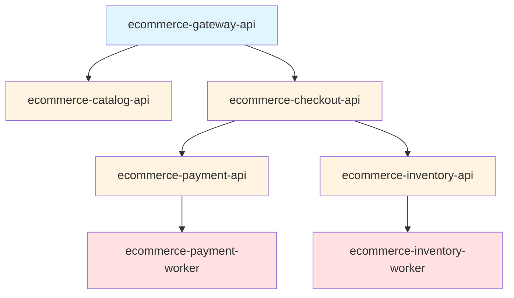

# How to Configure Service Naming Conventions in OpenTelemetry

Author: [nawazdhandala](https://www.github.com/nawazdhandala)

Tags: OpenTelemetry, Service Naming, Conventions, Best Practices, Configuration

Description: A comprehensive guide to establishing effective service naming conventions in OpenTelemetry for better observability, troubleshooting, and team collaboration.

Service names are the most fundamental identifier in your observability system. They appear in every trace, metric, and log, serving as the primary way to filter, group, and analyze telemetry data. Yet many teams start with ad-hoc naming that creates confusion and makes troubleshooting difficult as systems grow.

## Why Service Naming Conventions Matter

Poor service naming creates cascading problems throughout your observability infrastructure. Consider a team that names services inconsistently: "payment-api", "PaymentProcessor", "payment_worker", and "pmt-svc" might all refer to components of the same payment system. When an incident occurs, engineers waste precious time figuring out which service names to search for.

Good naming conventions provide immediate benefits:

**Faster Troubleshooting**: When every service follows a predictable pattern, you instantly know which services to investigate. If "checkout-api" has errors, you know to check "checkout-worker" and "checkout-db" without guessing names.

**Better Automation**: Consistent naming enables automation. You can write scripts that automatically generate dashboards, configure alerts, or calculate service-level objectives based on service name patterns.

**Clear Ownership**: Well-structured names can encode team ownership, making it obvious who to contact during incidents.

**Simplified Onboarding**: New team members can navigate your system topology when names follow logical patterns rather than arbitrary choices.

## Core Principles for Service Names

Before diving into specific conventions, understand these fundamental principles:

### Uniqueness Across Your Organization

Every service must have a unique name. This seems obvious, but problems arise when different teams choose the same name or when services get renamed without updating telemetry configuration:

```javascript
// Bad: Ambiguous service names
const service1 = new Resource({
  'service.name': 'api',  // Which API?
});

const service2 = new Resource({
  'service.name': 'api',  // Same name, different service!
});

// Good: Unique, descriptive names
const service1 = new Resource({
  'service.name': 'checkout-api',
});

const service2 = new Resource({
  'service.name': 'inventory-api',
});
```

Maintain a registry of service names to prevent collisions. This can be as simple as a spreadsheet or as sophisticated as a service catalog tool.

### Stability Over Time

Changing service names breaks historical analysis. If you rename "payment-service" to "payments-api", you lose the ability to compare metrics before and after the change. Choose names you can live with long-term:

```python
# Plan for evolution in your initial naming
# Bad: Names that will need changing
service_names = [
    "temp-api",           # Temporary becomes permanent
    "new-service",        # Won't be new forever
    "v2-payments",        # Version in name requires changes
]

# Good: Names that last
service_names = [
    "payment-processor",   # Describes function, not status
    "order-api",          # Clear purpose
    "notification-worker", # Descriptive and stable
]
```

If you must rename a service, implement a transition period where telemetry is sent with both the old and new names, allowing time for dashboards and alerts to migrate.

### Human Readability

Service names appear in traces, dashboards, alerts, and incident reports. Optimize for human comprehension:

```go
// Bad: Abbreviated or cryptic names
badNames := []string{
    "pmt-svc",      // What does pmt mean?
    "svc-001",      // Meaningless number
    "usrmgmt",      // Missing vowels
}

// Good: Clear, readable names
goodNames := []string{
    "payment-service",
    "user-management",
    "order-processor",
}
```

Avoid abbreviations unless they're universally understood in your organization. "auth" might be clear, but "pmt" probably isn't.

### Hierarchical Structure

Use delimiters to create logical groupings that reflect your system architecture:

```yaml
# Hierarchical naming with hyphens
ecommerce-checkout-api
ecommerce-checkout-worker
ecommerce-inventory-api
ecommerce-inventory-worker
ecommerce-notification-service

# This structure clearly shows:
# - Product area: ecommerce
# - Domain: checkout, inventory, notification
# - Component type: api, worker, service
```

This hierarchy enables filtering in observability tools. You can search for "ecommerce-checkout-*" to see all checkout-related services.

## Recommended Naming Patterns

Different organizations have different needs, but these patterns work well for most scenarios.

### Pattern 1: Domain-Component-Type

Structure: `{domain}-{component}-{type}`

This pattern emphasizes the business domain and component function:

```javascript
// Examples of domain-component-type pattern
const serviceNames = [
  'payment-processing-api',      // Payment domain, processing component, API type
  'payment-fraud-worker',        // Payment domain, fraud component, worker type
  'order-fulfillment-service',   // Order domain, fulfillment component, service type
  'inventory-tracking-api',      // Inventory domain, tracking component, API type
  'notification-email-worker',   // Notification domain, email component, worker type
];

// Configuration in OpenTelemetry
const { Resource } = require('@opentelemetry/resources');
const { SemanticResourceAttributes } = require('@opentelemetry/semantic-conventions');

function createResourceForService(domain, component, type) {
  const serviceName = `${domain}-${component}-${type}`;

  return new Resource({
    [SemanticResourceAttributes.SERVICE_NAME]: serviceName,
    // Additional attributes for flexibility
    'service.domain': domain,
    'service.component': component,
    'service.type': type,
  });
}

// Usage
const resource = createResourceForService('payment', 'processing', 'api');
```

This pattern works well for medium to large organizations with clear domain boundaries.

### Pattern 2: Team-Service-Type

Structure: `{team}-{service}-{type}`

This pattern emphasizes ownership and makes it easy to find which team runs a service:

```python
# Examples of team-service-type pattern
service_names = [
    'platform-auth-api',           # Platform team, auth service
    'platform-logging-collector',  # Platform team, logging service
    'payments-checkout-api',       # Payments team, checkout service
    'payments-fraud-worker',       # Payments team, fraud service
    'data-analytics-processor',    # Data team, analytics service
]

# Implementation in Python
from opentelemetry.sdk.resources import Resource
from opentelemetry.semconv.resource import ResourceAttributes

def create_team_based_resource(team, service, service_type):
    """Create resource with team-based naming convention"""
    service_name = f"{team}-{service}-{service_type}"

    return Resource.create({
        ResourceAttributes.SERVICE_NAME: service_name,
        # Store components as separate attributes for querying
        "team": team,
        "service.component": service,
        "service.type": service_type,
    })

# Usage
resource = create_team_based_resource('platform', 'auth', 'api')
```

This pattern simplifies incident response because you immediately know who owns each service.

### Pattern 3: Product-Environment-Service

Structure: `{product}-{environment}-{service}`

This pattern embeds environment information in the service name:

```go
// Examples of product-environment-service pattern
package main

import (
    "go.opentelemetry.io/otel/sdk/resource"
    semconv "go.opentelemetry.io/otel/semconv/v1.20.0"
)

// WARNING: This pattern is generally NOT recommended
// Environment should be a resource attribute, not part of service name

// Better approach: separate environment from service name
func createResource(product, service, environment string) *resource.Resource {
    serviceName := fmt.Sprintf("%s-%s", product, service)

    return resource.NewWithAttributes(
        semconv.SchemaURL,
        semconv.ServiceName(serviceName),
        semconv.DeploymentEnvironment(environment),  // Environment as attribute
        attribute.String("product", product),
    )
}

// Usage
res := createResource("ecommerce", "checkout-api", "production")
// Results in service.name = "ecommerce-checkout-api"
// and deployment.environment = "production"
```

Actually, embedding environment in service names is an anti-pattern. Use the `deployment.environment` resource attribute instead. This keeps service names stable across environments and enables environment-based filtering without name manipulation.

### Pattern 4: Namespace-Service

Structure: `{namespace}.{service}`

Use dot notation for deeply nested hierarchies:

```python
# Examples of namespace-service pattern with dot notation
service_names = [
    'acme.ecommerce.checkout.api',
    'acme.ecommerce.checkout.worker',
    'acme.platform.auth.service',
    'acme.platform.monitoring.collector',
]

# Implementation
from opentelemetry.sdk.resources import Resource
from opentelemetry.semconv.resource import ResourceAttributes

def create_namespaced_resource(namespace_parts, service_type):
    """
    Create resource with namespace-based naming
    namespace_parts: list like ['acme', 'ecommerce', 'checkout']
    service_type: string like 'api' or 'worker'
    """
    namespace = '.'.join(namespace_parts)
    service_name = f"{namespace}.{service_type}"

    return Resource.create({
        ResourceAttributes.SERVICE_NAME: service_name,
        ResourceAttributes.SERVICE_NAMESPACE: namespace,
        "service.type": service_type,
    })

# Usage
resource = create_namespaced_resource(['acme', 'ecommerce', 'checkout'], 'api')
```

This pattern works well for large organizations with multiple products and deep hierarchies. However, dots can cause issues with some metrics systems, so test compatibility first.

## Service Type Suffixes

The type suffix describes the service's technical role. Standardize these across your organization:

```javascript
// Standard service type suffixes
const serviceTypes = {
  // API services
  'api': 'REST/HTTP API endpoint',
  'graphql': 'GraphQL API endpoint',
  'grpc': 'gRPC service',

  // Background processing
  'worker': 'Background job processor',
  'consumer': 'Message queue consumer',
  'processor': 'Data processor',

  // Data services
  'db': 'Database service',
  'cache': 'Caching layer',
  'search': 'Search service',

  // Infrastructure
  'gateway': 'API gateway',
  'proxy': 'Proxy service',
  'collector': 'Telemetry collector',

  // Functions
  'function': 'Serverless function',
  'lambda': 'AWS Lambda function',
};

// Helper to create resources with standard types
function createServiceResource(domain, component, type) {
  if (!serviceTypes[type]) {
    throw new Error(`Unknown service type: ${type}. Valid types: ${Object.keys(serviceTypes).join(', ')}`);
  }

  return new Resource({
    [SemanticResourceAttributes.SERVICE_NAME]: `${domain}-${component}-${type}`,
    'service.domain': domain,
    'service.component': component,
    'service.type': type,
    'service.type.description': serviceTypes[type],
  });
}
```

Standardizing types enables powerful queries like "show me all worker services" or "what's the error rate across all APIs?"

## Handling Special Cases

Real-world systems have complexity that doesn't fit neat patterns. Here's how to handle common edge cases.

### Sidecar Services

Sidecar containers often need distinct names from their main application:

```yaml
# Kubernetes pod with main app and sidecar
apiVersion: v1
kind: Pod
metadata:
  name: checkout-api-pod
spec:
  containers:
  # Main application
  - name: checkout-api
    env:
    - name: OTEL_SERVICE_NAME
      value: "checkout-api"

  # Sidecar proxy
  - name: envoy-proxy
    env:
    - name: OTEL_SERVICE_NAME
      value: "checkout-api-proxy"  # Related but distinct name
    - name: OTEL_RESOURCE_ATTRIBUTES
      value: "service.sidecar.for=checkout-api"  # Link to main service
```

The sidecar has its own service name but includes an attribute linking it to the main service.

### Multi-Tenant Services

For services serving multiple tenants, keep tenant information in attributes, not the service name:

```python
# Bad: Tenant in service name
bad_resources = [
    Resource.create({
        ResourceAttributes.SERVICE_NAME: "api-tenant-abc",  # Don't do this
    }),
    Resource.create({
        ResourceAttributes.SERVICE_NAME: "api-tenant-xyz",  # Don't do this
    }),
]

# Good: Tenant as attribute
good_resource = Resource.create({
    ResourceAttributes.SERVICE_NAME: "multi-tenant-api",
    "tenant.id": "abc",  # Tenant as attribute, not in name
})

# In your instrumentation, add tenant to spans:
from opentelemetry import trace

tracer = trace.get_tracer(__name__)

def handle_request(tenant_id, request):
    with tracer.start_as_current_span("handle_request") as span:
        span.set_attribute("tenant.id", tenant_id)
        # Process request
```

This keeps service names manageable while maintaining tenant visibility in telemetry.

### Versioned APIs

For services with multiple API versions running simultaneously:

```go
// Bad: Version in service name
// Don't create separate services for each API version
badResource1 := resource.NewWithAttributes(
    semconv.ServiceName("payment-api-v1"),  // Don't do this
)
badResource2 := resource.NewWithAttributes(
    semconv.ServiceName("payment-api-v2"),  // Don't do this
)

// Good: Version as attribute
goodResource := resource.NewWithAttributes(
    semconv.ServiceName("payment-api"),
    attribute.String("api.version", "v2"),  // Version as attribute
)

// Add version to spans for per-endpoint visibility
span.SetAttributes(
    attribute.String("http.route", "/v2/payments"),
    attribute.String("api.version", "v2"),
)
```

If versions are truly separate deployments with different teams, separate service names might make sense. But for most cases, use attributes.

## Implementation Strategy

Rolling out naming conventions across an organization requires planning.

### Document Your Convention

Create clear documentation with examples:

```markdown
# Service Naming Convention

## Pattern
{domain}-{component}-{type}

## Examples
- payment-processing-api
- order-fulfillment-worker
- inventory-tracking-service

## Valid Domains
- payment: Payment processing systems
- order: Order management systems
- inventory: Inventory tracking
- notification: Notification services
- user: User management

## Valid Types
- api: REST/HTTP API
- worker: Background processor
- service: General service
- consumer: Message queue consumer

## Naming Checklist
- [ ] Name follows pattern
- [ ] Domain is on approved list
- [ ] Type is on approved list
- [ ] Name is unique (check service registry)
- [ ] Name added to service registry
```

### Create Helper Libraries

Build shared libraries that enforce conventions:

```javascript
// shared-otel-config package
const { Resource } = require('@opentelemetry/resources');
const { SemanticResourceAttributes } = require('@opentelemetry/semantic-conventions');

const VALID_DOMAINS = ['payment', 'order', 'inventory', 'notification', 'user'];
const VALID_TYPES = ['api', 'worker', 'service', 'consumer'];

class ServiceNamingError extends Error {
  constructor(message) {
    super(message);
    this.name = 'ServiceNamingError';
  }
}

function createServiceResource(domain, component, type, version) {
  // Validate inputs
  if (!VALID_DOMAINS.includes(domain)) {
    throw new ServiceNamingError(
      `Invalid domain "${domain}". Must be one of: ${VALID_DOMAINS.join(', ')}`
    );
  }

  if (!VALID_TYPES.includes(type)) {
    throw new ServiceNamingError(
      `Invalid type "${type}". Must be one of: ${VALID_TYPES.join(', ')}`
    );
  }

  // Construct service name
  const serviceName = `${domain}-${component}-${type}`;

  // Create resource with standard attributes
  return new Resource({
    [SemanticResourceAttributes.SERVICE_NAME]: serviceName,
    [SemanticResourceAttributes.SERVICE_VERSION]: version,
    'service.domain': domain,
    'service.component': component,
    'service.type': type,
  });
}

module.exports = { createServiceResource };
```

Teams use this library instead of manually constructing service names, ensuring consistency.

### Gradual Migration

If you're fixing existing inconsistent naming, migrate gradually:

```python
# Migration helper that supports old and new names
from opentelemetry.sdk.resources import Resource
from opentelemetry.semconv.resource import ResourceAttributes

def create_migrating_resource(new_service_name, old_service_name=None):
    """
    Create resource during naming migration.
    Includes both old and new names during transition period.
    """
    attrs = {
        ResourceAttributes.SERVICE_NAME: new_service_name,
    }

    # During migration, include old name for continuity
    if old_service_name:
        attrs["service.name.legacy"] = old_service_name
        attrs["service.name.migration"] = "true"

    return Resource.create(attrs)

# Phase 1: Add new name while keeping old
resource = create_migrating_resource(
    new_service_name="payment-processing-api",
    old_service_name="PaymentAPI"  # Old inconsistent name
)

# Phase 2: Update dashboards/alerts to use new name

# Phase 3: Remove old name after transition
resource = create_migrating_resource(
    new_service_name="payment-processing-api"
)
```

## Visualizing Service Relationships

Good naming conventions make service topology clear. Here's how services with consistent naming appear in your architecture:



The naming pattern makes it immediately obvious how services relate and which team owns each component.

## Monitoring and Enforcement

Maintain naming consistency over time:

```python
# Automated naming convention validator
import re
from typing import List, Tuple

class NamingValidator:
    def __init__(self, valid_domains: List[str], valid_types: List[str]):
        self.valid_domains = valid_domains
        self.valid_types = valid_types
        # Pattern: {domain}-{component}-{type}
        self.pattern = re.compile(r'^([a-z]+)-([a-z]+-?[a-z]+)-([a-z]+)$')

    def validate(self, service_name: str) -> Tuple[bool, str]:
        """
        Validate service name against naming convention.
        Returns (is_valid, error_message)
        """
        match = self.pattern.match(service_name)

        if not match:
            return False, f"Service name '{service_name}' doesn't match pattern: {{domain}}-{{component}}-{{type}}"

        domain, component, svc_type = match.groups()

        if domain not in self.valid_domains:
            return False, f"Invalid domain '{domain}'. Valid domains: {', '.join(self.valid_domains)}"

        if svc_type not in self.valid_types:
            return False, f"Invalid type '{svc_type}'. Valid types: {', '.join(self.valid_types)}"

        return True, ""

# Usage in CI/CD
validator = NamingValidator(
    valid_domains=['payment', 'order', 'inventory'],
    valid_types=['api', 'worker', 'service']
)

# Validate during deployment
service_name = "payment-processing-api"
is_valid, error = validator.validate(service_name)

if not is_valid:
    raise ValueError(f"Invalid service name: {error}")
```

Add this validation to your CI/CD pipeline to prevent non-conforming names from reaching production.

Service naming conventions are more than pedantic rules. They're fundamental infrastructure that enables effective observability. Invest time upfront to design conventions that work for your organization, document them clearly, provide tooling to make compliance easy, and enforce them consistently. Your future on-call engineers will thank you when they can quickly understand and troubleshoot your system during the next 3 AM incident.

For more on building effective observability practices, read our guide on [monitoring vs observability](https://oneuptime.com/blog/post/2025-11-28-monitoring-vs-observability-sre/view).
