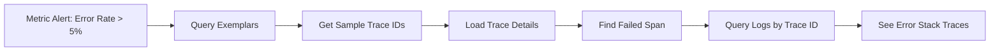
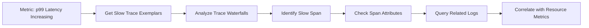
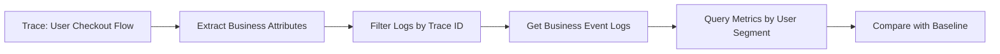

# How to Understand OpenTelemetry Signal Correlation (Traces + Logs + Metrics Together)

Author: [nawazdhandala](https://www.github.com/nawazdhandala)

Tags: OpenTelemetry, Signal Correlation, Traces, Logs, Metrics, Observability

Description: Learn how OpenTelemetry correlates traces, logs, and metrics to provide unified observability across your distributed systems.

Observability without correlation is like having three different maps of the same city, each showing different details but no way to relate them. You might know your service is slow (metrics), see error messages (logs), and have request flows (traces), but understanding the actual problem requires connecting these signals.

OpenTelemetry's signal correlation solves this by creating explicit relationships between traces, logs, and metrics. This unified approach transforms debugging from a scavenger hunt across multiple tools into a coherent investigation.

## The Three Signals and Their Roles

Each observability signal serves a distinct purpose in understanding system behavior.

**Traces** show request flow through distributed systems. When a user clicks "checkout" on an e-commerce site, a trace follows that request across the frontend, API gateway, payment service, inventory service, and notification service. Each step becomes a span with timing data and context.

**Logs** capture discrete events and messages. They record the "what happened" moments: database connection errors, cache misses, validation failures, or business logic decisions. Logs provide the narrative detail that traces can't capture.

**Metrics** aggregate numerical data over time. Response times, error rates, CPU usage, and request counts become time-series data that reveals trends and anomalies. Metrics answer "how many" and "how much" questions efficiently.

Separately, these signals have limitations. Traces without logs miss crucial error details. Metrics without traces can't explain why a specific request was slow. Logs without context are just noise. Correlation bridges these gaps.

## How OpenTelemetry Correlates Signals

OpenTelemetry uses shared identifiers to link signals together. The correlation model relies on three key concepts: trace context, span context, and resource attributes.

### Trace Context Propagation

Every distributed trace starts with a unique trace ID. This 16-byte identifier follows the request through every service. When Service A calls Service B, it passes the trace ID in HTTP headers or gRPC metadata using W3C Trace Context format.

```go
// Creating a span automatically includes trace context
func handleCheckout(w http.ResponseWriter, r *http.Request) {
    // Extract trace context from incoming request
    ctx := otel.GetTextMapPropagator().Extract(r.Context(),
        propagation.HeaderCarrier(r.Header))

    // Create span with extracted context
    tracer := otel.Tracer("checkout-service")
    ctx, span := tracer.Start(ctx, "process_checkout")
    defer span.End()

    // This span inherits the trace ID from the parent
    traceID := span.SpanContext().TraceID().String()
    spanID := span.SpanContext().SpanID().String()

    // Use context for downstream calls
    processPayment(ctx, order)
}
```

The trace context contains the trace ID, span ID, and trace flags. Every span in the trace shares the same trace ID while having unique span IDs.

### Linking Logs to Traces

Logs correlate with traces by including trace and span IDs in log records. When your code writes a log entry during request processing, OpenTelemetry automatically injects these identifiers.

```python
import logging
from opentelemetry import trace
from opentelemetry.instrumentation.logging import LoggingInstrumentor

# Initialize logging instrumentation
LoggingInstrumentor().instrument()

logger = logging.getLogger(__name__)
tracer = trace.get_tracer(__name__)

def process_payment(order_id, amount):
    # Create span for payment processing
    with tracer.start_as_current_span("process_payment") as span:
        span.set_attribute("order.id", order_id)
        span.set_attribute("payment.amount", amount)

        # This log automatically includes trace_id and span_id
        logger.info(f"Processing payment for order {order_id}")

        try:
            # Payment processing logic
            result = payment_gateway.charge(amount)
            logger.info(f"Payment successful: {result.transaction_id}")
            return result
        except PaymentError as e:
            # Error log includes the same trace context
            logger.error(f"Payment failed: {e}", exc_info=True)
            span.set_status(StatusCode.ERROR, str(e))
            raise
```

The instrumented logger adds fields like `trace_id`, `span_id`, and `trace_flags` to every log entry. Backend systems can then query logs by trace ID to see all log messages from a specific request.

### Connecting Metrics to Traces

Metrics correlation works differently because metrics are aggregated rather than per-request. OpenTelemetry links metrics to traces through exemplars and resource attributes.

**Exemplars** attach specific trace IDs to metric measurements. When recording a histogram of request durations, exemplars preserve trace IDs for sample measurements.

```javascript
// Recording metrics with exemplar support
const meter = opentelemetry.metrics.getMeterProvider().getMeter('api-service');
const requestDuration = meter.createHistogram('http.server.duration', {
  description: 'HTTP request duration',
  unit: 'ms'
});

function handleRequest(req, res) {
  const startTime = Date.now();
  const span = opentelemetry.trace.getTracer('api-service').startSpan('handle_request');

  try {
    // Process request
    const result = processRequest(req);

    // Record metric with context (enables exemplar)
    const duration = Date.now() - startTime;
    requestDuration.record(duration, {
      'http.method': req.method,
      'http.route': req.route,
      'http.status_code': 200
    }, opentelemetry.context.active());

    span.end();
    res.json(result);
  } catch (error) {
    const duration = Date.now() - startTime;
    requestDuration.record(duration, {
      'http.method': req.method,
      'http.route': req.route,
      'http.status_code': 500
    }, opentelemetry.context.active());

    span.recordException(error);
    span.setStatus({ code: opentelemetry.SpanStatusCode.ERROR });
    span.end();
    throw error;
  }
}
```

When you see a spike in request duration metrics, exemplars let you jump directly to traces that contributed to that spike. Instead of guessing which requests were slow, you have concrete examples to investigate.

## Practical Correlation Patterns

Understanding the mechanics is one thing. Applying correlation effectively requires specific patterns for common debugging scenarios.

### Pattern 1: Error Investigation

When an error rate metric spikes, follow this correlation path:



The metric identifies the problem exists. Exemplars provide trace IDs of failed requests. The trace shows which service failed. Logs reveal the actual error message and stack trace.

### Pattern 2: Performance Debugging

When response time metrics show degradation:



Start with aggregated latency metrics to spot the trend. Use exemplars to find slow traces. Examine trace timing to locate bottlenecks. Check logs for that span to see what it was doing. Finally, correlate with infrastructure metrics (CPU, memory, disk I/O) using resource attributes.

### Pattern 3: Business Flow Analysis

When tracking specific user journeys:



Traces capture the technical flow. Logs within that trace contain business events (cart created, discount applied, payment processed). Metrics filtered by business attributes (user tier, region, product category) show how this journey compares to others.

## Resource Attributes as Correlation Keys

Beyond signal-to-signal correlation, resource attributes provide environmental context. Resources represent the entities producing telemetry: services, hosts, containers, or processes.

```yaml
# Common resource attributes for correlation
resource:
  service.name: checkout-api
  service.version: 2.3.1
  deployment.environment: production
  cloud.provider: aws
  cloud.region: us-east-1
  cloud.availability_zone: us-east-1a
  k8s.cluster.name: prod-cluster
  k8s.namespace.name: checkout
  k8s.pod.name: checkout-api-7d9f8b5c-xk2m9
  host.name: ip-10-0-1-42
```

All signals from the same service instance share these attributes. When debugging, you can filter traces, logs, and metrics by `k8s.pod.name` to see everything from that specific pod. Or query by `cloud.availability_zone` to compare behavior across regions.

## Implementing Correlation in Practice

Getting correlation working requires coordination across your instrumentation code and backend configuration.

### Application-Level Setup

First, ensure context propagation works correctly:

```java
// Configure global propagators
OpenTelemetry openTelemetry = OpenTelemetrySdk.builder()
    .setPropagators(
        ContextPropagators.create(
            TextMapPropagator.composite(
                W3CTraceContextPropagator.getInstance(),
                W3CBaggagePropagator.getInstance()
            )
        )
    )
    .build();

// For HTTP clients, propagation happens automatically with auto-instrumentation
// For custom protocols, inject context manually
public void sendMessage(Message msg) {
    Context context = Context.current();
    Map<String, String> carrier = new HashMap<>();

    // Inject context into message headers
    openTelemetry.getPropagators().getTextMapPropagator()
        .inject(context, carrier, (c, key, value) -> c.put(key, value));

    msg.setHeaders(carrier);
    messageQueue.send(msg);
}
```

Second, configure logging to include trace context:

```ruby
require 'opentelemetry/sdk'
require 'opentelemetry/instrumentation/all'
require 'logger'

# Initialize OpenTelemetry
OpenTelemetry::SDK.configure do |c|
  c.use_all() # Auto-instrument all supported libraries
end

# Create logger with formatter that includes trace context
logger = Logger.new(STDOUT)
logger.formatter = proc do |severity, datetime, progname, msg|
  span_context = OpenTelemetry::Trace.current_span.context
  if span_context.valid?
    trace_id = span_context.trace_id.unpack1('H*')
    span_id = span_context.span_id.unpack1('H*')
    "[#{datetime}] #{severity} trace_id=#{trace_id} span_id=#{span_id} - #{msg}\n"
  else
    "[#{datetime}] #{severity} - #{msg}\n"
  end
end
```

### Backend Configuration

Your observability backend needs to index correlation fields. In the OpenTelemetry Collector, ensure exporters preserve these fields:

```yaml
# collector-config.yaml
receivers:
  otlp:
    protocols:
      grpc:
      http:

processors:
  batch:
    timeout: 10s
    send_batch_size: 1024

  # Resource detection adds cloud/k8s attributes
  resourcedetection:
    detectors: [env, system, docker, gcp, eks, ecs]

  # Ensure trace context in logs
  attributes:
    actions:
      - key: trace_id
        action: insert
        from_context: trace_id
      - key: span_id
        action: insert
        from_context: span_id

exporters:
  # Configure your backend exporter
  otlphttp:
    endpoint: https://your-backend.com/v1/traces
    headers:
      api-key: ${API_KEY}

service:
  pipelines:
    traces:
      receivers: [otlp]
      processors: [resourcedetection, batch]
      exporters: [otlphttp]
    logs:
      receivers: [otlp]
      processors: [resourcedetection, attributes, batch]
      exporters: [otlphttp]
    metrics:
      receivers: [otlp]
      processors: [resourcedetection, batch]
      exporters: [otlphttp]
```

## Correlation in Action: A Real Debugging Session

Here's how signal correlation solves real problems. Your monitoring alerts that the checkout service error rate jumped from 0.5% to 8% at 14:30.

**Step 1: Check Error Metrics**
Query: `rate(http_requests_total{status="5xx"}[5m])`
Result: Sharp spike starting 14:30, affecting `/api/checkout/process` endpoint.

**Step 2: Get Exemplar Traces**
Click on the metric spike to see exemplar trace IDs: `a3f7b2c8...`, `d9e1f4a2...`, `b6c3d8f1...`

**Step 3: Analyze Trace**
Load trace `a3f7b2c8...`. The waterfall shows:
- checkout-api: 45ms (success)
- payment-service: 2100ms (error)
- inventory-service: not called

The payment-service span has status ERROR with description "Database connection timeout."

**Step 4: Query Correlated Logs**
Filter logs by `trace_id=a3f7b2c8`. You see:
```
[ERROR] Failed to acquire database connection from pool
[ERROR] Connection pool exhausted: 50/50 connections in use
[ERROR] Waited 2000ms for connection, timing out
```

**Step 5: Check Resource Metrics**
Query database connection pool metrics for `service.name=payment-service` at 14:30. Connection pool utilization jumped to 100% at 14:29.

**Step 6: Root Cause**
A deployment at 14:28 introduced a bug that leaks database connections. Each request holds connections without releasing them. Within two minutes, the pool exhausted.

Without correlation, you'd have seen the error rate metric but spent hours checking different services. Correlation connected the dots in minutes.

## Common Correlation Pitfalls

Signal correlation only works when implemented consistently. Watch for these issues.

**Broken Context Propagation**: If a service doesn't propagate trace context to downstream calls, correlation breaks. Every HTTP client, message queue producer, and RPC call must propagate context.

**Missing Log Context**: Logs written outside request context won't have trace IDs. Always pass context through your call stack, even to utility functions.

**Inconsistent Resource Attributes**: If different services use different attribute names for the same thing (`service_name` vs `service.name`), correlation queries fail. Follow OpenTelemetry semantic conventions strictly.

**Sampling Confusion**: If you sample traces at 10% but don't sample logs, you'll have logs without traces and traces without logs. Align your sampling strategies or accept gaps.

**Clock Skew**: Distributed systems need synchronized clocks. Even small clock differences make trace timelines confusing and correlation queries unreliable.

## Moving Forward with Correlation

Signal correlation transforms observability from data collection to insight generation. By linking traces, logs, and metrics through shared identifiers and resource attributes, OpenTelemetry creates a unified view of system behavior.

Start with consistent instrumentation. Propagate context everywhere. Include trace IDs in logs. Record metrics with context. Tag everything with resource attributes. Your observability backend will handle the rest, turning isolated signals into a coherent story of what's happening in your systems.

When the next production incident hits, you'll navigate directly from symptoms to root cause by following the correlation trail OpenTelemetry builds automatically.
