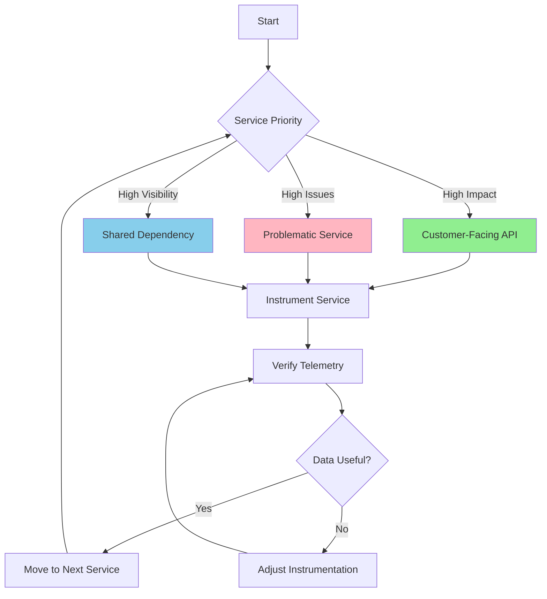

# How to Set Up OpenTelemetry for a Small Team Without a Dedicated SRE

Author: [nawazdhandala](https://www.github.com/nawazdhandala)

Tags: OpenTelemetry, Small Teams, SRE, Getting Started, Observability

Description: A practical guide for small engineering teams to implement OpenTelemetry without dedicated SRE resources, focusing on simple setups and maintainable configurations.

Small teams face a unique challenge with observability. You need insights into your systems, but you don't have an SRE team to build and maintain complex telemetry pipelines. OpenTelemetry can work for you without requiring a dedicated observability expert.

I've helped several small teams implement OpenTelemetry, and the key is starting simple. You don't need to instrument everything perfectly on day one. You need telemetry that helps you debug production issues without becoming a maintenance burden.

## Start with Auto-Instrumentation

Auto-instrumentation is your best friend. Instead of manually adding spans to every function, let OpenTelemetry instrument common frameworks and libraries automatically.

For Python applications using Flask or Django, auto-instrumentation instruments HTTP requests, database queries, and external API calls without any code changes. You get immediate visibility into request flows.

Node.js auto-instrumentation covers Express, HTTP clients, database drivers, and more. Install a package, add a few lines of configuration, and you're collecting traces.

Java has the most mature auto-instrumentation. The OpenTelemetry Java agent instruments hundreds of libraries through bytecode manipulation. You don't modify application code at all, just add a JVM argument.

Here's how to start with auto-instrumentation:

```python
# Python: Install auto-instrumentation packages
pip install opentelemetry-distro
pip install opentelemetry-exporter-otlp

# Run your application with auto-instrumentation
opentelemetry-bootstrap -a install
opentelemetry-instrument \
  --traces_exporter otlp \
  --metrics_exporter otlp \
  --service_name my-service \
  --exporter_otlp_endpoint http://localhost:4318 \
  python app.py
```

```javascript
// Node.js: Auto-instrumentation in a single file
// Create instrumentation.js
const { NodeSDK } = require('@opentelemetry/sdk-node');
const { OTLPTraceExporter } = require('@opentelemetry/exporter-trace-otlp-http');
const { getNodeAutoInstrumentations } = require('@opentelemetry/auto-instrumentations-node');

const sdk = new NodeSDK({
  traceExporter: new OTLPTraceExporter({
    url: 'http://localhost:4318/v1/traces',
  }),
  instrumentations: [getNodeAutoInstrumentations()],
  serviceName: 'my-service',
});

sdk.start();

// Require this file before your application code
// node -r ./instrumentation.js app.js
```

```bash
# Java: Download the agent and add to startup
curl -L -O https://github.com/open-telemetry/opentelemetry-java-instrumentation/releases/latest/download/opentelemetry-javaagent.jar

# Add to your java command
java -javaagent:opentelemetry-javaagent.jar \
  -Dotel.service.name=my-service \
  -Dotel.exporter.otlp.endpoint=http://localhost:4318 \
  -jar myapp.jar
```

Auto-instrumentation gets you 80% of the value with 20% of the effort. Save manual instrumentation for critical business logic that auto-instrumentation can't see.

## Use a Managed Backend

Running your own observability backend (Jaeger, Prometheus, etc.) adds operational complexity. Small teams should use managed services instead.

Many vendors offer free tiers sufficient for small applications. You get a working backend without managing storage, retention, or scaling.

OpenTelemetry's vendor-neutral approach means you're not locked in. Start with a free tier, and if you outgrow it, switching backends only requires changing your exporter configuration.

Popular options include:

- Honeycomb (generous free tier, excellent for traces)
- Grafana Cloud (includes Tempo for traces, Loki for logs)
- OneUptime (open-source friendly, self-hosted or cloud)
- Lightstep (good for complex microservices)

Configuration for managed backends is straightforward:

```yaml
# Environment variables work across languages
OTEL_EXPORTER_OTLP_ENDPOINT=https://api.vendor.com
OTEL_EXPORTER_OTLP_HEADERS=x-api-key=your-api-key
OTEL_SERVICE_NAME=my-service
OTEL_TRACES_EXPORTER=otlp
OTEL_METRICS_EXPORTER=otlp
```

Using environment variables keeps configuration out of your code. You can change backends by updating environment variables in your deployment configuration.

## Deploy a Simple Collector Configuration

Even with a managed backend, running an OpenTelemetry Collector provides benefits. It decouples your application from the backend, handles retries, and enables local debugging.

For small teams, a basic Collector configuration is enough. You don't need complex processing pipelines or multiple exporters.

Deploy the Collector as a sidecar container in Kubernetes or a separate container in Docker Compose. Keep it close to your application to minimize network hops.

```yaml
# docker-compose.yml for local development
version: '3.8'
services:
  app:
    build: .
    environment:
      - OTEL_EXPORTER_OTLP_ENDPOINT=http://otel-collector:4318
      - OTEL_SERVICE_NAME=my-app
    depends_on:
      - otel-collector

  otel-collector:
    image: otel/opentelemetry-collector:0.91.0
    command: ["--config=/etc/otel/config.yaml"]
    volumes:
      - ./otel-collector-config.yaml:/etc/otel/config.yaml
    ports:
      - "4318:4318"  # OTLP HTTP
      - "4317:4317"  # OTLP gRPC
```

```yaml
# otel-collector-config.yaml - Simple configuration
receivers:
  otlp:
    protocols:
      http:
        endpoint: 0.0.0.0:4318
      grpc:
        endpoint: 0.0.0.0:4317

processors:
  batch:
    timeout: 10s
    send_batch_size: 1024

  memory_limiter:
    check_interval: 1s
    limit_mib: 512

exporters:
  otlp:
    endpoint: https://api.yourbackend.com
    headers:
      x-api-key: ${BACKEND_API_KEY}

  # Useful for debugging
  logging:
    loglevel: debug

service:
  pipelines:
    traces:
      receivers: [otlp]
      processors: [memory_limiter, batch]
      exporters: [otlp]

    metrics:
      receivers: [otlp]
      processors: [memory_limiter, batch]
      exporters: [otlp]
```

This configuration receives telemetry, batches it for efficiency, and exports to your backend. The memory limiter prevents the Collector from consuming excessive resources.

## Focus on Key Services First

Don't try to instrument everything at once. Start with services that are either:

1. Customer-facing (highest business impact)
2. Frequently causing issues (highest debugging value)
3. Dependencies for other services (highest visibility multiplier)

Instrument one service thoroughly, verify the data is useful, then move to the next. This incremental approach prevents overwhelm and lets you learn as you go.

For each service, ensure you're capturing:

- Incoming HTTP requests
- Outgoing HTTP calls to other services
- Database queries
- Cache operations
- Error conditions

Auto-instrumentation usually handles these automatically. Verify by generating traffic and checking your backend for traces.



## Keep Configuration Simple and Consistent

Create a standard configuration template for your services. This reduces cognitive load and makes adding instrumentation to new services trivial.

Store configuration in a shared repository. When you improve the configuration for one service, all services benefit.

```yaml
# Standard environment variables for all services
# Store in a shared config file or repository

# Required for all services
OTEL_SERVICE_NAME: ${SERVICE_NAME}
OTEL_EXPORTER_OTLP_ENDPOINT: http://otel-collector:4318
OTEL_TRACES_EXPORTER: otlp
OTEL_METRICS_EXPORTER: otlp

# Optional but recommended
OTEL_RESOURCE_ATTRIBUTES: "deployment.environment=${ENV},service.version=${VERSION}"

# Sampling for high-traffic services
OTEL_TRACES_SAMPLER: parentbased_traceidratio
OTEL_TRACES_SAMPLER_ARG: 0.1  # Sample 10% of traces
```

For Kubernetes, use ConfigMaps:

```yaml
apiVersion: v1
kind: ConfigMap
metadata:
  name: otel-config
data:
  OTEL_EXPORTER_OTLP_ENDPOINT: "http://otel-collector:4318"
  OTEL_TRACES_EXPORTER: "otlp"
  OTEL_METRICS_EXPORTER: "otlp"
---
apiVersion: apps/v1
kind: Deployment
metadata:
  name: my-service
spec:
  template:
    spec:
      containers:
      - name: app
        envFrom:
        - configMapRef:
            name: otel-config
        env:
        - name: OTEL_SERVICE_NAME
          value: "my-service"
```

This pattern means adding OpenTelemetry to a new service requires one line: referencing the ConfigMap.

## Add Alerting Gradually

You don't need a sophisticated alerting setup from day one. Start with alerts for critical issues:

- Error rate above threshold
- Response time degradation
- Service availability

Most managed backends include basic alerting. Configure a few essential alerts using their UI rather than building custom alerting infrastructure.

As you learn what matters, refine alerts. Remove noisy alerts immediately. A team ignoring alerts because of false positives is worse than having no alerts.

## Use Tracing to Replace Logging (Partially)

Small teams often over-rely on logging, which creates volume and cost problems. Tracing provides context that logs can't match.

Instead of logging every step of a request, create spans. The trace shows the flow automatically. Add attributes to spans instead of logging strings.

```python
# Old approach: Excessive logging
import logging

def process_order(order_id):
    logging.info(f"Processing order {order_id}")

    logging.info(f"Fetching order details for {order_id}")
    order = get_order(order_id)
    logging.info(f"Order details: {order}")

    logging.info(f"Validating order {order_id}")
    if not validate(order):
        logging.error(f"Order validation failed for {order_id}")
        return False

    logging.info(f"Charging payment for order {order_id}")
    charge_result = charge_payment(order)
    logging.info(f"Payment result: {charge_result}")

    return True
```

```python
# New approach: Tracing with attributes
from opentelemetry import trace

tracer = trace.get_tracer(__name__)

def process_order(order_id):
    with tracer.start_as_current_span("process_order") as span:
        span.set_attribute("order.id", order_id)

        order = get_order(order_id)  # Auto-instrumented if using DB library
        span.set_attribute("order.total", order['total'])
        span.set_attribute("order.items", len(order['items']))

        if not validate(order):
            span.set_attribute("validation.result", "failed")
            span.add_event("validation_failed")
            return False

        span.set_attribute("validation.result", "passed")
        charge_result = charge_payment(order)
        span.set_attribute("payment.result", charge_result['status'])

        return True
```

The trace automatically shows timing for each operation and how they nest. Attributes provide the context you'd normally log. Events mark specific moments without requiring separate log statements.

Keep logs for unstructured debugging information or errors that need immediate attention. Use traces for understanding request flow and timing.

## Establish a Maintenance Routine

Observability isn't set-and-forget. Schedule monthly reviews:

1. Check for instrumentation errors or gaps
2. Review sampling rates if costs are climbing
3. Update SDKs for security patches
4. Clean up unused dashboards or queries

These reviews take an hour per month but prevent technical debt from accumulating. Put them on your team calendar.

Document your setup in a simple markdown file:

```markdown
# Observability Setup

## Architecture
- OpenTelemetry Collector running as sidecar in k8s
- Auto-instrumentation on all services
- Exporting to Honeycomb

## Configuration
- ConfigMap: `otel-config` in `production` namespace
- Sampling: 10% for high-traffic services, 100% for others

## Debugging
1. Check service logs for instrumentation errors
2. Verify Collector is receiving data: `kubectl logs -l app=otel-collector`
3. Check backend for recent traces

## Contacts
- Backend account: team@company.com
- Escalation: #observability in Slack

## Last Updated
2026-02-06
```

## Handle Growth Without Over-Engineering

As your team and services grow, you'll need to revisit your setup. The beauty of starting simple is that you can evolve incrementally.

If costs become an issue, adjust sampling rates before you architect complex filtering. If a single Collector becomes a bottleneck, add more replicas before you build a multi-tier collection pipeline.

Watch for these signals that you've outgrown the simple setup:

- Collector CPU/memory usage consistently high
- Backend costs exceeding value
- Team spending significant time on observability maintenance
- Multiple teams with different requirements

At that point, consider bringing in an SRE or platform engineer. But most small teams can operate for years with the simple setup described here.

## Learning Resources for Your Team

Everyone on the team should understand basic OpenTelemetry concepts. These resources help without requiring deep expertise:

- OpenTelemetry documentation's "Getting Started" guides
- Your backend vendor's OpenTelemetry integration docs
- The OpenTelemetry demo application (great for hands-on learning)

Schedule a team session to review traces together. Pick a recent production issue and walk through how you would debug it using traces. This builds collective understanding.

## Realistic Expectations

OpenTelemetry won't solve all observability problems automatically. You'll still have outages and bugs. But you'll debug them faster and with less guesswork.

The goal isn't perfect instrumentation. It's having enough visibility to answer questions when things go wrong. Can you trace a request end-to-end? Can you identify which service is slow? Can you see when errors started?

If you can answer those questions, your simple setup is working. Don't let perfect be the enemy of good enough.

Small teams can absolutely adopt OpenTelemetry successfully. Skip the complex architectures and focus on getting value quickly. Auto-instrument your services, use a managed backend, run a simple Collector, and focus on your core business instead of building observability infrastructure.