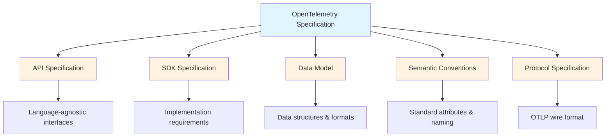

# How to Understand the OpenTelemetry Specification and Why It Exists

Author: [nawazdhandala](https://www.github.com/nawazdhandala)

Tags: OpenTelemetry, Specification, Standards, CNCF, Observability

Description: An exploration of the OpenTelemetry specification, its role in standardizing observability, and how it enables vendor-neutral instrumentation across languages and platforms.

The OpenTelemetry specification is the blueprint that makes vendor-neutral observability possible. Without it, every language implementation, instrumentation library, and backend would interpret telemetry differently, creating the same fragmentation that OpenTelemetry was designed to solve. Understanding this specification helps you make better instrumentation decisions and troubleshoot issues when implementations behave unexpectedly.

## What is the OpenTelemetry Specification?

The OpenTelemetry specification is a detailed technical document that defines how telemetry data should be collected, represented, and transmitted. It covers everything from how to create a span to what attributes should describe an HTTP request. The specification is language-agnostic, describing concepts and requirements that apply regardless of whether you're writing Go, Python, JavaScript, or any other language.

Think of it as the constitution for observability. Just as a legal constitution provides principles that all laws must follow, the OpenTelemetry specification provides principles that all implementations must follow. This ensures that a trace created in Python can be understood by a collector written in Go and visualized by a backend written in Java.

The specification is organized into several key areas:



Each area serves a distinct purpose in creating a complete, interoperable observability ecosystem.

## The API Specification: Defining Interfaces

The API specification defines the interfaces that application developers interact with when instrumenting code. It describes what methods should exist, what parameters they accept, and what behavior is expected, without prescribing how they're implemented:

```python
# The API specification defines interfaces like this (conceptually)
# Actual implementation follows these contracts

from opentelemetry import trace

# API specification defines that you get a tracer from a TracerProvider
tracer = trace.get_tracer(
    instrumenting_module_name="my-application",
    instrumenting_module_version="1.0.0"
)

# API defines the start_span method signature and behavior
with tracer.start_as_current_span("operation-name") as span:
    # API defines how to set attributes
    span.set_attribute("key", "value")

    # API defines how to add events
    span.add_event("Processing started")

    # API defines how to record exceptions
    try:
        risky_operation()
    except Exception as e:
        # API specifies exception recording behavior
        span.record_exception(e)
        raise
```

The API specification ensures consistency. Whether you're using Python, Java, or JavaScript, the conceptual model remains the same. You get a tracer, start spans, add attributes, and record events using similar patterns adapted to each language's idioms.

### API Stability Guarantees

The API specification includes strict stability guarantees. Once an API is marked stable, it won't have breaking changes. This allows you to instrument your application without worrying that an OpenTelemetry update will require code changes:

```javascript
// Code written against stable API remains valid across updates
const { trace } = require('@opentelemetry/api');

// This pattern is stable and won't break in future versions
const tracer = trace.getTracer('my-service', '1.0.0');

const span = tracer.startSpan('database-query');
span.setAttribute('db.system', 'postgresql');
span.setAttribute('db.statement', 'SELECT * FROM users WHERE id = $1');
span.end();
```

This stability is crucial for production systems where updating instrumentation code across hundreds of services would be prohibitively expensive.

## The SDK Specification: Implementation Requirements

While the API defines what developers see, the SDK specification defines how implementations must behave internally. It covers span processors, exporters, samplers, and resource detection:

```go
// SDK specification defines how components work together
package main

import (
    "go.opentelemetry.io/otel"
    "go.opentelemetry.io/otel/exporters/otlp/otlptrace/otlptracegrpc"
    "go.opentelemetry.io/otel/sdk/resource"
    sdktrace "go.opentelemetry.io/otel/sdk/trace"
    semconv "go.opentelemetry.io/otel/semconv/v1.20.0"
)

func initTracer() (*sdktrace.TracerProvider, error) {
    // SDK specification defines resource creation
    res, err := resource.New(context.Background(),
        resource.WithAttributes(
            semconv.ServiceName("my-service"),
        ),
    )

    // SDK specification defines exporter requirements
    exporter, err := otlptracegrpc.New(context.Background())

    // SDK specification defines how span processors work
    bsp := sdktrace.NewBatchSpanProcessor(exporter)

    // SDK specification defines sampler behavior
    sampler := sdktrace.AlwaysSample()

    // SDK specification defines how components combine
    tp := sdktrace.NewTracerProvider(
        sdktrace.WithSampler(sampler),
        sdktrace.WithSpanProcessor(bsp),
        sdktrace.WithResource(res),
    )

    otel.SetTracerProvider(tp)
    return tp, nil
}
```

The SDK specification ensures that regardless of language, implementations handle span lifecycle, batching, and export in consistent ways. This predictability helps when debugging issues or optimizing performance.

### Configurability Requirements

The SDK specification mandates certain configurability options. Every SDK must support environment variables for basic configuration:

```bash
# SDK specification requires these environment variables
export OTEL_SERVICE_NAME="my-service"
export OTEL_RESOURCE_ATTRIBUTES="deployment.environment=production,team=platform"
export OTEL_TRACES_EXPORTER="otlp"
export OTEL_EXPORTER_OTLP_ENDPOINT="http://collector:4317"
export OTEL_EXPORTER_OTLP_PROTOCOL="grpc"
export OTEL_TRACES_SAMPLER="traceidratio"
export OTEL_TRACES_SAMPLER_ARG="0.1"

# Start application - configuration applied automatically
node index.js
```

This standardization means you can configure any OpenTelemetry-instrumented application using the same environment variables, regardless of language or framework.

## The Data Model: Structure of Telemetry

The data model specification defines how telemetry data is structured internally. It describes the fields that make up a span, a metric data point, or a log record:

```python
# Conceptual representation of the span data model
# as defined in the specification

class Span:
    """
    Data model for a span as defined by OpenTelemetry specification.
    """
    def __init__(self):
        # Required fields
        self.trace_id = None           # 16-byte identifier for the trace
        self.span_id = None            # 8-byte identifier for this span
        self.parent_span_id = None     # 8-byte identifier for parent span
        self.name = None               # Human-readable operation name
        self.kind = None               # SpanKind enum: INTERNAL, SERVER, CLIENT, etc.
        self.start_time = None         # Timestamp when span started
        self.end_time = None           # Timestamp when span ended

        # Optional fields
        self.attributes = {}           # Key-value pairs describing the span
        self.events = []               # Timestamped events during span lifetime
        self.links = []                # Links to other spans
        self.status = None             # Status: OK, ERROR, UNSET
        self.resource = None           # Resource attributes describing the service

        # Specification defines exact semantics for each field
        self.instrumentation_scope = None  # Which library created this span
```

The specification goes into detail about each field: valid values, size limits, and semantic meaning. For example, it defines that trace IDs must be 16 bytes, that span names should describe operations (not individual calls), and that attributes must be key-value pairs with specific value types.

### Context Propagation

The data model includes context propagation, which enables distributed tracing:

```javascript
// Context propagation as defined in specification
const { context, trace, propagation } = require('@opentelemetry/api');

// Specification defines how context is extracted from incoming requests
function handleRequest(req, res) {
  // Extract context from HTTP headers
  const parentContext = propagation.extract(context.active(), req.headers);

  // Start a new span with extracted context as parent
  const span = trace.getTracer('my-service').startSpan(
    'handle-request',
    {
      kind: trace.SpanKind.SERVER,
      // Specification defines how parent context links spans
      attributes: {
        'http.method': req.method,
        'http.url': req.url,
      }
    },
    parentContext
  );

  // Process request
  processRequest(req, res);

  span.end();
}

// When calling downstream service, inject context
function callDownstream(url) {
  const headers = {};

  // Specification defines how context is injected into outgoing requests
  propagation.inject(context.active(), headers);

  // Headers now contain traceparent and tracestate
  return fetch(url, { headers });
}
```

The specification defines both the W3C Trace Context standard format for propagation and fallback mechanisms for compatibility with legacy systems.

## Semantic Conventions: Standard Vocabulary

Semantic conventions are the shared vocabulary of OpenTelemetry. They define standard attribute names and values for common scenarios like HTTP requests, database calls, or messaging operations:

```python
# Using semantic conventions for HTTP instrumentation
from opentelemetry import trace
from opentelemetry.semconv.trace import SpanAttributes

tracer = trace.get_tracer(__name__)

def handle_http_request(request):
    with tracer.start_as_current_span("HTTP GET") as span:
        # Semantic conventions define standard HTTP attributes
        span.set_attribute(SpanAttributes.HTTP_METHOD, request.method)
        span.set_attribute(SpanAttributes.HTTP_URL, request.url)
        span.set_attribute(SpanAttributes.HTTP_TARGET, request.path)
        span.set_attribute(SpanAttributes.HTTP_HOST, request.host)
        span.set_attribute(SpanAttributes.HTTP_SCHEME, request.scheme)
        span.set_attribute(SpanAttributes.HTTP_USER_AGENT, request.headers.get('User-Agent'))

        # Process request
        status_code = process_request(request)

        # Semantic conventions define status code attribute
        span.set_attribute(SpanAttributes.HTTP_STATUS_CODE, status_code)

        # Semantic conventions define how to mark errors
        if status_code >= 500:
            span.set_status(trace.Status(trace.StatusCode.ERROR))
```

These conventions ensure that dashboards, queries, and alerts work across different services and languages. When every service uses `http.method` instead of inventing `request.method`, `req.method`, or `method`, analysis becomes straightforward.

### Convention Categories

Semantic conventions cover numerous categories:

```yaml
# Categories of semantic conventions

HTTP Conventions:
  - http.method: HTTP request method
  - http.status_code: HTTP response status
  - http.url: Full request URL
  - http.target: Request target

Database Conventions:
  - db.system: Database system (postgresql, mysql, mongodb)
  - db.statement: Database statement being executed
  - db.name: Database name
  - db.operation: Operation name (SELECT, INSERT, etc)

RPC Conventions:
  - rpc.system: RPC system (grpc, jsonrpc)
  - rpc.service: Service name being called
  - rpc.method: Method being called

Messaging Conventions:
  - messaging.system: Messaging system (kafka, rabbitmq)
  - messaging.destination: Queue or topic name
  - messaging.operation: Operation (send, receive, process)

Resource Conventions:
  - service.name: Logical service name
  - service.version: Service version
  - deployment.environment: Deployment environment
```

The specification continues to evolve these conventions based on community feedback and emerging technologies.

## The Protocol Specification: OTLP

OpenTelemetry Protocol (OTLP) is the wire format for transmitting telemetry data. The protocol specification defines the exact structure of messages sent between instrumented applications and collectors or backends:

```protobuf
// OTLP is defined using Protocol Buffers
// This ensures efficient encoding and language interoperability

syntax = "proto3";

package opentelemetry.proto.trace.v1;

// A collection of spans from a single resource
message ResourceSpans {
  // Resource information for all spans in this message
  opentelemetry.proto.resource.v1.Resource resource = 1;

  // Instrumentation library that created these spans
  repeated ScopeSpans scope_spans = 2;

  // Schema URL for this data
  string schema_url = 3;
}

// Represents a single span
message Span {
  // Trace ID - 16 bytes
  bytes trace_id = 1;

  // Span ID - 8 bytes
  bytes span_id = 2;

  // Parent span ID - 8 bytes
  bytes parent_span_id = 3;

  // Human-readable name
  string name = 4;

  // Span kind
  SpanKind kind = 5;

  // Start time in nanoseconds since Unix epoch
  fixed64 start_time_unix_nano = 6;

  // End time in nanoseconds since Unix epoch
  fixed64 end_time_unix_nano = 7;

  // Attributes
  repeated opentelemetry.proto.common.v1.KeyValue attributes = 8;

  // More fields...
}
```

OTLP supports both gRPC and HTTP transports. The specification defines exactly how data is encoded, compressed, and transmitted:

```javascript
// Configuring OTLP exporter in Node.js
const { OTLPTraceExporter } = require('@opentelemetry/exporter-trace-otlp-grpc');

// gRPC transport
const grpcExporter = new OTLPTraceExporter({
  url: 'http://collector:4317',  // OTLP/gRPC default port
  // Specification defines supported compression
  compression: 'gzip',
  // Specification defines timeout behavior
  timeoutMillis: 10000,
  // Specification defines authentication options
  metadata: {
    'api-key': 'your-api-key',
  },
});

// HTTP transport with JSON encoding
const { OTLPTraceExporter: HTTPExporter } = require('@opentelemetry/exporter-trace-otlp-http');

const httpExporter = new HTTPExporter({
  url: 'http://collector:4318/v1/traces',  // OTLP/HTTP default path
  headers: {
    'Content-Type': 'application/json',
    'Authorization': 'Bearer token',
  },
});
```

The protocol specification ensures that any OTLP exporter can communicate with any OTLP receiver, regardless of implementation language.

## Why the Specification Exists

The specification solves fundamental problems that plagued observability before standardization.

### Preventing Vendor Lock-in

Before OpenTelemetry, instrumenting your application meant choosing a vendor upfront. If you instrumented with Datadog's library, switching to New Relic meant re-instrumenting. The specification breaks this lock-in:

```python
# With OpenTelemetry, instrumentation is vendor-neutral
from opentelemetry import trace
from opentelemetry.sdk.trace import TracerProvider
from opentelemetry.sdk.trace.export import BatchSpanProcessor

# Instrument once using the spec-compliant API
tracer_provider = TracerProvider()
trace.set_tracer_provider(tracer_provider)

# Switch backends by changing only the exporter
# No changes to application instrumentation needed

# Option 1: Send to Jaeger
from opentelemetry.exporter.jaeger import JaegerExporter
jaeger_exporter = JaegerExporter(agent_host_name="localhost", agent_port=6831)
tracer_provider.add_span_processor(BatchSpanProcessor(jaeger_exporter))

# Option 2: Send to Zipkin (just swap the exporter)
from opentelemetry.exporter.zipkin import ZipkinExporter
zipkin_exporter = ZipkinExporter(endpoint="http://localhost:9411/api/v2/spans")
tracer_provider.add_span_processor(BatchSpanProcessor(zipkin_exporter))

# Option 3: Send to commercial backend via OTLP
from opentelemetry.exporter.otlp.proto.grpc.trace_exporter import OTLPSpanExporter
otlp_exporter = OTLPSpanExporter(endpoint="https://backend.example.com:4317")
tracer_provider.add_span_processor(BatchSpanProcessor(otlp_exporter))
```

Your application code stays the same. Only the exporter configuration changes.

### Enabling Ecosystem Growth

The specification creates a level playing field for tool developers. Anyone can build:

- Instrumentation libraries that work with any backend
- Backends that accept data from any instrumented application
- Collectors that process telemetry from diverse sources
- Analysis tools that work with standardized data

This ecosystem growth benefits everyone. Instead of each vendor building instrumentation for every framework, the community builds shared instrumentation that works everywhere.

### Ensuring Consistency

Without a specification, each implementation would make different choices about span naming, attribute formats, and context propagation. The specification ensures consistency:

```go
// All spec-compliant implementations handle context the same way
package main

import (
    "context"
    "go.opentelemetry.io/otel"
    "go.opentelemetry.io/otel/trace"
)

func outerFunction(ctx context.Context) {
    tracer := otel.Tracer("my-service")

    // Start a span and get a new context
    ctx, span := tracer.Start(ctx, "outer-operation")
    defer span.End()

    // Pass context to inner function
    // Specification guarantees context propagation works
    innerFunction(ctx)
}

func innerFunction(ctx context.Context) {
    tracer := otel.Tracer("my-service")

    // This span automatically becomes a child of the outer span
    // because the specification defines context propagation behavior
    ctx, span := tracer.Start(ctx, "inner-operation")
    defer span.End()

    // Do work
}
```

## Working with the Specification

You don't need to memorize the entire specification, but knowing where to find answers helps when you encounter unexpected behavior.

### Reading the Specification

The specification is organized logically on GitHub at github.com/open-telemetry/opentelemetry-specification:

```markdown
# Specification structure

/specification
  /overview.md                  # Start here for big picture
  /trace/                       # Tracing specification
    /api.md                     # Trace API requirements
    /sdk.md                     # Trace SDK requirements
  /metrics/                     # Metrics specification
  /logs/                        # Logs specification
  /resource/                    # Resource specification
    /semantic_conventions/      # Standard resource attributes
  /context/                     # Context propagation
  /protocol/                    # OTLP specification
```

When you have questions like "What's the difference between span events and span attributes?" or "How should I name my database spans?", the specification has authoritative answers.

### Compliance Levels

The specification uses RFC 2119 keywords to indicate requirement levels:

```yaml
# Understanding specification language

MUST / REQUIRED / SHALL:
  # Implementation must do this
  "Trace IDs MUST be 16 bytes"
  "Implementations MUST support environment variable configuration"

MUST NOT / SHALL NOT:
  # Implementation must not do this
  "Span names MUST NOT include high-cardinality values"

SHOULD / RECOMMENDED:
  # Implementation should do this unless there's good reason not to
  "SDKs SHOULD provide a way to configure custom samplers"

MAY / OPTIONAL:
  # Implementation can choose
  "Implementations MAY optimize by caching TracerProvider instances"
```

Understanding these levels helps you know what's required versus what's optional.

### Staying Current

The specification evolves as observability needs change. Follow specification changes through:

- GitHub repository watch notifications
- OpenTelemetry blog announcements
- CNCF OpenTelemetry community meetings
- Changelog reviews before upgrading SDKs

Major changes go through a rigorous review process including community feedback periods, ensuring stability while allowing innovation.

## Practical Implications

Understanding the specification helps you make better instrumentation decisions.

### Debugging Issues

When telemetry behaves unexpectedly, the specification helps diagnose whether it's a bug or expected behavior:

```python
# Is this a bug or expected behavior?
from opentelemetry import trace

tracer = trace.get_tracer(__name__)

with tracer.start_as_current_span("operation") as span:
    # You set an attribute with one type
    span.set_attribute("count", 42)

    # Later set the same attribute with different type
    span.set_attribute("count", "forty-two")

    # Question: Which value is kept?
    # Answer: Check the specification
```

The specification states that setting the same attribute multiple times keeps the last value. Understanding this prevents confusion and helps you write correct instrumentation.

### Choosing Libraries

When evaluating instrumentation libraries, check specification compliance. Libraries that follow the specification integrate cleanly with your observability stack:

```javascript
// Spec-compliant library provides standard interfaces
const { trace } = require('@opentelemetry/api');

// You can verify compliance by checking if it follows spec patterns
const tracer = trace.getTracer('library-name', 'version');

// Spec-compliant libraries use standard semantic conventions
span.setAttribute('http.method', 'GET');  // Not 'request.method'
span.setAttribute('http.status_code', 200);  // Not 'response.code'
```

### Contributing to OpenTelemetry

Understanding the specification is essential for contributing to OpenTelemetry projects. Whether you're fixing bugs, adding features, or creating new instrumentation, your changes must align with specification requirements.

The OpenTelemetry specification is the foundation that enables vendor-neutral, consistent observability across languages, frameworks, and tools. While you don't need to memorize every detail, understanding its structure, purpose, and key concepts helps you instrument applications effectively and troubleshoot issues when they arise. The specification represents the collective wisdom of the observability community, distilled into a practical standard that benefits everyone.

For more foundational concepts, explore our guides on [the three pillars of observability](https://oneuptime.com/blog/post/2025-08-20-three-pillars-of-observability-logs-metrics-traces/view) and [what is an OpenTelemetry Collector](https://oneuptime.com/blog/post/2025-09-18-what-is-opentelemetry-collector-and-why-use-one/view).
