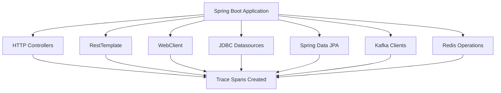

# How to Set Up OpenTelemetry in Spring Boot with the Spring Boot Starter

Author: [nawazdhandala](https://www.github.com/nawazdhandala)

Tags: OpenTelemetry, Spring Boot, Java, Starter, Auto-Configuration

Description: A comprehensive guide to integrating OpenTelemetry into Spring Boot applications using the official Spring Boot Starter for automatic instrumentation and observability.

The Spring Boot Starter for OpenTelemetry provides a seamless way to add observability to your applications without manual instrumentation. Unlike the Java agent approach, the starter integrates directly with Spring Boot's auto-configuration mechanism, giving you fine-grained control over what gets instrumented while maintaining the simplicity that Spring Boot developers expect.

## Why Use the Spring Boot Starter?

The OpenTelemetry Spring Boot Starter offers several advantages over manual instrumentation or even the Java agent:

- **Spring-native integration**: Works with Spring Boot's dependency injection and configuration system
- **Type-safe configuration**: Use application.properties or application.yml with IDE autocomplete
- **Selective instrumentation**: Enable or disable specific instrumentations programmatically
- **Better testability**: Easier to mock and test compared to agent-based approaches
- **No JVM agent required**: Runs as a regular dependency, simpler deployment

## Adding Dependencies

The first step is adding the OpenTelemetry Spring Boot Starter to your project. The starter handles most of the heavy lifting through auto-configuration.

```xml
<!-- Add this to your pom.xml -->
<dependencies>
    <!-- Core OpenTelemetry Spring Boot Starter -->
    <dependency>
        <groupId>io.opentelemetry.instrumentation</groupId>
        <artifactId>opentelemetry-spring-boot-starter</artifactId>
        <version>2.1.0-alpha</version>
    </dependency>

    <!-- OTLP Exporter for sending data to collectors -->
    <dependency>
        <groupId>io.opentelemetry</groupId>
        <artifactId>opentelemetry-exporter-otlp</artifactId>
    </dependency>

    <!-- Spring Boot Web for HTTP instrumentation -->
    <dependency>
        <groupId>org.springframework.boot</groupId>
        <artifactId>spring-boot-starter-web</artifactId>
    </dependency>
</dependencies>
```

For Gradle users, the equivalent configuration looks like this:

```groovy
dependencies {
    implementation 'io.opentelemetry.instrumentation:opentelemetry-spring-boot-starter:2.1.0-alpha'
    implementation 'io.opentelemetry:opentelemetry-exporter-otlp'
    implementation 'org.springframework.boot:spring-boot-starter-web'
}
```

## Basic Configuration

Configure OpenTelemetry through your application.yml file. The starter supports all standard OpenTelemetry SDK configuration options.

```yaml
# Basic OpenTelemetry configuration
otel:
  # Service name appears in all traces and metrics
  service:
    name: payment-service
    version: 1.0.0

  # Resource attributes for service identification
  resource:
    attributes:
      deployment.environment: production
      service.namespace: payments

  # OTLP exporter configuration
  exporter:
    otlp:
      # Endpoint for your OpenTelemetry collector or backend
      endpoint: http://localhost:4318
      # Use HTTP or gRPC protocol
      protocol: http/protobuf
      # Headers for authentication
      headers:
        api-key: your-api-key-here

  # Trace configuration
  traces:
    exporter: otlp
    sampler:
      # Sample 100% of traces (adjust for production)
      probability: 1.0

  # Metrics configuration
  metrics:
    exporter: otlp
    # Export interval in milliseconds
    export-interval: 60000

  # Logging configuration
  logs:
    exporter: otlp
```

## Understanding Auto-Instrumentation

The Spring Boot Starter automatically instruments common Spring components. Here's what gets instrumented out of the box:



## Creating a Sample Application

Here's a complete Spring Boot application that demonstrates automatic instrumentation:

```java
package com.example.demo;

import org.springframework.boot.SpringApplication;
import org.springframework.boot.autoconfigure.SpringBootApplication;
import org.springframework.web.bind.annotation.GetMapping;
import org.springframework.web.bind.annotation.RestController;
import org.springframework.beans.factory.annotation.Autowired;
import org.springframework.jdbc.core.JdbcTemplate;

/**
 * Main Spring Boot application with automatic OpenTelemetry instrumentation.
 * The starter will automatically create spans for HTTP requests and database calls.
 */
@SpringBootApplication
public class DemoApplication {
    public static void main(String[] args) {
        SpringApplication.run(DemoApplication.class, args);
    }
}

@RestController
class PaymentController {

    @Autowired
    private JdbcTemplate jdbcTemplate;

    /**
     * This endpoint is automatically instrumented.
     * A span is created for the HTTP request, and child spans
     * are created for the database query.
     */
    @GetMapping("/payments")
    public List<Payment> getPayments() {
        // Database query automatically creates a span
        return jdbcTemplate.query(
            "SELECT id, amount, status FROM payments WHERE status = ?",
            new Object[]{"pending"},
            (rs, rowNum) -> new Payment(
                rs.getLong("id"),
                rs.getBigDecimal("amount"),
                rs.getString("status")
            )
        );
    }
}
```

## Manual Instrumentation with the Starter

While auto-instrumentation covers many cases, you'll often need custom spans for business logic:

```java
package com.example.demo;

import io.opentelemetry.api.trace.Tracer;
import io.opentelemetry.api.trace.Span;
import io.opentelemetry.api.trace.StatusCode;
import io.opentelemetry.context.Scope;
import org.springframework.stereotype.Service;
import org.springframework.beans.factory.annotation.Autowired;

/**
 * Service demonstrating manual span creation with the OpenTelemetry API.
 * The Tracer is automatically injected by the Spring Boot Starter.
 */
@Service
public class PaymentService {

    @Autowired
    private Tracer tracer;

    /**
     * Process a payment with custom instrumentation.
     * Creates a manual span to track the payment processing logic.
     */
    public void processPayment(Payment payment) {
        // Create a new span for this operation
        Span span = tracer.spanBuilder("payment.process")
            .setAttribute("payment.id", payment.getId())
            .setAttribute("payment.amount", payment.getAmount().toString())
            .startSpan();

        // Make this span the active span
        try (Scope scope = span.makeCurrent()) {

            // Validate payment
            validatePayment(payment);

            // Process with payment gateway
            String transactionId = chargePaymentGateway(payment);
            span.setAttribute("transaction.id", transactionId);

            // Update database
            updatePaymentStatus(payment.getId(), "completed");

            // Mark span as successful
            span.setStatus(StatusCode.OK);

        } catch (PaymentException e) {
            // Record exception and mark span as error
            span.recordException(e);
            span.setStatus(StatusCode.ERROR, e.getMessage());
            throw e;
        } finally {
            // Always end the span
            span.end();
        }
    }

    /**
     * Nested operations automatically become child spans
     * when called within an active span context.
     */
    private void validatePayment(Payment payment) {
        Span span = tracer.spanBuilder("payment.validate").startSpan();
        try (Scope scope = span.makeCurrent()) {
            if (payment.getAmount().compareTo(BigDecimal.ZERO) <= 0) {
                throw new PaymentException("Invalid amount");
            }
            span.setStatus(StatusCode.OK);
        } finally {
            span.end();
        }
    }
}
```

## Configuring Sampling

Production environments typically need sampling to reduce data volume. Configure sampling strategies through properties:

```yaml
otel:
  traces:
    sampler:
      # Parent-based sampling with ratio
      type: parentbased_traceidratio
      arg: 0.1  # Sample 10% of traces
```

For more complex sampling, implement a custom sampler:

```java
package com.example.demo.config;

import io.opentelemetry.api.trace.SpanKind;
import io.opentelemetry.sdk.trace.samplers.Sampler;
import io.opentelemetry.sdk.trace.samplers.SamplingResult;
import io.opentelemetry.context.Context;
import io.opentelemetry.api.common.Attributes;
import org.springframework.context.annotation.Bean;
import org.springframework.context.annotation.Configuration;

/**
 * Custom sampler that samples 100% of errors and 10% of successful requests.
 * This ensures you always capture traces when things go wrong.
 */
@Configuration
public class TracingConfig {

    @Bean
    public Sampler customSampler() {
        return new Sampler() {
            private final Sampler alwaysOn = Sampler.alwaysOn();
            private final Sampler tenPercent = Sampler.traceIdRatioBased(0.1);

            @Override
            public SamplingResult shouldSample(
                Context parentContext,
                String traceId,
                String name,
                SpanKind spanKind,
                Attributes attributes,
                List<LinkData> parentLinks
            ) {
                // Always sample if span name indicates an error
                if (name.contains("error") || name.contains("exception")) {
                    return alwaysOn.shouldSample(
                        parentContext, traceId, name, spanKind, attributes, parentLinks
                    );
                }

                // Otherwise sample 10%
                return tenPercent.shouldSample(
                    parentContext, traceId, name, spanKind, attributes, parentLinks
                );
            }

            @Override
            public String getDescription() {
                return "ErrorAwareSampler{always sample errors, 10% otherwise}";
            }
        };
    }
}
```

## Exporting to Different Backends

The starter supports multiple export destinations. Here's how to configure different backends:

```yaml
# Export to Jaeger
otel:
  exporter:
    otlp:
      endpoint: http://jaeger:4318
      protocol: http/protobuf

---
# Export to Zipkin
spring:
  config:
    activate:
      on-profile: zipkin

otel:
  traces:
    exporter: zipkin
  exporter:
    zipkin:
      endpoint: http://zipkin:9411/api/v2/spans

---
# Export to multiple destinations (requires custom configuration)
spring:
  config:
    activate:
      on-profile: multi-export
```

For multiple exporters, configure them programmatically:

```java
package com.example.demo.config;

import io.opentelemetry.sdk.trace.export.SpanExporter;
import io.opentelemetry.sdk.trace.export.BatchSpanProcessor;
import io.opentelemetry.exporter.otlp.trace.OtlpGrpcSpanExporter;
import io.opentelemetry.exporter.logging.LoggingSpanExporter;
import org.springframework.context.annotation.Bean;
import org.springframework.context.annotation.Configuration;

/**
 * Configure multiple span exporters for redundancy or testing.
 * Spans will be sent to both OTLP collector and console logs.
 */
@Configuration
public class MultiExporterConfig {

    @Bean
    public SpanExporter otlpExporter() {
        return OtlpGrpcSpanExporter.builder()
            .setEndpoint("http://collector:4317")
            .build();
    }

    @Bean
    public SpanExporter loggingExporter() {
        // Useful for debugging
        return LoggingSpanExporter.create();
    }

    @Bean
    public BatchSpanProcessor otlpProcessor(SpanExporter otlpExporter) {
        return BatchSpanProcessor.builder(otlpExporter).build();
    }

    @Bean
    public BatchSpanProcessor loggingProcessor(SpanExporter loggingExporter) {
        return BatchSpanProcessor.builder(loggingExporter).build();
    }
}
```

## Adding Context Propagation

Context propagation ensures traces continue across service boundaries. Configure propagators for your architecture:

```yaml
otel:
  propagators:
    # Support multiple propagation formats
    - tracecontext    # W3C Trace Context (standard)
    - baggage         # W3C Baggage
    - b3              # Zipkin B3 (legacy systems)
    - jaeger          # Jaeger propagation
```

## Health Checks and Monitoring

Monitor the health of your OpenTelemetry instrumentation:

```java
package com.example.demo.actuator;

import io.opentelemetry.sdk.trace.SdkTracerProvider;
import org.springframework.boot.actuate.health.Health;
import org.springframework.boot.actuate.health.HealthIndicator;
import org.springframework.stereotype.Component;
import org.springframework.beans.factory.annotation.Autowired;

/**
 * Custom health indicator for OpenTelemetry.
 * Exposes tracing status through Spring Boot Actuator.
 */
@Component
public class OpenTelemetryHealthIndicator implements HealthIndicator {

    @Autowired(required = false)
    private SdkTracerProvider tracerProvider;

    @Override
    public Health health() {
        if (tracerProvider == null) {
            return Health.down()
                .withDetail("reason", "TracerProvider not initialized")
                .build();
        }

        return Health.up()
            .withDetail("provider", tracerProvider.getClass().getSimpleName())
            .build();
    }
}
```

## Troubleshooting Common Issues

When traces don't appear, check these common issues:

1. **Verify exporter endpoint connectivity**: Test with curl or telnet
2. **Check sampling configuration**: You might be sampling 0%
3. **Review logs for export errors**: Enable debug logging
4. **Validate resource attributes**: Ensure service.name is set

Enable debug logging to diagnose issues:

```yaml
logging:
  level:
    io.opentelemetry: DEBUG
    io.opentelemetry.exporter: TRACE
```

## Performance Considerations

The Spring Boot Starter has minimal overhead, but consider these optimizations:

- Use batch span processors (enabled by default)
- Adjust batch size and schedule delay based on throughput
- Use appropriate sampling rates for high-traffic services
- Consider async exporters for latency-sensitive paths

```yaml
otel:
  sdk:
    trace:
      export:
        # Batch configuration for optimal performance
        batch:
          max-queue-size: 2048
          max-export-batch-size: 512
          schedule-delay: 5000  # milliseconds
```

The OpenTelemetry Spring Boot Starter provides a production-ready foundation for observability in Spring applications. By leveraging Spring Boot's auto-configuration, it reduces the complexity of adding telemetry while maintaining the flexibility to customize instrumentation as your needs evolve.
