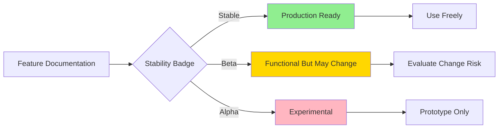
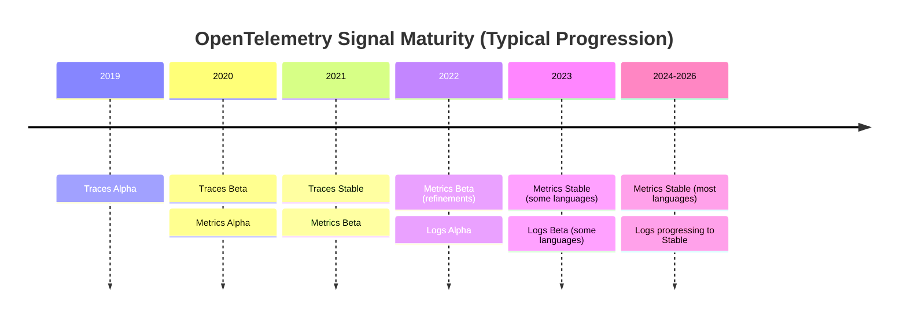

# How to Understand OpenTelemetry Stability Levels (Stable, Beta, Alpha)

Author: [nawazdhandala](https://www.github.com/nawazdhandala)

Tags: OpenTelemetry, Stability, Versioning, API, SDK, Maturity

Description: A comprehensive explanation of OpenTelemetry's stability levels and how they affect your implementation decisions and production readiness.

OpenTelemetry marks every feature with a stability level: Stable, Beta, or Alpha. These labels aren't just bureaucratic overhead. They tell you exactly what you can rely on in production and what might break in the next release.

Understanding these levels saves you from painful debugging sessions when an experimental feature changes its API or disappears entirely. After migrating multiple services to OpenTelemetry, I've learned to treat stability levels as critical information, not optional metadata.

## The Three Stability Levels Explained

Stable means the feature is production-ready. The API won't change in breaking ways. You can depend on it for critical systems. If breaking changes become absolutely necessary, they'll only happen in a major version bump (like 1.x to 2.x), giving you plenty of warning.

Beta indicates functional completeness but reserves the right to change. The feature works as intended and has been tested, but based on real-world usage, the API might need adjustments. These changes are less frequent than Alpha, but they can happen in minor releases.

Alpha is experimental territory. The feature exists to gather feedback. The API can change dramatically or the feature might be removed entirely. Using Alpha features in production is risky unless you're prepared to adapt quickly.

The stability level applies to different components independently. The tracing API might be Stable while the metrics API is Beta and logs are Alpha. You need to check each component you use.

## How Stability Levels Apply to Different Components

OpenTelemetry splits into three main layers: API, SDK, and instrumentation. Each layer has its own stability tracking.

The API layer defines interfaces for creating traces, metrics, and logs. This is what application code imports and calls. A Stable API means your instrumentation code won't need changes.

The SDK layer implements the API and handles data processing, sampling, and export. SDK stability affects how you configure and deploy OpenTelemetry, but usually not your application code.

Instrumentation libraries auto-instrument frameworks and libraries. These have separate stability from the core SDK. Express.js instrumentation might be Stable while gRPC instrumentation is still Beta.

Here's how to check stability in different languages:

```python
# Python: Check the documentation or release notes
# Most stable components are in main packages
from opentelemetry import trace  # Stable API
from opentelemetry.sdk.trace import TracerProvider  # Stable SDK

# Beta components often have version suffixes
from opentelemetry.sdk.metrics import MeterProvider  # Check docs for current status
```

```javascript
// Node.js: Check package.json or documentation
// Stable components don't have version prefixes
const { trace } = require('@opentelemetry/api');  // Stable

// Experimental components are clearly marked
const { metrics } = require('@opentelemetry/api');  // Check current status
```

```go
// Go: Import paths indicate stability
import (
    "go.opentelemetry.io/otel"  // Stable
    "go.opentelemetry.io/otel/trace"  // Stable
    "go.opentelemetry.io/otel/metric"  // Check docs for current status
)
```

## Reading Stability Information from Documentation

Every OpenTelemetry specification document includes stability markers. Look for badges or labels next to feature descriptions. The documentation repository maintains a status page listing every component's stability.

Language-specific documentation varies in how clearly it displays stability. Some implementations put stability badges prominently, others bury it in release notes. When in doubt, check the specification document for that signal type.

The OpenTelemetry website maintains a status page showing the maturity of each signal (traces, metrics, logs) across all language implementations. This is your go-to reference when evaluating whether to adopt a feature.



## Stable Features: What You Can Trust

Stable features have undergone extensive testing and real-world validation. The OpenTelemetry maintainers commit to backward compatibility. You can build long-term systems on these foundations.

The tracing API reached Stable status first. Creating spans, adding attributes, and propagating context are all Stable operations. Any code you write using these APIs will continue to work across SDK updates.

Span attributes follow defined semantic conventions. While new conventions get added, existing ones remain valid. If you instrument a HTTP server using the Stable conventions, those attributes won't suddenly become deprecated.

Context propagation is Stable across W3C Trace Context and Baggage. If you pass context between services using these standards, the mechanism won't change. This is crucial for distributed tracing in microservices.

Here's what Stable tracing looks like:

```python
# This code will work across SDK versions
from opentelemetry import trace

tracer = trace.get_tracer(__name__)

with tracer.start_as_current_span("process_order") as span:
    span.set_attribute("order.id", order_id)
    span.set_attribute("order.total", order_total)
    # Process order
    span.add_event("order_validated")
```

```javascript
// Stable API usage in Node.js
const { trace } = require('@opentelemetry/api');

const tracer = trace.getTracer('order-service');

const span = tracer.startSpan('process_order');
span.setAttribute('order.id', orderId);
span.setAttribute('order.total', orderTotal);
// Process order
span.addEvent('order_validated');
span.end();
```

## Beta Features: Weighing the Tradeoffs

Beta features are functionally complete but might see API refinements. The core functionality won't disappear, but method signatures or configuration options might change.

Metrics reached Beta in most language implementations during 2023-2024. You can use metrics in production, but updates might require code changes. The data model is solid, but the SDK interfaces are still settling.

Logs signal support varies widely by language. Some implementations have Beta log support with working bridges to existing logging frameworks. Others are earlier in development. Check your specific language's status.

When using Beta features, implement abstractions in your code. Instead of calling OpenTelemetry APIs directly throughout your application, create wrapper functions. This localizes changes when APIs evolve.

```python
# Create an abstraction layer for Beta features
class MetricsHelper:
    def __init__(self, meter_provider):
        self.meter = meter_provider.get_meter(__name__)
        self.order_counter = self.meter.create_counter(
            "orders.processed",
            description="Number of orders processed"
        )

    def increment_orders(self, attributes):
        # If the API changes, you only update this method
        self.order_counter.add(1, attributes)

# Use the abstraction in application code
metrics = MetricsHelper(meter_provider)
metrics.increment_orders({"status": "success"})
```

This pattern means API changes only affect your wrapper class, not every place you record metrics.

## Alpha Features: Proceed with Caution

Alpha features are experimental. Use them to evaluate upcoming functionality or provide feedback to maintainers, but understand they can change radically.

Profiling signal support is currently Alpha in several languages. The feature exists and you can experiment with it, but the API isn't finalized. If you implement profiling now, expect to rewrite it when the API stabilizes.

Some instrumentation libraries remain in Alpha because they instrument rapidly-evolving frameworks. The instrumentation works but needs frequent updates to track framework changes.

Alpha features come with explicit warnings in documentation. If you don't see a warning, double-check the stability status. Don't assume a feature is Stable just because it's documented.

When evaluating Alpha features:

```yaml
# Document your usage of Alpha features
# Keep a registry of experimental dependencies

experimental_features:
  - component: profiling
    stability: Alpha
    language: python
    reason: "Evaluating for future use"
    update_schedule: "Review quarterly"
    fallback_plan: "Can remove without impact"

  - component: redis_instrumentation
    stability: Alpha
    language: javascript
    reason: "No stable alternative available"
    update_schedule: "Check with each SDK release"
    fallback_plan: "Custom instrumentation if removed"
```

## Stability Progression Timeline

Features don't stay at one level forever. OpenTelemetry has a defined progression path from Alpha to Beta to Stable.

The specification defines requirements for each transition. Alpha to Beta requires implementation in at least two languages, documentation, and no major design concerns. Beta to Stable requires multiple production deployments, proven reliability, and community consensus.

Traces progressed fastest. The tracing specification and API reached Stable in 2021 across most languages. This reflects tracing's maturity as an observability signal.

Metrics took longer. The data model went through several iterations before stabilizing. Different languages implemented metrics at different paces, with some reaching Stable in 2023 and others still in Beta as of 2026.

Logs are the newest signal. The specification focuses on bridging existing logging frameworks rather than creating new APIs. This approach means logs support depends heavily on language-specific logging ecosystems.



## Impact on Production Deployment Decisions

Stability levels directly influence what you should deploy. For critical production services, stick to Stable features. The risk of API changes disrupting production isn't worth early access to Beta functionality.

For internal services or non-critical paths, Beta features are reasonable. You'll need to budget time for updates when APIs change, but you get access to newer functionality sooner.

Alpha features belong in development and staging environments. Use them to learn, provide feedback, and prepare for eventual stability. Don't put them in production unless you have a specific reason and can absorb the maintenance burden.

Some organizations create tiered adoption policies:

```python
# Example policy enforcement in code review
class StabilityPolicy:
    PRODUCTION_ALLOWED = ['stable']
    STAGING_ALLOWED = ['stable', 'beta']
    DEV_ALLOWED = ['stable', 'beta', 'alpha']

    @staticmethod
    def check_import(import_path, environment):
        stability = get_stability_level(import_path)

        if environment == 'production':
            return stability in StabilityPolicy.PRODUCTION_ALLOWED
        elif environment == 'staging':
            return stability in StabilityPolicy.STAGING_ALLOWED
        else:
            return stability in StabilityPolicy.DEV_ALLOWED
```

## Tracking Stability Changes

Stability levels change over time. Subscribe to OpenTelemetry release announcements to know when Beta features become Stable or Alpha features graduate to Beta.

The specification repository uses GitHub issues and pull requests to discuss stability changes. For features you depend on, watch the relevant specification PRs to see when stability might change.

Each language implementation publishes release notes highlighting stability changes. When a Beta feature becomes Stable, it's worth reviewing if you've been waiting to adopt it.

Some implementations maintain a compatibility and stability document that tracks each component's status. Bookmark this for your language and check it quarterly.

## Making Informed Decisions

Stability levels aren't the only factor in adoption decisions, but they're crucial. A Stable feature from last year might be less useful than a Beta feature that solves your exact problem.

Consider your team's capacity to handle changes. If you're already stretched thin, avoid Beta and Alpha features. If you have bandwidth to track updates, Beta features might be worth the tradeoff.

Think about your upgrade cadence. If you only update dependencies quarterly, Beta features pose more risk. If you update monthly, you can track API changes more easily.

Your observability backend matters too. Some vendors or tools support only Stable signals. Using Beta or Alpha features might mean your backend can't process the data properly.

## Future Stability Expectations

OpenTelemetry continues evolving. New signals like profiling and session replay are working through Alpha and Beta stages. Knowing the stability trajectory helps you plan adoption timing.

The project aims for API stability across major versions. Once something reaches Stable, it should remain compatible through the 1.x version line. This gives you confidence in long-term investments.

SDK implementations have more flexibility to change. While they respect semantic versioning, SDK internals can evolve more freely than APIs. This separation lets implementations improve without breaking application code.

Instrumentation libraries will continue having varied stability levels. Popular frameworks get stable instrumentation quickly. Newer or niche frameworks might stay in Beta or Alpha longer.

Understanding these levels transforms how you approach OpenTelemetry adoption. Instead of treating all features equally, you can make risk-aware decisions that match your organization's tolerance for change. Stable features form your foundation. Beta features expand capabilities when the tradeoff makes sense. Alpha features let you peek at the future without betting your production systems on it.