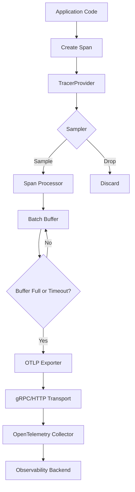

# How to Set Up OpenTelemetry TracerProvider and OTLP Exporter in Go

Author: [nawazdhandala](https://www.github.com/nawazdhandala)

Tags: OpenTelemetry, Go, TracerProvider, OTLP, Exporter, Setup

Description: Complete guide to configuring OpenTelemetry TracerProvider and OTLP exporter in Go applications for production-ready distributed tracing infrastructure.

Setting up OpenTelemetry instrumentation in your Go application requires two fundamental components: a TracerProvider that manages trace collection and processing, and an exporter that sends trace data to your observability backend. While individual instrumentation libraries create spans, the TracerProvider controls how those spans are processed, sampled, and exported.

The OpenTelemetry Protocol (OTLP) has emerged as the standard for transmitting telemetry data. OTLP exporters send traces to OpenTelemetry Collectors or directly to observability platforms that support the protocol. Understanding how to configure these components correctly ensures your traces reach your backend reliably and efficiently.

## Understanding the Components

The TracerProvider sits at the heart of OpenTelemetry instrumentation. When your application creates a span, it requests a tracer from the TracerProvider. The provider determines how that span is processed: which attributes to include, whether to sample it, and where to send it.

Span processors form the pipeline between span creation and export. The batch processor aggregates spans before sending them, reducing network overhead. The simple processor exports each span immediately, useful for debugging but inefficient in production.

Exporters handle the actual transmission of span data. The OTLP exporter supports both gRPC and HTTP protocols, with gRPC being the more efficient choice for high-volume applications.

## Installing Required Packages

Install the OpenTelemetry SDK and OTLP exporter packages.

```bash
# Core OpenTelemetry SDK
go get -u go.opentelemetry.io/otel
go get -u go.opentelemetry.io/otel/sdk/trace
go get -u go.opentelemetry.io/otel/sdk/resource

# OTLP exporter with gRPC
go get -u go.opentelemetry.io/otel/exporters/otlp/otlptrace
go get -u go.opentelemetry.io/otel/exporters/otlp/otlptrace/otlptracegrpc

# OTLP exporter with HTTP (alternative)
go get -u go.opentelemetry.io/otel/exporters/otlp/otlptrace/otlptracehttp

# Semantic conventions for resource attributes
go get -u go.opentelemetry.io/otel/semconv/v1.17.0
```

These packages provide everything needed for production-ready trace export.

## Basic TracerProvider Setup

Create a minimal TracerProvider configuration that exports traces to stdout for development.

```go
package main

import (
    "context"
    "log"

    "go.opentelemetry.io/otel"
    "go.opentelemetry.io/otel/exporters/stdout/stdouttrace"
    "go.opentelemetry.io/otel/sdk/resource"
    sdktrace "go.opentelemetry.io/otel/sdk/trace"
    semconv "go.opentelemetry.io/otel/semconv/v1.17.0"
)

func initTracerProvider() (*sdktrace.TracerProvider, error) {
    // Create stdout exporter for development
    exporter, err := stdouttrace.New(
        stdouttrace.WithPrettyPrint(),
    )
    if err != nil {
        return nil, err
    }

    // Define resource attributes that identify this service
    resource := resource.NewWithAttributes(
        semconv.SchemaURL,
        semconv.ServiceName("my-service"),
        semconv.ServiceVersion("1.0.0"),
        semconv.DeploymentEnvironment("development"),
    )

    // Create TracerProvider with batch span processor
    tp := sdktrace.NewTracerProvider(
        sdktrace.WithBatcher(exporter),
        sdktrace.WithResource(resource),
    )

    // Register as global TracerProvider
    otel.SetTracerProvider(tp)

    return tp, nil
}

func main() {
    tp, err := initTracerProvider()
    if err != nil {
        log.Fatal(err)
    }

    // Ensure proper shutdown
    defer func() {
        if err := tp.Shutdown(context.Background()); err != nil {
            log.Printf("Error shutting down tracer provider: %v", err)
        }
    }()

    // Your application code here
    log.Println("Tracer provider initialized")
}
```

This basic setup exports traces to stdout, making it easy to verify instrumentation during development. The batch processor aggregates spans before exporting them for efficiency.

## Production Setup with OTLP gRPC Exporter

Configure OTLP exporter with gRPC for production use.

```go
package main

import (
    "context"
    "fmt"
    "log"
    "time"

    "go.opentelemetry.io/otel"
    "go.opentelemetry.io/otel/exporters/otlp/otlptrace"
    "go.opentelemetry.io/otel/exporters/otlp/otlptrace/otlptracegrpc"
    "go.opentelemetry.io/otel/sdk/resource"
    sdktrace "go.opentelemetry.io/otel/sdk/trace"
    semconv "go.opentelemetry.io/otel/semconv/v1.17.0"
    "google.golang.org/grpc"
    "google.golang.org/grpc/credentials/insecure"
)

func initProductionTracer(ctx context.Context) (*sdktrace.TracerProvider, error) {
    // Configure OTLP gRPC exporter
    exporter, err := otlptracegrpc.New(
        ctx,
        otlptracegrpc.WithEndpoint("otel-collector:4317"),
        // Use insecure for development/internal networks
        otlptracegrpc.WithInsecure(),
        // For production with TLS:
        // otlptracegrpc.WithTLSCredentials(credentials.NewClientTLSFromCert(nil, "")),
        otlptracegrpc.WithTimeout(5*time.Second),
        otlptracegrpc.WithRetry(otlptracegrpc.RetryConfig{
            Enabled:         true,
            InitialInterval: 1 * time.Second,
            MaxInterval:     30 * time.Second,
            MaxElapsedTime:  5 * time.Minute,
        }),
    )
    if err != nil {
        return nil, fmt.Errorf("failed to create OTLP exporter: %w", err)
    }

    // Define comprehensive resource attributes
    resource, err := resource.New(
        ctx,
        resource.WithAttributes(
            semconv.ServiceName("my-service"),
            semconv.ServiceVersion("1.0.0"),
            semconv.ServiceInstanceID("instance-123"),
            semconv.DeploymentEnvironment("production"),
            semconv.ServiceNamespace("backend"),
        ),
        // Detect resource attributes from environment
        resource.WithFromEnv(),
        resource.WithProcess(),
        resource.WithOS(),
        resource.WithContainer(),
        resource.WithHost(),
    )
    if err != nil {
        return nil, fmt.Errorf("failed to create resource: %w", err)
    }

    // Create TracerProvider with production configuration
    tp := sdktrace.NewTracerProvider(
        sdktrace.WithBatcher(
            exporter,
            sdktrace.WithMaxExportBatchSize(512),
            sdktrace.WithMaxQueueSize(2048),
            sdktrace.WithBatchTimeout(5*time.Second),
        ),
        sdktrace.WithResource(resource),
        sdktrace.WithSampler(sdktrace.ParentBased(
            sdktrace.TraceIDRatioBased(0.1), // Sample 10% of traces
        )),
    )

    otel.SetTracerProvider(tp)

    return tp, nil
}

func main() {
    ctx := context.Background()

    tp, err := initProductionTracer(ctx)
    if err != nil {
        log.Fatal(err)
    }

    // Graceful shutdown with timeout
    defer func() {
        shutdownCtx, cancel := context.WithTimeout(context.Background(), 10*time.Second)
        defer cancel()

        if err := tp.Shutdown(shutdownCtx); err != nil {
            log.Printf("Error shutting down tracer provider: %v", err)
        }
    }()

    log.Println("Production tracer provider initialized")
}
```

This production configuration includes retry logic, connection pooling, batch processing tuning, and sampling to handle high-volume trace data efficiently.

## OTLP HTTP Exporter Alternative

Some environments prefer HTTP over gRPC. Configure the HTTP exporter as an alternative.

```go
package main

import (
    "context"
    "crypto/tls"
    "fmt"
    "net/http"
    "time"

    "go.opentelemetry.io/otel/exporters/otlp/otlptrace/otlptracehttp"
    sdktrace "go.opentelemetry.io/otel/sdk/trace"
    "go.opentelemetry.io/otel/sdk/resource"
    semconv "go.opentelemetry.io/otel/semconv/v1.17.0"
)

func initHTTPExporter(ctx context.Context) (*sdktrace.TracerProvider, error) {
    // Configure OTLP HTTP exporter
    exporter, err := otlptracehttp.New(
        ctx,
        otlptracehttp.WithEndpoint("otel-collector:4318"),
        otlptracehttp.WithURLPath("/v1/traces"),
        // Use insecure for development
        otlptracehttp.WithInsecure(),
        // For production with custom TLS:
        // otlptracehttp.WithTLSClientConfig(&tls.Config{...}),
        otlptracehttp.WithTimeout(10*time.Second),
        otlptracehttp.WithRetry(otlptracehttp.RetryConfig{
            Enabled:         true,
            InitialInterval: 1 * time.Second,
            MaxInterval:     30 * time.Second,
            MaxElapsedTime:  5 * time.Minute,
        }),
        // Add custom headers (e.g., for authentication)
        otlptracehttp.WithHeaders(map[string]string{
            "X-API-Key": "your-api-key",
        }),
    )
    if err != nil {
        return nil, fmt.Errorf("failed to create HTTP exporter: %w", err)
    }

    resource := resource.NewWithAttributes(
        semconv.SchemaURL,
        semconv.ServiceName("my-service"),
        semconv.ServiceVersion("1.0.0"),
    )

    tp := sdktrace.NewTracerProvider(
        sdktrace.WithBatcher(exporter),
        sdktrace.WithResource(resource),
    )

    return tp, nil
}
```

The HTTP exporter works well with API gateways, load balancers, and environments where HTTP is preferred over gRPC.

## Advanced Resource Configuration

Resource attributes provide context about your service. Configure them comprehensively for better trace organization.

```go
package main

import (
    "context"
    "fmt"
    "os"

    "go.opentelemetry.io/otel/sdk/resource"
    semconv "go.opentelemetry.io/otel/semconv/v1.17.0"
)

func createDetailedResource(ctx context.Context) (*resource.Resource, error) {
    // Combine multiple resource attribute sources
    r, err := resource.New(
        ctx,
        // Explicit service attributes
        resource.WithAttributes(
            semconv.ServiceName("my-service"),
            semconv.ServiceVersion(getVersion()),
            semconv.ServiceNamespace("backend"),
            semconv.ServiceInstanceID(getInstanceID()),
        ),
        // Cloud provider attributes (AWS, GCP, Azure)
        resource.WithAttributes(
            semconv.CloudProvider("aws"),
            semconv.CloudRegion(os.Getenv("AWS_REGION")),
            semconv.CloudAvailabilityZone(os.Getenv("AWS_AVAILABILITY_ZONE")),
        ),
        // Kubernetes attributes
        resource.WithAttributes(
            semconv.K8SClusterName(os.Getenv("K8S_CLUSTER_NAME")),
            semconv.K8SNamespaceName(os.Getenv("K8S_NAMESPACE")),
            semconv.K8SPodName(os.Getenv("K8S_POD_NAME")),
            semconv.K8SDeploymentName(os.Getenv("K8S_DEPLOYMENT_NAME")),
        ),
        // Container attributes
        resource.WithContainer(),
        // Host attributes
        resource.WithHost(),
        // Process attributes
        resource.WithProcess(),
        // OS attributes
        resource.WithOS(),
        // Environment variables (reads OTEL_RESOURCE_ATTRIBUTES)
        resource.WithFromEnv(),
    )
    if err != nil {
        return nil, fmt.Errorf("failed to create resource: %w", err)
    }

    return r, nil
}

func getVersion() string {
    // Get version from build info or environment
    if version := os.Getenv("SERVICE_VERSION"); version != "" {
        return version
    }
    return "dev"
}

func getInstanceID() string {
    // Generate or retrieve instance ID
    if id := os.Getenv("INSTANCE_ID"); id != "" {
        return id
    }
    hostname, _ := os.Hostname()
    return hostname
}
```

Comprehensive resource attributes enable filtering and grouping traces by environment, region, cluster, or deployment in your observability platform.

## Custom Sampling Strategies

Sampling controls which traces are recorded and exported. Implement custom sampling logic for different scenarios.

```go
package main

import (
    "strings"

    "go.opentelemetry.io/otel/attribute"
    sdktrace "go.opentelemetry.io/otel/sdk/trace"
    "go.opentelemetry.io/otel/trace"
)

// Custom sampler that combines multiple strategies
type CustomSampler struct {
    healthCheckSampler sdktrace.Sampler
    errorSampler       sdktrace.Sampler
    defaultSampler     sdktrace.Sampler
}

func NewCustomSampler() sdktrace.Sampler {
    return &CustomSampler{
        // Never sample health checks
        healthCheckSampler: sdktrace.NeverSample(),
        // Always sample traces with errors
        errorSampler: sdktrace.AlwaysSample(),
        // Sample 10% of normal traffic
        defaultSampler: sdktrace.TraceIDRatioBased(0.1),
    }
}

func (s *CustomSampler) ShouldSample(params sdktrace.SamplingParameters) sdktrace.SamplingResult {
    // Check if this is a health check endpoint
    for _, attr := range params.Attributes {
        if attr.Key == "http.route" {
            route := attr.Value.AsString()
            if strings.HasPrefix(route, "/health") || strings.HasPrefix(route, "/metrics") {
                return s.healthCheckSampler.ShouldSample(params)
            }
        }

        // Always sample error traces
        if attr.Key == "error" && attr.Value.AsBool() {
            return s.errorSampler.ShouldSample(params)
        }
    }

    // Use default sampling for everything else
    return s.defaultSampler.ShouldSample(params)
}

func (s *CustomSampler) Description() string {
    return "CustomSampler{health:never,errors:always,default:0.1}"
}

// Use custom sampler in TracerProvider
func initWithCustomSampler(ctx context.Context, exporter sdktrace.SpanExporter) (*sdktrace.TracerProvider, error) {
    resource := resource.NewWithAttributes(
        semconv.SchemaURL,
        semconv.ServiceName("my-service"),
    )

    tp := sdktrace.NewTracerProvider(
        sdktrace.WithBatcher(exporter),
        sdktrace.WithResource(resource),
        sdktrace.WithSampler(NewCustomSampler()),
    )

    return tp, nil
}
```

Custom samplers reduce trace volume while ensuring critical traces (errors, slow requests) are always captured.

## Multiple Span Processors

Chain multiple span processors to handle traces differently based on your requirements.

```go
package main

import (
    "context"
    "fmt"
    "log"

    sdktrace "go.opentelemetry.io/otel/sdk/trace"
    "go.opentelemetry.io/otel/sdk/trace/tracetest"
)

// Custom span processor that logs errors
type ErrorLoggingProcessor struct{}

func (p *ErrorLoggingProcessor) OnStart(parent context.Context, s sdktrace.ReadWriteSpan) {}

func (p *ErrorLoggingProcessor) OnEnd(s sdktrace.ReadOnlySpan) {
    // Log spans that have errors
    if s.Status().Code == codes.Error {
        log.Printf("Error span: %s - %s", s.Name(), s.Status().Description)
    }
}

func (p *ErrorLoggingProcessor) Shutdown(ctx context.Context) error {
    return nil
}

func (p *ErrorLoggingProcessor) ForceFlush(ctx context.Context) error {
    return nil
}

// Setup TracerProvider with multiple processors
func initWithMultipleProcessors(ctx context.Context, exporter sdktrace.SpanExporter) (*sdktrace.TracerProvider, error) {
    resource := resource.NewWithAttributes(
        semconv.SchemaURL,
        semconv.ServiceName("my-service"),
    )

    tp := sdktrace.NewTracerProvider(
        // Batch processor for normal export
        sdktrace.WithBatcher(exporter),
        // Simple processor for immediate error logging
        sdktrace.WithSpanProcessor(&ErrorLoggingProcessor{}),
        sdktrace.WithResource(resource),
    )

    return tp, nil
}
```

Multiple processors enable complex trace handling patterns like dual export, filtering, or synchronous processing for critical events.

## Environment-Based Configuration

Support different configurations for development, staging, and production environments.

```go
package main

import (
    "context"
    "fmt"
    "os"

    "go.opentelemetry.io/otel/exporters/stdout/stdouttrace"
    "go.opentelemetry.io/otel/exporters/otlp/otlptrace/otlptracegrpc"
    sdktrace "go.opentelemetry.io/otel/sdk/trace"
    "go.opentelemetry.io/otel/sdk/resource"
    semconv "go.opentelemetry.io/otel/semconv/v1.17.0"
)

type TracerConfig struct {
    Environment     string
    ServiceName     string
    ServiceVersion  string
    OTLPEndpoint    string
    SamplingRate    float64
}

func initTracerFromEnv(ctx context.Context) (*sdktrace.TracerProvider, error) {
    config := TracerConfig{
        Environment:     getEnv("ENVIRONMENT", "development"),
        ServiceName:     getEnv("SERVICE_NAME", "my-service"),
        ServiceVersion:  getEnv("SERVICE_VERSION", "dev"),
        OTLPEndpoint:    getEnv("OTEL_EXPORTER_OTLP_ENDPOINT", "localhost:4317"),
        SamplingRate:    getEnvFloat("OTEL_SAMPLING_RATE", 1.0),
    }

    // Create exporter based on environment
    var exporter sdktrace.SpanExporter
    var err error

    switch config.Environment {
    case "development":
        // Use stdout exporter for development
        exporter, err = stdouttrace.New(stdouttrace.WithPrettyPrint())
    case "staging", "production":
        // Use OTLP exporter for staging and production
        exporter, err = otlptracegrpc.New(
            ctx,
            otlptracegrpc.WithEndpoint(config.OTLPEndpoint),
            otlptracegrpc.WithInsecure(),
        )
    default:
        return nil, fmt.Errorf("unknown environment: %s", config.Environment)
    }

    if err != nil {
        return nil, fmt.Errorf("failed to create exporter: %w", err)
    }

    // Create resource
    resource := resource.NewWithAttributes(
        semconv.SchemaURL,
        semconv.ServiceName(config.ServiceName),
        semconv.ServiceVersion(config.ServiceVersion),
        semconv.DeploymentEnvironment(config.Environment),
    )

    // Choose sampler based on environment
    var sampler sdktrace.Sampler
    if config.Environment == "development" {
        sampler = sdktrace.AlwaysSample()
    } else {
        sampler = sdktrace.ParentBased(
            sdktrace.TraceIDRatioBased(config.SamplingRate),
        )
    }

    // Create TracerProvider
    tp := sdktrace.NewTracerProvider(
        sdktrace.WithBatcher(exporter),
        sdktrace.WithResource(resource),
        sdktrace.WithSampler(sampler),
    )

    return tp, nil
}

func getEnv(key, defaultValue string) string {
    if value := os.Getenv(key); value != "" {
        return value
    }
    return defaultValue
}

func getEnvFloat(key string, defaultValue float64) float64 {
    if value := os.Getenv(key); value != "" {
        var f float64
        fmt.Sscanf(value, "%f", &f)
        return f
    }
    return defaultValue
}
```

Environment-based configuration makes it easy to adapt tracing behavior without code changes.

## Graceful Shutdown

Implement proper shutdown to ensure all spans are exported before the application exits.

```go
package main

import (
    "context"
    "log"
    "os"
    "os/signal"
    "syscall"
    "time"

    sdktrace "go.opentelemetry.io/otel/sdk/trace"
)

func runWithGracefulShutdown(tp *sdktrace.TracerProvider) {
    // Setup signal handling
    sigChan := make(chan os.Signal, 1)
    signal.Notify(sigChan, os.Interrupt, syscall.SIGTERM)

    // Your application logic runs here
    go func() {
        // Application code
        log.Println("Application running...")
    }()

    // Wait for shutdown signal
    <-sigChan
    log.Println("Shutting down gracefully...")

    // Create shutdown context with timeout
    shutdownCtx, cancel := context.WithTimeout(context.Background(), 30*time.Second)
    defer cancel()

    // Shutdown TracerProvider to flush remaining spans
    if err := tp.Shutdown(shutdownCtx); err != nil {
        log.Printf("Error during tracer provider shutdown: %v", err)
    } else {
        log.Println("Tracer provider shut down successfully")
    }
}
```

Proper shutdown ensures buffered spans are exported and connections are closed cleanly.

## TracerProvider Architecture

Understanding how components work together:



The TracerProvider orchestrates sampling, processing, and export, ensuring efficient trace collection without impacting application performance.

## Testing Your Configuration

Verify your TracerProvider setup works correctly before deploying to production.

```go
package main

import (
    "context"
    "testing"
    "time"

    "go.opentelemetry.io/otel"
    sdktrace "go.opentelemetry.io/otel/sdk/trace"
    "go.opentelemetry.io/otel/sdk/trace/tracetest"
)

func TestTracerProviderSetup(t *testing.T) {
    // Create in-memory span recorder for testing
    sr := tracetest.NewSpanRecorder()

    // Create test TracerProvider
    tp := sdktrace.NewTracerProvider(
        sdktrace.WithSpanProcessor(sr),
    )
    otel.SetTracerProvider(tp)

    // Create test span
    tracer := otel.Tracer("test")
    ctx, span := tracer.Start(context.Background(), "test-span")
    time.Sleep(10 * time.Millisecond)
    span.End()

    // Shutdown to flush spans
    if err := tp.Shutdown(ctx); err != nil {
        t.Fatalf("Failed to shutdown: %v", err)
    }

    // Verify span was recorded
    spans := sr.Ended()
    if len(spans) != 1 {
        t.Fatalf("Expected 1 span, got %d", len(spans))
    }

    if spans[0].Name() != "test-span" {
        t.Errorf("Expected span name 'test-span', got '%s'", spans[0].Name())
    }
}
```

Testing ensures your configuration exports spans correctly before you deploy to production.

Setting up OpenTelemetry TracerProvider and OTLP exporter correctly forms the foundation of effective distributed tracing. By configuring resource attributes, sampling strategies, span processors, and export options appropriately for your environment, you create a robust telemetry pipeline that provides visibility into your application without overwhelming your observability backend or degrading application performance. The patterns shown here scale from development to production, adapting to different deployment environments while maintaining consistent trace quality.
