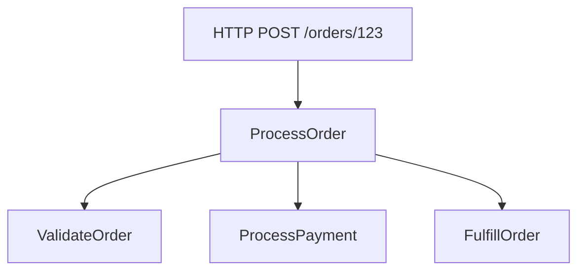

# How to Set Up OpenTelemetry Tracing in ASP.NET Core with System.Diagnostics

Author: [nawazdhandala](https://www.github.com/nawazdhandala)

Tags: OpenTelemetry, ASP.NET Core, .NET, System.Diagnostics, Tracing, C#

Description: Learn how to implement distributed tracing in ASP.NET Core applications using OpenTelemetry and System.Diagnostics.Activity for complete observability.

Distributed tracing has become essential for understanding the behavior of modern web applications, especially those built with microservices architectures. ASP.NET Core, combined with OpenTelemetry and System.Diagnostics, provides a powerful foundation for implementing comprehensive tracing without vendor lock-in.

The System.Diagnostics namespace in .NET contains the Activity API, which forms the backbone of distributed tracing in the .NET ecosystem. When you combine this with OpenTelemetry, you get a standardized way to collect, process, and export trace data to any backend that supports the OpenTelemetry Protocol (OTLP).

## Understanding Activity and ActivitySource

Before diving into implementation, you need to understand two core concepts: Activity and ActivitySource. An Activity represents a single unit of work in your application, similar to a span in OpenTelemetry terminology. An ActivitySource is a factory for creating activities, analogous to a tracer.

The beauty of this approach is that System.Diagnostics.Activity is built directly into .NET, so many frameworks and libraries already emit activities automatically. ASP.NET Core, HttpClient, and SqlClient all create activities out of the box.

## Setting Up Your ASP.NET Core Project

Start by creating a new ASP.NET Core Web API project and adding the necessary OpenTelemetry packages. You'll need several NuGet packages to get full tracing functionality.

```bash
# Create a new ASP.NET Core Web API project
dotnet new webapi -n TracingDemo
cd TracingDemo

# Add OpenTelemetry packages
dotnet add package OpenTelemetry.Extensions.Hosting
dotnet add package OpenTelemetry.Instrumentation.AspNetCore
dotnet add package OpenTelemetry.Instrumentation.Http
dotnet add package OpenTelemetry.Exporter.Console
dotnet add package OpenTelemetry.Exporter.OpenTelemetryProtocol
```

These packages provide the core OpenTelemetry functionality, automatic instrumentation for ASP.NET Core and HttpClient, and exporters for both console output (useful for development) and OTLP (for production).

## Configuring OpenTelemetry in Program.cs

The configuration happens in your Program.cs file where you set up the dependency injection container. Here's how to configure comprehensive tracing:

```csharp
using OpenTelemetry.Resources;
using OpenTelemetry.Trace;

var builder = WebApplication.CreateBuilder(args);

// Add services to the container
builder.Services.AddControllers();
builder.Services.AddEndpointsApiExplorer();
builder.Services.AddSwaggerGen();

// Configure OpenTelemetry tracing
builder.Services.AddOpenTelemetry()
    .ConfigureResource(resource => resource
        .AddService(
            serviceName: "TracingDemo",
            serviceVersion: "1.0.0",
            serviceInstanceId: Environment.MachineName))
    .WithTracing(tracing => tracing
        .AddAspNetCoreInstrumentation(options =>
        {
            // Capture request and response headers
            options.RecordException = true;
            options.EnrichWithHttpRequest = (activity, httpRequest) =>
            {
                activity.SetTag("http.request.header.user_agent",
                    httpRequest.Headers.UserAgent.ToString());
            };
            options.EnrichWithHttpResponse = (activity, httpResponse) =>
            {
                activity.SetTag("http.response.status_code",
                    httpResponse.StatusCode);
            };
        })
        .AddHttpClientInstrumentation(options =>
        {
            // Trace outgoing HTTP requests
            options.RecordException = true;
        })
        .AddConsoleExporter()
        .AddOtlpExporter(otlpOptions =>
        {
            // Configure OTLP endpoint (e.g., OneUptime, Jaeger, etc.)
            otlpOptions.Endpoint = new Uri("http://localhost:4317");
        }));

var app = builder.Build();

// Configure the HTTP request pipeline
if (app.Environment.IsDevelopment())
{
    app.UseSwagger();
    app.UseSwaggerUI();
}

app.UseHttpsRedirection();
app.UseAuthorization();
app.MapControllers();

app.Run();
```

This configuration sets up resource attributes that identify your service, enables automatic instrumentation for incoming HTTP requests and outgoing HttpClient calls, and configures exporters to send data to both console and an OTLP endpoint.

## Creating Custom Activities with ActivitySource

While automatic instrumentation covers HTTP requests, you often need to trace custom business logic. This is where ActivitySource comes in:

```csharp
using System.Diagnostics;

namespace TracingDemo.Services;

public class OrderService
{
    // Create an ActivitySource for this service
    private static readonly ActivitySource ActivitySource = new("TracingDemo.OrderService", "1.0.0");

    public async Task<Order> ProcessOrderAsync(int orderId)
    {
        // Start a new activity for this operation
        using var activity = ActivitySource.StartActivity("ProcessOrder");

        // Add tags to provide context
        activity?.SetTag("order.id", orderId);
        activity?.SetTag("order.source", "api");

        try
        {
            // Simulate order validation
            await ValidateOrderAsync(orderId);

            // Simulate payment processing
            var paymentResult = await ProcessPaymentAsync(orderId);

            activity?.SetTag("payment.status", paymentResult.Status);

            // Simulate order fulfillment
            await FulfillOrderAsync(orderId);

            activity?.SetStatus(ActivityStatusCode.Ok);

            return new Order { Id = orderId, Status = "Completed" };
        }
        catch (Exception ex)
        {
            // Record exceptions in the trace
            activity?.SetStatus(ActivityStatusCode.Error, ex.Message);
            activity?.RecordException(ex);
            throw;
        }
    }

    private async Task ValidateOrderAsync(int orderId)
    {
        using var activity = ActivitySource.StartActivity("ValidateOrder");
        activity?.SetTag("order.id", orderId);

        // Simulate validation logic
        await Task.Delay(50);

        if (orderId <= 0)
        {
            throw new ArgumentException("Invalid order ID");
        }
    }

    private async Task<PaymentResult> ProcessPaymentAsync(int orderId)
    {
        using var activity = ActivitySource.StartActivity("ProcessPayment");
        activity?.SetTag("order.id", orderId);
        activity?.SetTag("payment.method", "credit_card");

        // Simulate payment processing
        await Task.Delay(100);

        return new PaymentResult { Status = "Success" };
    }

    private async Task FulfillOrderAsync(int orderId)
    {
        using var activity = ActivitySource.StartActivity("FulfillOrder");
        activity?.SetTag("order.id", orderId);

        // Simulate fulfillment
        await Task.Delay(75);
    }
}

public class Order
{
    public int Id { get; set; }
    public string Status { get; set; } = string.Empty;
}

public class PaymentResult
{
    public string Status { get; set; } = string.Empty;
}
```

Each activity automatically becomes a child of the current activity, creating a hierarchical trace that shows the complete flow of execution through your application.

## Registering Custom ActivitySources

For OpenTelemetry to capture your custom activities, you need to register the ActivitySource names in your tracing configuration:

```csharp
// In Program.cs, update the tracing configuration
builder.Services.AddOpenTelemetry()
    .WithTracing(tracing => tracing
        .AddAspNetCoreInstrumentation()
        .AddHttpClientInstrumentation()
        .AddSource("TracingDemo.OrderService") // Register custom source
        .AddConsoleExporter()
        .AddOtlpExporter(otlpOptions =>
        {
            otlpOptions.Endpoint = new Uri("http://localhost:4317");
        }));
```

Without registering the source name, your custom activities won't be captured by the OpenTelemetry SDK.

## Creating a Controller to Test Tracing

Here's a controller that demonstrates the tracing in action:

```csharp
using Microsoft.AspNetCore.Mvc;
using TracingDemo.Services;

namespace TracingDemo.Controllers;

[ApiController]
[Route("[controller]")]
public class OrdersController : ControllerBase
{
    private readonly OrderService _orderService;
    private readonly ILogger<OrdersController> _logger;

    public OrdersController(OrderService orderService, ILogger<OrdersController> logger)
    {
        _orderService = orderService;
        _logger = logger;
    }

    [HttpPost("{orderId}")]
    public async Task<ActionResult<Order>> ProcessOrder(int orderId)
    {
        _logger.LogInformation("Received order processing request for order {OrderId}", orderId);

        try
        {
            var order = await _orderService.ProcessOrderAsync(orderId);
            return Ok(order);
        }
        catch (ArgumentException ex)
        {
            _logger.LogWarning(ex, "Invalid order request");
            return BadRequest(ex.Message);
        }
        catch (Exception ex)
        {
            _logger.LogError(ex, "Error processing order");
            return StatusCode(500, "Internal server error");
        }
    }
}
```

Don't forget to register the OrderService in your dependency injection container:

```csharp
// In Program.cs
builder.Services.AddSingleton<OrderService>();
```

## Understanding the Trace Hierarchy

When you make a request to your API, OpenTelemetry creates a trace with multiple spans in a hierarchy:



Each span contains timing information, tags, and status. This hierarchy makes it easy to see where time is spent and where errors occur.

## Adding Contextual Information with Tags and Events

Tags and events provide crucial context for debugging. Tags are key-value pairs attached to activities:

```csharp
public async Task<User> GetUserAsync(string userId)
{
    using var activity = ActivitySource.StartActivity("GetUser");
    activity?.SetTag("user.id", userId);
    activity?.SetTag("cache.enabled", true);

    // Add an event to mark a specific point in time
    activity?.AddEvent(new ActivityEvent("CheckingCache"));

    var user = await _cache.GetAsync<User>(userId);

    if (user == null)
    {
        activity?.AddEvent(new ActivityEvent("CacheMiss"));
        user = await _database.GetUserAsync(userId);
        await _cache.SetAsync(userId, user);
    }
    else
    {
        activity?.AddEvent(new ActivityEvent("CacheHit"));
    }

    activity?.SetTag("user.found", user != null);

    return user;
}
```

Tags are indexed and searchable in most tracing backends, making them perfect for filtering and aggregation. Events mark specific points in time within a span.

## Best Practices for Activity Naming

Activity names should be meaningful and follow a consistent pattern. Good practices include:

- Use verb-noun format: "ProcessOrder", "GetUser", "UpdateInventory"
- Keep names generic, not specific: "ProcessOrder" not "ProcessOrder123"
- Use the same name for the same logical operation
- Avoid high-cardinality values in names (use tags instead)

Poor activity names make traces hard to understand and analyze at scale.

## Handling Distributed Context Propagation

When your service calls another service, OpenTelemetry automatically propagates the trace context using W3C Trace Context headers. This happens automatically with HttpClient:

```csharp
public class ExternalApiService
{
    private readonly HttpClient _httpClient;
    private static readonly ActivitySource ActivitySource = new("TracingDemo.ExternalApiService");

    public ExternalApiService(HttpClient httpClient)
    {
        _httpClient = httpClient;
    }

    public async Task<string> CallExternalServiceAsync(string endpoint)
    {
        using var activity = ActivitySource.StartActivity("CallExternalService");
        activity?.SetTag("external.endpoint", endpoint);

        // HttpClient automatically propagates trace context
        var response = await _httpClient.GetAsync(endpoint);

        activity?.SetTag("external.status_code", (int)response.StatusCode);

        return await response.Content.ReadAsStringAsync();
    }
}
```

The trace context flows automatically across service boundaries, enabling end-to-end distributed tracing.

## Sampling Strategies

In production, tracing every request can be expensive. OpenTelemetry supports sampling to reduce overhead:

```csharp
builder.Services.AddOpenTelemetry()
    .WithTracing(tracing => tracing
        .SetSampler(new TraceIdRatioBasedSampler(0.1)) // Sample 10% of traces
        .AddAspNetCoreInstrumentation()
        .AddSource("TracingDemo.OrderService")
        .AddOtlpExporter());
```

You can also implement custom sampling logic based on request attributes, error status, or duration.

## Conclusion

OpenTelemetry tracing in ASP.NET Core with System.Diagnostics provides a robust, standardized approach to distributed tracing. The Activity API integrates seamlessly with the .NET ecosystem, automatic instrumentation reduces boilerplate, and custom activities give you fine-grained control over what you trace.

Start with automatic instrumentation for HTTP requests and gradually add custom activities for business-critical operations. Use tags generously to provide context, and make sure your activity names are meaningful and consistent. With proper tracing in place, debugging production issues becomes significantly easier, and you gain valuable insights into your application's behavior under real-world conditions.
