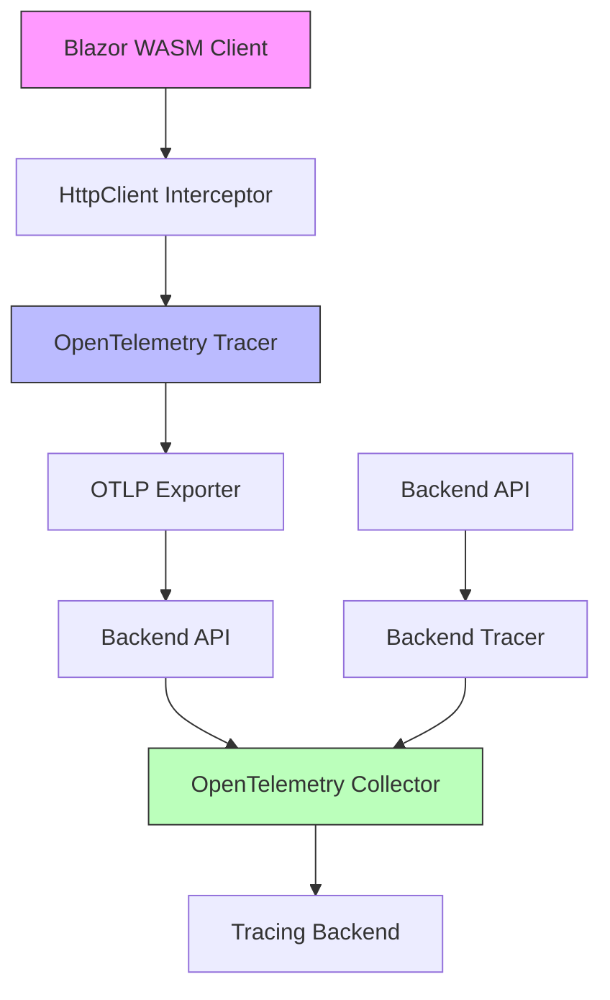

# How to Set Up OpenTelemetry Tracing in Blazor WebAssembly Applications

Author: [nawazdhandala](https://www.github.com/nawazdhandala)

Tags: OpenTelemetry, Blazor, WebAssembly, .NET, Browser, Tracing

Description: Learn how to implement distributed tracing in Blazor WebAssembly applications using OpenTelemetry, including browser-side instrumentation and backend integration.

Blazor WebAssembly runs entirely in the browser using WebAssembly, which presents unique challenges for observability. Unlike traditional server-side applications, WASM apps execute in a sandboxed environment with limited access to system resources. Implementing OpenTelemetry tracing in this context requires a different approach that accounts for browser constraints, CORS policies, and the client-server architecture.

## Understanding Blazor WASM Observability Challenges

Blazor WebAssembly applications face several observability hurdles. The entire application runs in the browser's WebAssembly runtime, meaning traditional server-side instrumentation libraries won't work. Additionally, you need to consider payload sizes carefully since every byte is downloaded by the client. CORS policies restrict where telemetry data can be sent, and you must handle sensitive data appropriately since all code executes on the client side.

## Architecture Overview

Here's how OpenTelemetry tracing flows in a Blazor WASM application:



## Installing Required Packages

Start by adding the necessary OpenTelemetry packages to your Blazor WASM project. You'll need the core SDK, HTTP instrumentation, and an exporter.

```bash
# Add OpenTelemetry packages to your .csproj
dotnet add package OpenTelemetry
dotnet add package OpenTelemetry.Exporter.OpenTelemetryProtocol
dotnet add package OpenTelemetry.Instrumentation.Http
dotnet add package OpenTelemetry.Extensions.Hosting
```

Your project file should include these dependencies:

```xml
<ItemGroup>
  <PackageReference Include="OpenTelemetry" Version="1.7.0" />
  <PackageReference Include="OpenTelemetry.Exporter.OpenTelemetryProtocol" Version="1.7.0" />
  <PackageReference Include="OpenTelemetry.Instrumentation.Http" Version="1.7.0" />
  <PackageReference Include="OpenTelemetry.Extensions.Hosting" Version="1.7.0" />
</ItemGroup>
```

## Configuring OpenTelemetry in Program.cs

The configuration differs significantly from server-side Blazor. You need to set up the tracer provider in the WebAssembly host builder.

```csharp
using Microsoft.AspNetCore.Components.Web;
using Microsoft.AspNetCore.Components.WebAssembly.Hosting;
using OpenTelemetry;
using OpenTelemetry.Resources;
using OpenTelemetry.Trace;

var builder = WebAssemblyHostBuilder.CreateDefault(args);
builder.RootComponents.Add<App>("#app");
builder.RootComponents.Add<HeadOutlet>("head::after");

// Configure HttpClient with base address
builder.Services.AddScoped(sp => new HttpClient
{
    BaseAddress = new Uri(builder.HostEnvironment.BaseAddress)
});

// Configure OpenTelemetry tracing
builder.Services.AddOpenTelemetry()
    .ConfigureResource(resource => resource
        .AddService(
            serviceName: "blazor-wasm-client",
            serviceVersion: "1.0.0")
        .AddAttributes(new Dictionary<string, object>
        {
            ["deployment.environment"] = builder.HostEnvironment.Environment,
            ["client.type"] = "webassembly"
        }))
    .WithTracing(tracing => tracing
        .AddHttpClientInstrumentation(options =>
        {
            // Enrich spans with additional HTTP request data
            options.EnrichWithHttpRequestMessage = (activity, request) =>
            {
                activity.SetTag("http.request.header.user_agent",
                    request.Headers.UserAgent?.ToString());
            };

            // Enrich spans with HTTP response data
            options.EnrichWithHttpResponseMessage = (activity, response) =>
            {
                activity.SetTag("http.response.content_length",
                    response.Content.Headers.ContentLength);
            };

            // Filter out telemetry endpoints to avoid noise
            options.FilterHttpRequestMessage = (request) =>
            {
                return !request.RequestUri?.AbsolutePath.Contains("/telemetry") ?? true;
            };
        })
        .AddOtlpExporter(options =>
        {
            // Export to your backend API which forwards to collector
            options.Endpoint = new Uri($"{builder.HostEnvironment.BaseAddress}telemetry");
            options.Protocol = OpenTelemetry.Exporter.OtlpExportProtocol.HttpProtobuf;
        }));

await builder.Build().RunAsync();
```

## Creating a Custom Tracing Service

For more control over tracing in your Blazor components, create a dedicated tracing service that wraps OpenTelemetry APIs.

```csharp
using System.Diagnostics;
using OpenTelemetry.Trace;

namespace BlazorWasmApp.Services;

public interface ITracingService
{
    Activity? StartActivity(string name, ActivityKind kind = ActivityKind.Internal);
    void RecordException(Exception exception);
    void AddEvent(string name, Dictionary<string, object>? attributes = null);
}

public class TracingService : ITracingService
{
    private static readonly ActivitySource ActivitySource = new(
        "BlazorWasmApp.Client",
        "1.0.0");

    public Activity? StartActivity(string name, ActivityKind kind = ActivityKind.Internal)
    {
        var activity = ActivitySource.StartActivity(name, kind);

        // Add default tags for browser context
        activity?.SetTag("component.type", "blazor.wasm");
        activity?.SetTag("browser.user_agent", GetUserAgent());

        return activity;
    }

    public void RecordException(Exception exception)
    {
        var activity = Activity.Current;
        if (activity != null)
        {
            activity.SetStatus(ActivityStatusCode.Error, exception.Message);
            activity.RecordException(exception);
        }
    }

    public void AddEvent(string name, Dictionary<string, object>? attributes = null)
    {
        var activity = Activity.Current;
        if (activity != null)
        {
            var tags = attributes != null
                ? new ActivityTagsCollection(attributes)
                : null;
            activity.AddEvent(new ActivityEvent(name, tags: tags));
        }
    }

    private static string GetUserAgent()
    {
        // Access via JSInterop in real implementation
        return "Mozilla/5.0";
    }
}
```

Register the tracing service in your DI container:

```csharp
builder.Services.AddScoped<ITracingService, TracingService>();
```

## Instrumenting Blazor Components

Now you can instrument your Blazor components to create custom spans for user interactions and component lifecycle events.

```csharp
@page "/weather"
@using System.Diagnostics
@inject HttpClient Http
@inject ITracingService TracingService

<PageTitle>Weather</PageTitle>

<h1>Weather Forecast</h1>

@if (forecasts == null)
{
    <p><em>Loading...</em></p>
}
else
{
    <table class="table">
        <thead>
            <tr>
                <th>Date</th>
                <th>Temp. (C)</th>
                <th>Summary</th>
            </tr>
        </thead>
        <tbody>
            @foreach (var forecast in forecasts)
            {
                <tr>
                    <td>@forecast.Date.ToShortDateString()</td>
                    <td>@forecast.TemperatureC</td>
                    <td>@forecast.Summary</td>
                </tr>
            }
        </tbody>
    </table>
}

@code {
    private WeatherForecast[]? forecasts;

    protected override async Task OnInitializedAsync()
    {
        // Create a custom span for component initialization
        using var activity = TracingService.StartActivity(
            "WeatherComponent.Initialize",
            ActivityKind.Internal);

        activity?.SetTag("component.name", "WeatherForecast");

        try
        {
            TracingService.AddEvent("Fetching weather data");

            // This HTTP call will be automatically instrumented
            forecasts = await Http.GetFromJsonAsync<WeatherForecast[]>("api/weather");

            activity?.SetTag("forecast.count", forecasts?.Length ?? 0);
            TracingService.AddEvent("Weather data loaded successfully");
        }
        catch (Exception ex)
        {
            TracingService.RecordException(ex);
            throw;
        }
    }

    public class WeatherForecast
    {
        public DateTime Date { get; set; }
        public int TemperatureC { get; set; }
        public string? Summary { get; set; }
    }
}
```

## Backend API Telemetry Forwarding

Since browsers have limited connectivity options, you'll typically send telemetry through your backend API. Create a controller to forward telemetry data to your OpenTelemetry Collector.

```csharp
using Microsoft.AspNetCore.Mvc;

namespace BlazorWasmApp.Server.Controllers;

[ApiController]
[Route("[controller]")]
public class TelemetryController : ControllerBase
{
    private readonly HttpClient _httpClient;
    private readonly ILogger<TelemetryController> _logger;

    public TelemetryController(
        IHttpClientFactory httpClientFactory,
        ILogger<TelemetryController> logger)
    {
        _httpClient = httpClientFactory.CreateClient("OtelCollector");
        _logger = logger;
    }

    // Forward OTLP traces from browser to collector
    [HttpPost]
    public async Task<IActionResult> ForwardTelemetry()
    {
        try
        {
            // Read the OTLP protobuf payload from browser
            using var memoryStream = new MemoryStream();
            await Request.Body.CopyToAsync(memoryStream);
            var payload = memoryStream.ToArray();

            // Forward to OpenTelemetry Collector
            var content = new ByteArrayContent(payload);
            content.Headers.ContentType = new System.Net.Http.Headers.MediaTypeHeaderValue(
                "application/x-protobuf");

            var response = await _httpClient.PostAsync("v1/traces", content);
            response.EnsureSuccessStatusCode();

            return Ok();
        }
        catch (Exception ex)
        {
            _logger.LogError(ex, "Failed to forward telemetry");
            return StatusCode(500);
        }
    }
}
```

Configure the HTTP client in your backend's Program.cs:

```csharp
builder.Services.AddHttpClient("OtelCollector", client =>
{
    client.BaseAddress = new Uri("http://otel-collector:4318/");
    client.Timeout = TimeSpan.FromSeconds(10);
});
```

## Handling Trace Context Propagation

To maintain distributed tracing across the browser and backend, ensure trace context is properly propagated through HTTP headers.

```csharp
using System.Net.Http.Headers;
using System.Diagnostics;

public class TraceContextHandler : DelegatingHandler
{
    protected override async Task<HttpResponseMessage> SendAsync(
        HttpRequestMessage request,
        CancellationToken cancellationToken)
    {
        var activity = Activity.Current;

        if (activity != null)
        {
            // W3C Trace Context propagation
            request.Headers.Add("traceparent",
                $"00-{activity.TraceId}-{activity.SpanId}-{activity.ActivityTraceFlags:x2}");

            if (!string.IsNullOrEmpty(activity.TraceStateString))
            {
                request.Headers.Add("tracestate", activity.TraceStateString);
            }
        }

        return await base.SendAsync(request, cancellationToken);
    }
}
```

Register the handler with your HttpClient:

```csharp
builder.Services.AddTransient<TraceContextHandler>();

builder.Services.AddHttpClient("TracedClient", client =>
{
    client.BaseAddress = new Uri(builder.HostEnvironment.BaseAddress);
})
.AddHttpMessageHandler<TraceContextHandler>();
```

## Performance Considerations for WASM

Blazor WebAssembly applications are sensitive to payload size and runtime performance. Follow these practices to minimize overhead:

**Sampling Strategy**: Don't trace every request in production. Implement head-based sampling to reduce data volume:

```csharp
.WithTracing(tracing => tracing
    .SetSampler(new TraceIdRatioBasedSampler(0.1)) // Sample 10% of traces
    .AddHttpClientInstrumentation()
    .AddOtlpExporter());
```

**Batching**: Configure the OTLP exporter to batch spans before sending:

```csharp
.AddOtlpExporter(options =>
{
    options.Endpoint = new Uri($"{builder.HostEnvironment.BaseAddress}telemetry");
    options.Protocol = OpenTelemetry.Exporter.OtlpExportProtocol.HttpProtobuf;
    options.BatchExportProcessorOptions = new()
    {
        MaxQueueSize = 2048,
        ScheduledDelayMilliseconds = 5000,
        ExporterTimeoutMilliseconds = 30000,
        MaxExportBatchSize = 512
    };
});
```

## Debugging and Troubleshooting

Enable console logging to debug telemetry issues in the browser:

```csharp
builder.Logging.SetMinimumLevel(LogLevel.Debug);
builder.Logging.AddFilter("OpenTelemetry", LogLevel.Debug);
```

Use browser developer tools to inspect network requests to the telemetry endpoint. Verify that OTLP payloads are being sent and the backend is responding with 200 status codes.

## Best Practices

Keep tracing lightweight in WASM applications. Only instrument critical user flows and API calls. Avoid creating spans for every component render or state change, as this generates excessive overhead.

Always sanitize data before adding it to spans. Remember that client-side code can be inspected, so never include sensitive information like tokens, passwords, or personal data in span attributes.

Implement error boundaries around traced operations to prevent telemetry failures from breaking your application. Use try-catch blocks and ensure spans are properly disposed even when exceptions occur.

OpenTelemetry tracing in Blazor WebAssembly requires careful consideration of the browser environment's constraints. By forwarding telemetry through your backend API, implementing selective instrumentation, and following these patterns, you can achieve effective observability for your client-side applications without compromising performance or user experience.
