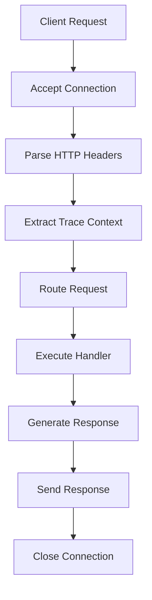

# How to Add OpenTelemetry Tracing to a C++ HTTP Server Application

Author: [nawazdhandala](https://www.github.com/nawazdhandala)

Tags: OpenTelemetry, C++, HTTP Server, Tracing, Web

Description: A practical guide to instrumenting C++ HTTP server applications with OpenTelemetry tracing, including context propagation, span management, and error tracking.

HTTP servers form the backbone of modern web services, and understanding their performance characteristics through distributed tracing is essential. OpenTelemetry makes it possible to capture detailed information about each request, from receipt to response.

## HTTP Server Architecture

Before implementing tracing, understand the typical HTTP server structure. Most C++ HTTP servers follow this pattern:



Tracing should capture each significant step while adding minimal overhead.

## Basic Server Setup

Here's a simple HTTP server using the Beast library from Boost. We'll add OpenTelemetry instrumentation incrementally:

```cpp
#include <boost/beast/core.hpp>
#include <boost/beast/http.hpp>
#include <boost/beast/version.hpp>
#include <boost/asio.hpp>
#include <memory>
#include <string>
#include <thread>

namespace beast = boost::beast;
namespace http = beast::http;
namespace net = boost::asio;
using tcp = boost::asio::ip::tcp;

// Handle a single HTTP request without tracing
http::response<http::string_body> HandleRequest(
    http::request<http::string_body> req
) {
    http::response<http::string_body> res{http::status::ok, req.version()};
    res.set(http::field::server, "cpp-otel-server");
    res.set(http::field::content_type, "application/json");
    res.keep_alive(req.keep_alive());
    res.body() = R"({"status": "ok"})";
    res.prepare_payload();
    return res;
}
```

## Adding OpenTelemetry Headers

Include the necessary OpenTelemetry headers:

```cpp
#include "opentelemetry/trace/provider.h"
#include "opentelemetry/trace/span.h"
#include "opentelemetry/trace/span_startoptions.h"
#include "opentelemetry/context/propagation/global_propagator.h"
#include "opentelemetry/context/propagation/text_map_propagator.h"
#include "opentelemetry/trace/propagation/http_trace_context.h"
#include "opentelemetry/sdk/trace/tracer_provider.h"
#include "opentelemetry/exporters/otlp/otlp_grpc_exporter_factory.h"
#include "opentelemetry/sdk/trace/batch_span_processor_factory.h"

namespace trace_api = opentelemetry::trace;
namespace context = opentelemetry::context;
namespace propagation = opentelemetry::context::propagation;
```

## Extracting Trace Context from Headers

HTTP headers carry trace context between services. Implement a carrier to extract these headers:

```cpp
// Carrier class to extract trace context from HTTP headers
class HttpHeaderCarrier : public propagation::TextMapCarrier {
public:
    explicit HttpHeaderCarrier(const http::request<http::string_body>& req)
        : request_(req) {}

    // Get a header value by key
    nostd::string_view Get(nostd::string_view key) const noexcept override {
        auto it = request_.find(std::string(key));
        if (it != request_.end()) {
            header_value_ = std::string(it->value());
            return nostd::string_view(header_value_);
        }
        return "";
    }

    // Set is not needed for extraction
    void Set(nostd::string_view key, nostd::string_view value) noexcept override {
        // Not used when extracting context
    }

private:
    const http::request<http::string_body>& request_;
    mutable std::string header_value_;
};
```

## Creating Spans for HTTP Requests

Wrap each request in a span that captures relevant information:

```cpp
http::response<http::string_body> HandleRequestWithTracing(
    http::request<http::string_body> req,
    trace_api::Tracer* tracer
) {
    // Extract trace context from incoming headers
    HttpHeaderCarrier carrier(req);
    auto prop = context::propagation::GlobalTextMapPropagator::GetGlobalPropagator();
    auto current_ctx = prop->Extract(carrier, context::RuntimeContext::GetCurrent());

    // Start a new span with the extracted context as parent
    trace_api::StartSpanOptions options;
    options.kind = trace_api::SpanKind::kServer;
    options.parent = trace_api::GetSpan(current_ctx)->GetContext();

    auto span = tracer->StartSpan(
        req.target().to_string(),
        {{trace_api::SemanticConventions::kHttpMethod, std::string(req.method_string())},
         {trace_api::SemanticConventions::kHttpTarget, std::string(req.target())},
         {trace_api::SemanticConventions::kHttpScheme, "http"},
         {trace_api::SemanticConventions::kHttpFlavor, "1.1"}},
        options
    );

    // Make the span active for the duration of this request
    auto scope = tracer->WithActiveSpan(span);

    // Process the request
    http::response<http::string_body> res{http::status::ok, req.version()};
    res.set(http::field::server, "cpp-otel-server");
    res.set(http::field::content_type, "application/json");
    res.keep_alive(req.keep_alive());

    // Add response attributes to span
    span->SetAttribute(
        trace_api::SemanticConventions::kHttpStatusCode,
        static_cast<uint32_t>(res.result_int())
    );

    res.body() = R"({"status": "ok"})";
    res.prepare_payload();

    // End the span before returning
    span->End();
    return res;
}
```

## Routing with Tracing

Implement a router that creates spans for different endpoints:

```cpp
class TracedRouter {
public:
    explicit TracedRouter(trace_api::Tracer* tracer) : tracer_(tracer) {}

    http::response<http::string_body> Route(
        http::request<http::string_body> req
    ) {
        // Extract context and create server span
        HttpHeaderCarrier carrier(req);
        auto prop = context::propagation::GlobalTextMapPropagator::GetGlobalPropagator();
        auto current_ctx = prop->Extract(carrier, context::RuntimeContext::GetCurrent());

        trace_api::StartSpanOptions options;
        options.kind = trace_api::SpanKind::kServer;
        options.parent = trace_api::GetSpan(current_ctx)->GetContext();

        std::string span_name = std::string(req.method_string()) + " " +
                                std::string(req.target());
        auto span = tracer_->StartSpan(span_name, {}, options);
        auto scope = tracer_->WithActiveSpan(span);

        // Add HTTP semantic conventions
        span->SetAttribute("http.method", std::string(req.method_string()));
        span->SetAttribute("http.target", std::string(req.target()));
        span->SetAttribute("http.flavor", "1.1");

        http::response<http::string_body> res;

        // Route based on target
        std::string target(req.target());
        if (target == "/health") {
            res = HandleHealth(req);
        } else if (target.starts_with("/api/users")) {
            res = HandleUsers(req);
        } else if (target.starts_with("/api/orders")) {
            res = HandleOrders(req);
        } else {
            res = HandleNotFound(req);
        }

        // Record response status
        span->SetAttribute("http.status_code", res.result_int());
        if (res.result_int() >= 500) {
            span->SetStatus(trace_api::StatusCode::kError, "Server Error");
        } else if (res.result_int() >= 400) {
            span->SetStatus(trace_api::StatusCode::kError, "Client Error");
        }

        span->End();
        return res;
    }

private:
    trace_api::Tracer* tracer_;

    http::response<http::string_body> HandleHealth(
        const http::request<http::string_body>& req
    ) {
        // Create a child span for health check logic
        auto span = tracer_->StartSpan("check_health");

        http::response<http::string_body> res{http::status::ok, req.version()};
        res.set(http::field::content_type, "application/json");
        res.body() = R"({"status": "healthy"})";
        res.prepare_payload();

        span->End();
        return res;
    }

    http::response<http::string_body> HandleUsers(
        const http::request<http::string_body>& req
    ) {
        auto span = tracer_->StartSpan("handle_users");
        span->SetAttribute("handler.type", "users");

        // Simulate database query
        auto db_span = tracer_->StartSpan("database.query");
        db_span->SetAttribute("db.system", "postgresql");
        db_span->SetAttribute("db.statement", "SELECT * FROM users");
        // Simulate work
        std::this_thread::sleep_for(std::chrono::milliseconds(10));
        db_span->End();

        http::response<http::string_body> res{http::status::ok, req.version()};
        res.set(http::field::content_type, "application/json");
        res.body() = R"({"users": []})";
        res.prepare_payload();

        span->End();
        return res;
    }

    http::response<http::string_body> HandleOrders(
        const http::request<http::string_body>& req
    ) {
        auto span = tracer_->StartSpan("handle_orders");
        span->SetAttribute("handler.type", "orders");

        http::response<http::string_body> res{http::status::ok, req.version()};
        res.set(http::field::content_type, "application/json");
        res.body() = R"({"orders": []})";
        res.prepare_payload();

        span->End();
        return res;
    }

    http::response<http::string_body> HandleNotFound(
        const http::request<http::string_body>& req
    ) {
        http::response<http::string_body> res{http::status::not_found, req.version()};
        res.set(http::field::content_type, "application/json");
        res.body() = R"({"error": "Not Found"})";
        res.prepare_payload();
        return res;
    }
};
```

## Error Handling with Tracing

Capture exceptions and errors in spans:

```cpp
http::response<http::string_body> SafeHandleRequest(
    http::request<http::string_body> req,
    trace_api::Tracer* tracer
) {
    HttpHeaderCarrier carrier(req);
    auto prop = context::propagation::GlobalTextMapPropagator::GetGlobalPropagator();
    auto current_ctx = prop->Extract(carrier, context::RuntimeContext::GetCurrent());

    trace_api::StartSpanOptions options;
    options.kind = trace_api::SpanKind::kServer;
    auto span = tracer->StartSpan("http_request", {}, options);
    auto scope = tracer->WithActiveSpan(span);

    try {
        // Process request
        http::response<http::string_body> res = ProcessRequest(req);
        span->SetAttribute("http.status_code", res.result_int());
        span->End();
        return res;
    } catch (const std::exception& e) {
        // Record exception in span
        span->AddEvent("exception", {
            {"exception.type", "std::exception"},
            {"exception.message", e.what()}
        });
        span->SetStatus(trace_api::StatusCode::kError, e.what());
        span->End();

        // Return error response
        http::response<http::string_body> res{
            http::status::internal_server_error,
            req.version()
        };
        res.set(http::field::content_type, "application/json");
        res.body() = R"({"error": "Internal Server Error"})";
        res.prepare_payload();
        return res;
    }
}
```

## Complete Server Implementation

Here's a complete example with tracing:

```cpp
#include <iostream>
#include <memory>
#include <boost/beast/core.hpp>
#include <boost/beast/http.hpp>
#include <boost/asio.hpp>
#include "opentelemetry/trace/provider.h"
#include "opentelemetry/exporters/otlp/otlp_grpc_exporter_factory.h"
#include "opentelemetry/sdk/trace/batch_span_processor_factory.h"
#include "opentelemetry/sdk/trace/tracer_provider_factory.h"

namespace beast = boost::beast;
namespace http = beast::http;
namespace net = boost::asio;
using tcp = boost::asio::ip::tcp;

void InitTracer() {
    auto exporter = opentelemetry::exporter::otlp::OtlpGrpcExporterFactory::Create();
    auto processor = opentelemetry::sdk::trace::BatchSpanProcessorFactory::Create(
        std::move(exporter)
    );
    auto provider = opentelemetry::sdk::trace::TracerProviderFactory::Create(
        std::move(processor)
    );
    opentelemetry::trace::Provider::SetTracerProvider(provider);
}

int main() {
    try {
        InitTracer();
        auto tracer = opentelemetry::trace::Provider::GetTracerProvider()
            ->GetTracer("http-server", "1.0.0");

        net::io_context ioc{1};
        tcp::acceptor acceptor{ioc, {tcp::v4(), 8080}};

        std::cout << "Server listening on port 8080" << std::endl;

        TracedRouter router(tracer.get());

        while (true) {
            tcp::socket socket{ioc};
            acceptor.accept(socket);

            beast::flat_buffer buffer;
            http::request<http::string_body> req;
            http::read(socket, buffer, req);

            auto res = router.Route(std::move(req));

            http::write(socket, res);
            socket.shutdown(tcp::socket::shutdown_send);
        }
    } catch (const std::exception& e) {
        std::cerr << "Error: " << e.what() << std::endl;
        return 1;
    }

    return 0;
}
```

## Testing the Instrumented Server

Test the server with curl and verify traces appear in your backend:

```bash
# Send a traced request
curl -H "traceparent: 00-4bf92f3577b34da6a3ce929d0e0e4736-00f067aa0ba902b7-01" \
     http://localhost:8080/api/users

# The traceparent header ensures context propagation
```

Instrumenting HTTP servers with OpenTelemetry provides visibility into request latency, error rates, and dependencies. The trace context propagation ensures end-to-end tracing across your distributed system.
