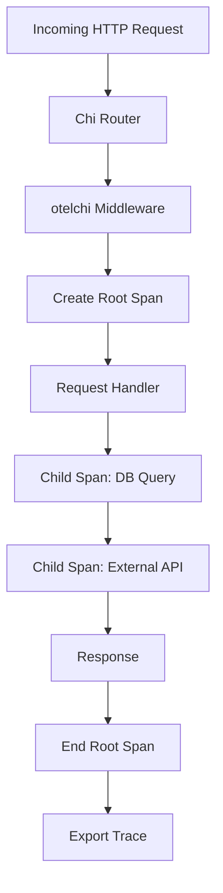

# How to Add OpenTelemetry Tracing to a Go Chi Router with otelchi

Author: [nawazdhandala](https://www.github.com/nawazdhandala)

Tags: OpenTelemetry, Go, Chi, otelchi, Router, Tracing

Description: Complete guide to instrumenting Chi router applications with OpenTelemetry using otelchi middleware for automatic trace generation and span management.

Chi is one of the most popular HTTP routers in the Go ecosystem, known for its lightweight design and powerful middleware system. When building production applications with Chi, observability becomes critical for understanding request flows, identifying bottlenecks, and debugging issues across distributed systems.

The otelchi package provides seamless OpenTelemetry integration for Chi routers through middleware that automatically creates spans for incoming HTTP requests. This instrumentation captures essential details like HTTP method, status codes, route patterns, and timing information without requiring manual span creation in your handlers.

## Why Instrument Chi with OpenTelemetry

Chi routers handle HTTP routing and middleware composition, making them the perfect place to inject observability. By instrumenting at the router level, you gain visibility into every request that enters your application, including middleware execution time, route matching performance, and handler processing duration.

OpenTelemetry tracing helps you answer questions like: Which endpoints are slowest? Where do errors occur in the request lifecycle? How do requests flow through middleware chains? What's the performance impact of each middleware component?

## Installing Required Dependencies

First, install the Chi router, OpenTelemetry SDK, and otelchi middleware package.

```bash
go get -u github.com/go-chi/chi/v5
go get -u go.opentelemetry.io/otel
go get -u go.opentelemetry.io/otel/sdk/trace
go get -u go.opentelemetry.io/otel/exporters/stdout/stdouttrace
go get -u go.opentelemetry.io/contrib/instrumentation/github.com/go-chi/chi/v5/otelchi
```

These packages provide the core Chi router, OpenTelemetry SDK components, a stdout exporter for development, and the Chi-specific instrumentation middleware.

## Setting Up OpenTelemetry Provider

Before using otelchi middleware, initialize the OpenTelemetry tracer provider. This configuration determines how spans are collected, processed, and exported.

```go
package main

import (
    "context"
    "log"
    "time"

    "go.opentelemetry.io/otel"
    "go.opentelemetry.io/otel/exporters/stdout/stdouttrace"
    "go.opentelemetry.io/otel/sdk/resource"
    sdktrace "go.opentelemetry.io/otel/sdk/trace"
    semconv "go.opentelemetry.io/otel/semconv/v1.17.0"
)

func initTracer() (*sdktrace.TracerProvider, error) {
    // Create stdout exporter for development (replace with OTLP in production)
    exporter, err := stdouttrace.New(
        stdouttrace.WithPrettyPrint(),
    )
    if err != nil {
        return nil, err
    }

    // Define service resource attributes
    resource := resource.NewWithAttributes(
        semconv.SchemaURL,
        semconv.ServiceName("chi-api-service"),
        semconv.ServiceVersion("1.0.0"),
        semconv.DeploymentEnvironment("development"),
    )

    // Create tracer provider with batch span processor
    tp := sdktrace.NewTracerProvider(
        sdktrace.WithBatcher(exporter),
        sdktrace.WithResource(resource),
        sdktrace.WithSampler(sdktrace.AlwaysSample()),
    )

    // Register as global tracer provider
    otel.SetTracerProvider(tp)

    return tp, nil
}
```

This setup creates a tracer provider with stdout export for development. The batch processor aggregates spans before exporting them, improving performance. Resource attributes identify your service in distributed traces.

## Basic Chi Router with otelchi Middleware

Now add otelchi middleware to your Chi router. The middleware automatically creates a span for each incoming request.

```go
package main

import (
    "net/http"
    "time"

    "github.com/go-chi/chi/v5"
    "github.com/go-chi/chi/v5/middleware"
    "go.opentelemetry.io/contrib/instrumentation/github.com/go-chi/chi/v5/otelchi"
)

func main() {
    // Initialize OpenTelemetry
    tp, err := initTracer()
    if err != nil {
        log.Fatal(err)
    }
    defer func() {
        ctx, cancel := context.WithTimeout(context.Background(), 5*time.Second)
        defer cancel()
        if err := tp.Shutdown(ctx); err != nil {
            log.Printf("Error shutting down tracer provider: %v", err)
        }
    }()

    // Create Chi router
    r := chi.NewRouter()

    // Add standard Chi middleware
    r.Use(middleware.RequestID)
    r.Use(middleware.RealIP)
    r.Use(middleware.Logger)
    r.Use(middleware.Recoverer)

    // Add OpenTelemetry middleware - this creates spans for all requests
    r.Use(otelchi.Middleware("chi-api-service"))

    // Define routes
    r.Get("/", homeHandler)
    r.Get("/users/{userID}", getUserHandler)
    r.Post("/users", createUserHandler)

    // Start server
    log.Println("Server starting on :8080")
    http.ListenAndServe(":8080", r)
}
```

The `otelchi.Middleware()` call accepts a service name and returns Chi middleware that wraps every request in a span. Place it after recovery and logging middleware but before your application routes.

## Implementing Traced Handlers

Your handlers automatically get traced without modification. However, you can extract the span context and add custom attributes or create child spans.

```go
package main

import (
    "encoding/json"
    "net/http"

    "github.com/go-chi/chi/v5"
    "go.opentelemetry.io/otel"
    "go.opentelemetry.io/otel/attribute"
    "go.opentelemetry.io/otel/codes"
)

func homeHandler(w http.ResponseWriter, r *http.Request) {
    w.Header().Set("Content-Type", "application/json")
    json.NewEncoder(w).Encode(map[string]string{
        "message": "Chi API with OpenTelemetry",
    })
}

func getUserHandler(w http.ResponseWriter, r *http.Request) {
    // Extract tracer and current context
    tracer := otel.Tracer("handlers")
    ctx := r.Context()

    // Create child span for database operation
    ctx, span := tracer.Start(ctx, "fetch-user-from-db")
    defer span.End()

    // Get user ID from URL parameters
    userID := chi.URLParam(r, "userID")

    // Add custom attributes to span
    span.SetAttributes(
        attribute.String("user.id", userID),
        attribute.String("operation", "get_user"),
    )

    // Simulate database query
    time.Sleep(50 * time.Millisecond)

    // Check for errors and record them in span
    if userID == "" {
        span.SetStatus(codes.Error, "user ID is required")
        span.RecordError(fmt.Errorf("missing user ID"))
        http.Error(w, "User ID required", http.StatusBadRequest)
        return
    }

    span.SetStatus(codes.Ok, "user retrieved successfully")

    w.Header().Set("Content-Type", "application/json")
    json.NewEncoder(w).Encode(map[string]interface{}{
        "user_id": userID,
        "name":    "John Doe",
        "email":   "john@example.com",
    })
}

func createUserHandler(w http.ResponseWriter, r *http.Request) {
    tracer := otel.Tracer("handlers")
    ctx := r.Context()

    // Create child span for validation
    ctx, validationSpan := tracer.Start(ctx, "validate-user-input")

    var user struct {
        Name  string `json:"name"`
        Email string `json:"email"`
    }

    if err := json.NewDecoder(r.Body).Decode(&user); err != nil {
        validationSpan.RecordError(err)
        validationSpan.SetStatus(codes.Error, "invalid JSON")
        validationSpan.End()
        http.Error(w, "Invalid JSON", http.StatusBadRequest)
        return
    }

    validationSpan.SetAttributes(
        attribute.String("user.name", user.Name),
        attribute.String("user.email", user.Email),
    )
    validationSpan.End()

    // Create child span for database insert
    _, insertSpan := tracer.Start(ctx, "insert-user-to-db")
    time.Sleep(75 * time.Millisecond) // Simulate DB operation
    insertSpan.End()

    w.Header().Set("Content-Type", "application/json")
    w.WriteHeader(http.StatusCreated)
    json.NewEncoder(w).Encode(map[string]string{
        "message": "User created successfully",
    })
}
```

These handlers demonstrate creating child spans for specific operations, adding custom attributes, and recording errors. The context from the request carries the trace information through your application.

## Advanced Configuration Options

The otelchi middleware accepts configuration options for fine-tuning instrumentation behavior.

```go
package main

import (
    "github.com/go-chi/chi/v5"
    "go.opentelemetry.io/contrib/instrumentation/github.com/go-chi/chi/v5/otelchi"
    "go.opentelemetry.io/otel/trace"
)

func setupAdvancedRouter() *chi.Mux {
    r := chi.NewRouter()

    // Configure otelchi middleware with options
    r.Use(otelchi.Middleware(
        "chi-api-service",
        otelchi.WithChiRoutes(r), // Capture route patterns in span names
        otelchi.WithFilter(func(r *http.Request) bool {
            // Skip health check endpoints from tracing
            return r.URL.Path != "/health" && r.URL.Path != "/metrics"
        }),
    ))

    r.Get("/health", healthCheckHandler)
    r.Get("/api/v1/products/{id}", getProductHandler)

    return r
}

func healthCheckHandler(w http.ResponseWriter, r *http.Request) {
    w.WriteHeader(http.StatusOK)
    w.Write([]byte("OK"))
}

func getProductHandler(w http.ResponseWriter, r *http.Request) {
    // Handler logic with automatic tracing
    productID := chi.URLParam(r, "id")

    w.Header().Set("Content-Type", "application/json")
    json.NewEncoder(w).Encode(map[string]string{
        "product_id": productID,
        "name":       "Sample Product",
    })
}
```

The `WithChiRoutes()` option captures route patterns in span names, making traces more readable. The `WithFilter()` option excludes specific endpoints from tracing to reduce noise.

## Trace Visualization

Here's how your traces flow through the Chi router with middleware and handlers:



Each request creates a root span that contains child spans for database queries, external API calls, and other operations performed during request handling.

## Production Considerations

When deploying Chi applications with OpenTelemetry to production, replace the stdout exporter with an OTLP exporter that sends traces to your observability backend.

```go
import (
    "go.opentelemetry.io/otel/exporters/otlp/otlptrace/otlptracegrpc"
)

func initProductionTracer() (*sdktrace.TracerProvider, error) {
    // Create OTLP exporter
    exporter, err := otlptracegrpc.New(
        context.Background(),
        otlptracegrpc.WithEndpoint("otel-collector:4317"),
        otlptracegrpc.WithInsecure(), // Use WithTLSCredentials() in production
    )
    if err != nil {
        return nil, err
    }

    tp := sdktrace.NewTracerProvider(
        sdktrace.WithBatcher(exporter),
        sdktrace.WithResource(resource.NewWithAttributes(
            semconv.SchemaURL,
            semconv.ServiceName("chi-api-service"),
        )),
        sdktrace.WithSampler(sdktrace.ParentBased(sdktrace.TraceIDRatioBased(0.1))),
    )

    otel.SetTracerProvider(tp)
    return tp, nil
}
```

This configuration sends traces to an OpenTelemetry Collector via gRPC. The sampler reduces trace volume by sampling 10% of requests while preserving parent-child relationships.

## Debugging and Testing

Verify your instrumentation works correctly by examining trace output during development.

```go
// Test helper to inspect traces
func TestChiTracing(t *testing.T) {
    // Setup in-memory exporter
    exporter := tracetest.NewInMemoryExporter()
    tp := sdktrace.NewTracerProvider(
        sdktrace.WithSyncer(exporter),
    )
    otel.SetTracerProvider(tp)

    // Create test router
    r := chi.NewRouter()
    r.Use(otelchi.Middleware("test-service"))
    r.Get("/test", func(w http.ResponseWriter, r *http.Request) {
        w.WriteHeader(http.StatusOK)
    })

    // Make test request
    req := httptest.NewRequest("GET", "/test", nil)
    rec := httptest.NewRecorder()
    r.ServeHTTP(rec, req)

    // Verify trace was created
    spans := exporter.GetSpans()
    assert.Equal(t, 1, len(spans))
    assert.Equal(t, "GET /test", spans[0].Name)
}
```

This test verifies that otelchi middleware creates spans with the expected names and attributes.

The otelchi middleware transforms your Chi router into a fully observable HTTP service with minimal code changes. By automatically creating spans for every request and capturing HTTP semantics, it provides the foundation for distributed tracing across your microservices architecture. Combined with custom instrumentation in your handlers, you gain complete visibility into request processing, performance characteristics, and error patterns.
