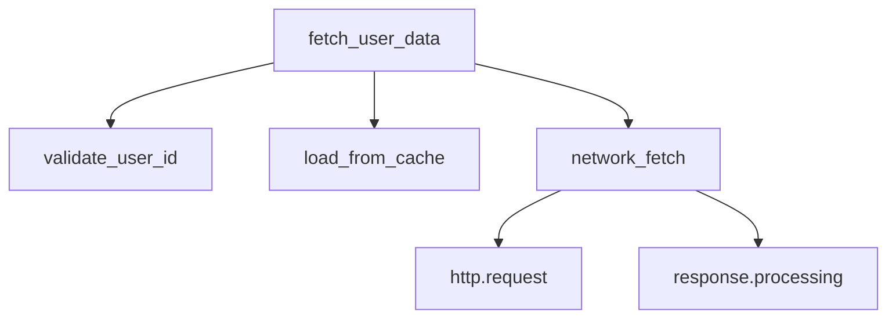

# How to Add OpenTelemetry Tracing to an iOS App with opentelemetry-swift

Author: [nawazdhandala](https://www.github.com/nawazdhandala)

Tags: OpenTelemetry, Swift, iOS, opentelemetry-swift, Mobile, Tracing

Description: Learn how to integrate OpenTelemetry tracing into your iOS application using the opentelemetry-swift SDK with practical examples and best practices.

OpenTelemetry provides a vendor-neutral way to collect telemetry data from your iOS applications. The opentelemetry-swift SDK is the official implementation for Swift and iOS, allowing you to instrument your mobile apps with distributed tracing capabilities. This guide walks through the complete setup process and shows you how to create your first traces.

## Why OpenTelemetry for iOS?

Mobile applications present unique observability challenges. Network conditions vary, app lifecycle events affect performance, and debugging issues in production requires careful instrumentation. OpenTelemetry gives you a standardized approach to capture traces, which helps you understand how your iOS app behaves in real-world conditions.

Unlike traditional logging, distributed tracing shows you the complete journey of operations through your app. You can see how long each operation takes, identify bottlenecks, and understand the relationship between different components of your application.

## Setting Up opentelemetry-swift

The opentelemetry-swift SDK is distributed through Swift Package Manager, making integration straightforward. Add the package to your Xcode project by navigating to File > Add Package Dependencies and entering the repository URL.

```swift
// Package.swift dependencies section
dependencies: [
    .package(
        url: "https://github.com/open-telemetry/opentelemetry-swift",
        from: "1.5.0"
    )
]
```

After adding the package, import the required modules into your code. The SDK is modular, so you only include what you need for tracing.

```swift
import OpenTelemetryApi
import OpenTelemetrySdk
import StdoutExporter
import ResourceExtension
```

## Initializing the OpenTelemetry SDK

Before creating any traces, you need to initialize the SDK with a tracer provider. This setup typically happens during app launch, often in your AppDelegate or SwiftUI App struct.

```swift
import UIKit
import OpenTelemetryApi
import OpenTelemetrySdk
import StdoutExporter
import ResourceExtension

class TelemetryManager {
    static let shared = TelemetryManager()
    private var tracerProvider: TracerProviderSdk?

    private init() {}

    func initialize() {
        // Create a resource with app information
        let resource = Resource(attributes: [
            ResourceAttributes.serviceName.rawValue: AttributeValue.string("my-ios-app"),
            ResourceAttributes.serviceVersion.rawValue: AttributeValue.string("1.0.0"),
            "deployment.environment": AttributeValue.string("production")
        ])

        // Create a simple console exporter for development
        let exporter = StdoutExporter()

        // Create a span processor that batches spans
        let processor = SimpleSpanProcessor(spanExporter: exporter)

        // Initialize the tracer provider
        tracerProvider = TracerProviderBuilder()
            .with(resource: resource)
            .add(spanProcessor: processor)
            .build()

        // Set the global tracer provider
        OpenTelemetry.registerTracerProvider(tracerProvider: tracerProvider!)
    }

    func getTracer(instrumentationName: String = "default") -> Tracer {
        return OpenTelemetry.instance.tracerProvider.get(
            instrumentationName: instrumentationName,
            instrumentationVersion: "1.0.0"
        )
    }

    func shutdown() {
        tracerProvider?.shutdown()
    }
}
```

This initialization creates a tracer provider with resource attributes that identify your application. The StdoutExporter sends traces to the console, which is useful during development. In production, you would replace this with an OTLP exporter.

## Creating Your First Span

A span represents a single operation in your application. Spans have a start time, end time, and attributes that describe what happened during that operation.

```swift
import SwiftUI

struct ContentView: View {
    let tracer = TelemetryManager.shared.getTracer(instrumentationName: "ui")

    var body: some View {
        VStack {
            Button("Perform Operation") {
                performTracedOperation()
            }
        }
    }

    func performTracedOperation() {
        // Create a span to track this operation
        let span = tracer.spanBuilder(spanName: "user_button_tap").startSpan()

        // Add attributes to provide context
        span.setAttribute(key: "button.name", value: "perform_operation")
        span.setAttribute(key: "user.action", value: "tap")

        // Simulate some work
        Thread.sleep(forTimeInterval: 0.5)

        // End the span when the operation completes
        span.end()
    }
}
```

Each span captures timing information automatically. When you call `startSpan()`, OpenTelemetry records the start time. Calling `end()` records the completion time and sends the span to your configured exporter.

## Working with Span Context

Distributed tracing becomes powerful when you connect related operations. Span context allows you to create parent-child relationships between spans, showing how operations flow through your app.

```swift
class DataService {
    let tracer = TelemetryManager.shared.getTracer(instrumentationName: "data-service")

    func fetchUserData(userId: String) {
        // Create a parent span for the entire operation
        let parentSpan = tracer.spanBuilder(spanName: "fetch_user_data")
            .setSpanKind(spanKind: .client)
            .startSpan()

        parentSpan.setAttribute(key: "user.id", value: userId)

        // Perform sub-operations with child spans
        validateUserId(userId: userId, parentSpan: parentSpan)
        let data = loadFromCache(userId: userId, parentSpan: parentSpan)

        if data == nil {
            fetchFromNetwork(userId: userId, parentSpan: parentSpan)
        }

        parentSpan.end()
    }

    private func validateUserId(userId: String, parentSpan: Span) {
        // Create a child span
        let span = tracer.spanBuilder(spanName: "validate_user_id")
            .setParent(parentSpan)
            .startSpan()

        // Validation logic here
        span.setAttribute(key: "validation.result", value: "success")

        span.end()
    }

    private func loadFromCache(userId: String, parentSpan: Span) -> [String: Any]? {
        let span = tracer.spanBuilder(spanName: "load_from_cache")
            .setParent(parentSpan)
            .startSpan()

        span.setAttribute(key: "cache.hit", value: false)

        span.end()
        return nil
    }

    private func fetchFromNetwork(userId: String, parentSpan: Span) {
        let span = tracer.spanBuilder(spanName: "network_fetch")
            .setParent(parentSpan)
            .setSpanKind(spanKind: .client)
            .startSpan()

        span.setAttribute(key: "http.method", value: "GET")
        span.setAttribute(key: "http.url", value: "https://api.example.com/users/\(userId)")

        // Network request logic here
        Thread.sleep(forTimeInterval: 1.0)

        span.setAttribute(key: "http.status_code", value: 200)
        span.end()
    }
}
```

This example shows how multiple operations relate to each other. The parent span encompasses the entire user data fetch operation, while child spans represent individual steps. When viewing these traces in a backend system, you'll see a waterfall diagram showing how these operations executed.

## Error Handling and Span Status

When operations fail, you should record that information in your spans. OpenTelemetry provides a status API for marking spans as successful or failed.

```swift
func processPayment(amount: Double) {
    let span = tracer.spanBuilder(spanName: "process_payment").startSpan()

    span.setAttribute(key: "payment.amount", value: amount)
    span.setAttribute(key: "payment.currency", value: "USD")

    do {
        try performPaymentValidation(amount: amount)
        try submitPaymentToProcessor(amount: amount)

        // Mark span as successful
        span.status = .ok
    } catch let error as PaymentError {
        // Record the error in the span
        span.status = .error(description: error.localizedDescription)
        span.setAttribute(key: "error.type", value: String(describing: type(of: error)))
        span.setAttribute(key: "error.message", value: error.localizedDescription)
    } catch {
        span.status = .error(description: "Unknown payment error")
    }

    span.end()
}

enum PaymentError: Error {
    case insufficientFunds
    case invalidAmount
    case processorUnavailable
}

func performPaymentValidation(amount: Double) throws {
    if amount <= 0 {
        throw PaymentError.invalidAmount
    }
}

func submitPaymentToProcessor(amount: Double) throws {
    // Payment processing logic
}
```

Recording errors in spans helps you track failure rates and understand what went wrong during operations. The error status and attributes provide debugging information without requiring you to reproduce the issue locally.

## Integrating with App Lifecycle

iOS apps have a complex lifecycle with states like foreground, background, and suspension. Integrating OpenTelemetry with these lifecycle events helps you understand how state transitions affect your app's behavior.

```swift
import UIKit

class AppDelegate: UIResponder, UIApplicationDelegate {
    let tracer = TelemetryManager.shared.getTracer(instrumentationName: "app-lifecycle")

    func application(
        _ application: UIApplication,
        didFinishLaunchingWithOptions launchOptions: [UIApplication.LaunchOptionsKey: Any]?
    ) -> Bool {
        // Initialize OpenTelemetry first
        TelemetryManager.shared.initialize()

        // Create a span for app launch
        let span = tracer.spanBuilder(spanName: "app_launch").startSpan()
        span.setAttribute(key: "launch.type", value: "cold_start")

        // Perform initialization work
        performAppInitialization()

        span.end()

        return true
    }

    func applicationDidEnterBackground(_ application: UIApplication) {
        let span = tracer.spanBuilder(spanName: "app_enter_background").startSpan()

        // Save state, pause operations, etc.

        span.end()
    }

    func applicationWillEnterForeground(_ application: UIApplication) {
        let span = tracer.spanBuilder(spanName: "app_enter_foreground").startSpan()

        // Restore state, resume operations

        span.end()
    }

    func applicationWillTerminate(_ application: UIApplication) {
        // Ensure all spans are flushed before termination
        TelemetryManager.shared.shutdown()
    }

    private func performAppInitialization() {
        // Initialization logic
    }
}
```

## Best Practices for iOS Tracing

Keep span names consistent and descriptive. Use snake_case for span names and follow a naming convention across your app. This makes filtering and analyzing traces easier.

Add meaningful attributes to your spans. Include information that helps you understand the context of the operation, such as user IDs, resource identifiers, or configuration values. Avoid including sensitive information like passwords or authentication tokens.

Create spans at appropriate granularity. Too many spans create noise and overhead, while too few spans provide insufficient detail. Focus on operations that take significant time or are important for understanding app behavior.

Remember that OpenTelemetry collection has a performance cost. The overhead is generally small, but creating excessive spans can impact battery life and app responsiveness on mobile devices. Use sampling strategies in production to balance observability with performance.

## Visualizing Your Traces

While the StdoutExporter works for development, you need a proper backend to visualize traces in production. OpenTelemetry traces can be sent to any compatible backend like Jaeger, Zipkin, or commercial APM solutions.

The trace data follows a hierarchical structure that backend systems display as waterfall diagrams:



Each box in the visualization represents a span, and the width represents the duration. This makes it easy to spot slow operations and understand how your app spends time.

## Moving Forward

You now have OpenTelemetry tracing running in your iOS app. The basic setup provides visibility into operations, errors, and timing. From here, you can add more sophisticated instrumentation like automatic network tracing, custom metrics, or integration with backend services.

The opentelemetry-swift SDK continues to evolve with new features and improvements. Check the official repository for updates and additional instrumentation libraries that can automatically trace common operations in your iOS app.
