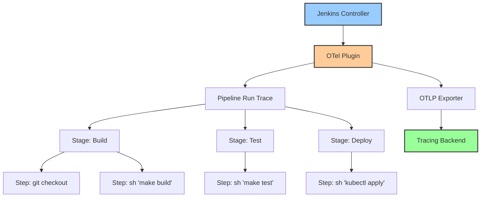

# How to Add OpenTelemetry Tracing to Jenkins Pipelines

Author: [nawazdhandala](https://www.github.com/nawazdhandala)

Tags: OpenTelemetry, Jenkins, CI/CD, Tracing, Observability, Pipelines

Description: Learn how to add OpenTelemetry tracing to Jenkins pipelines for end-to-end build visibility, performance analysis, and failure debugging.

---

Jenkins remains one of the most widely used CI/CD systems in the world, but observing what happens inside a Jenkins pipeline has always been awkward. You get console logs, maybe some timestamps, and a lot of guesswork when things slow down or break. OpenTelemetry changes this by letting you emit structured traces from every stage, step, and parallel branch in your pipeline.

This guide covers how to set up the Jenkins OpenTelemetry plugin, configure custom trace instrumentation in Jenkinsfiles, and build meaningful observability around your Jenkins builds.

## The Jenkins OpenTelemetry Plugin

Jenkins has an official OpenTelemetry plugin that automatically instruments pipeline executions. It creates traces for pipeline runs, with spans for each stage and step. This is the easiest way to get started because it requires no changes to your Jenkinsfiles.

The plugin works by hooking into the Jenkins pipeline execution engine. Every time a stage starts or a step executes, the plugin creates a span with timing data, status, and relevant attributes.



## Installing and Configuring the Plugin

Install the OpenTelemetry plugin through Jenkins' plugin manager or by adding it to your plugin list if you manage Jenkins as code.

```groovy
// If using Jenkins Configuration as Code (JCasC),
// add the plugin dependency to your plugins.txt:
// opentelemetry:latest

// JCasC configuration for the OpenTelemetry plugin
// Located in jenkins.yaml under the unclassified section
unclassified:
  openTelemetry:
    # OTLP endpoint where traces will be sent
    endpoint: "https://otel-collector.example.com:4317"
    # Protocol to use for exporting (grpc or http/protobuf)
    exporterProtocol: "grpc"
    # Service name that appears in traces
    serviceName: "jenkins"
    # Authentication headers for the OTLP endpoint
    authentication:
      header:
        headerName: "Authorization"
        headerValueSecretId: "otel-auth-token"
```

If you prefer the Jenkins UI, navigate to Manage Jenkins, then System Configuration, and scroll to the OpenTelemetry section. Fill in your OTLP endpoint, choose the protocol, and set the service name.

Once configured, the plugin immediately starts generating traces for all pipeline runs. No Jenkinsfile changes needed.

## Understanding Automatic Instrumentation

The plugin automatically creates spans with useful attributes for every pipeline execution. Here is what you get out of the box.

The root span represents the entire pipeline run. It includes attributes like the job name, build number, result, and the node it ran on. Each stage in the pipeline gets its own child span, and individual steps within stages get nested spans.

```
Trace: jenkins-pipeline-run
  |
  |-- Span: Pipeline 'my-app-build' #142
  |   |-- ci.pipeline.name: my-app-build
  |   |-- ci.pipeline.run.number: 142
  |   |-- ci.pipeline.result: SUCCESS
  |   |
  |   |-- Span: Stage 'Checkout'
  |   |   |-- Span: git checkout
  |   |       |-- git.url: https://github.com/org/my-app.git
  |   |       |-- git.branch: main
  |   |       |-- git.commit: a1b2c3d4
  |   |
  |   |-- Span: Stage 'Build'
  |   |   |-- Span: sh 'mvn clean package'
  |   |       |-- duration: 120s
  |   |
  |   |-- Span: Stage 'Test'
  |   |   |-- Span: sh 'mvn test'
  |   |   |   |-- duration: 180s
  |   |   |-- Span: junit 'target/surefire-reports/*.xml'
  |   |       |-- tests.total: 342
  |   |       |-- tests.passed: 340
  |   |       |-- tests.failed: 2
  |   |
  |   |-- Span: Stage 'Deploy'
  |       |-- Span: sh 'kubectl apply -f k8s/'
  |           |-- duration: 45s
```

This automatic instrumentation gives you visibility without writing any tracing code. But for more control, you can add custom instrumentation to your Jenkinsfiles.

## Custom Instrumentation in Jenkinsfiles

While the plugin handles automatic tracing, you often want to add custom spans for specific operations, attach business-relevant attributes, or create spans around shell commands that do important work.

The OpenTelemetry plugin exposes a `withOpenTelemetrySpan` step that you can use in your pipeline scripts.

```groovy
// Jenkinsfile with custom OpenTelemetry instrumentation
// This pipeline adds manual spans around key operations
// and attaches custom attributes for richer trace data.
pipeline {
    agent any

    environment {
        APP_VERSION = "${env.BUILD_NUMBER}-${env.GIT_COMMIT?.take(7)}"
    }

    stages {
        stage('Build') {
            steps {
                // Wrap the build in a custom span with extra attributes
                withOpenTelemetrySpan(
                    spanName: 'docker-build',
                    attributes: [
                        'build.tool': 'docker',
                        'build.target': 'production',
                        'app.version': "${APP_VERSION}"
                    ]
                ) {
                    sh '''
                        docker build \
                          --build-arg VERSION=${APP_VERSION} \
                          -t my-app:${APP_VERSION} .
                    '''
                }
            }
        }

        stage('Test') {
            parallel {
                stage('Unit Tests') {
                    steps {
                        withOpenTelemetrySpan(
                            spanName: 'unit-tests',
                            attributes: ['test.type': 'unit']
                        ) {
                            sh 'mvn test -pl unit-tests'
                            // Publish test results so the plugin captures counts
                            junit 'unit-tests/target/surefire-reports/*.xml'
                        }
                    }
                }
                stage('Integration Tests') {
                    steps {
                        withOpenTelemetrySpan(
                            spanName: 'integration-tests',
                            attributes: ['test.type': 'integration']
                        ) {
                            sh 'mvn test -pl integration-tests'
                            junit 'integration-tests/target/surefire-reports/*.xml'
                        }
                    }
                }
            }
        }

        stage('Deploy') {
            steps {
                withOpenTelemetrySpan(
                    spanName: 'kubernetes-deploy',
                    attributes: [
                        'deployment.environment': 'production',
                        'deployment.strategy': 'rolling',
                        'app.version': "${APP_VERSION}"
                    ]
                ) {
                    sh "kubectl set image deployment/my-app my-app=my-app:${APP_VERSION}"
                    sh "kubectl rollout status deployment/my-app --timeout=300s"
                }
            }
        }
    }
}
```

The parallel stages in the Test phase produce parallel spans in the trace, giving you a clear picture of how parallel execution affects your overall pipeline duration.

## Sending Traces to an OpenTelemetry Collector

For production setups, it is best to send Jenkins traces to an OpenTelemetry Collector rather than directly to a backend. The collector gives you the ability to process, filter, and route traces before they reach storage.

Here is a collector configuration tuned for CI/CD trace data from Jenkins.

```yaml
# otel-collector-config.yaml
# Collector configuration optimized for Jenkins CI/CD traces.
# Enriches spans with additional metadata and batches them for export.
receivers:
  otlp:
    protocols:
      grpc:
        endpoint: 0.0.0.0:4317
      http:
        endpoint: 0.0.0.0:4318

processors:
  # Batch spans to reduce export overhead
  batch:
    timeout: 10s
    send_batch_size: 256

  # Add resource attributes to identify this data source
  resource:
    attributes:
      - key: deployment.environment
        value: ci
        action: upsert
      - key: service.namespace
        value: cicd
        action: upsert

  # Filter out noisy spans from internal Jenkins housekeeping
  filter:
    traces:
      span:
        - 'name == "node" AND attributes["jenkins.step.type"] == "node"'
        - 'name == "properties"'

exporters:
  otlphttp:
    endpoint: https://your-backend.example.com
    headers:
      Authorization: "Bearer ${OTEL_AUTH_TOKEN}"

  # Optional: also export to a debug log for troubleshooting
  debug:
    verbosity: basic

service:
  pipelines:
    traces:
      receivers: [otlp]
      processors: [resource, filter, batch]
      exporters: [otlphttp]
```

The filter processor removes spans for internal Jenkins steps that add noise without value. The resource processor adds context that helps you distinguish CI/CD traces from application traces in your backend.

## Adding Build Metrics Alongside Traces

Traces tell you about individual pipeline runs, but metrics give you the aggregate view. The Jenkins OpenTelemetry plugin also exports metrics that you can use for dashboards.

```yaml
# Extend the collector config to handle Jenkins metrics
receivers:
  otlp:
    protocols:
      grpc:
        endpoint: 0.0.0.0:4317

processors:
  batch:
    timeout: 10s

exporters:
  otlphttp:
    endpoint: https://your-backend.example.com

service:
  pipelines:
    traces:
      receivers: [otlp]
      processors: [batch]
      exporters: [otlphttp]

    # Metrics pipeline for Jenkins build metrics
    metrics:
      receivers: [otlp]
      processors: [batch]
      exporters: [otlphttp]
```

The plugin exports metrics such as:

- `ci.pipeline.run.duration` - how long each pipeline run takes
- `ci.pipeline.run.count` - number of pipeline runs by status
- `jenkins.queue.waiting` - number of builds waiting in the queue
- `jenkins.agents.online` - number of online build agents

These metrics pair well with the trace data to give you both the bird's eye view and the ability to drill down into specific runs.

## Tracing Shared Libraries

Many Jenkins setups use shared libraries for common pipeline logic. You can instrument these libraries to get traces across all pipelines that use them.

```groovy
// vars/deployToKubernetes.groovy
// Shared library function that wraps a Kubernetes deployment
// in an OpenTelemetry span so every pipeline that calls it
// automatically gets deployment tracing.

def call(Map config) {
    withOpenTelemetrySpan(
        spanName: "deploy-${config.app}-${config.environment}",
        attributes: [
            'deployment.app': config.app,
            'deployment.environment': config.environment,
            'deployment.namespace': config.namespace ?: 'default',
            'deployment.version': config.version,
            'deployment.cluster': config.cluster ?: 'primary'
        ]
    ) {
        sh """
            kubectl config use-context ${config.cluster ?: 'primary'}
            kubectl -n ${config.namespace ?: 'default'} set image \
              deployment/${config.app} \
              ${config.app}=${config.image}:${config.version}
            kubectl -n ${config.namespace ?: 'default'} rollout status \
              deployment/${config.app} --timeout=600s
        """
    }
}
```

Any Jenkinsfile that calls this shared library function automatically gets a traced deployment span with all the relevant attributes, without any extra effort from the pipeline author.

```groovy
// Using the shared library in a Jenkinsfile
// The deployToKubernetes call is traced automatically
stage('Deploy') {
    steps {
        deployToKubernetes(
            app: 'my-service',
            environment: 'production',
            namespace: 'prod',
            version: env.APP_VERSION,
            image: 'registry.example.com/my-service'
        )
    }
}
```

## Analyzing Pipeline Performance

Once traces are flowing, you can start asking useful questions about your build process.

Which stage takes the longest on average? Look at span durations grouped by stage name. You will often find that test stages dominate build time, but sometimes it is a slow Docker build or a flaky deployment step.

How often do builds fail at each stage? Group span statuses by stage name. If integration tests fail 15% of the time, that is a signal to investigate test reliability.

What is the queue wait time before builds start? The gap between when a build is triggered and when the first stage starts reveals queue contention. If builds wait 10 minutes just to get an agent, you need more build capacity.

Are parallel stages actually saving time? Compare the wall-clock time of parallel stages against their individual durations. If parallel stages are not overlapping in the trace, something is serializing them, possibly limited agents or shared resources.

## Connecting Jenkins Traces to Deployment Monitoring

The most valuable integration is linking Jenkins build traces to production monitoring. When your deployment step finishes, record the trace ID and build metadata somewhere your production monitoring can access it.

```groovy
// Record the deployment event with trace context so production
// monitoring can link back to the CI build that created this release.
stage('Record Deployment') {
    steps {
        withOpenTelemetrySpan(
            spanName: 'record-deployment-event',
            attributes: [
                'deployment.environment': 'production',
                'deployment.version': "${APP_VERSION}",
                'vcs.commit.sha': "${env.GIT_COMMIT}"
            ]
        ) {
            // Write deployment metadata for production correlation
            sh """
                curl -X POST https://your-backend.example.com/api/v1/deployments \
                  -H 'Content-Type: application/json' \
                  -d '{
                    "version": "${APP_VERSION}",
                    "commit": "${env.GIT_COMMIT}",
                    "jenkins_build": "${env.BUILD_URL}",
                    "timestamp": "'"\$(date -u +%Y-%m-%dT%H:%M:%SZ)"'"
                  }'
            """
        }
    }
}
```

This creates a bridge between your CI/CD traces and your production observability. When something goes wrong in production, you can trace back to the exact Jenkins build, see which tests passed, and understand exactly what was deployed.

## Conclusion

Adding OpenTelemetry tracing to Jenkins pipelines gives you structured, queryable data about your entire build and deployment process. The Jenkins OpenTelemetry plugin provides automatic instrumentation that works immediately, while custom spans let you add business context where it matters most. Combined with an OpenTelemetry Collector for processing and routing, you get a complete CI/CD observability pipeline that helps you optimize build times, debug failures, and connect deployments to production monitoring.
