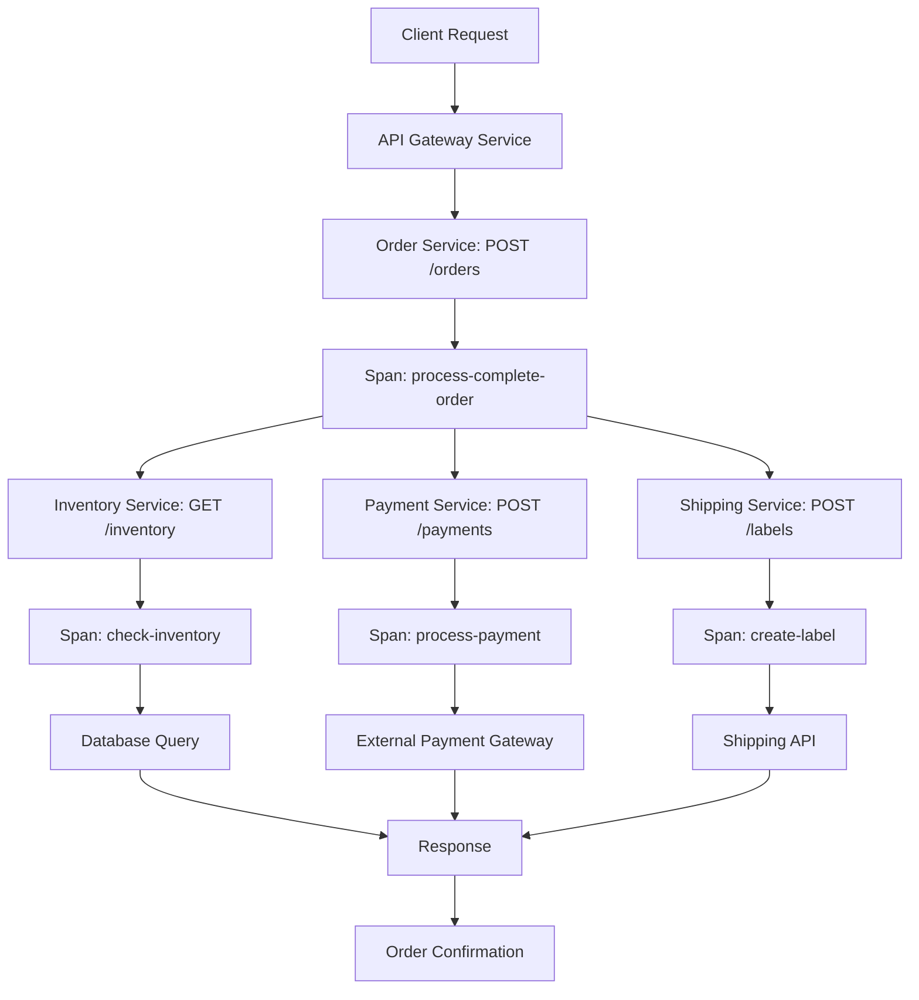

# How to Add OpenTelemetry Tracing to a Micronaut Application

Author: [nawazdhandala](https://www.github.com/nawazdhandala)

Tags: OpenTelemetry, Micronaut, Java, Tracing, Microservices

Description: Complete guide to implementing OpenTelemetry distributed tracing in Micronaut applications for comprehensive observability across microservices.

Micronaut has gained significant traction as a modern JVM framework optimized for microservices and serverless applications. Its compile-time dependency injection and low memory footprint make it ideal for cloud-native applications. Adding OpenTelemetry tracing to Micronaut applications provides visibility into request flows, performance bottlenecks, and inter-service communication patterns.

This comprehensive guide covers everything from basic setup to advanced tracing patterns in Micronaut applications.

## Why OpenTelemetry with Micronaut

Micronaut's design philosophy aligns perfectly with OpenTelemetry's goals. Both prioritize performance and minimal runtime overhead. Micronaut's ahead-of-time compilation means instrumentation code is generated at compile time, reducing the performance impact compared to runtime instrumentation approaches.

The combination gives you production-ready observability with negligible overhead, making it suitable even for high-throughput applications.

## Setting Up OpenTelemetry in Micronaut

Micronaut provides official OpenTelemetry integration through the Micronaut Tracing module. Add the necessary dependencies to your project.

```gradle
// For Gradle (build.gradle)
dependencies {
    // Core OpenTelemetry integration
    implementation("io.micronaut.tracing:micronaut-tracing-opentelemetry")

    // OpenTelemetry API
    implementation("io.opentelemetry:opentelemetry-api")

    // OTLP exporter for sending traces
    implementation("io.opentelemetry:opentelemetry-exporter-otlp")

    // Optional: Annotations for custom instrumentation
    implementation("io.micronaut.tracing:micronaut-tracing-opentelemetry-annotation")
}
```

For Maven users, add these dependencies to your `pom.xml`:

```xml
<dependencies>
    <!-- Core OpenTelemetry integration -->
    <dependency>
        <groupId>io.micronaut.tracing</groupId>
        <artifactId>micronaut-tracing-opentelemetry</artifactId>
    </dependency>

    <!-- OpenTelemetry API -->
    <dependency>
        <groupId>io.opentelemetry</groupId>
        <artifactId>opentelemetry-api</artifactId>
    </dependency>

    <!-- OTLP exporter -->
    <dependency>
        <groupId>io.opentelemetry</groupId>
        <artifactId>opentelemetry-exporter-otlp</artifactId>
    </dependency>
</dependencies>
```

Configure OpenTelemetry in your `application.yml` file.

```yaml
# application.yml
tracing:
  # Enable tracing
  enabled: true

opentelemetry:
  # Service name that appears in traces
  service-name: micronaut-demo-service

  # Resource attributes
  resource-attributes:
    deployment.environment: production
    service.version: 1.0.0

  # OTLP exporter configuration
  exporter:
    otlp:
      enabled: true
      endpoint: http://localhost:4317

  # Sampling configuration (1.0 = 100% of traces)
  sampler:
    probability: 1.0

  # Span processor configuration
  span-processor:
    batch:
      schedule-delay: 5000
      max-queue-size: 2048
      max-export-batch-size: 512
```

## Automatic HTTP Instrumentation

Once configured, Micronaut automatically instruments HTTP server and client requests. Create a basic controller to see this in action.

```java
package com.example.controller;

import io.micronaut.http.annotation.*;
import io.micronaut.http.HttpResponse;
import jakarta.inject.Inject;

@Controller("/api/products")
public class ProductController {

    @Inject
    private ProductService productService;

    // GET endpoint - automatically traced
    @Get("/{id}")
    public HttpResponse<Product> getProduct(@PathVariable Long id) {
        Product product = productService.findById(id);

        if (product == null) {
            return HttpResponse.notFound();
        }

        return HttpResponse.ok(product);
    }

    // POST endpoint - traces include request body size
    @Post
    public HttpResponse<Product> createProduct(@Body Product product) {
        Product created = productService.create(product);
        return HttpResponse.created(created);
    }

    // PUT endpoint with path parameter
    @Put("/{id}")
    public HttpResponse<Product> updateProduct(
            @PathVariable Long id,
            @Body Product product) {
        product.setId(id);
        Product updated = productService.update(product);
        return HttpResponse.ok(updated);
    }

    // DELETE endpoint
    @Delete("/{id}")
    public HttpResponse<Void> deleteProduct(@PathVariable Long id) {
        productService.delete(id);
        return HttpResponse.noContent();
    }
}
```

These endpoints are automatically instrumented. Each request creates a span with attributes like:
- `http.method` (GET, POST, etc.)
- `http.route` (the matched route pattern)
- `http.status_code` (response status)
- `http.url` (full request URL)

## Adding Custom Spans with Annotations

Use Micronaut's tracing annotations to create custom spans for specific methods.

```java
package com.example.service;

import io.micronaut.tracing.annotation.ContinueSpan;
import io.micronaut.tracing.annotation.NewSpan;
import io.micronaut.tracing.annotation.SpanTag;
import jakarta.inject.Singleton;

@Singleton
public class ProductService {

    @Inject
    private ProductRepository repository;

    @Inject
    private InventoryService inventoryService;

    @Inject
    private PricingService pricingService;

    // Create a new span for this method
    @NewSpan("find-product-by-id")
    public Product findById(@SpanTag("product.id") Long id) {
        // The @SpanTag annotation adds the id as a span attribute
        Product product = repository.findById(id).orElse(null);

        if (product != null) {
            // These method calls will be child spans
            enrichWithInventory(product);
            enrichWithPricing(product);
        }

        return product;
    }

    // Continue the current span (doesn't create a new one)
    @ContinueSpan
    private void enrichWithInventory(@SpanTag("product.id") Product product) {
        int inventory = inventoryService.getInventoryCount(product.getId());
        product.setInventoryCount(inventory);
    }

    @ContinueSpan
    private void enrichWithPricing(@SpanTag("product.id") Product product) {
        Price price = pricingService.getCurrentPrice(product.getId());
        product.setPrice(price);
    }

    // Create a new span with custom name
    @NewSpan("create-product")
    public Product create(@SpanTag("product.name") Product product) {
        // Validate product
        validateProduct(product);

        // Save to database
        Product saved = repository.save(product);

        // Initialize inventory
        inventoryService.initializeInventory(saved.getId(), 0);

        return saved;
    }

    @NewSpan("validate-product")
    private void validateProduct(@SpanTag("product.name") Product product) {
        if (product.getName() == null || product.getName().isEmpty()) {
            throw new IllegalArgumentException("Product name is required");
        }

        if (product.getPrice() == null || product.getPrice().compareTo(BigDecimal.ZERO) <= 0) {
            throw new IllegalArgumentException("Product price must be positive");
        }
    }
}
```

## Manual Instrumentation with OpenTelemetry API

For more control, use the OpenTelemetry API directly to create and manage spans.

```java
package com.example.service;

import io.opentelemetry.api.trace.Span;
import io.opentelemetry.api.trace.SpanKind;
import io.opentelemetry.api.trace.StatusCode;
import io.opentelemetry.api.trace.Tracer;
import io.opentelemetry.context.Scope;
import jakarta.inject.Inject;
import jakarta.inject.Singleton;

import java.util.List;
import java.util.Map;

@Singleton
public class OrderService {

    @Inject
    private Tracer tracer;

    @Inject
    private PaymentService paymentService;

    @Inject
    private ShippingService shippingService;

    @Inject
    private InventoryService inventoryService;

    public Order processOrder(OrderRequest request) {
        // Create a parent span for the entire operation
        Span span = tracer.spanBuilder("process-order")
            .setSpanKind(SpanKind.INTERNAL)
            .startSpan();

        try (Scope scope = span.makeCurrent()) {
            // Add attributes to track business metrics
            span.setAttribute("order.customer_id", request.getCustomerId());
            span.setAttribute("order.item_count", request.getItems().size());
            span.setAttribute("order.total", request.getTotal().doubleValue());

            // Step 1: Reserve inventory
            Map<Long, Integer> reservations = reserveInventory(request.getItems());
            span.addEvent("inventory_reserved");

            // Step 2: Process payment
            PaymentResult payment = processPayment(request);
            span.setAttribute("payment.transaction_id", payment.getTransactionId());
            span.addEvent("payment_processed");

            // Step 3: Create shipping label
            ShippingLabel label = createShippingLabel(request);
            span.setAttribute("shipping.tracking_number", label.getTrackingNumber());
            span.addEvent("shipping_label_created");

            // Step 4: Save order
            Order order = saveOrder(request, payment, label, reservations);
            span.setAttribute("order.id", order.getId());
            span.addEvent("order_saved");

            // Mark span as successful
            span.setStatus(StatusCode.OK);

            return order;

        } catch (InsufficientInventoryException e) {
            // Handle inventory errors
            span.setStatus(StatusCode.ERROR, "Insufficient inventory");
            span.recordException(e);
            span.setAttribute("error.type", "INSUFFICIENT_INVENTORY");
            throw e;

        } catch (PaymentFailedException e) {
            // Handle payment errors
            span.setStatus(StatusCode.ERROR, "Payment failed");
            span.recordException(e);
            span.setAttribute("error.type", "PAYMENT_FAILED");
            span.setAttribute("payment.decline_reason", e.getReason());
            throw e;

        } catch (Exception e) {
            // Handle unexpected errors
            span.setStatus(StatusCode.ERROR, "Order processing failed");
            span.recordException(e);
            throw new OrderProcessingException("Failed to process order", e);

        } finally {
            span.end();
        }
    }

    private Map<Long, Integer> reserveInventory(List<OrderItem> items) {
        Span span = tracer.spanBuilder("reserve-inventory")
            .setSpanKind(SpanKind.INTERNAL)
            .startSpan();

        try (Scope scope = span.makeCurrent()) {
            span.setAttribute("items.count", items.size());

            Map<Long, Integer> reservations = inventoryService.reserveItems(items);

            span.setAttribute("reservations.successful", reservations.size());
            return reservations;

        } finally {
            span.end();
        }
    }

    private PaymentResult processPayment(OrderRequest request) {
        Span span = tracer.spanBuilder("process-payment")
            .setSpanKind(SpanKind.CLIENT)
            .startSpan();

        try (Scope scope = span.makeCurrent()) {
            span.setAttribute("payment.amount", request.getTotal().doubleValue());
            span.setAttribute("payment.method", request.getPaymentMethod());

            PaymentResult result = paymentService.charge(
                request.getPaymentToken(),
                request.getTotal()
            );

            span.setAttribute("payment.status", result.getStatus());
            return result;

        } finally {
            span.end();
        }
    }

    private ShippingLabel createShippingLabel(OrderRequest request) {
        Span span = tracer.spanBuilder("create-shipping-label")
            .setSpanKind(SpanKind.CLIENT)
            .startSpan();

        try (Scope scope = span.makeCurrent()) {
            span.setAttribute("shipping.address", request.getShippingAddress().toString());
            span.setAttribute("shipping.method", request.getShippingMethod());

            ShippingLabel label = shippingService.createLabel(
                request.getShippingAddress(),
                request.getItems()
            );

            span.setAttribute("shipping.cost", label.getCost().doubleValue());
            return label;

        } finally {
            span.end();
        }
    }
}
```

## Tracing Database Operations

Micronaut automatically instruments JDBC operations when using Micronaut Data. For custom database operations, add manual spans.

```java
package com.example.repository;

import io.micronaut.data.annotation.Repository;
import io.micronaut.data.repository.CrudRepository;
import io.micronaut.tracing.annotation.NewSpan;
import io.micronaut.tracing.annotation.SpanTag;

import java.util.List;
import java.util.Optional;

@Repository
public interface ProductRepository extends CrudRepository<Product, Long> {

    // Automatically traced by Micronaut Data
    @NewSpan("find-product-by-id")
    Optional<Product> findById(@SpanTag("product.id") Long id);

    // Custom query method with tracing
    @NewSpan("find-products-by-category")
    List<Product> findByCategoryId(@SpanTag("category.id") Long categoryId);

    // Complex query with multiple parameters
    @NewSpan("search-products")
    List<Product> findByNameContainingAndPriceBetween(
        @SpanTag("search.query") String name,
        @SpanTag("price.min") Double minPrice,
        @SpanTag("price.max") Double maxPrice
    );
}
```

For native queries or complex operations, use manual instrumentation:

```java
package com.example.repository;

import io.opentelemetry.api.trace.Span;
import io.opentelemetry.api.trace.Tracer;
import io.opentelemetry.context.Scope;
import jakarta.inject.Inject;
import jakarta.inject.Singleton;

import javax.sql.DataSource;
import java.sql.Connection;
import java.sql.PreparedStatement;
import java.sql.ResultSet;
import java.util.ArrayList;
import java.util.List;

@Singleton
public class CustomProductRepository {

    @Inject
    private DataSource dataSource;

    @Inject
    private Tracer tracer;

    public List<Product> findTopSellingProducts(int limit) {
        Span span = tracer.spanBuilder("find-top-selling-products")
            .setAttribute("db.system", "postgresql")
            .setAttribute("db.operation", "SELECT")
            .startSpan();

        try (Scope scope = span.makeCurrent();
             Connection conn = dataSource.getConnection()) {

            span.setAttribute("db.connection_string", conn.getMetaData().getURL());
            span.setAttribute("query.limit", limit);

            String sql = """
                SELECT p.*, COUNT(oi.id) as sales_count
                FROM products p
                JOIN order_items oi ON p.id = oi.product_id
                GROUP BY p.id
                ORDER BY sales_count DESC
                LIMIT ?
                """;

            span.setAttribute("db.statement", sql);

            try (PreparedStatement stmt = conn.prepareStatement(sql)) {
                stmt.setInt(1, limit);

                try (ResultSet rs = stmt.executeQuery()) {
                    List<Product> products = new ArrayList<>();
                    int rowCount = 0;

                    while (rs.next()) {
                        products.add(mapResultSetToProduct(rs));
                        rowCount++;
                    }

                    span.setAttribute("db.rows_returned", rowCount);
                    return products;
                }
            }

        } catch (Exception e) {
            span.recordException(e);
            throw new RepositoryException("Failed to fetch top selling products", e);
        } finally {
            span.end();
        }
    }

    private Product mapResultSetToProduct(ResultSet rs) throws Exception {
        // Mapping logic here
        return new Product();
    }
}
```

## Distributed Tracing Across Microservices

When calling other services, OpenTelemetry automatically propagates trace context through HTTP headers.

```java
package com.example.client;

import io.micronaut.http.annotation.Get;
import io.micronaut.http.annotation.Header;
import io.micronaut.http.annotation.PathVariable;
import io.micronaut.http.client.annotation.Client;
import io.micronaut.tracing.annotation.NewSpan;
import io.micronaut.tracing.annotation.SpanTag;

// Declarative HTTP client with automatic trace propagation
@Client("${services.inventory.url}")
public interface InventoryClient {

    @Get("/api/inventory/{productId}")
    @NewSpan("get-inventory")
    InventoryInfo getInventory(@SpanTag("product.id") @PathVariable Long productId);

    @Get("/api/inventory/{productId}/reserve")
    @NewSpan("reserve-inventory")
    ReservationResult reserve(
        @SpanTag("product.id") @PathVariable Long productId,
        @SpanTag("quantity") @Header("X-Quantity") int quantity
    );
}
```

Use the client in your service:

```java
package com.example.service;

import io.opentelemetry.api.trace.Span;
import io.opentelemetry.api.trace.Tracer;
import io.opentelemetry.context.Scope;
import jakarta.inject.Inject;
import jakarta.inject.Singleton;

@Singleton
public class OrderProcessingService {

    @Inject
    private Tracer tracer;

    @Inject
    private InventoryClient inventoryClient;

    @Inject
    private PaymentClient paymentClient;

    @Inject
    private ShippingClient shippingClient;

    public OrderResult processOrder(Order order) {
        Span span = tracer.spanBuilder("process-complete-order")
            .startSpan();

        try (Scope scope = span.makeCurrent()) {
            span.setAttribute("order.id", order.getId());
            span.setAttribute("order.total", order.getTotal().doubleValue());

            // Call inventory service - trace context propagates automatically
            InventoryInfo inventory = inventoryClient.getInventory(order.getProductId());
            span.setAttribute("inventory.available", inventory.getQuantity());

            if (inventory.getQuantity() < order.getQuantity()) {
                span.addEvent("insufficient_inventory");
                throw new InsufficientInventoryException();
            }

            // Reserve inventory
            ReservationResult reservation = inventoryClient.reserve(
                order.getProductId(),
                order.getQuantity()
            );
            span.setAttribute("reservation.id", reservation.getId());

            // Process payment - creates a child span in the trace
            PaymentResult payment = paymentClient.processPayment(
                order.getCustomerId(),
                order.getTotal()
            );
            span.setAttribute("payment.transaction_id", payment.getTransactionId());

            // Create shipping label
            ShippingLabel label = shippingClient.createLabel(order);
            span.setAttribute("shipping.tracking_number", label.getTrackingNumber());

            return new OrderResult(order.getId(), payment, label);

        } finally {
            span.end();
        }
    }
}
```

## Trace Flow Visualization

Here's how a distributed trace flows through multiple Micronaut services:



## Configuration for Production

Optimize OpenTelemetry settings for production workloads.

```yaml
# application-prod.yml
tracing:
  enabled: true

opentelemetry:
  service-name: ${SERVICE_NAME:micronaut-service}

  resource-attributes:
    deployment.environment: ${ENVIRONMENT:production}
    service.version: ${APP_VERSION:unknown}
    service.namespace: ${NAMESPACE:default}
    host.name: ${HOSTNAME:unknown}

  exporter:
    otlp:
      enabled: true
      endpoint: ${OTEL_EXPORTER_OTLP_ENDPOINT:http://localhost:4317}
      # Use gRPC for better performance
      protocol: grpc
      # Add timeout for resilience
      timeout: 10s
      # Compression for network efficiency
      compression: gzip

  # Sampling strategy for high-throughput services
  sampler:
    # Use parent-based sampling with probability
    type: parentbased_traceidratio
    probability: ${OTEL_TRACE_SAMPLE_RATE:0.1}

  # Batch processor for efficiency
  span-processor:
    batch:
      schedule-delay: 5000
      max-queue-size: 2048
      max-export-batch-size: 512
      export-timeout: 30000

  # Limit span attributes to prevent excessive data
  span-limits:
    max-attributes: 128
    max-events: 128
    max-links: 128
    max-attribute-length: 1024
```

Adding OpenTelemetry tracing to Micronaut applications provides comprehensive observability with minimal performance overhead. The combination of automatic instrumentation and flexible manual options gives you complete control over what gets traced. Start with the automatic instrumentation for immediate visibility, then add custom spans to capture business-specific metrics and operations that matter most to your application.
