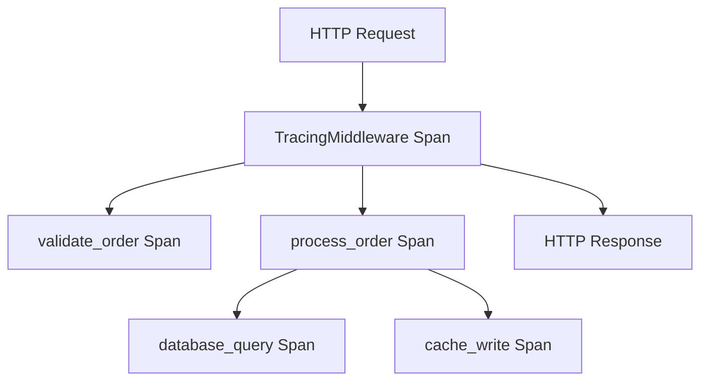

# How to Add OpenTelemetry Tracing Middleware to Actix-web Applications

Author: [nawazdhandala](https://www.github.com/nawazdhandala)

Tags: OpenTelemetry, Rust, Actix-web, Middleware, Tracing

Description: Learn how to implement OpenTelemetry tracing middleware in Actix-web applications with practical examples and production-ready configurations.

Actix-web is one of the most performant web frameworks in the Rust ecosystem, and adding OpenTelemetry tracing to it gives you powerful observability capabilities. This guide walks through implementing tracing middleware from scratch, covering both basic and advanced patterns.

## Understanding Actix-web Middleware Architecture

Actix-web uses a transform-based middleware system where each middleware wraps the next service in the chain. The middleware can inspect and modify requests before they reach handlers, and responses before they return to clients. For tracing, we want to create spans that represent the entire request lifecycle.

## Setting Up Dependencies

First, add the required dependencies to your `Cargo.toml`:

```toml
[dependencies]
actix-web = "4.5"
opentelemetry = { version = "0.22", features = ["trace"] }
opentelemetry_sdk = { version = "0.22", features = ["rt-tokio"] }
opentelemetry-otlp = { version = "0.15", features = ["tokio"] }
tracing = "0.1"
tracing-opentelemetry = "0.23"
tracing-subscriber = { version = "0.3", features = ["env-filter"] }
```

These crates provide the foundation for OpenTelemetry integration. The `tracing-opentelemetry` bridge connects Rust's tracing ecosystem with OpenTelemetry's instrumentation model.

## Creating the Tracing Middleware

Here's a complete implementation of an OpenTelemetry tracing middleware:

```rust
use actix_web::{
    dev::{forward_ready, Service, ServiceRequest, ServiceResponse, Transform},
    Error, HttpMessage,
};
use futures_util::future::LocalBoxFuture;
use opentelemetry::trace::{SpanKind, Status, TraceContextExt, Tracer};
use opentelemetry::{global, Context, KeyValue};
use std::future::{ready, Ready};

// The middleware factory that will create instances of our middleware
pub struct TracingMiddleware;

impl<Svc, Bd> Transform<Svc, ServiceRequest> for TracingMiddleware
where
    Svc: Service<ServiceRequest, Response = ServiceResponse<Bd>, Error = Error>,
    Svc::Future: 'static,
    Bd: 'static,
{
    type Response = ServiceResponse<Bd>;
    type Error = Error;
    type InitError = ();
    type Transform = TracingMiddlewareService<Svc>;
    type Future = Ready<Result<Self::Transform, Self::InitError>>;

    fn new_transform(&self, service: Svc) -> Self::Future {
        ready(Ok(TracingMiddlewareService { service }))
    }
}

// The actual middleware service that processes requests
pub struct TracingMiddlewareService<Svc> {
    service: Svc,
}

impl<Svc, Bd> Service<ServiceRequest> for TracingMiddlewareService<Svc>
where
    Svc: Service<ServiceRequest, Response = ServiceResponse<Bd>, Error = Error>,
    Svc::Future: 'static,
    Bd: 'static,
{
    type Response = ServiceResponse<Bd>;
    type Error = Error;
    type Future = LocalBoxFuture<'static, Result<Self::Response, Self::Error>>;

    forward_ready!(service);

    fn call(&self, req: ServiceRequest) -> Self::Future {
        let tracer = global::tracer("actix-web");

        // Extract the current context from incoming headers
        let parent_context = extract_context_from_request(&req);

        // Build span attributes from the request
        let mut attributes = vec![
            KeyValue::new("http.method", req.method().to_string()),
            KeyValue::new("http.target", req.path().to_string()),
            KeyValue::new("http.scheme", req.connection_info().scheme().to_string()),
        ];

        if let Some(host) = req.connection_info().host().split(':').next() {
            attributes.push(KeyValue::new("http.host", host.to_string()));
        }

        // Create a new span for this request
        let span = tracer
            .span_builder(format!("{} {}", req.method(), req.path()))
            .with_kind(SpanKind::Server)
            .with_attributes(attributes)
            .start_with_context(&tracer, &parent_context);

        let cx = parent_context.with_span(span);

        // Store the context in request extensions for downstream use
        req.extensions_mut().insert(cx.clone());

        let fut = self.service.call(req);

        Box::pin(async move {
            let result = fut.await;

            // Update span based on response
            let span = cx.span();
            match &result {
                Ok(response) => {
                    span.set_attribute(KeyValue::new(
                        "http.status_code",
                        response.status().as_u16() as i64,
                    ));

                    if response.status().is_client_error() || response.status().is_server_error() {
                        span.set_status(Status::Error {
                            description: format!("HTTP {}", response.status()).into(),
                        });
                    }
                }
                Err(err) => {
                    span.set_status(Status::Error {
                        description: err.to_string().into(),
                    });
                    span.set_attribute(KeyValue::new("error", true));
                }
            }

            span.end();
            result
        })
    }
}

// Helper function to extract OpenTelemetry context from HTTP headers
fn extract_context_from_request(req: &ServiceRequest) -> Context {
    use opentelemetry::propagation::Extractor;

    struct HeaderExtractor<'a>(&'a actix_web::http::header::HeaderMap);

    impl<'a> Extractor for HeaderExtractor<'a> {
        fn get(&self, key: &str) -> Option<&str> {
            self.0.get(key).and_then(|v| v.to_str().ok())
        }

        fn keys(&self) -> Vec<&str> {
            self.0.keys().map(|k| k.as_str()).collect()
        }
    }

    let extractor = HeaderExtractor(req.headers());
    global::get_text_map_propagator(|propagator| propagator.extract(&extractor))
}
```

This middleware creates a span for every incoming request, extracts distributed tracing context from headers, and records relevant HTTP metadata.

## Integrating the Middleware into Your Application

Now wire up the middleware in your Actix-web application:

```rust
use actix_web::{web, App, HttpResponse, HttpServer};
use opentelemetry::global;
use opentelemetry_sdk::trace::{self, RandomIdGenerator, Sampler};
use opentelemetry_sdk::Resource;
use opentelemetry::KeyValue;

#[actix_web::main]
async fn main() -> std::io::Result<()> {
    // Initialize the OpenTelemetry tracer
    let tracer = opentelemetry_otlp::new_pipeline()
        .tracing()
        .with_exporter(opentelemetry_otlp::new_exporter().tonic())
        .with_trace_config(
            trace::config()
                .with_sampler(Sampler::AlwaysOn)
                .with_id_generator(RandomIdGenerator::default())
                .with_resource(Resource::new(vec![
                    KeyValue::new("service.name", "my-actix-service"),
                    KeyValue::new("service.version", "1.0.0"),
                ])),
        )
        .install_batch(opentelemetry_sdk::runtime::Tokio)
        .expect("Failed to initialize tracer");

    // Set the global tracer provider
    global::set_tracer_provider(tracer);

    HttpServer::new(|| {
        App::new()
            // Apply the tracing middleware to all routes
            .wrap(TracingMiddleware)
            .route("/hello", web::get().to(hello_handler))
            .route("/users/{id}", web::get().to(get_user))
    })
    .bind(("127.0.0.1", 8080))?
    .run()
    .await?;

    // Shutdown the tracer provider to flush remaining spans
    global::shutdown_tracer_provider();

    Ok(())
}

async fn hello_handler() -> HttpResponse {
    HttpResponse::Ok().body("Hello, traced world!")
}

async fn get_user(path: web::Path<String>) -> HttpResponse {
    let user_id = path.into_inner();
    HttpResponse::Ok().json(serde_json::json!({
        "id": user_id,
        "name": "John Doe"
    }))
}
```

The middleware automatically instruments every request, creating spans with proper parent-child relationships when requests come from other instrumented services.

## Adding Custom Spans in Handlers

You can add additional spans within your handlers to trace specific operations:

```rust
use actix_web::{web, HttpResponse, HttpRequest};
use opentelemetry::trace::{Tracer, TraceContextExt};
use opentelemetry::global;

async fn process_order(
    req: HttpRequest,
    order_data: web::Json<OrderData>,
) -> HttpResponse {
    let tracer = global::tracer("actix-web");

    // Get the parent context from request extensions
    let parent_cx = req.extensions()
        .get::<opentelemetry::Context>()
        .cloned()
        .unwrap_or_else(opentelemetry::Context::current);

    // Create a child span for order validation
    let validation_span = tracer
        .start_with_context("validate_order", &parent_cx);
    let validation_cx = parent_cx.with_span(validation_span);

    // Perform validation logic
    if !validate_order(&order_data) {
        validation_cx.span().set_attribute(KeyValue::new("validation.result", "failed"));
        validation_cx.span().end();
        return HttpResponse::BadRequest().body("Invalid order");
    }

    validation_cx.span().set_attribute(KeyValue::new("validation.result", "passed"));
    validation_cx.span().end();

    // Create another span for order processing
    let processing_span = tracer
        .start_with_context("process_order", &parent_cx);
    let processing_cx = parent_cx.with_span(processing_span);

    let order_id = save_order(&order_data).await;
    processing_cx.span().set_attribute(KeyValue::new("order.id", order_id.clone()));
    processing_cx.span().end();

    HttpResponse::Ok().json(serde_json::json!({
        "order_id": order_id,
        "status": "processed"
    }))
}
```

This pattern gives you fine-grained visibility into what happens during request processing.

## Propagating Context to Background Tasks

When spawning background tasks, you need to explicitly pass the tracing context:

```rust
use actix_web::{web, HttpResponse, HttpRequest};
use opentelemetry::Context;

async fn enqueue_job(req: HttpRequest) -> HttpResponse {
    // Capture the current context
    let cx = req.extensions()
        .get::<Context>()
        .cloned()
        .unwrap_or_else(Context::current);

    // Spawn a background task with the context
    actix_web::rt::spawn(async move {
        let tracer = global::tracer("actix-web");
        let span = tracer.start_with_context("background_job", &cx);
        let _guard = cx.with_span(span);

        // Perform background work
        perform_heavy_computation().await;
    });

    HttpResponse::Accepted().body("Job enqueued")
}
```

Without explicit context propagation, your background spans won't be connected to the original request trace.

## Production Considerations

When running in production, consider these configuration options:

```rust
use opentelemetry_sdk::trace::{Sampler, SamplingDecision};

// Sample only 10% of requests in production
let sampler = Sampler::TraceIdRatioBased(0.1);

// Or use parent-based sampling to respect upstream decisions
let sampler = Sampler::ParentBased(Box::new(Sampler::TraceIdRatioBased(0.1)));

let tracer = opentelemetry_otlp::new_pipeline()
    .tracing()
    .with_exporter(
        opentelemetry_otlp::new_exporter()
            .tonic()
            .with_endpoint("http://collector:4317")
    )
    .with_trace_config(
        trace::config()
            .with_sampler(sampler)
            .with_max_events_per_span(128)
            .with_max_attributes_per_span(128)
    )
    .install_batch(opentelemetry_sdk::runtime::Tokio)
    .expect("Failed to initialize tracer");
```

Adjust batch size and flush intervals based on your throughput requirements to balance between latency and resource usage.

## Visualizing Traces

Here's how the trace structure looks for a typical request:



Each span captures timing, attributes, and the hierarchical relationship between operations, giving you complete visibility into request processing.

## Troubleshooting Common Issues

If spans aren't appearing in your collector, verify that the tracer provider is properly initialized before starting the HTTP server. The global tracer provider must be set before creating the application.

If context isn't propagating between services, ensure both services use compatible propagators. The default W3C Trace Context propagator works across most modern systems.

For high-throughput services, monitor the batch span processor queue size. If spans are being dropped, increase the queue size or adjust batch parameters.

This middleware approach gives you comprehensive tracing with minimal overhead, making it straightforward to understand request flows and identify performance bottlenecks in your Actix-web applications.
