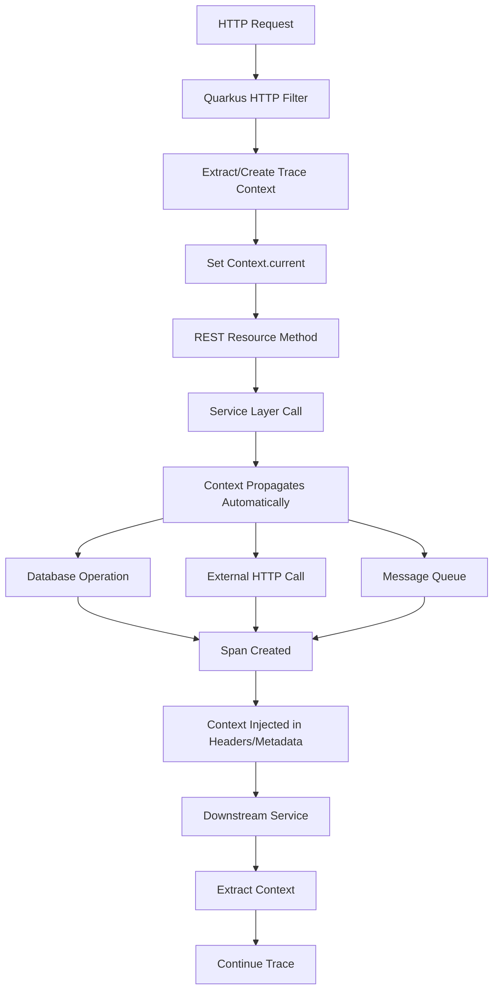

# How to Enable OpenTelemetry Tracing in Quarkus Applications

Author: [nawazdhandala](https://www.github.com/nawazdhandala)

Tags: OpenTelemetry, Quarkus, Java, Tracing, Cloud-Native, GraalVM

Description: Complete guide to implementing OpenTelemetry distributed tracing in Quarkus applications, including automatic instrumentation, native image support, and reactive programming patterns for cloud-native Java microservices.

Quarkus represents the next generation of Java frameworks, designed specifically for cloud-native, containerized workloads. With its focus on fast startup times, low memory footprint, and native compilation support through GraalVM, Quarkus enables Java applications to compete with Go and Rust in resource-constrained environments. OpenTelemetry integration in Quarkus leverages these advantages while providing comprehensive distributed tracing that works identically in both JVM and native modes.

The combination of Quarkus and OpenTelemetry addresses a critical challenge in modern microservices: maintaining observability without sacrificing performance. Traditional Java frameworks impose significant overhead for instrumentation, making tracing expensive in high-throughput systems. Quarkus's build-time optimization and reactive architecture reduce this overhead dramatically. OpenTelemetry's standardized APIs ensure instrumentation remains portable across vendors and platforms.

## Setting Up OpenTelemetry in Quarkus

Quarkus provides first-class OpenTelemetry support through its extension ecosystem. Start by adding the necessary dependencies to your project.

```xml
<dependencies>
    <!-- Quarkus core -->
    <dependency>
        <groupId>io.quarkus</groupId>
        <artifactId>quarkus-resteasy-reactive</artifactId>
    </dependency>

    <!-- OpenTelemetry extension -->
    <dependency>
        <groupId>io.quarkus</groupId>
        <artifactId>quarkus-opentelemetry</artifactId>
    </dependency>

    <!-- OTLP exporter -->
    <dependency>
        <groupId>io.opentelemetry</groupId>
        <artifactId>opentelemetry-exporter-otlp</artifactId>
    </dependency>

    <!-- Optional: JSON logging integration -->
    <dependency>
        <groupId>io.quarkus</groupId>
        <artifactId>quarkus-logging-json</artifactId>
    </dependency>
</dependencies>
```

Configure OpenTelemetry in your application.properties file.

```properties
# Application identification
quarkus.application.name=order-service

# OpenTelemetry configuration
quarkus.opentelemetry.enabled=true
quarkus.opentelemetry.tracer.exporter.otlp.endpoint=http://localhost:4317

# Service name for traces
quarkus.otel.service.name=order-service

# Trace all requests by default
quarkus.otel.traces.sampler=always_on

# Export configuration
quarkus.otel.exporter.otlp.traces.endpoint=http://localhost:4317
quarkus.otel.exporter.otlp.traces.protocol=grpc

# Optional: Add resource attributes
quarkus.otel.resource.attributes=deployment.environment=production,service.version=1.0.0

# Integration with Quarkus logging
quarkus.log.console.format=%d{HH:mm:ss} %-5p traceId=%X{traceId}, spanId=%X{spanId} [%c{2.}] (%t) %s%e%n

# Native image configuration
quarkus.native.additional-build-args=--initialize-at-run-time=io.opentelemetry
```

## Automatic REST Instrumentation

Quarkus automatically instruments REST endpoints when OpenTelemetry is enabled. Create a simple REST resource to see this in action.

```java
package com.oneuptime.resource;

import io.opentelemetry.api.trace.Span;
import io.opentelemetry.api.trace.Tracer;
import io.opentelemetry.context.Scope;
import jakarta.inject.Inject;
import jakarta.ws.rs.*;
import jakarta.ws.rs.core.MediaType;
import jakarta.ws.rs.core.Response;
import org.slf4j.Logger;
import org.slf4j.LoggerFactory;

/**
 * REST resource with automatic OpenTelemetry tracing
 * Spans are created automatically for each endpoint
 */
@Path("/orders")
@Produces(MediaType.APPLICATION_JSON)
@Consumes(MediaType.APPLICATION_JSON)
public class OrderResource {

    private static final Logger logger = LoggerFactory.getLogger(OrderResource.class);

    @Inject
    Tracer tracer;

    @Inject
    OrderService orderService;

    /**
     * Automatically traced endpoint
     * Quarkus creates a span with HTTP method, path, and status code
     */
    @GET
    @Path("/{orderId}")
    public Response getOrder(@PathParam("orderId") String orderId) {
        // Get the current span created by Quarkus
        Span span = Span.current();

        // Add custom attributes to the automatic span
        span.setAttribute("order.id", orderId);
        span.setAttribute("business.operation", "get.order");

        logger.info("Retrieving order: {}", orderId);

        Order order = orderService.findById(orderId);

        if (order != null) {
            span.setAttribute("order.status", order.getStatus());
            return Response.ok(order).build();
        } else {
            span.setAttribute("order.not.found", true);
            return Response.status(Response.Status.NOT_FOUND).build();
        }
    }

    /**
     * Create order with custom child spans
     */
    @POST
    public Response createOrder(CreateOrderRequest request) {
        Span span = Span.current();
        span.setAttribute("customer.id", request.getCustomerId());
        span.setAttribute("order.items.count", request.getItems().size());

        // Create child span for validation
        Span validationSpan = tracer.spanBuilder("validate.order")
            .setAttribute("validation.type", "business.rules")
            .startSpan();

        try (Scope scope = validationSpan.makeCurrent()) {
            validateOrderRequest(request);
            validationSpan.addEvent("validation.passed");
        } catch (IllegalArgumentException e) {
            validationSpan.recordException(e);
            validationSpan.setAttribute("validation.failed", true);
            return Response.status(Response.Status.BAD_REQUEST)
                .entity(new ErrorResponse(e.getMessage()))
                .build();
        } finally {
            validationSpan.end();
        }

        // Create order with automatic span propagation
        Order order = orderService.createOrder(request);

        span.setAttribute("order.id", order.getId());
        span.addEvent("order.created");

        return Response.status(Response.Status.CREATED)
            .entity(order)
            .build();
    }

    /**
     * Update order status with error handling
     */
    @PUT
    @Path("/{orderId}/status")
    public Response updateOrderStatus(
            @PathParam("orderId") String orderId,
            @QueryParam("status") String newStatus) {

        Span span = Span.current();
        span.setAttribute("order.id", orderId);
        span.setAttribute("order.new.status", newStatus);

        try {
            Order order = orderService.updateStatus(orderId, newStatus);
            span.addEvent("order.status.updated");
            return Response.ok(order).build();

        } catch (OrderNotFoundException e) {
            span.recordException(e);
            span.setAttribute("error.type", "not.found");
            return Response.status(Response.Status.NOT_FOUND).build();

        } catch (Exception e) {
            span.recordException(e);
            span.setAttribute("error.type", "internal");
            logger.error("Failed to update order status", e);
            return Response.status(Response.Status.INTERNAL_SERVER_ERROR).build();
        }
    }

    private void validateOrderRequest(CreateOrderRequest request) {
        if (request.getCustomerId() == null || request.getCustomerId().isEmpty()) {
            throw new IllegalArgumentException("Customer ID is required");
        }
        if (request.getItems() == null || request.getItems().isEmpty()) {
            throw new IllegalArgumentException("Order must contain at least one item");
        }
    }
}
```

## Service Layer Tracing

Instrument service layer methods to track business logic execution separate from HTTP handling.

```java
package com.oneuptime.service;

import io.opentelemetry.api.trace.Span;
import io.opentelemetry.api.trace.SpanKind;
import io.opentelemetry.api.trace.StatusCode;
import io.opentelemetry.api.trace.Tracer;
import io.opentelemetry.context.Scope;
import jakarta.enterprise.context.ApplicationScoped;
import jakarta.inject.Inject;
import org.slf4j.Logger;
import org.slf4j.LoggerFactory;

import java.util.UUID;

/**
 * Service class with custom span creation for business operations
 */
@ApplicationScoped
public class OrderService {

    private static final Logger logger = LoggerFactory.getLogger(OrderService.class);

    @Inject
    Tracer tracer;

    @Inject
    OrderRepository repository;

    @Inject
    InventoryClient inventoryClient;

    @Inject
    PaymentService paymentService;

    /**
     * Create order with multiple traced operations
     */
    public Order createOrder(CreateOrderRequest request) {
        Span span = tracer.spanBuilder("service.create.order")
            .setSpanKind(SpanKind.INTERNAL)
            .setAttribute("customer.id", request.getCustomerId())
            .startSpan();

        try (Scope scope = span.makeCurrent()) {
            // Check inventory availability
            boolean inventoryAvailable = checkInventoryAvailability(request.getItems());

            if (!inventoryAvailable) {
                span.setAttribute("order.creation.failed", true);
                span.setAttribute("failure.reason", "insufficient.inventory");
                throw new InsufficientInventoryException("Insufficient inventory");
            }

            // Process payment
            boolean paymentSuccess = processPayment(request);

            if (!paymentSuccess) {
                span.setAttribute("order.creation.failed", true);
                span.setAttribute("failure.reason", "payment.failed");
                throw new PaymentFailedException("Payment processing failed");
            }

            // Create order entity
            Order order = new Order();
            order.setId(UUID.randomUUID().toString());
            order.setCustomerId(request.getCustomerId());
            order.setItems(request.getItems());
            order.setStatus("CREATED");
            order.setCreatedAt(System.currentTimeMillis());

            // Persist order
            repository.persist(order);

            span.setAttribute("order.id", order.getId());
            span.setAttribute("order.status", order.getStatus());
            span.addEvent("order.persisted");
            span.setStatus(StatusCode.OK);

            logger.info("Order created successfully: {}", order.getId());
            return order;

        } catch (Exception e) {
            span.recordException(e);
            span.setStatus(StatusCode.ERROR, "Order creation failed");
            throw e;
        } finally {
            span.end();
        }
    }

    /**
     * Check inventory with child span
     */
    private boolean checkInventoryAvailability(java.util.List<OrderItem> items) {
        Span span = tracer.spanBuilder("check.inventory.availability")
            .setAttribute("items.count", items.size())
            .startSpan();

        try (Scope scope = span.makeCurrent()) {
            for (OrderItem item : items) {
                span.addEvent("checking.item",
                    io.opentelemetry.api.common.Attributes.of(
                        io.opentelemetry.api.common.AttributeKey.stringKey("product.id"),
                        item.getProductId()
                    ));

                boolean available = inventoryClient.checkAvailability(
                    item.getProductId(),
                    item.getQuantity()
                );

                if (!available) {
                    span.setAttribute("inventory.check.failed", true);
                    span.setAttribute("unavailable.product", item.getProductId());
                    return false;
                }
            }

            span.setAttribute("inventory.check.passed", true);
            return true;

        } finally {
            span.end();
        }
    }

    /**
     * Process payment with external service call tracing
     */
    private boolean processPayment(CreateOrderRequest request) {
        Span span = tracer.spanBuilder("process.payment")
            .setSpanKind(SpanKind.CLIENT)
            .setAttribute("payment.amount", calculateTotal(request.getItems()))
            .setAttribute("customer.id", request.getCustomerId())
            .startSpan();

        try (Scope scope = span.makeCurrent()) {
            boolean success = paymentService.charge(
                request.getCustomerId(),
                calculateTotal(request.getItems())
            );

            span.setAttribute("payment.success", success);
            return success;

        } catch (Exception e) {
            span.recordException(e);
            return false;
        } finally {
            span.end();
        }
    }

    public Order findById(String orderId) {
        Span span = tracer.spanBuilder("repository.find.order")
            .setAttribute("order.id", orderId)
            .startSpan();

        try (Scope scope = span.makeCurrent()) {
            return repository.findById(orderId);
        } finally {
            span.end();
        }
    }

    public Order updateStatus(String orderId, String newStatus) {
        Span span = tracer.spanBuilder("service.update.order.status")
            .setAttribute("order.id", orderId)
            .setAttribute("new.status", newStatus)
            .startSpan();

        try (Scope scope = span.makeCurrent()) {
            Order order = repository.findById(orderId);
            if (order == null) {
                throw new OrderNotFoundException("Order not found: " + orderId);
            }

            order.setStatus(newStatus);
            repository.persist(order);

            span.addEvent("status.updated");
            return order;

        } finally {
            span.end();
        }
    }

    private double calculateTotal(java.util.List<OrderItem> items) {
        return items.stream()
            .mapToDouble(item -> item.getPrice() * item.getQuantity())
            .sum();
    }
}
```

## Reactive Programming Tracing

Quarkus excels at reactive programming with Mutiny. Trace context propagation works seamlessly with reactive streams.

```java
package com.oneuptime.service;

import io.opentelemetry.api.trace.Span;
import io.opentelemetry.api.trace.Tracer;
import io.opentelemetry.context.Context;
import io.opentelemetry.context.Scope;
import io.smallrye.mutiny.Uni;
import io.smallrye.mutiny.Multi;
import jakarta.enterprise.context.ApplicationScoped;
import jakarta.inject.Inject;
import org.slf4j.Logger;
import org.slf4j.LoggerFactory;

import java.time.Duration;

/**
 * Reactive service with OpenTelemetry context propagation
 */
@ApplicationScoped
public class ReactiveOrderService {

    private static final Logger logger = LoggerFactory.getLogger(ReactiveOrderService.class);

    @Inject
    Tracer tracer;

    @Inject
    ReactiveOrderRepository repository;

    /**
     * Reactive order creation with automatic context propagation
     */
    public Uni<Order> createOrderAsync(CreateOrderRequest request) {
        // Capture current trace context
        Context context = Context.current();
        Span span = tracer.spanBuilder("reactive.create.order")
            .setAttribute("customer.id", request.getCustomerId())
            .startSpan();

        return Uni.createFrom().item(() -> {
            // Make span current in reactive context
            try (Scope scope = span.makeCurrent()) {
                Order order = new Order();
                order.setId(java.util.UUID.randomUUID().toString());
                order.setCustomerId(request.getCustomerId());
                order.setStatus("CREATED");
                span.setAttribute("order.id", order.getId());
                return order;
            }
        })
        .chain(order -> repository.persistAsync(order))
        .invoke(order -> {
            try (Scope scope = span.makeCurrent()) {
                span.addEvent("order.persisted");
                logger.info("Order created: {}", order.getId());
            }
        })
        .eventually(() -> span.end());
    }

    /**
     * Reactive stream processing with trace context
     */
    public Multi<OrderStatus> streamOrderUpdates(String orderId) {
        Span span = tracer.spanBuilder("stream.order.updates")
            .setAttribute("order.id", orderId)
            .startSpan();

        return Multi.createFrom().ticks().every(Duration.ofSeconds(1))
            .onItem().transform(tick -> {
                try (Scope scope = span.makeCurrent()) {
                    span.addEvent("status.update.emitted",
                        io.opentelemetry.api.common.Attributes.of(
                            io.opentelemetry.api.common.AttributeKey.longKey("tick"),
                            tick
                        ));

                    return new OrderStatus(orderId, getStatusForTick(tick));
                }
            })
            .select().first(5)
            .invoke(() -> span.end());
    }

    /**
     * Parallel processing with individual spans
     */
    public Uni<BatchResult> processBatchAsync(java.util.List<CreateOrderRequest> requests) {
        Span batchSpan = tracer.spanBuilder("batch.process.orders")
            .setAttribute("batch.size", requests.size())
            .startSpan();

        // Capture context for parallel operations
        Context parentContext = Context.current();

        // Process each order in parallel with its own span
        java.util.List<Uni<Order>> orderUnis = requests.stream()
            .map(request -> processOrderWithSpan(request, parentContext))
            .collect(java.util.stream.Collectors.toList());

        return Uni.combine().all().unis(orderUnis)
            .combinedWith(results -> {
                try (Scope scope = batchSpan.makeCurrent()) {
                    BatchResult result = new BatchResult();
                    result.setSuccessCount(results.size());
                    batchSpan.setAttribute("batch.success.count", results.size());
                    return result;
                }
            })
            .eventually(() -> batchSpan.end());
    }

    /**
     * Process single order with parent context
     */
    private Uni<Order> processOrderWithSpan(
            CreateOrderRequest request,
            Context parentContext) {

        Span span = tracer.spanBuilder("process.batch.order")
            .setParent(parentContext)
            .setAttribute("customer.id", request.getCustomerId())
            .startSpan();

        return Uni.createFrom().item(() -> {
            try (Scope scope = span.makeCurrent()) {
                Order order = new Order();
                order.setId(java.util.UUID.randomUUID().toString());
                order.setCustomerId(request.getCustomerId());
                span.setAttribute("order.id", order.getId());
                return order;
            }
        })
        .eventually(() -> span.end());
    }

    private String getStatusForTick(long tick) {
        String[] statuses = {"CREATED", "PROCESSING", "PACKED", "SHIPPED", "DELIVERED"};
        return statuses[(int) (tick % statuses.length)];
    }
}
```

## Database Tracing with Hibernate ORM

Quarkus automatically traces database operations when using Hibernate with OpenTelemetry.

```java
package com.oneuptime.repository;

import io.opentelemetry.api.trace.Span;
import io.opentelemetry.api.trace.Tracer;
import io.opentelemetry.context.Scope;
import io.quarkus.hibernate.orm.panache.PanacheRepository;
import jakarta.enterprise.context.ApplicationScoped;
import jakarta.inject.Inject;
import jakarta.transaction.Transactional;

import java.util.List;

/**
 * Repository with automatic database operation tracing
 * Hibernate operations are automatically instrumented
 */
@ApplicationScoped
public class OrderRepository implements PanacheRepository<Order> {

    @Inject
    Tracer tracer;

    /**
     * Find orders by customer with custom span
     */
    public List<Order> findByCustomer(String customerId) {
        Span span = tracer.spanBuilder("db.query.orders.by.customer")
            .setAttribute("customer.id", customerId)
            .setAttribute("db.operation", "SELECT")
            .startSpan();

        try (Scope scope = span.makeCurrent()) {
            List<Order> orders = list("customerId", customerId);
            span.setAttribute("result.count", orders.size());
            return orders;
        } finally {
            span.end();
        }
    }

    /**
     * Update order status with transaction tracing
     */
    @Transactional
    public void updateOrderStatus(String orderId, String newStatus) {
        Span span = tracer.spanBuilder("db.update.order.status")
            .setAttribute("order.id", orderId)
            .setAttribute("new.status", newStatus)
            .setAttribute("db.operation", "UPDATE")
            .startSpan();

        try (Scope scope = span.makeCurrent()) {
            Order order = findById(orderId);
            if (order != null) {
                order.setStatus(newStatus);
                persist(order);
                span.addEvent("order.updated");
            } else {
                span.setAttribute("order.not.found", true);
            }
        } finally {
            span.end();
        }
    }
}
```

## Trace Context Propagation

Understanding how Quarkus propagates trace context helps debug issues.



## Native Image Support

Quarkus compiles to native executables with GraalVM. Configure OpenTelemetry for native mode.

```properties
# Native image specific configuration
quarkus.native.additional-build-args=\
  --initialize-at-run-time=io.opentelemetry.sdk.trace.SdkTracerProvider,\
  --initialize-at-run-time=io.opentelemetry.sdk.metrics.SdkMeterProvider,\
  --initialize-at-run-time=io.opentelemetry.sdk.logs.SdkLoggerProvider

# Optimize for native mode
quarkus.otel.sdk-disabled=false
```

Build and test the native executable.

```bash
# Build native image with tracing support
./mvnw package -Pnative

# Run native executable
./target/order-service-1.0.0-runner

# Verify tracing works in native mode
curl http://localhost:8080/orders/12345

# Check exported traces
curl http://localhost:4318/v1/traces
```

## Testing Tracing Configuration

Create tests to verify trace instrumentation works correctly.

```java
package com.oneuptime.tracing;

import io.opentelemetry.api.trace.Span;
import io.opentelemetry.api.trace.SpanKind;
import io.opentelemetry.sdk.testing.junit5.OpenTelemetryExtension;
import io.opentelemetry.sdk.trace.data.SpanData;
import io.quarkus.test.junit.QuarkusTest;
import jakarta.inject.Inject;
import org.junit.jupiter.api.Test;
import org.junit.jupiter.api.extension.RegisterExtension;

import java.util.List;

import static org.junit.jupiter.api.Assertions.*;

/**
 * Test OpenTelemetry tracing configuration
 */
@QuarkusTest
class OrderTracingTest {

    @RegisterExtension
    static final OpenTelemetryExtension otelTesting = OpenTelemetryExtension.create();

    @Inject
    OrderService orderService;

    @Test
    void testOrderCreationCreatesSpans() {
        // Create test request
        CreateOrderRequest request = new CreateOrderRequest();
        request.setCustomerId("customer-123");

        // Execute operation
        Order order = orderService.createOrder(request);

        // Verify spans were created
        List<SpanData> spans = otelTesting.getSpans();
        assertFalse(spans.isEmpty(), "Expected spans to be created");

        // Verify span attributes
        SpanData serviceSpan = spans.stream()
            .filter(s -> s.getName().equals("service.create.order"))
            .findFirst()
            .orElseThrow();

        assertEquals(SpanKind.INTERNAL, serviceSpan.getKind());
        assertEquals("customer-123",
            serviceSpan.getAttributes().get(
                io.opentelemetry.api.common.AttributeKey.stringKey("customer.id")
            ));
    }
}
```

Quarkus and OpenTelemetry combine to deliver high-performance observability for cloud-native Java applications. Automatic instrumentation covers REST endpoints, database operations, and external calls without code changes. Reactive programming support ensures trace context flows through asynchronous operations. Native image compilation maintains full tracing functionality while achieving startup times under 100ms and memory footprints under 50MB. The result is enterprise-grade observability with resource efficiency previously unavailable to Java applications.
