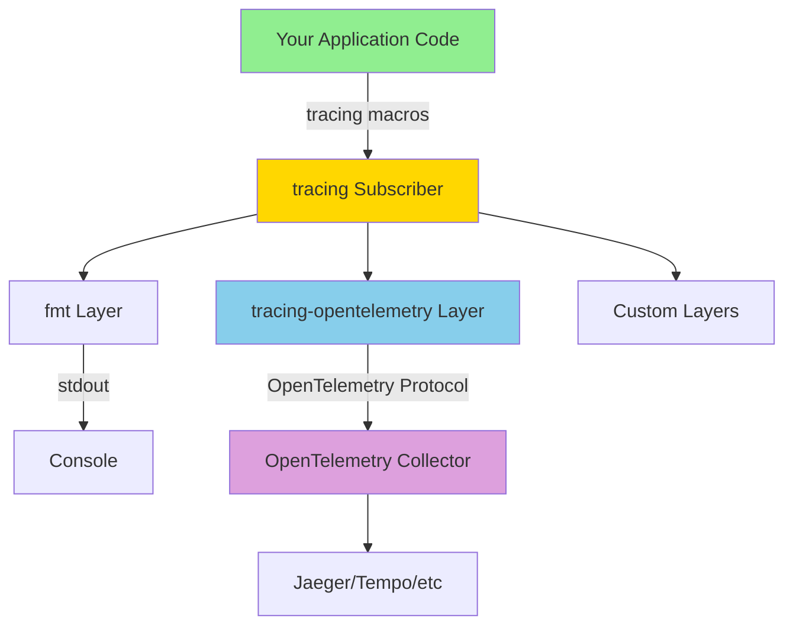

# How to Set Up OpenTelemetry Tracing in Rust

Author: [nawazdhandala](https://www.github.com/nawazdhandala)

Tags: OpenTelemetry, Rust, Tracing, Crates, Setup, Observability

Description: Complete guide to integrating OpenTelemetry with Rust's tracing ecosystem for structured logging and distributed tracing across your applications.

Rust's `tracing` crate has become the de facto standard for instrumentation in the ecosystem. Combining it with OpenTelemetry gives you the best of both worlds: idiomatic Rust instrumentation and standardized telemetry export. This guide shows you how to set up this powerful combination from scratch.

## Why Use tracing with OpenTelemetry?

The `tracing` crate provides ergonomic macros and a rich ecosystem of integrations across Rust libraries. OpenTelemetry provides standardized telemetry export and compatibility with industry-standard observability platforms. Together, they let you instrument once and export everywhere.

Rather than choosing between Rust-native tooling and OpenTelemetry compatibility, the `tracing-opentelemetry` bridge gives you both. Your code uses familiar `tracing` patterns while your ops team gets OpenTelemetry-compatible telemetry.

## Core Dependencies

Start with these dependencies in your `Cargo.toml`:

```toml
[dependencies]
tracing = "0.1"
tracing-subscriber = { version = "0.3", features = ["env-filter", "json"] }
tracing-opentelemetry = "0.33"
opentelemetry = { version = "0.32", features = ["trace"] }
opentelemetry_sdk = { version = "0.32", features = ["trace"] }
opentelemetry-otlp = { version = "0.32", features = ["grpc-tonic"] }
tokio = { version = "1.35", features = ["full"] }
```

These crates form the foundation of your observability stack. The `tracing-subscriber` crate provides the layer system that connects everything together.

## Basic Setup

Here's a minimal working example:

```rust
use opentelemetry::global;
use opentelemetry::trace::TracerProvider as _;
use opentelemetry_sdk::propagation::TraceContextPropagator;
use opentelemetry_sdk::trace::{RandomIdGenerator, Sampler, SdkTracerProvider};
use opentelemetry_sdk::Resource;
use tracing_subscriber::layer::SubscriberExt;
use tracing_subscriber::util::SubscriberInitExt;

fn init_tracing() -> Result<SdkTracerProvider, Box<dyn std::error::Error + Send + Sync + 'static>> {
    // Initialize OpenTelemetry exporter and tracer provider
    let exporter = opentelemetry_otlp::SpanExporter::builder()
        .with_tonic()
        .build()?;

    let tracer_provider = SdkTracerProvider::builder()
        .with_batch_exporter(exporter)
        .with_sampler(Sampler::AlwaysOn)
        .with_id_generator(RandomIdGenerator::default())
        .with_resource(
            Resource::builder()
                .with_service_name("my-rust-service")
                .build(),
        )
        .build();

    global::set_tracer_provider(tracer_provider.clone());
    global::set_text_map_propagator(TraceContextPropagator::new());

    // Create OpenTelemetry tracing layer
    let tracer = tracer_provider.tracer("my-rust-service");
    let telemetry_layer = tracing_opentelemetry::layer()
        .with_tracer(tracer);

    // Set up the tracing subscriber with multiple layers
    tracing_subscriber::registry()
        .with(tracing_subscriber::EnvFilter::from_default_env())
        .with(telemetry_layer)
        .with(tracing_subscriber::fmt::layer())
        .init();

    Ok(tracer_provider)
}

#[tokio::main]
async fn main() -> Result<(), Box<dyn std::error::Error + Send + Sync + 'static>> {
    let tracer_provider = init_tracing()?;

    // Your application code here
    tracing::info!("Application started");

    do_work().await?;

    // Shutdown to flush remaining spans
    tracer_provider.shutdown()?;

    Ok(())
}

async fn do_work() -> Result<(), Box<dyn std::error::Error + Send + Sync + 'static>> {
    tracing::info!("Starting work");
    Ok(())
}
```

This setup gives you both console output and OpenTelemetry export. The `fmt` layer prints to stdout while the `telemetry` layer sends spans to your collector.

## Using the instrument Macro

The `#[instrument]` macro is your primary tool for creating spans:

```rust
use tracing::{instrument, info};

// Automatically create a span for this function
#[instrument]
fn calculate_fibonacci(n: u32) -> u64 {
    info!("Calculating fibonacci number");

    if n <= 1 {
        return n as u64;
    }

    calculate_fibonacci(n - 1) + calculate_fibonacci(n - 2)
}

// Control which parameters are recorded
#[instrument(skip(password))]
async fn authenticate_user(username: &str, password: &str) -> Result<User, AuthError> {
    info!("Authenticating user");

    let user = lookup_user(username).await?;
    verify_password(&user, password)?;

    Ok(user)
}

// Customize the span name
#[instrument(name = "db.query.user")]
async fn lookup_user(username: &str) -> Result<User, DbError> {
    // Database query logic
    Ok(User {
        id: 123,
        username: username.to_string(),
    })
}

// Add custom fields to the span
#[instrument(fields(user_id = %user.id, action = "update"))]
async fn update_user_profile(user: &User, data: ProfileData) -> Result<(), UpdateError> {
    info!("Updating user profile");

    save_to_database(user.id, data).await?;

    Ok(())
}
```

The `#[instrument]` macro automatically creates a span that starts when the function is called and ends when it returns, capturing function arguments by default. Use `ret` or `err` when you want return values or errors recorded as events.

## Creating Manual Spans

For more control, create spans manually:

```rust
use tracing::{info, info_span, warn, Instrument};

async fn process_orders(orders: Vec<Order>) -> Result<(), ProcessError> {
    let order_count = orders.len();

    async move {
        info!("Starting order processing");

        for order in orders {
            // Create a child span for each order
            let order_span = info_span!(
                "process_single_order",
                order.id = %order.id,
                order.amount = order.amount
            );

            async {
                match validate_order(&order) {
                    Ok(_) => {
                        info!("Order validated successfully");
                        process_payment(&order).await?;
                    }
                    Err(e) => {
                        warn!("Order validation failed: {}", e);
                    }
                }

                Ok::<(), ProcessError>(())
            }
            .instrument(order_span)
            .await?;
        }

        Ok(())
    }
    .instrument(info_span!("process_orders", order_count = order_count))
    .await
}
```

Manual spans give you fine-grained control over span boundaries and attributes.

## Recording Structured Events

Use events to record structured data within spans:

```rust
use tracing::{debug, error, info, instrument};

#[instrument]
async fn handle_api_request(req: ApiRequest) -> ApiResponse {
    debug!(
        request.method = %req.method,
        request.path = %req.path,
        request.id = %req.id,
        "Received API request"
    );

    let start = std::time::Instant::now();

    let result = process_request(&req).await;

    let duration_ms = start.elapsed().as_millis();

    match &result {
        Ok(response) => {
            info!(
                response.status = response.status,
                response.size = response.body.len(),
                duration_ms = duration_ms,
                "Request completed successfully"
            );
        }
        Err(error) => {
            error!(
                error.message = %error,
                error.code = error.code(),
                duration_ms = duration_ms,
                "Request failed"
            );
        }
    }

    result.unwrap_or_else(|e| ApiResponse::error(e))
}
```

Events become span events in OpenTelemetry, giving you detailed timeline information about what happened during span execution.

## Propagating Context Across Async Boundaries

Rust's async runtime requires explicit context propagation:

```rust
use tracing::{info_span, instrument, Instrument};

async fn fetch_and_process() -> Result<(), Error> {
    let data = fetch_data().await?;

    // Spawn a background task that inherits the current span
    let processing_task = tokio::spawn(
        async move {
            process_data(data).await
        }
        .instrument(info_span!("background_processing"))
    );

    // Wait for the background task
    processing_task.await??;

    Ok(())
}

#[instrument]
async fn fetch_data() -> Result<Data, Error> {
    // Fetch data from somewhere
    Ok(Data::default())
}

#[instrument]
async fn process_data(data: Data) -> Result<(), Error> {
    // Process the data
    Ok(())
}
```

The `.instrument()` combinator ensures spawned tasks maintain the correct span context.

## Configuring Multiple Layers

Combine multiple subscriber layers for different outputs:

```rust
use opentelemetry::trace::TracerProvider as _;
use opentelemetry_sdk::trace::SdkTracerProvider;
use tracing_subscriber::{fmt, EnvFilter};
use tracing_subscriber::layer::SubscriberExt;
use tracing_subscriber::util::SubscriberInitExt;

fn init_layered_tracing() -> Result<SdkTracerProvider, Box<dyn std::error::Error + Send + Sync + 'static>> {
    // Environment-based filtering
    let env_filter = EnvFilter::try_from_default_env()
        .unwrap_or_else(|_| EnvFilter::new("info"));

    // Console output layer with pretty formatting
    let fmt_layer = fmt::layer()
        .with_target(true)
        .with_thread_ids(true)
        .with_line_number(true);

    // JSON output layer for structured logs
    let json_layer = fmt::layer()
        .json()
        .with_current_span(true)
        .with_span_list(true)
        .with_writer(std::io::stderr);

    // OpenTelemetry layer
    let exporter = opentelemetry_otlp::SpanExporter::builder()
        .with_tonic()
        .build()?;

    let tracer_provider = opentelemetry_sdk::trace::SdkTracerProvider::builder()
        .with_batch_exporter(exporter)
        .build();

    let tracer = tracer_provider.tracer("my-rust-service");

    let telemetry_layer = tracing_opentelemetry::layer()
        .with_tracer(tracer);

    // Combine all layers
    tracing_subscriber::registry()
        .with(env_filter)
        .with(fmt_layer)
        .with(json_layer)
        .with(telemetry_layer)
        .init();

    Ok(tracer_provider)
}
```

This configuration sends formatted logs to stdout, JSON logs to stderr, and telemetry to OpenTelemetry collectors simultaneously.

## Adding Custom Attributes

Enrich spans with domain-specific information:

```rust
use tracing::{info_span, instrument, Span};
use tracing_opentelemetry::OpenTelemetrySpanExt;

#[instrument(skip(ctx))]
async fn handle_user_request(ctx: RequestContext, user_id: u64) -> Result<(), Error> {
    let current_span = Span::current();

    // Add custom attributes to the current span
    current_span.set_attribute("user.id", user_id as i64);
    current_span.set_attribute("user.tier", ctx.user_tier.as_str().to_owned());
    current_span.set_attribute("request.source", ctx.source_ip.to_string());

    // These attributes will appear in OpenTelemetry spans
    perform_action(user_id).await?;

    Ok(())
}

// You can also add attributes when creating spans
fn process_batch(items: &[Item]) -> Result<(), Error> {
    let span = info_span!(
        "process_batch",
        batch.size = items.len(),
        batch.type = "standard",
        processing.mode = "parallel"
    );
    let _guard = span.entered();

    // Processing logic
    Ok(())
}
```

Custom attributes help you filter and analyze traces based on your application's specific dimensions.

## Integrating with External HTTP Clients

Propagate trace context to downstream services:

```rust
use opentelemetry::global;
use opentelemetry::propagation::Injector;
use tracing::instrument;
use tracing_opentelemetry::OpenTelemetrySpanExt;

struct HeaderInjector<'a>(&'a mut reqwest::header::HeaderMap);

impl<'a> Injector for HeaderInjector<'a> {
    fn set(&mut self, key: &str, value: String) {
        if let Ok(name) = reqwest::header::HeaderName::from_bytes(key.as_bytes()) {
            if let Ok(val) = reqwest::header::HeaderValue::from_str(&value) {
                self.0.insert(name, val);
            }
        }
    }
}

#[instrument]
async fn call_downstream_service(url: &str) -> Result<String, reqwest::Error> {
    let client = reqwest::Client::new();
    let mut headers = reqwest::header::HeaderMap::new();

    // Inject current span context into HTTP headers
    let cx = tracing::Span::current().context();

    global::get_text_map_propagator(|propagator| {
        propagator.inject_context(&cx, &mut HeaderInjector(&mut headers));
    });

    let response = client
        .get(url)
        .headers(headers)
        .send()
        .await?
        .text()
        .await?;

    Ok(response)
}
```

This ensures your distributed traces connect across service boundaries.

## Handling Errors with Tracing

Record errors as span events and status:

```rust
use opentelemetry::trace::Status;
use tracing::{error, instrument, Span};
use tracing_opentelemetry::OpenTelemetrySpanExt;

#[instrument]
async fn risky_operation() -> Result<String, OperationError> {
    match perform_operation().await {
        Ok(result) => {
            Ok(result)
        }
        Err(e) => {
            // Record the error in the current span
            error!(error.message = %e, error.type = ?e, "Operation failed");

            // Also set OpenTelemetry span status
            let span = Span::current();
            span.set_status(Status::error(e.to_string()));

            Err(e)
        }
    }
}

#[instrument(err)]
async fn auto_error_recording() -> Result<(), MyError> {
    // The `err` parameter automatically records errors
    perform_fallible_operation().await?;
    Ok(())
}
```

The `err` parameter on `#[instrument]` automatically records error return values, saving you boilerplate.

## Sampling Configuration

Control which spans are recorded and exported:

```rust
use opentelemetry::trace::TracerProvider as _;
use opentelemetry_sdk::trace::{Sampler, SamplingDecision, SamplingResult, SdkTracerProvider};
use tracing_subscriber::layer::SubscriberExt;
use tracing_subscriber::util::SubscriberInitExt;

// Sample based on trace ID (consistent across service boundaries)
fn init_with_sampling() -> Result<SdkTracerProvider, Box<dyn std::error::Error + Send + Sync + 'static>> {
    let sampler = Sampler::TraceIdRatioBased(0.1);  // Sample 10% of traces

    let exporter = opentelemetry_otlp::SpanExporter::builder()
        .with_tonic()
        .build()?;

    let tracer_provider = SdkTracerProvider::builder()
        .with_batch_exporter(exporter)
        .with_sampler(sampler)
        .build();

    let telemetry_layer = tracing_opentelemetry::layer()
        .with_tracer(tracer_provider.tracer("my-rust-service"));

    tracing_subscriber::registry()
        .with(telemetry_layer)
        .init();

    Ok(tracer_provider)
}

// Custom sampling logic
#[derive(Clone, Debug)]
struct CustomSampler;

impl opentelemetry_sdk::trace::ShouldSample for CustomSampler {
    fn should_sample(
        &self,
        parent_context: Option<&opentelemetry::Context>,
        trace_id: opentelemetry::trace::TraceId,
        name: &str,
        span_kind: &opentelemetry::trace::SpanKind,
        attributes: &[opentelemetry::KeyValue],
        links: &[opentelemetry::trace::Link],
    ) -> SamplingResult {
        // Always sample spans with errors
        if attributes.iter().any(|kv| kv.key.as_str() == "error" && kv.value.as_str() == "true") {
            return SamplingResult {
                decision: SamplingDecision::RecordAndSample,
                attributes: vec![],
                trace_state: Default::default(),
            };
        }

        // Sample 10% of everything else
        if trace_id.to_bytes()[0] < 25 {
            SamplingResult {
                decision: SamplingDecision::RecordAndSample,
                attributes: vec![],
                trace_state: Default::default(),
            }
        } else {
            SamplingResult {
                decision: SamplingDecision::Drop,
                attributes: vec![],
                trace_state: Default::default(),
            }
        }
    }
}
```

Smart sampling reduces costs while ensuring you capture important traces.

## Tracing Ecosystem Integration

Many Rust libraries already support tracing:

```rust
// Database queries with sqlx
use sqlx::postgres::PgPoolOptions;
use tracing::instrument;

#[instrument]
async fn query_database() -> Result<Vec<User>, sqlx::Error> {
    let pool = PgPoolOptions::new()
        .max_connections(5)
        .connect("postgresql://localhost/mydb")
        .await?;

    // SQLx emits tracing-based query logs when logging is enabled.
    // Use a SQLx tracing/OpenTelemetry integration crate if you need per-query spans.
    let users = sqlx::query_as::<_, User>("SELECT * FROM users")
        .fetch_all(&pool)
        .await?;

    Ok(users)
}

// HTTP servers with common frameworks have tracing integration
// Tower services automatically propagate span context
// Redis clients like fred support tracing
```

The ecosystem's standardization on `tracing` means instrumentation often comes for free.

## Visualizing the Architecture

Here's how the pieces fit together:


```mermaid
graph TB
    A[Your Application Code] -->|tracing macros| B[tracing Subscriber]
    B --> C[fmt Layer]
    B --> D[tracing-opentelemetry Layer]
    B --> E[Custom Layers]
    C -->|stdout| F[Console]
    D -->|OpenTelemetry Protocol| G[OpenTelemetry Collector]
    G --> H[Jaeger/Tempo/etc]

    style A fill:#90EE90
    style B fill:#FFD700
    style D fill:#87CEEB
    style G fill:#DDA0DD
```

The layered architecture lets you add or remove outputs without changing your instrumentation code.

## Best Practices

Keep these patterns in mind when instrumenting your code:

Use `#[instrument]` on public functions and async functions to automatically capture entry and exit points. Skip sensitive parameters with the `skip` attribute to prevent leaking secrets in telemetry.

Create child spans for distinct operations within a function to show detailed execution flow. Use `info_span!` for informational spans and error events for failures.

Record custom attributes that help you understand your specific domain. Generic attributes like timing are captured automatically, but business-specific data requires explicit recording.

Always shut down the `SdkTracerProvider` before application exit to ensure buffered spans are flushed to your collector.

The combination of `tracing` and OpenTelemetry gives you observability that scales from development to production, with minimal overhead and maximum flexibility.
