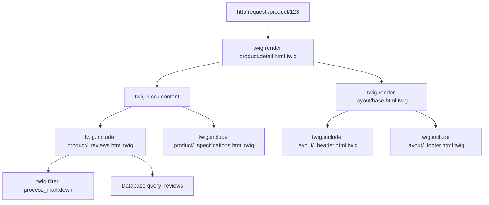

# How to Configure OpenTelemetry Twig Template Tracing in Symfony

Author: [nawazdhandala](https://www.github.com/nawazdhandala)

Tags: OpenTelemetry, PHP, Symfony, Twig, Templates, Rendering, Tracing

Description: Learn how to instrument Twig template rendering in Symfony with OpenTelemetry to identify performance bottlenecks, track template hierarchy, and optimize view layer performance.

Template rendering often gets overlooked when optimizing application performance. Developers focus on database queries and API calls while templates silently consume milliseconds, sometimes seconds, processing complex layouts and includes. OpenTelemetry tracing for Twig gives you visibility into this critical part of your response time.

## Understanding Twig Performance Characteristics

Twig templates go through several stages that each contribute to rendering time. The template loader finds and reads template files from disk or cache. The lexer and parser convert template syntax into tokens and an abstract syntax tree. The compiler transforms the AST into executable PHP code. Finally, the runtime executes that PHP code to produce HTML.

Most applications run with Twig's cache enabled, meaning compilation happens once and subsequent requests only execute the cached PHP. However, even with caching, template rendering can be slow due to:

Complex template inheritance with multiple levels of extends and blocks. Dozens or hundreds of include statements loading partial templates. Expensive Twig extensions or filters processing data. Large loops rendering hundreds of items. Excessive function calls to services or repositories from templates.

Without instrumentation, these issues remain invisible until users complain about slow page loads.

## Creating a Twig Runtime Profiler Extension

Twig allows you to hook into the rendering process through extensions and runtime loaders. We'll create an extension that wraps template rendering with OpenTelemetry spans.

```php
// src/Twig/Extension/OpenTelemetryExtension.php

namespace App\Twig\Extension;

use App\Twig\Runtime\OpenTelemetryRuntime;
use Twig\Extension\AbstractExtension;
use Twig\Extension\ProfilerExtension;

class OpenTelemetryExtension extends AbstractExtension
{
    public function __construct(
        private OpenTelemetryRuntime $runtime
    ) {}

    public function getNodeVisitors(): array
    {
        return [
            new OpenTelemetryNodeVisitor($this->runtime),
        ];
    }
}
```

The node visitor intercepts template compilation to inject our tracing code:

```php
// src/Twig/Extension/OpenTelemetryNodeVisitor.php

namespace App\Twig\Extension;

use Twig\Environment;
use Twig\Node\Node;
use Twig\Node\ModuleNode;
use Twig\Node\BlockNode;
use Twig\Node\BodyNode;
use Twig\NodeVisitor\NodeVisitorInterface;

class OpenTelemetryNodeVisitor implements NodeVisitorInterface
{
    public function __construct(
        private $runtime
    ) {}

    public function enterNode(Node $node, Environment $env): Node
    {
        return $node;
    }

    public function leaveNode(Node $node, Environment $env): Node
    {
        if ($node instanceof ModuleNode) {
            // Wrap the entire template body
            $node->setNode('body', $this->wrapNode($node->getNode('body'), $node->getTemplateName()));
        }

        if ($node instanceof BlockNode) {
            // Wrap individual blocks
            $node->setNode('body', $this->wrapNode($node->getNode('body'), 'block:' . $node->getAttribute('name')));
        }

        return $node;
    }

    public function getPriority(): int
    {
        return 0;
    }

    private function wrapNode(Node $node, string $name): Node
    {
        // Inject tracing calls around the node
        return new OpenTelemetryNode($node, $name, $this->runtime);
    }
}
```

However, a simpler approach uses Twig's profiler extension as a foundation and extends it with OpenTelemetry:

```php
// src/Twig/Profiler/OpenTelemetryProfile.php

namespace App\Twig\Profiler;

use OpenTelemetry\API\Trace\TracerProviderInterface;
use OpenTelemetry\API\Trace\SpanInterface;
use Twig\Profiler\Profile;

class OpenTelemetryProfile extends Profile
{
    private $tracer;
    private array $spans = [];
    private array $scopes = [];

    public function __construct(
        TracerProviderInterface $tracerProvider,
        private bool $captureTemplateVariables = false
    ) {
        parent::__construct();
        $this->tracer = $tracerProvider->getTracer('twig.template');
    }

    public function enter(Profile $profile): void
    {
        parent::enter($profile);

        $name = $this->getSpanName($profile);

        $span = $this->tracer->spanBuilder($name)
            ->setAttribute('twig.template', $profile->getTemplate())
            ->setAttribute('twig.type', $profile->getType())
            ->startSpan();

        $profileId = spl_object_id($profile);
        $this->spans[$profileId] = $span;
        $this->scopes[$profileId] = $span->activate();
    }

    public function leave(Profile $profile): void
    {
        parent::leave($profile);

        $profileId = spl_object_id($profile);

        if (isset($this->spans[$profileId])) {
            $span = $this->spans[$profileId];

            // Add timing and memory information
            $span->setAttribute('twig.duration_ms', $profile->getDuration() * 1000);
            $span->setAttribute('twig.memory_mb', $profile->getMemoryUsage() / 1024 / 1024);

            $span->end();

            if (isset($this->scopes[$profileId])) {
                $this->scopes[$profileId]->detach();
                unset($this->scopes[$profileId]);
            }

            unset($this->spans[$profileId]);
        }
    }

    private function getSpanName(Profile $profile): string
    {
        $type = $profile->getType();
        $template = $profile->getTemplate();

        return match($type) {
            'template' => "twig.render {$template}",
            'block' => "twig.block {$profile->getName()} in {$template}",
            'macro' => "twig.macro {$profile->getName()} in {$template}",
            default => "twig.{$type} {$template}",
        };
    }
}
```

Register the profile as a service and enable it in Twig:

```yaml
# config/services.yaml

services:
  App\Twig\Profiler\OpenTelemetryProfile:
    arguments:
      $tracerProvider: '@opentelemetry.trace.tracer_provider'
      $captureTemplateVariables: '%env(bool:OTEL_TWIG_CAPTURE_VARIABLES)%'

# config/packages/twig.yaml

twig:
  profiler:
    class: App\Twig\Profiler\OpenTelemetryProfile
```

## Instrumenting Template Includes and Embeds

Twig's include and embed tags create nested template rendering that should appear as child spans.

```php
// src/Twig/Runtime/TemplateIncludeTracer.php

namespace App\Twig\Runtime;

use OpenTelemetry\API\Trace\TracerProviderInterface;
use OpenTelemetry\API\Trace\SpanKind;
use Twig\Environment;

class TemplateIncludeTracer
{
    private $tracer;

    public function __construct(TracerProviderInterface $tracerProvider)
    {
        $this->tracer = $tracerProvider->getTracer('twig.includes');
    }

    public function traceInclude(Environment $env, string $template, array $variables = []): string
    {
        $span = $this->tracer->spanBuilder("twig.include {$template}")
            ->setSpanKind(SpanKind::KIND_INTERNAL)
            ->setAttribute('twig.template', $template)
            ->setAttribute('twig.variables.count', count($variables))
            ->startSpan();

        $scope = $span->activate();

        try {
            $result = $env->render($template, $variables);
            $span->setAttribute('twig.output.size', strlen($result));
            return $result;

        } catch (\Throwable $e) {
            $span->recordException($e);
            throw $e;

        } finally {
            $span->end();
            $scope->detach();
        }
    }
}
```

Register this as a Twig function to use in templates:

```php
// src/Twig/Extension/TracingExtension.php

namespace App\Twig\Extension;

use App\Twig\Runtime\TemplateIncludeTracer;
use Twig\Extension\AbstractExtension;
use Twig\TwigFunction;

class TracingExtension extends AbstractExtension
{
    public function getFunctions(): array
    {
        return [
            new TwigFunction('trace_include', [TemplateIncludeTracer::class, 'traceInclude'], [
                'needs_environment' => true,
            ]),
        ];
    }
}
```

Now you can explicitly trace specific includes that you suspect are slow:

```twig
{# templates/product/detail.html.twig #}

<div class="product-details">
    
        <h1>{{ product.name }}</h1>

        {# Traced include shows up as a separate span #}
        {{ trace_include('product/_reviews.html.twig', {product: product}) }}

        {# Regular include is captured by profiler #}
        
    
</div>
```

## Tracking Template Variable Usage

Large or complex variables passed to templates can impact performance, especially if they trigger lazy loading or expensive serialization.

```php
// src/Twig/Runtime/VariableProfiler.php

namespace App\Twig\Runtime;

use OpenTelemetry\API\Trace\TracerProviderInterface;

class VariableProfiler
{
    private $tracer;

    public function __construct(
        TracerProviderInterface $tracerProvider,
        private int $sizeThreshold = 1048576 // 1MB
    ) {
        $this->tracer = $tracerProvider->getTracer('twig.variables');
    }

    public function profileVariables(array $variables): array
    {
        $span = $this->tracer->spanBuilder('twig.variables.profile')
            ->setAttribute('variables.count', count($variables))
            ->startSpan();

        $scope = $span->activate();

        try {
            $totalSize = 0;
            $largeVariables = [];

            foreach ($variables as $name => $value) {
                $size = $this->estimateSize($value);
                $totalSize += $size;

                if ($size > $this->sizeThreshold) {
                    $largeVariables[$name] = $size;
                }
            }

            $span->setAttribute('variables.total_size_mb', $totalSize / 1024 / 1024);

            if (!empty($largeVariables)) {
                $span->setAttribute('variables.large_variables', json_encode($largeVariables));
            }

            return $variables;

        } finally {
            $span->end();
            $scope->detach();
        }
    }

    private function estimateSize($value): int
    {
        if (is_string($value)) {
            return strlen($value);
        }

        if (is_array($value)) {
            $size = 0;
            foreach ($value as $item) {
                $size += $this->estimateSize($item);
            }
            return $size;
        }

        if (is_object($value)) {
            try {
                return strlen(serialize($value));
            } catch (\Throwable $e) {
                return 0;
            }
        }

        return 0;
    }
}
```

Hook this into template rendering by wrapping your controller's render calls:

```php
// src/Controller/BaseController.php

namespace App\Controller;

use App\Twig\Runtime\VariableProfiler;
use Symfony\Bundle\FrameworkBundle\Controller\AbstractController;
use Symfony\Component\HttpFoundation\Response;

abstract class BaseController extends AbstractController
{
    public function __construct(
        private VariableProfiler $variableProfiler
    ) {}

    protected function render(string $view, array $parameters = [], Response $response = null): Response
    {
        // Profile variables before passing to Twig
        $parameters = $this->variableProfiler->profileVariables($parameters);

        return parent::render($view, $parameters, $response);
    }
}
```

## Instrumenting Custom Twig Extensions

If you have custom Twig extensions with filters or functions that perform expensive operations, instrument them directly.

```php
// src/Twig/Extension/DataProcessingExtension.php

namespace App\Twig\Extension;

use OpenTelemetry\API\Trace\TracerProviderInterface;
use Twig\Extension\AbstractExtension;
use Twig\TwigFilter;

class DataProcessingExtension extends AbstractExtension
{
    private $tracer;

    public function __construct(TracerProviderInterface $tracerProvider)
    {
        $this->tracer = $tracerProvider->getTracer('twig.extensions');
    }

    public function getFilters(): array
    {
        return [
            new TwigFilter('process_markdown', [$this, 'processMarkdown']),
            new TwigFilter('format_price', [$this, 'formatPrice']),
        ];
    }

    public function processMarkdown(string $text): string
    {
        $span = $this->tracer->spanBuilder('twig.filter.process_markdown')
            ->setAttribute('input.length', strlen($text))
            ->startSpan();

        $scope = $span->activate();

        try {
            // Expensive markdown processing
            $result = $this->convertMarkdownToHtml($text);

            $span->setAttribute('output.length', strlen($result));

            return $result;

        } finally {
            $span->end();
            $scope->detach();
        }
    }

    public function formatPrice(float $amount, string $currency = 'USD'): string
    {
        $span = $this->tracer->spanBuilder('twig.filter.format_price')
            ->setAttribute('amount', $amount)
            ->setAttribute('currency', $currency)
            ->startSpan();

        $scope = $span->activate();

        try {
            // Price formatting logic that might make API calls
            $formatted = $this->priceFormatter->format($amount, $currency);
            return $formatted;

        } finally {
            $span->end();
            $scope->detach();
        }
    }

    private function convertMarkdownToHtml(string $text): string
    {
        // Actual markdown conversion implementation
        return $text; // Simplified
    }
}
```

## Detecting Template Performance Issues

With complete instrumentation, you can identify common performance problems in your templates.

Create a span processor that flags slow template renders:

```php
// src/OpenTelemetry/SlowTemplateProcessor.php

namespace App\OpenTelemetry;

use OpenTelemetry\SDK\Trace\SpanProcessorInterface;
use OpenTelemetry\SDK\Trace\ReadWriteSpanInterface;
use OpenTelemetry\SDK\Trace\ReadableSpanInterface;
use OpenTelemetry\Context\ContextInterface;
use Psr\Log\LoggerInterface;

class SlowTemplateProcessor implements SpanProcessorInterface
{
    public function __construct(
        private LoggerInterface $logger,
        private int $thresholdMs = 100
    ) {}

    public function onStart(ReadWriteSpanInterface $span, ContextInterface $parentContext): void
    {
        // Nothing to do on start
    }

    public function onEnd(ReadableSpanInterface $span): void
    {
        // Check if this is a Twig span
        if (!str_starts_with($span->getName(), 'twig.')) {
            return;
        }

        $duration = ($span->getEndEpochNanos() - $span->getStartEpochNanos()) / 1_000_000;

        if ($duration > $this->thresholdMs) {
            $attributes = $span->getAttributes()->toArray();

            $this->logger->warning('Slow template rendering detected', [
                'span_name' => $span->getName(),
                'duration_ms' => $duration,
                'template' => $attributes['twig.template'] ?? 'unknown',
                'trace_id' => $span->getContext()->getTraceId(),
            ]);
        }
    }

    public function forceFlush(): bool
    {
        return true;
    }

    public function shutdown(): bool
    {
        return true;
    }
}
```

Register this processor in your OpenTelemetry configuration:

```yaml
# config/services.yaml

services:
  App\OpenTelemetry\SlowTemplateProcessor:
    arguments:
      $logger: '@logger'
      $thresholdMs: '%env(int:OTEL_TWIG_SLOW_THRESHOLD_MS)%'
    tags:
      - { name: opentelemetry.span_processor }
```

## Visualizing Template Rendering Hierarchy

With all instrumentation in place, your template traces show a clear hierarchy:



Each span shows:
- Template name and type (render, block, include, embed)
- Execution time in milliseconds
- Memory usage
- Number of variables passed
- Size of output generated

## Optimization Strategies Based on Traces

Once you have visibility into template rendering, apply these optimizations:

**Cache expensive filters**: If markdown processing shows up as slow, cache the HTML output instead of reprocessing on every request.

**Reduce include depth**: Templates with 10+ levels of includes add overhead. Consider flattening or combining templates.

**Lazy load complex blocks**: Use AJAX to load slow template sections after the initial page render.

**Minimize variable passing**: Only pass variables that templates actually need, reducing serialization overhead.

**Profile extensions**: Custom Twig extensions that make database queries or API calls should be moved to controllers or cached.

## Environment Configuration

Control Twig instrumentation through environment variables:

```bash
# .env

# Enable Twig profiling and tracing
OTEL_TWIG_ENABLED=true

# Capture template variables
OTEL_TWIG_CAPTURE_VARIABLES=false

# Threshold for slow template warnings (milliseconds)
OTEL_TWIG_SLOW_THRESHOLD_MS=100
```

For development:

```bash
# .env.local

OTEL_TWIG_ENABLED=true
OTEL_TWIG_CAPTURE_VARIABLES=true
OTEL_TWIG_SLOW_THRESHOLD_MS=50
```

With comprehensive Twig instrumentation, you transform template rendering from a mysterious black box into a fully observable component. You can see exactly which templates are slow, where time is being spent, and how template structure affects overall performance. This visibility is essential for optimizing the user-facing parts of your application.
