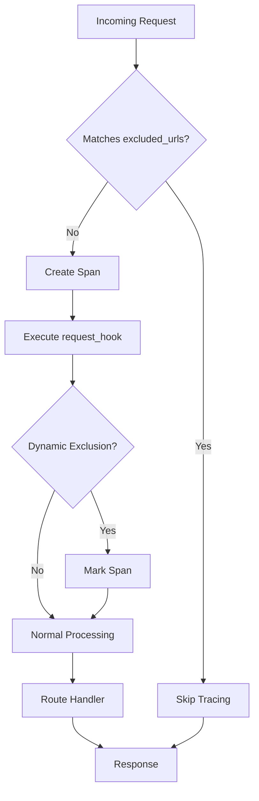

# How to Configure OpenTelemetry URL Exclusions in Flask Applications

Author: [nawazdhandala](https://www.github.com/nawazdhandala)

Tags: OpenTelemetry, Flask, URL Exclusions, Configuration, Python, Filtering

Description: Learn how to exclude specific URLs and endpoints from OpenTelemetry tracing in Flask applications to reduce noise and optimize telemetry costs.

When you instrument a Flask application with OpenTelemetry, every HTTP request generates a trace span. While comprehensive tracing is valuable, certain endpoints like health checks, metrics, and static assets can create unnecessary noise and inflate storage costs. Health check endpoints might receive requests every few seconds from load balancers, generating thousands of nearly identical traces daily. Excluding these URLs from tracing keeps your telemetry data focused on meaningful user interactions and business logic.

## Why URL Exclusions Matter

Production Flask applications typically expose several types of endpoints that don't need tracing:

**Health Check Endpoints**: Load balancers, orchestrators like Kubernetes, and monitoring systems constantly poll these endpoints. A health check running every 5 seconds generates over 17,000 requests daily per service instance.

**Metrics Endpoints**: Prometheus and other monitoring systems scrape metrics endpoints frequently. These requests are already monitored by the metrics system itself.

**Static Assets**: When Flask serves static files, each CSS, JavaScript, or image request creates a trace. These traces rarely provide actionable insights.

**Internal Diagnostics**: Debug endpoints, admin panels, and internal tools might not need production tracing.

Excluding these URLs reduces your telemetry data volume by 40-60% in typical applications, directly lowering costs while keeping your traces focused on actual application behavior.

## Basic URL Exclusion Syntax

The FlaskInstrumentor accepts an `excluded_urls` parameter that takes a comma-separated string of URL patterns to exclude from tracing.

```python
from flask import Flask
from opentelemetry.instrumentation.flask import FlaskInstrumentor

app = Flask(__name__)

# Exclude specific endpoints from tracing
FlaskInstrumentor().instrument_app(
    app,
    excluded_urls="/health,/metrics,/ready"
)

@app.route('/health')
def health_check():
    return {"status": "healthy"}

@app.route('/metrics')
def metrics():
    return {"requests": 1000, "errors": 5}

@app.route('/ready')
def readiness_check():
    return {"ready": True}

@app.route('/api/users')
def get_users():
    # This endpoint WILL be traced
    return {"users": []}

if __name__ == '__main__':
    app.run()
```

Requests to `/health`, `/metrics`, and `/ready` won't generate traces, while `/api/users` and other endpoints will be traced normally.

## Pattern Matching and Regular Expressions

For more sophisticated filtering, use regular expressions. The `excluded_urls` parameter accepts regex patterns, allowing you to match multiple URLs with a single pattern.

```python
from flask import Flask
from opentelemetry.instrumentation.flask import FlaskInstrumentor

app = Flask(__name__)

# Use regex patterns to exclude multiple URL patterns
FlaskInstrumentor().instrument_app(
    app,
    excluded_urls="health|ready|metrics|/static/.*|/assets/.*"
)

@app.route('/health')
def health():
    return {"status": "ok"}

@app.route('/healthz')
def healthz():
    # Also matches the pattern due to 'health' substring
    return {"status": "ok"}

@app.route('/static/<path:filename>')
def static_files(filename):
    # All static file requests are excluded
    return f"Static file: {filename}"

@app.route('/api/data')
def get_data():
    # This IS traced
    return {"data": [1, 2, 3]}

if __name__ == '__main__':
    app.run()
```

The pattern `health|ready|metrics` matches any URL containing these strings. The pattern `/static/.*` matches all URLs starting with `/static/`, regardless of what follows.

## Excluding URL Patterns by Prefix

Many applications organize endpoints with prefixes like `/internal/`, `/admin/`, or `/_debug/`. You can exclude entire prefixes efficiently.

```python
from flask import Flask, Blueprint
from opentelemetry.instrumentation.flask import FlaskInstrumentor

app = Flask(__name__)

# Create internal and public blueprints
internal_bp = Blueprint('internal', __name__, url_prefix='/internal')
admin_bp = Blueprint('admin', __name__, url_prefix='/admin')
api_bp = Blueprint('api', __name__, url_prefix='/api')

# Internal endpoints
@internal_bp.route('/health')
def internal_health():
    return {"status": "healthy"}

@internal_bp.route('/debug')
def internal_debug():
    return {"debug": "info"}

# Admin endpoints
@admin_bp.route('/users')
def admin_users():
    return {"users": []}

# Public API endpoints
@api_bp.route('/products')
def get_products():
    return {"products": []}

# Register blueprints
app.register_blueprint(internal_bp)
app.register_blueprint(admin_bp)
app.register_blueprint(api_bp)

# Exclude all internal and admin URLs
FlaskInstrumentor().instrument_app(
    app,
    excluded_urls="/internal/.*|/admin/.*"
)

if __name__ == '__main__':
    app.run()
```

This configuration excludes everything under `/internal/` and `/admin/`, while tracing all `/api/` endpoints.

## Dynamic URL Exclusions

Sometimes you need to decide at runtime whether to exclude a URL, based on request headers, query parameters, or other context. While `excluded_urls` uses static patterns, you can implement dynamic filtering with request hooks.

```python
from flask import Flask, request
from opentelemetry.instrumentation.flask import FlaskInstrumentor
from opentelemetry import trace

app = Flask(__name__)

def request_hook(span, environ):
    """Skip tracing based on runtime conditions"""
    # Check for internal traffic header
    if environ.get('HTTP_X_INTERNAL_REQUEST') == 'true':
        # Mark span to be dropped
        span.set_attribute("internal.request", True)
        # You can't directly drop a span, but you can mark it
        # Your backend can filter based on this attribute
        return

    # Check for canary or test traffic
    user_agent = environ.get('HTTP_USER_AGENT', '')
    if 'monitoring-bot' in user_agent.lower():
        span.set_attribute("bot.traffic", True)
        return

    # Check for specific query parameters
    query_string = environ.get('QUERY_STRING', '')
    if 'no_trace=1' in query_string:
        span.set_attribute("trace.disabled", True)
        return

FlaskInstrumentor().instrument_app(
    app,
    request_hook=request_hook
)

@app.route('/api/data')
def get_data():
    return {"data": [1, 2, 3]}

if __name__ == '__main__':
    app.run()
```

While this approach doesn't prevent span creation, it marks spans for filtering at the backend level. Many observability platforms support server-side filtering based on span attributes.

## Combining Multiple Exclusion Strategies

Real-world applications often need multiple exclusion strategies. Combine static URL patterns with dynamic filtering for comprehensive control.

```python
from flask import Flask, request
from opentelemetry.instrumentation.flask import FlaskInstrumentor
from opentelemetry import trace
import re

app = Flask(__name__)

# Static exclusions for known endpoints
STATIC_EXCLUSIONS = "health|ready|metrics|/static/.*|/assets/.*"

# Additional dynamic exclusion patterns
DYNAMIC_PATTERNS = [
    re.compile(r'/api/v[0-9]+/internal/.*'),
    re.compile(r'.*\.(css|js|png|jpg|ico|woff)$')
]

def request_hook(span, environ):
    """Apply dynamic exclusion logic"""
    path = environ.get('PATH_INFO', '')

    # Check against dynamic patterns
    for pattern in DYNAMIC_PATTERNS:
        if pattern.match(path):
            span.set_attribute("excluded.dynamic", True)
            return

    # Check for load balancer health checks
    user_agent = environ.get('HTTP_USER_AGENT', '')
    if 'ELB-HealthChecker' in user_agent or 'kube-probe' in user_agent:
        span.set_attribute("excluded.healthcheck", True)
        return

    # Check for specific headers indicating internal traffic
    if environ.get('HTTP_X_FORWARDED_FOR', '').startswith('10.'):
        span.set_attribute("excluded.internal", True)
        return

FlaskInstrumentor().instrument_app(
    app,
    excluded_urls=STATIC_EXCLUSIONS,
    request_hook=request_hook
)

@app.route('/health')
def health():
    return {"status": "ok"}

@app.route('/api/v1/internal/metrics')
def internal_metrics():
    # Excluded by dynamic pattern
    return {"metrics": {}}

@app.route('/api/v1/users')
def get_users():
    # This IS traced
    return {"users": []}

if __name__ == '__main__':
    app.run()
```

## Trace Flow with Exclusions

Understanding how requests flow through your instrumentation helps you configure exclusions correctly:



## Excluding Based on HTTP Methods

Some endpoints might need tracing for certain HTTP methods but not others. For example, you might want to trace POST requests to an endpoint but exclude GET requests used for polling.

```python
from flask import Flask, request
from opentelemetry.instrumentation.flask import FlaskInstrumentor

app = Flask(__name__)

def request_hook(span, environ):
    """Exclude specific HTTP methods for certain endpoints"""
    path = environ.get('PATH_INFO', '')
    method = environ.get('REQUEST_METHOD', '')

    # Exclude GET requests to the status endpoint
    if path == '/api/status' and method == 'GET':
        span.set_attribute("excluded.polling", True)
        return

    # Exclude HEAD requests globally
    if method == 'HEAD':
        span.set_attribute("excluded.head_request", True)
        return

FlaskInstrumentor().instrument_app(
    app,
    request_hook=request_hook
)

@app.route('/api/status', methods=['GET', 'POST'])
def status():
    if request.method == 'GET':
        # Excluded from tracing
        return {"status": "active"}
    else:
        # POST requests ARE traced
        return {"status": "updated"}

if __name__ == '__main__':
    app.run()
```

## Environment-Based Exclusions

Different environments often need different exclusion policies. Development environments might trace everything for debugging, while production excludes many endpoints.

```python
import os
from flask import Flask
from opentelemetry.instrumentation.flask import FlaskInstrumentor

app = Flask(__name__)

# Determine environment
environment = os.getenv('FLASK_ENV', 'development')

# Configure exclusions based on environment
if environment == 'production':
    excluded_urls = "health|ready|metrics|/static/.*|/internal/.*"
elif environment == 'staging':
    excluded_urls = "health|ready|/static/.*"
else:
    # Development: trace everything
    excluded_urls = ""

FlaskInstrumentor().instrument_app(
    app,
    excluded_urls=excluded_urls
)

@app.route('/health')
def health():
    return {"status": "ok"}

@app.route('/api/data')
def get_data():
    return {"data": []}

if __name__ == '__main__':
    app.run()
```

## Testing URL Exclusions

Verify your exclusion configuration is working correctly with automated tests.

```python
from flask import Flask
from opentelemetry import trace
from opentelemetry.sdk.trace import TracerProvider
from opentelemetry.sdk.trace.export import SimpleSpanProcessor
from opentelemetry.sdk.trace.export.in_memory_span_exporter import InMemorySpanExporter
from opentelemetry.instrumentation.flask import FlaskInstrumentor
import unittest

app = Flask(__name__)

# Set up in-memory exporter for testing
exporter = InMemorySpanExporter()
provider = TracerProvider()
provider.add_span_processor(SimpleSpanProcessor(exporter))
trace.set_tracer_provider(provider)

# Instrument with exclusions
FlaskInstrumentor().instrument_app(
    app,
    excluded_urls="health|metrics"
)

@app.route('/health')
def health():
    return {"status": "ok"}

@app.route('/api/data')
def get_data():
    return {"data": []}

class TestURLExclusions(unittest.TestCase):
    def setUp(self):
        self.client = app.test_client()
        exporter.clear()

    def test_health_endpoint_excluded(self):
        """Health endpoint should not create spans"""
        response = self.client.get('/health')
        self.assertEqual(response.status_code, 200)

        spans = exporter.get_finished_spans()
        self.assertEqual(len(spans), 0, "Health endpoint should not create spans")

    def test_api_endpoint_traced(self):
        """API endpoint should create spans"""
        response = self.client.get('/api/data')
        self.assertEqual(response.status_code, 200)

        spans = exporter.get_finished_spans()
        self.assertEqual(len(spans), 1, "API endpoint should create a span")

        span = spans[0]
        self.assertEqual(span.name, "HTTP GET /api/data")

if __name__ == '__main__':
    unittest.main()
```

## Common Exclusion Patterns

Here are patterns commonly used in production Flask applications:

```python
# Health and readiness checks
excluded_urls = "health|healthz|ready|readiness|liveness"

# Static assets
excluded_urls = "/static/.*|.*\\.(css|js|png|jpg|jpeg|gif|ico|svg|woff|woff2|ttf|eot)"

# Metrics and monitoring
excluded_urls = "metrics|prometheus|/actuator/.*"

# Admin and internal
excluded_urls = "/admin/.*|/internal/.*|/_debug/.*"

# Combined comprehensive pattern
excluded_urls = (
    "health|healthz|ready|readiness|liveness|"
    "metrics|prometheus|"
    "/static/.*|.*\\.(css|js|png|jpg|jpeg|gif|ico|svg|woff|woff2|ttf|eot)|"
    "/admin/.*|/internal/.*|/_debug/.*"
)
```

## Performance Impact

URL exclusions happen early in the request processing pipeline, before most instrumentation overhead occurs. Excluded requests skip:

1. Span creation and initialization
2. Context propagation setup
3. Attribute collection
4. Span ending and export

In high-traffic scenarios with many health checks, proper exclusions can reduce instrumentation CPU overhead by 30-50% and eliminate corresponding network and storage costs.

## Monitoring Exclusion Effectiveness

Track how many requests you're excluding to ensure your configuration is working as expected:

```python
from flask import Flask, request
from opentelemetry.instrumentation.flask import FlaskInstrumentor
import logging

app = Flask(__name__)
logger = logging.getLogger(__name__)

excluded_count = 0
total_count = 0

@app.before_request
def track_requests():
    global excluded_count, total_count
    total_count += 1

    # Log excluded request patterns
    if any(pattern in request.path for pattern in ['health', 'metrics', 'static']):
        excluded_count += 1
        if total_count % 100 == 0:
            exclusion_rate = (excluded_count / total_count) * 100
            logger.info(f"Exclusion rate: {exclusion_rate:.1f}% ({excluded_count}/{total_count})")

FlaskInstrumentor().instrument_app(
    app,
    excluded_urls="health|metrics|/static/.*"
)

@app.route('/health')
def health():
    return {"status": "ok"}

@app.route('/api/data')
def get_data():
    return {"data": []}

if __name__ == '__main__':
    app.run()
```

Configuring URL exclusions is a fundamental part of production OpenTelemetry deployments. By carefully selecting which endpoints to exclude, you keep your traces focused on meaningful application behavior while controlling costs and reducing noise. Start with basic health check and static asset exclusions, then refine based on your application's specific patterns and observability needs.
