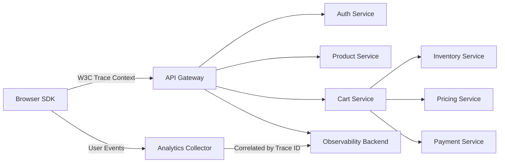

# How to Use OpenTelemetry to Track User Journey Analytics Across Services

Author: [nawazdhandala](https://www.github.com/nawazdhandala)

Tags: OpenTelemetry, User Journey, Analytics, Distributed Tracing, Observability, Frontend Monitoring

Description: Learn how to use OpenTelemetry to track complete user journeys across frontend and backend services, connecting page views, clicks, and API calls into unified traces.

---

Traditional analytics tools tell you what users did. They show you page views, click counts, and conversion funnels. But they rarely tell you why a user dropped off or what went wrong behind the scenes when a checkout took twelve seconds instead of two. OpenTelemetry bridges that gap by connecting frontend user interactions to the backend services that power them, giving you a single trace that follows a user from button click to database query and back.

In this guide, we will build a user journey tracking system using OpenTelemetry that spans the browser, API gateway, and backend services. You will be able to answer questions like "what happened in the backend when User X experienced a slow checkout?" without stitching together logs from five different systems.

## The User Journey Tracing Architecture

The key insight is that OpenTelemetry's context propagation works across service boundaries, including the boundary between your frontend and backend. When you start a trace in the browser, that trace context flows through every subsequent API call.



The browser SDK creates spans for user interactions and passes the trace context in HTTP headers. The backend services pick up that context and continue the trace, creating a complete picture from click to response.

## Frontend Instrumentation with OpenTelemetry Web SDK

Let us start with the browser. The OpenTelemetry Web SDK lets you instrument page loads, user clicks, and API calls from the frontend.

```javascript
// otel-browser.js - Browser-side OpenTelemetry configuration
import { WebTracerProvider } from '@opentelemetry/sdk-trace-web';
import { BatchSpanProcessor } from '@opentelemetry/sdk-trace-base';
import { OTLPTraceExporter } from '@opentelemetry/exporter-trace-otlp-http';
import { ZoneContextManager } from '@opentelemetry/context-zone';
import { registerInstrumentations } from '@opentelemetry/instrumentation';
import { getWebAutoInstrumentations } from '@opentelemetry/auto-instrumentations-web';
import { Resource } from '@opentelemetry/resources';

// Initialize the browser tracer
const provider = new WebTracerProvider({
    resource: new Resource({
        'service.name': 'web-frontend',
        'service.version': '2.1.0',
        'deployment.environment': 'production',
    }),
});

// Export spans to the collector via OTLP/HTTP
const exporter = new OTLPTraceExporter({
    url: 'https://otel-collector.example.com/v1/traces',
});

provider.addSpanProcessor(new BatchSpanProcessor(exporter, {
    maxQueueSize: 100,
    maxExportBatchSize: 30,
    scheduledDelayMillis: 5000, // Batch for 5 seconds before sending
}));

// ZoneContextManager maintains trace context across async operations
provider.register({
    contextManager: new ZoneContextManager(),
});

// Auto-instrument fetch/XHR calls and document load
registerInstrumentations({
    instrumentations: [
        getWebAutoInstrumentations({
            '@opentelemetry/instrumentation-fetch': {
                // Propagate trace context to your API domain
                propagateTraceHeaderCorsUrls: [/api\.example\.com/],
                // Add custom attributes to every fetch span
                applyCustomAttributesOnSpan: (span, request, result) => {
                    span.setAttribute('http.request.url_path',
                        new URL(request.url || request).pathname);
                },
            },
            '@opentelemetry/instrumentation-document-load': {
                enabled: true,
            },
        }),
    ],
});

export const tracer = provider.getTracer('user-journey');
```

The auto-instrumentation handles the common cases: page loads, fetch requests, and XMLHttpRequest calls. The `propagateTraceHeaderCorsUrls` setting is critical because it tells the SDK to include the `traceparent` header on API calls, which is how the backend connects its spans to the frontend trace.

## Tracking Custom User Journey Events

Auto-instrumentation gives you the network-level view, but user journeys are about intent. You need to capture what the user was trying to do, not just what HTTP calls were made.

```javascript
// journey-tracker.js - Custom user journey event tracking
import { tracer } from './otel-browser';
import { SpanStatusCode, context, trace } from '@opentelemetry/api';

class UserJourneyTracker {
    constructor() {
        this.activeJourneySpan = null;
        this.sessionId = this.generateSessionId();
    }

    generateSessionId() {
        return crypto.randomUUID();
    }

    // Start a named journey (e.g., "checkout", "product_search", "signup")
    startJourney(journeyName, attributes = {}) {
        // End any active journey first
        if (this.activeJourneySpan) {
            this.activeJourneySpan.end();
        }

        this.activeJourneySpan = tracer.startSpan(`journey.${journeyName}`, {
            attributes: {
                'user.session_id': this.sessionId,
                'journey.name': journeyName,
                'journey.started_at': new Date().toISOString(),
                ...attributes,
            },
        });

        return this.activeJourneySpan;
    }

    // Record a step within the current journey
    trackStep(stepName, attributes = {}) {
        if (!this.activeJourneySpan) {
            return null;
        }

        // Create child span within the journey context
        const journeyContext = trace.setSpan(
            context.active(),
            this.activeJourneySpan
        );

        const stepSpan = tracer.startSpan(
            `journey.step.${stepName}`,
            {
                attributes: {
                    'journey.step': stepName,
                    'user.session_id': this.sessionId,
                    ...attributes,
                },
            },
            journeyContext
        );

        return stepSpan;
    }

    // Track a user interaction like a button click or form submission
    trackInteraction(element, action, attributes = {}) {
        const span = this.trackStep(`interaction.${action}`, {
            'ui.element': element,
            'ui.action': action,
            ...attributes,
        });

        // Auto-end interaction spans since they are instantaneous
        if (span) {
            span.end();
        }
    }

    // Complete the current journey with a status
    completeJourney(success = true, attributes = {}) {
        if (!this.activeJourneySpan) return;

        this.activeJourneySpan.setAttributes({
            'journey.completed': true,
            'journey.success': success,
            'journey.completed_at': new Date().toISOString(),
            ...attributes,
        });

        this.activeJourneySpan.setStatus({
            code: success ? SpanStatusCode.OK : SpanStatusCode.ERROR,
        });

        this.activeJourneySpan.end();
        this.activeJourneySpan = null;
    }
}

export const journeyTracker = new UserJourneyTracker();
```

This tracker creates a parent span for each user journey and nests individual steps beneath it. In your tracing backend, you will see a tree structure that shows the full journey: the user clicked "Add to Cart", viewed the cart, started checkout, entered payment details, and completed the purchase, with every API call nested under the appropriate step.

## Integrating Journey Tracking into Your UI

Here is how you would wire the journey tracker into a React checkout flow:

```javascript
// CheckoutPage.jsx - React component with journey tracking
import { journeyTracker } from './journey-tracker';
import { useEffect } from 'react';

function CheckoutPage({ cartItems, userId }) {
    useEffect(() => {
        // Start a checkout journey when the page mounts
        journeyTracker.startJourney('checkout', {
            'user.id': userId,
            'cart.item_count': cartItems.length,
            'cart.total_value': cartItems.reduce((sum, i) => sum + i.price, 0),
        });

        // Clean up if user navigates away without completing
        return () => {
            journeyTracker.completeJourney(false, {
                'journey.abandon_reason': 'navigation',
            });
        };
    }, []);

    async function handlePayment(paymentDetails) {
        // Track the payment step with its own span
        const paymentSpan = journeyTracker.trackStep('payment_submission', {
            'payment.method': paymentDetails.method,
        });

        try {
            const result = await fetch('/api/checkout', {
                method: 'POST',
                headers: { 'Content-Type': 'application/json' },
                body: JSON.stringify({ cartItems, paymentDetails }),
            });

            if (result.ok) {
                paymentSpan.setStatus({ code: SpanStatusCode.OK });
                paymentSpan.end();

                // Mark the journey as successfully completed
                journeyTracker.completeJourney(true, {
                    'order.id': (await result.json()).orderId,
                });
            } else {
                throw new Error(`Payment failed: ${result.status}`);
            }
        } catch (error) {
            paymentSpan.recordException(error);
            paymentSpan.setStatus({
                code: SpanStatusCode.ERROR,
                message: error.message,
            });
            paymentSpan.end();
        }
    }

    // ... render checkout UI
}
```

When the checkout API call is made via `fetch`, the OpenTelemetry auto-instrumentation automatically attaches the trace context. The backend receives the `traceparent` header and continues the same trace, so the payment processing spans appear as children of the frontend checkout journey.

## Backend Correlation with User Journey Context

On the backend, you need to extract and enrich the trace with server-side context. Here is a Node.js Express example:

```javascript
// checkout-handler.js - Backend handler that continues the frontend trace
const { trace, SpanStatusCode } = require('@opentelemetry/api');

const tracer = trace.getTracer('checkout-service');

async function handleCheckout(req, res) {
    // The trace context is automatically propagated from the frontend
    // via the W3C traceparent header. The SDK picks it up automatically.

    const span = trace.getActiveSpan();

    // Enrich the trace with backend-specific attributes
    span.setAttributes({
        'user.id': req.user.id,
        'checkout.item_count': req.body.cartItems.length,
        'checkout.payment_method': req.body.paymentDetails.method,
    });

    // Validate inventory across all items
    const inventorySpan = tracer.startSpan('validate_inventory');
    const inventoryResult = await inventoryService.checkAll(req.body.cartItems);
    inventorySpan.setAttribute('inventory.all_available', inventoryResult.allAvailable);
    inventorySpan.end();

    if (!inventoryResult.allAvailable) {
        span.addEvent('checkout_blocked', {
            reason: 'inventory_unavailable',
            'unavailable_items': inventoryResult.unavailableItems.join(','),
        });
        return res.status(409).json({ error: 'Some items are no longer available' });
    }

    // Process payment
    const paymentSpan = tracer.startSpan('process_payment');
    try {
        const payment = await paymentService.charge({
            userId: req.user.id,
            amount: calculateTotal(req.body.cartItems),
            method: req.body.paymentDetails,
        });

        paymentSpan.setAttribute('payment.transaction_id', payment.transactionId);
        paymentSpan.setStatus({ code: SpanStatusCode.OK });
        paymentSpan.end();

        // Add a journey completion event to the trace
        span.addEvent('journey_completed', {
            'order.id': payment.orderId,
            'payment.transaction_id': payment.transactionId,
        });

        return res.json({ orderId: payment.orderId });
    } catch (error) {
        paymentSpan.recordException(error);
        paymentSpan.setStatus({ code: SpanStatusCode.ERROR });
        paymentSpan.end();

        throw error;
    }
}
```

The trace now tells a complete story. Starting from the browser, you can see the user loaded the checkout page, entered their payment details, clicked submit, and then follow the request through inventory validation and payment processing on the backend. If the payment was slow, you can drill into the payment service span to see exactly where the time was spent.

## Analyzing User Journeys in Your Observability Backend

Once the data is flowing, you can query your traces to answer business-critical questions:

- **Conversion funnel analysis**: Query for all `journey.checkout` spans and group by `journey.success` to see your real completion rate, including cases where the backend failed
- **Drop-off analysis**: Filter for journeys where `journey.completed` is false and look at the last step that has a span to see where users are leaving
- **Performance impact on conversion**: Correlate journey success rate with journey duration to quantify how latency affects your business
- **Error attribution**: Find failed journeys, follow the trace into the backend, and see exactly which service or database query caused the failure

## Privacy Considerations

When tracking user journeys, be careful about what you include in span attributes. Avoid capturing personally identifiable information (PII) in traces. Use anonymized user IDs, do not log form field contents, and make sure your sampling configuration does not accidentally retain sensitive data. OpenTelemetry's attribute processing in the Collector is a good place to scrub or hash any attributes that might contain PII before they reach your backend.

## Conclusion

User journey analytics with OpenTelemetry goes beyond traditional analytics by connecting the user experience to the technical reality of your backend services. Instead of treating frontend analytics and backend observability as separate concerns, you get a unified view that shows you exactly what happened, from the user's perspective and from the system's perspective, for every interaction. Start by instrumenting your most critical user flows, like checkout or signup, and expand from there as you see the value of correlated journey data.
