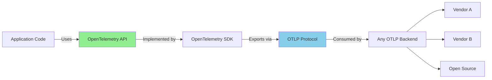

# How to Understand OpenTelemetry Vendor-Neutral Instrumentation

Author: [nawazdhandala](https://www.github.com/nawazdhandala)

Tags: OpenTelemetry, Vendor Neutral, Instrumentation, Portability, Standards

Description: An in-depth look at why OpenTelemetry's vendor-neutral approach matters and how it provides true portability for your observability instrumentation.

Vendor lock-in has plagued observability for years. You instrument your code with a vendor's SDK, and switching providers means rewriting every line of instrumentation. OpenTelemetry breaks this cycle by separating instrumentation from the backend.

Understanding vendor neutrality isn't just about philosophical purity. It's about making practical engineering decisions that won't paint you into a corner six months from now.

## What Vendor-Neutral Actually Means

Vendor-neutral instrumentation separates three concerns: creating telemetry, processing telemetry, and storing telemetry. Each layer has standard interfaces that different implementations can satisfy.

Your application code uses OpenTelemetry APIs to create spans, metrics, and logs. These APIs don't know or care where the data ends up. They expose a standard interface for instrumentation.

The SDK layer implements those APIs and handles data processing. It formats telemetry according to standard protocols and exports to configured destinations. You can swap SDKs without changing application code.

The backend receives telemetry through standard protocols (primarily OTLP, the OpenTelemetry Protocol). Any backend that speaks OTLP can receive your telemetry. Switching backends requires configuration changes, not code changes.

This separation means you can change any layer independently. Upgrade your SDK without touching application code. Switch backends without modifying instrumentation. Add new exporters without reimplementing telemetry collection.



## Contrast with Vendor-Specific Instrumentation

Vendor-specific SDKs tightly couple instrumentation to the backend. Datadog's SDK creates Datadog-specific spans. New Relic's agent produces New Relic telemetry. Switching vendors means replacing all instrumentation.

These vendor SDKs optimize for their backend's features. They might capture telemetry that OpenTelemetry doesn't standardize yet. But this optimization comes at the cost of portability.

Here's what vendor lock-in looks like:

```python
# Vendor-specific instrumentation (example with fictional VendorX)
from vendorx import trace

@trace.instrument()
def process_order(order_id):
    span = trace.current_span()
    span.add_tag("order.id", order_id)
    span.add_tag("order.priority", "high")

    # Vendor-specific features
    span.set_vendorx_metadata({"team": "orders"})

    result = do_processing()

    span.add_metric("processing_time", result.duration)
    return result
```

If you decide to switch from VendorX to VendorY, every instrumented function needs changes. The decorators are different. The API for adding tags differs. Vendor-specific features don't exist in VendorY.

With OpenTelemetry:

```python
# OpenTelemetry instrumentation
from opentelemetry import trace

tracer = trace.get_tracer(__name__)

@tracer.start_as_current_span("process_order")
def process_order(order_id):
    span = trace.get_current_span()
    span.set_attribute("order.id", order_id)
    span.set_attribute("order.priority", "high")

    # Standard attributes that any backend understands
    span.set_attribute("team", "orders")

    result = do_processing()

    # Metrics are separate from spans in OpenTelemetry
    # Record via the metrics API
    return result
```

Switching backends means changing configuration, not code. The instrumentation works with any OTLP-compatible backend.

## The Role of Semantic Conventions

Vendor neutrality only works if everyone agrees on attribute names and meanings. OpenTelemetry defines semantic conventions: standard names for common attributes.

For HTTP requests, semantic conventions specify attribute names like `http.method`, `http.status_code`, and `http.target`. Every SDK and backend understands these names.

Without conventions, one vendor might use `http_method` while another uses `request.method`. Your queries and dashboards would break when switching vendors.

Semantic conventions cover:

- HTTP client and server interactions
- Database queries (SQL, NoSQL)
- RPC calls (gRPC, Thrift)
- Messaging systems (Kafka, RabbitMQ)
- Cloud provider resources
- Kubernetes resources

Using semantic conventions means your telemetry is portable and queryable across backends:

```python
from opentelemetry import trace
from opentelemetry.semconv.trace import SpanAttributes

tracer = trace.get_tracer(__name__)

def make_http_request(url, method):
    with tracer.start_as_current_span("http_request") as span:
        # Use semantic conventions
        span.set_attribute(SpanAttributes.HTTP_METHOD, method)
        span.set_attribute(SpanAttributes.HTTP_URL, url)

        response = requests.request(method, url)

        span.set_attribute(SpanAttributes.HTTP_STATUS_CODE, response.status_code)
        span.set_attribute(SpanAttributes.HTTP_RESPONSE_CONTENT_LENGTH, len(response.content))

        return response
```

Any backend receiving this span knows exactly what these attributes mean. You can write queries using standard attribute names that work across vendors.

## OTLP: The Universal Protocol

The OpenTelemetry Protocol (OTLP) is the wire format for telemetry. It defines how traces, metrics, and logs are serialized and transmitted.

OTLP supports both HTTP and gRPC transports. It uses Protocol Buffers for efficient serialization. The format is versioned and backward compatible.

Any observability backend that supports OTLP can receive OpenTelemetry data. Most major vendors added OTLP support over the past few years. Open-source tools like Jaeger, Prometheus, and Loki have OTLP receivers.

OTLP makes the OpenTelemetry Collector possible. The Collector receives OTLP data, processes it, and exports to multiple destinations. You can send telemetry to multiple backends simultaneously:

```yaml
# OpenTelemetry Collector config exporting to multiple vendors
receivers:
  otlp:
    protocols:
      http:
      grpc:

processors:
  batch:

exporters:
  otlp/vendor-a:
    endpoint: https://api.vendora.com
    headers:
      authorization: Bearer ${VENDOR_A_TOKEN}

  otlp/vendor-b:
    endpoint: https://ingest.vendorb.com
    headers:
      x-api-key: ${VENDOR_B_KEY}

  prometheus:
    endpoint: "prometheus:9090"

service:
  pipelines:
    traces:
      receivers: [otlp]
      processors: [batch]
      exporters: [otlp/vendor-a, otlp/vendor-b]

    metrics:
      receivers: [otlp]
      processors: [batch]
      exporters: [otlp/vendor-a, prometheus]
```

Your application exports OTLP to the Collector. The Collector forwards to multiple backends. Switching backends means updating Collector configuration, not application code.

## Practical Portability Benefits

Vendor neutrality delivers concrete benefits beyond theoretical flexibility.

You can evaluate backends without reinstrumenting. Spin up a trial account, point your Collector at it, and compare backends using real production data. No code changes required.

Multi-backend strategies become feasible. Send high-cardinality metrics to one vendor optimized for that, and send traces to another vendor with better visualization. The same instrumentation feeds both.

Gradual migrations are less risky. Instead of a big-bang switch, configure dual exporting. Send data to both old and new backends. Verify the new backend works, then remove the old exporter.

Open-source evaluation is easier. Want to try Jaeger or Tempo? Point your OTLP exporter at them. No need to add vendor-specific libraries or recompile.

```python
# Configuration-based backend switching
# No code changes needed

# Development: Export to local Jaeger
# os.environ['OTEL_EXPORTER_OTLP_ENDPOINT'] = 'http://localhost:4318'

# Staging: Export to managed vendor
# os.environ['OTEL_EXPORTER_OTLP_ENDPOINT'] = 'https://api.staging-vendor.com'
# os.environ['OTEL_EXPORTER_OTLP_HEADERS'] = 'x-api-key=staging-key'

# Production: Export to Collector (which handles multi-backend)
# os.environ['OTEL_EXPORTER_OTLP_ENDPOINT'] = 'http://otel-collector:4318'

# Application code remains identical across environments
from opentelemetry import trace

tracer = trace.get_tracer(__name__)

@tracer.start_as_current_span("business_logic")
def business_logic():
    # This works regardless of backend
    span = trace.get_current_span()
    span.set_attribute("custom.attribute", "value")
```

## Limitations of Vendor Neutrality

Vendor neutrality doesn't mean all backends are identical. Each backend has unique features that OpenTelemetry can't fully abstract.

Querying languages differ. Honeycomb uses a different query syntax than Grafana. Learning a new backend requires learning its query language and UI.

Visualization capabilities vary. Some vendors excel at service maps, others at log correlation. You might miss features from your previous vendor.

Vendor-specific features don't map to OpenTelemetry. If a vendor offers custom span types or proprietary sampling algorithms, you can't use those through standard OpenTelemetry.

Cost models differ significantly. One vendor might charge by span count, another by ingested bytes, another by query volume. Your usage patterns might be cheap on one backend and expensive on another.

These limitations don't negate vendor neutrality's value. They mean you still need to evaluate backends carefully. But you evaluate based on features and cost, not how hard it is to switch.

## Using Vendor Distributions

Some vendors provide OpenTelemetry distributions: pre-configured SDKs optimized for their platform. These distributions are still OpenTelemetry, just with convenient defaults.

Vendor distributions might include:

- Pre-configured exporters for their backend
- Optimized sampling strategies
- Additional instrumentation libraries
- Performance tuning for their platform

Using a vendor distribution doesn't lock you in. The instrumentation code uses standard OpenTelemetry APIs. If you switch vendors, change the SDK to a different distribution or the vanilla OpenTelemetry SDK.

```javascript
// Using a vendor distribution
const { NodeSDK } = require('@vendorx/opentelemetry-node');

const sdk = new NodeSDK({
  // Vendor-optimized configuration
  // But still exports standard OTLP
});

sdk.start();

// Application code uses standard OpenTelemetry API
const { trace } = require('@opentelemetry/api');
const tracer = trace.getTracer('my-service');
```

The API imports come from `@opentelemetry/api`, not the vendor package. Your application code remains portable even when using vendor distributions.

## Context Propagation Standards

Vendor neutrality extends to distributed tracing context. OpenTelemetry uses W3C Trace Context, a web standard for propagating trace IDs across service boundaries.

Before W3C Trace Context, each vendor used proprietary headers. Zipkin used `X-B3-TraceId`. Jaeger used `uber-trace-id`. Cross-vendor tracing was impossible.

W3C Trace Context defines standard HTTP headers: `traceparent` and `tracestate`. Any system that understands these headers can participate in distributed traces, regardless of vendor.

```python
# OpenTelemetry automatically propagates W3C Trace Context
from opentelemetry import trace
from opentelemetry.propagate import inject
import requests

tracer = trace.get_tracer(__name__)

def call_downstream_service():
    with tracer.start_as_current_span("upstream_request"):
        headers = {}
        # Inject trace context into headers
        inject(headers)

        # The traceparent header is automatically added
        # Any downstream service can continue the trace
        response = requests.get("http://downstream-service/api", headers=headers)

        return response
```

The downstream service might use a different OpenTelemetry SDK version, a different language, or even a different backend. The trace remains connected through standard context propagation.

## Building Vendor-Neutral Abstractions

Even with OpenTelemetry, you might want application-specific abstractions. These abstractions should be vendor-neutral too.

Instead of coupling to a specific backend's features, use OpenTelemetry primitives:

```python
# Good: Vendor-neutral abstraction
from opentelemetry import trace

class OrderTracer:
    def __init__(self):
        self.tracer = trace.get_tracer(__name__)

    def trace_order_processing(self, order_id, func):
        with self.tracer.start_as_current_span("process_order") as span:
            span.set_attribute("order.id", order_id)

            try:
                result = func()
                span.set_attribute("order.status", "success")
                return result
            except Exception as e:
                span.set_attribute("order.status", "failed")
                span.record_exception(e)
                raise
```

This abstraction works with any OpenTelemetry backend. It uses standard APIs and semantic conventions.

## Cost Implications

Vendor neutrality affects costs in subtle ways. You can shop around for the best pricing, but you need to understand different cost models.

Some vendors charge by span volume. Others by data ingested. Still others by query count. The "cheapest" vendor depends on your usage pattern.

Sampling strategies become crucial. You might sample aggressively for a low-volume backend and sample less for one optimized for high cardinality.

The OpenTelemetry Collector enables cost-aware routing:

```yaml
# Route expensive high-cardinality data to specialized backend
# Send standard traces to cost-effective backend

exporters:
  otlp/cost-effective:
    endpoint: https://cheap-vendor.com

  otlp/high-cardinality:
    endpoint: https://expensive-vendor.com

processors:
  # Filter processor sends only high-cardinality spans to expensive backend
  filter/high-cardinality:
    spans:
      include:
        match_type: regexp
        attributes:
          - key: high_cardinality
            value: "true"

service:
  pipelines:
    traces/standard:
      receivers: [otlp]
      processors: [batch]
      exporters: [otlp/cost-effective]

    traces/high-cardinality:
      receivers: [otlp]
      processors: [filter/high-cardinality, batch]
      exporters: [otlp/high-cardinality]
```

This level of cost optimization is only possible with vendor-neutral instrumentation.

## Future-Proofing Your Instrumentation

Technology changes. The observability vendor you choose today might not exist in five years. Or their pricing might become untenable. Or a better option might emerge.

Vendor-neutral instrumentation means you're not betting your telemetry strategy on a single vendor's survival. You can adapt to market changes without rewriting application code.

New telemetry signals are emerging. Profiling, session replay, and real user monitoring are becoming standard. OpenTelemetry will standardize these signals over time. When they stabilize, your existing instrumentation can emit these new signals through SDK updates, not application changes.

The investment in OpenTelemetry instrumentation pays dividends over years. You instrument once using standards, then evolve your backend strategy as needs and options change.

Vendor neutrality isn't about distrusting vendors. Many vendors contribute heavily to OpenTelemetry. It's about making pragmatic engineering decisions that preserve flexibility. Your observability instrumentation should outlast any single backend choice.

Understanding vendor neutrality helps you make better decisions. You know what's portable and what's not. You know where you have flexibility and where you're making vendor-specific choices. That clarity leads to better architecture and less regret down the road.