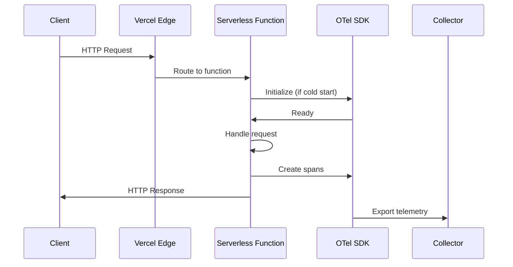
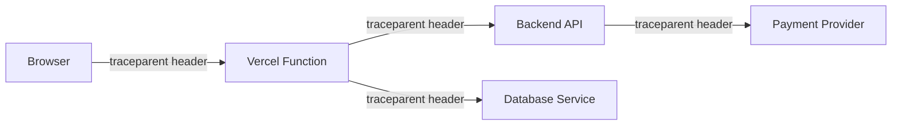

# How to Instrument Vercel Serverless Functions with OpenTelemetry

Author: [nawazdhandala](https://www.github.com/nawazdhandala)

Tags: OpenTelemetry, Vercel, Serverless, Next.js, Tracing, Edge Functions

Description: Learn how to add OpenTelemetry instrumentation to Vercel serverless functions for distributed tracing, metrics collection, and full observability.

---

Vercel makes deploying frontend applications and serverless APIs incredibly easy. But once your functions are running in production, understanding what happens inside them is a different story. Cold starts, third-party API calls, database queries - these all affect your users and you need visibility into them.

OpenTelemetry provides a standardized way to instrument your Vercel serverless functions. Whether you're running Next.js API routes, standalone serverless functions, or edge functions, you can capture traces and metrics without locking yourself into a specific vendor.

## How Vercel Serverless Functions Work

Before we dig into the instrumentation, it helps to understand how Vercel executes your functions. Each serverless function runs in an isolated environment. The function boots up, handles the request, and may stay warm for subsequent requests or get recycled.



The important thing to note is that the function might be terminated right after sending the response. This means we need to be careful about how and when we export telemetry data.

## Setting Up OpenTelemetry with Next.js on Vercel

If you're using Next.js (which is the most common framework on Vercel), there's built-in support for OpenTelemetry starting from version 13.4. Let's set it up.

Install the required packages first. The `@vercel/otel` package provides a thin wrapper that handles the serverless-specific concerns for you.

```bash
# Install OpenTelemetry packages for Next.js on Vercel
npm install @vercel/otel @opentelemetry/sdk-node \
  @opentelemetry/exporter-trace-otlp-http \
  @opentelemetry/resources \
  @opentelemetry/semantic-conventions
```

Create an instrumentation file at the root of your project. Next.js automatically loads this file when the `instrumentationHook` experimental feature is enabled.

```typescript
// instrumentation.ts - OpenTelemetry setup for Next.js on Vercel
// This file is automatically loaded by Next.js when instrumentation is enabled

import { registerOTel } from '@vercel/otel';

export function register() {
  // Register OpenTelemetry with your service name
  // The @vercel/otel package handles the serverless lifecycle automatically
  registerOTel({
    serviceName: process.env.OTEL_SERVICE_NAME || 'my-vercel-app',
  });
}
```

Enable the instrumentation hook in your Next.js configuration:

```javascript
// next.config.js - Enable OpenTelemetry instrumentation hook
/** @type {import('next').NextConfig} */
const nextConfig = {
  experimental: {
    instrumentationHook: true,
  },
};

module.exports = nextConfig;
```

## Custom Configuration with OTLP Exporter

The `@vercel/otel` package is convenient, but you might need more control over the exporter configuration. Here's how to set up a custom OpenTelemetry configuration that sends data to any OTLP-compatible backend.

```typescript
// instrumentation.ts - Custom OpenTelemetry configuration for Vercel
import { NodeSDK } from '@opentelemetry/sdk-node';
import { OTLPTraceExporter } from '@opentelemetry/exporter-trace-otlp-http';
import { Resource } from '@opentelemetry/resources';
import { ATTR_SERVICE_NAME } from '@opentelemetry/semantic-conventions';
import { SimpleSpanProcessor } from '@opentelemetry/sdk-trace-base';

export function register() {
  // Use SimpleSpanProcessor instead of BatchSpanProcessor for serverless
  // This ensures spans are exported immediately rather than batched,
  // which is important because the function may be terminated after response
  const exporter = new OTLPTraceExporter({
    url: process.env.OTEL_EXPORTER_OTLP_ENDPOINT + '/v1/traces',
    headers: {
      // Add authentication headers for your backend
      'x-oneuptime-token': process.env.ONEUPTIME_TOKEN || '',
    },
  });

  const sdk = new NodeSDK({
    resource: new Resource({
      [ATTR_SERVICE_NAME]: 'my-vercel-app',
      'deployment.environment': process.env.VERCEL_ENV || 'development',
      'vercel.region': process.env.VERCEL_REGION || 'unknown',
    }),
    spanProcessor: new SimpleSpanProcessor(exporter),
  });

  sdk.start();
}
```

Notice we're using `SimpleSpanProcessor` instead of `BatchSpanProcessor`. In serverless environments, batching can lead to data loss because the function might be frozen or terminated before the batch is flushed. `SimpleSpanProcessor` exports each span immediately after it ends.

## Instrumenting API Routes

With the SDK initialized, your Next.js API routes will automatically get basic HTTP span instrumentation. But you'll likely want to add custom spans for your business logic.

```typescript
// app/api/users/route.ts - Instrumented API route with custom spans
import { trace } from '@opentelemetry/api';
import { NextResponse } from 'next/server';

// Get a tracer for the users API module
const tracer = trace.getTracer('my-vercel-app.api.users');

export async function GET(request: Request) {
  // Create a span that wraps the entire handler logic
  return tracer.startActiveSpan('get-users', async (span) => {
    try {
      // Add request context as span attributes
      const url = new URL(request.url);
      span.setAttribute('query.page', url.searchParams.get('page') || '1');

      // Trace the database call as a child span
      const users = await tracer.startActiveSpan('fetch-users-from-db', async (dbSpan) => {
        const result = await fetchUsersFromDatabase();
        dbSpan.setAttribute('db.result_count', result.length);
        dbSpan.end();
        return result;
      });

      span.setAttribute('response.user_count', users.length);
      return NextResponse.json({ users });
    } catch (error) {
      // Record the error so it shows up in your trace viewer
      span.recordException(error as Error);
      span.setStatus({ code: 2, message: (error as Error).message });
      return NextResponse.json({ error: 'Internal Server Error' }, { status: 500 });
    } finally {
      span.end();
    }
  });
}
```

## Instrumenting Standalone Serverless Functions

If you're not using Next.js and instead have standalone Vercel serverless functions, you need to set up the SDK differently. Create a shared initialization module.

```typescript
// lib/telemetry.ts - Shared OpenTelemetry init for standalone Vercel functions
import { NodeSDK } from '@opentelemetry/sdk-node';
import { OTLPTraceExporter } from '@opentelemetry/exporter-trace-otlp-http';
import { Resource } from '@opentelemetry/resources';
import { SimpleSpanProcessor } from '@opentelemetry/sdk-trace-base';

let sdk: NodeSDK | null = null;

// Initialize the SDK once and reuse across warm invocations
export function initTelemetry() {
  if (sdk) return;

  const exporter = new OTLPTraceExporter({
    url: process.env.OTEL_EXPORTER_OTLP_ENDPOINT + '/v1/traces',
  });

  sdk = new NodeSDK({
    resource: new Resource({
      'service.name': 'my-vercel-functions',
      'faas.name': process.env.VERCEL_URL || 'unknown',
    }),
    spanProcessor: new SimpleSpanProcessor(exporter),
  });

  sdk.start();
}

// Force flush all pending spans - call this before the function returns
export async function flushTelemetry() {
  if (sdk) {
    await sdk.shutdown();
    sdk = null;
  }
}
```

Then use it in your function handler:

```typescript
// api/process-payment.ts - Standalone Vercel function with telemetry
import type { VercelRequest, VercelResponse } from '@vercel/node';
import { trace } from '@opentelemetry/api';
import { initTelemetry, flushTelemetry } from '../lib/telemetry';

// Initialize telemetry on cold start
initTelemetry();

const tracer = trace.getTracer('payment-service');

export default async function handler(req: VercelRequest, res: VercelResponse) {
  return tracer.startActiveSpan('process-payment', async (span) => {
    try {
      span.setAttribute('payment.method', req.body.method);
      span.setAttribute('payment.amount', req.body.amount);

      const result = await chargeCustomer(req.body);
      span.setAttribute('payment.status', result.status);

      res.status(200).json(result);
    } catch (error) {
      span.recordException(error as Error);
      span.setStatus({ code: 2 });
      res.status(500).json({ error: 'Payment failed' });
    } finally {
      span.end();
      // Flush telemetry before the function completes
      await flushTelemetry();
    }
  });
}
```

## Environment Variables on Vercel

Configure the following environment variables in your Vercel project settings. Go to your project dashboard, then Settings, then Environment Variables.

```bash
# Required: The endpoint of your OpenTelemetry collector
OTEL_EXPORTER_OTLP_ENDPOINT=https://your-collector.example.com

# Required: A name to identify your service in traces
OTEL_SERVICE_NAME=my-vercel-app

# Optional: Authentication token for your backend
ONEUPTIME_TOKEN=your-token-here
```

You can set different values per environment (Production, Preview, Development), which is helpful for routing telemetry from staging deployments to a separate backend.

## Trace Propagation Across Services

If your Vercel functions call other backend services, you want the trace context to propagate so you can see the full request lifecycle. The OpenTelemetry SDK automatically injects trace headers into outgoing HTTP requests when using the standard `fetch` API or libraries like `axios`.



Make sure the receiving services also have OpenTelemetry configured to extract these headers. The W3C Trace Context format is used by default.

## Performance Considerations

Serverless functions are sensitive to cold start times. The OpenTelemetry SDK adds some initialization overhead, but there are ways to minimize it.

- Use `@vercel/otel` when possible since it's optimized for Vercel's runtime
- Avoid loading unnecessary instrumentations. If you're not using gRPC, don't include the gRPC instrumentation
- Use `SimpleSpanProcessor` to avoid background timers that can interfere with function freezing
- Keep your span count reasonable. Don't create a span for every line of code

## Summary

Instrumenting Vercel serverless functions with OpenTelemetry requires some adjustments compared to traditional server applications. The main differences are using `SimpleSpanProcessor` instead of batch processing, flushing telemetry before the function completes, and being mindful of cold start overhead.

With this setup, you get distributed traces that show exactly what happens inside your serverless functions. You can track latency, find errors, and understand dependencies across your entire system - all without being tied to a single observability vendor.
