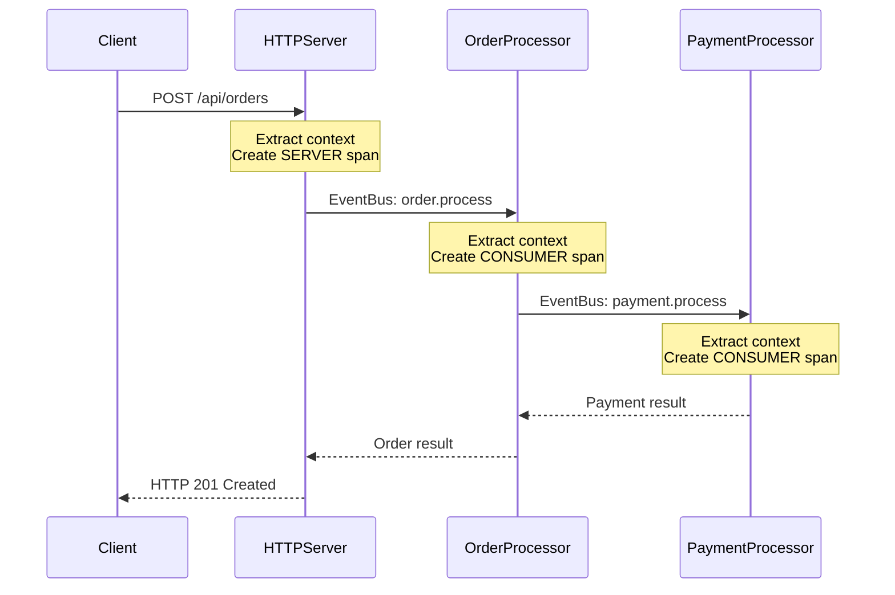

# How to Use OpenTelemetry with Vert.x in Java Applications

Author: [nawazdhandala](https://www.github.com/nawazdhandala)

Tags: OpenTelemetry, Vert.x, Java, Reactive, Event-Driven, Tracing

Description: Master OpenTelemetry instrumentation for Vert.x applications, including event bus tracing, HTTP client and server monitoring, and context propagation in reactive pipelines.

Vert.x is a reactive toolkit for building high-performance, event-driven applications on the JVM. Its asynchronous, non-blocking architecture presents unique challenges for distributed tracing. OpenTelemetry must work across event bus messages, HTTP requests, and complex reactive pipelines while respecting Vert.x's threading model.

This guide demonstrates how to instrument Vert.x applications with OpenTelemetry, maintaining trace context throughout your reactive flows.

## Understanding Vert.x's Threading Model

Vert.x uses event loops and a small number of threads to handle massive concurrency. Unlike traditional thread-per-request models, Vert.x multiplexes many operations onto few threads. This means traditional ThreadLocal-based context propagation fails.

OpenTelemetry's Context API can work with Vert.x, but it requires careful integration with Vert.x's context mechanism. Each verticle and event loop maintains its own context, and we must bridge OpenTelemetry context with Vert.x context.

## Project Dependencies

Add these dependencies to your pom.xml:

```xml
<!-- Vert.x core -->
<dependency>
    <groupId>io.vertx</groupId>
    <artifactId>vertx-core</artifactId>
    <version>4.5.1</version>
</dependency>

<!-- Vert.x Web for HTTP routing -->
<dependency>
    <groupId>io.vertx</groupId>
    <artifactId>vertx-web</artifactId>
    <version>4.5.1</version>
</dependency>

<!-- Vert.x Web Client -->
<dependency>
    <groupId>io.vertx</groupId>
    <artifactId>vertx-web-client</artifactId>
    <version>4.5.1</version>
</dependency>

<!-- OpenTelemetry core -->
<dependency>
    <groupId>io.opentelemetry</groupId>
    <artifactId>opentelemetry-api</artifactId>
    <version>1.34.1</version>
</dependency>

<dependency>
    <groupId>io.opentelemetry</groupId>
    <artifactId>opentelemetry-sdk</artifactId>
    <version>1.34.1</version>
</dependency>

<!-- OpenTelemetry exporters -->
<dependency>
    <groupId>io.opentelemetry</groupId>
    <artifactId>opentelemetry-exporter-otlp</artifactId>
    <version>1.34.1</version>
</dependency>
```

## Initializing OpenTelemetry

Create a configuration class to initialize OpenTelemetry with OTLP export:

```java
import io.opentelemetry.api.OpenTelemetry;
import io.opentelemetry.api.trace.Tracer;
import io.opentelemetry.api.trace.propagation.W3CTraceContextPropagator;
import io.opentelemetry.context.propagation.ContextPropagators;
import io.opentelemetry.exporter.otlp.trace.OtlpGrpcSpanExporter;
import io.opentelemetry.sdk.OpenTelemetrySdk;
import io.opentelemetry.sdk.resources.Resource;
import io.opentelemetry.sdk.trace.SdkTracerProvider;
import io.opentelemetry.sdk.trace.export.BatchSpanProcessor;
import io.opentelemetry.semconv.ResourceAttributes;

public class OpenTelemetryConfig {

    private static OpenTelemetry openTelemetry;
    private static Tracer tracer;

    public static void initialize(String serviceName) {
        // Create resource attributes identifying this service
        Resource resource = Resource.getDefault()
            .merge(Resource.builder()
                .put(ResourceAttributes.SERVICE_NAME, serviceName)
                .put(ResourceAttributes.SERVICE_VERSION, "1.0.0")
                .build());

        // Configure OTLP exporter
        OtlpGrpcSpanExporter spanExporter = OtlpGrpcSpanExporter.builder()
            .setEndpoint("http://localhost:4317")
            .build();

        // Build tracer provider with batch processor
        SdkTracerProvider tracerProvider = SdkTracerProvider.builder()
            .setResource(resource)
            .addSpanProcessor(BatchSpanProcessor.builder(spanExporter).build())
            .build();

        // Initialize OpenTelemetry SDK
        openTelemetry = OpenTelemetrySdk.builder()
            .setTracerProvider(tracerProvider)
            .setPropagators(ContextPropagators.create(
                W3CTraceContextPropagator.getInstance()))
            .buildAndRegisterGlobal();

        tracer = openTelemetry.getTracer(serviceName, "1.0.0");
    }

    public static OpenTelemetry getOpenTelemetry() {
        return openTelemetry;
    }

    public static Tracer getTracer() {
        return tracer;
    }
}
```

This configuration sets up OTLP export with W3C trace context propagation.

## Creating a Context Propagation Utility

Build a utility class that bridges OpenTelemetry context with Vert.x context:

```java
import io.opentelemetry.api.trace.Span;
import io.opentelemetry.api.trace.SpanKind;
import io.opentelemetry.api.trace.StatusCode;
import io.opentelemetry.api.trace.Tracer;
import io.opentelemetry.context.Context;
import io.opentelemetry.context.Scope;
import io.vertx.core.Future;
import io.vertx.core.Promise;

import java.util.function.Function;
import java.util.function.Supplier;

public class TracingHelper {

    private static final String OTEL_CONTEXT_KEY = "__otel_context__";

    // Store OpenTelemetry context in Vert.x context
    public static void storeContext(io.vertx.core.Context vertxContext, Context otelContext) {
        if (vertxContext != null) {
            vertxContext.putLocal(OTEL_CONTEXT_KEY, otelContext);
        }
    }

    // Retrieve OpenTelemetry context from Vert.x context
    public static Context getContext(io.vertx.core.Context vertxContext) {
        if (vertxContext != null) {
            Context ctx = vertxContext.getLocal(OTEL_CONTEXT_KEY);
            return ctx != null ? ctx : Context.current();
        }
        return Context.current();
    }

    // Execute code with active span
    public static <T> Future<T> traceAsync(
            io.vertx.core.Context vertxContext,
            Tracer tracer,
            String spanName,
            SpanKind spanKind,
            Function<Span, Future<T>> operation) {

        // Get parent context
        Context parentContext = getContext(vertxContext);

        // Start new span
        Span span = tracer.spanBuilder(spanName)
            .setParent(parentContext)
            .setSpanKind(spanKind)
            .startSpan();

        // Create new context with this span
        Context contextWithSpan = parentContext.with(span);

        // Store in Vert.x context
        storeContext(vertxContext, contextWithSpan);

        // Make span current
        try (Scope scope = contextWithSpan.makeCurrent()) {
            return operation.apply(span)
                .onSuccess(result -> {
                    span.setStatus(StatusCode.OK);
                    span.end();
                })
                .onFailure(error -> {
                    span.setStatus(StatusCode.ERROR, error.getMessage());
                    span.recordException(error);
                    span.end();
                });
        } catch (Exception e) {
            span.setStatus(StatusCode.ERROR, e.getMessage());
            span.recordException(e);
            span.end();
            return Future.failedFuture(e);
        }
    }

    // Simplified version for internal spans
    public static <T> Future<T> trace(
            io.vertx.core.Context vertxContext,
            Tracer tracer,
            String spanName,
            Function<Span, Future<T>> operation) {
        return traceAsync(vertxContext, tracer, spanName, SpanKind.INTERNAL, operation);
    }
}
```

This utility handles the complexity of context storage and span lifecycle management.

## Instrumenting HTTP Server

Create a traced HTTP server with request/response instrumentation:

```java
import io.opentelemetry.api.trace.Span;
import io.opentelemetry.api.trace.SpanKind;
import io.opentelemetry.api.trace.StatusCode;
import io.opentelemetry.context.Context;
import io.opentelemetry.context.Scope;
import io.opentelemetry.context.propagation.TextMapGetter;
import io.vertx.core.AbstractVerticle;
import io.vertx.core.Future;
import io.vertx.core.Promise;
import io.vertx.core.http.HttpServerRequest;
import io.vertx.ext.web.Router;
import io.vertx.ext.web.RoutingContext;

public class TracedHttpServerVerticle extends AbstractVerticle {

    @Override
    public void start(Promise<Void> startPromise) {
        Router router = Router.router(vertx);

        // Add tracing middleware
        router.route().handler(this::tracingHandler);

        // Define routes
        router.get("/api/users/:id").handler(this::handleGetUser);
        router.post("/api/users").handler(this::handleCreateUser);

        vertx.createHttpServer()
            .requestHandler(router)
            .listen(8080)
            .onSuccess(server -> {
                System.out.println("HTTP server started on port 8080");
                startPromise.complete();
            })
            .onFailure(startPromise::fail);
    }

    private void tracingHandler(RoutingContext ctx) {
        HttpServerRequest request = ctx.request();

        // Extract context from incoming headers
        Context extractedContext = OpenTelemetryConfig.getOpenTelemetry()
            .getPropagators()
            .getTextMapPropagator()
            .extract(Context.current(), request, new HttpServerRequestGetter());

        // Start server span
        Span span = OpenTelemetryConfig.getTracer()
            .spanBuilder(request.method() + " " + request.path())
            .setParent(extractedContext)
            .setSpanKind(SpanKind.SERVER)
            .startSpan();

        // Add HTTP attributes
        span.setAttribute("http.method", request.method().name());
        span.setAttribute("http.url", request.absoluteURI());
        span.setAttribute("http.target", request.path());
        span.setAttribute("http.scheme", request.scheme());

        // Store context in Vert.x context
        Context contextWithSpan = extractedContext.with(span);
        TracingHelper.storeContext(context, contextWithSpan);

        // Handle response
        ctx.addEndHandler(v -> {
            span.setAttribute("http.status_code", ctx.response().getStatusCode());

            if (ctx.response().getStatusCode() >= 500) {
                span.setStatus(StatusCode.ERROR);
            } else {
                span.setStatus(StatusCode.OK);
            }

            span.end();
        });

        // Continue with request processing
        try (Scope scope = contextWithSpan.makeCurrent()) {
            ctx.next();
        }
    }

    private void handleGetUser(RoutingContext ctx) {
        String userId = ctx.pathParam("id");

        TracingHelper.trace(context, OpenTelemetryConfig.getTracer(), "fetchUser", span -> {
            span.setAttribute("user.id", userId);

            // Simulate database fetch
            return vertx.executeBlocking(promise -> {
                try {
                    Thread.sleep(50);
                    promise.complete("{\"id\":\"" + userId + "\",\"name\":\"John Doe\"}");
                } catch (InterruptedException e) {
                    promise.fail(e);
                }
            });
        })
        .onSuccess(user -> {
            ctx.response()
                .putHeader("content-type", "application/json")
                .end(user.toString());
        })
        .onFailure(error -> {
            ctx.response()
                .setStatusCode(500)
                .end("Error: " + error.getMessage());
        });
    }

    private void handleCreateUser(RoutingContext ctx) {
        ctx.request().body()
            .compose(buffer -> {
                return TracingHelper.trace(context, OpenTelemetryConfig.getTracer(),
                    "createUser", span -> {
                    span.setAttribute("user.data.length", buffer.length());

                    // Simulate database insert
                    return vertx.executeBlocking(promise -> {
                        try {
                            Thread.sleep(100);
                            promise.complete("{\"id\":\"new-user-123\",\"status\":\"created\"}");
                        } catch (InterruptedException e) {
                            promise.fail(e);
                        }
                    });
                });
            })
            .onSuccess(result -> {
                ctx.response()
                    .setStatusCode(201)
                    .putHeader("content-type", "application/json")
                    .end(result.toString());
            })
            .onFailure(error -> {
                ctx.response()
                    .setStatusCode(500)
                    .end("Error: " + error.getMessage());
            });
    }

    // Getter for extracting headers from HttpServerRequest
    private static class HttpServerRequestGetter implements TextMapGetter<HttpServerRequest> {
        @Override
        public Iterable<String> keys(HttpServerRequest request) {
            return request.headers().names();
        }

        @Override
        public String get(HttpServerRequest request, String key) {
            return request.getHeader(key);
        }
    }
}
```

The tracing middleware extracts context from incoming requests and creates server spans automatically.

## Instrumenting HTTP Client

Create a traced HTTP client that propagates context to downstream services:

```java
import io.opentelemetry.api.trace.Span;
import io.opentelemetry.api.trace.SpanKind;
import io.opentelemetry.context.Context;
import io.opentelemetry.context.propagation.TextMapSetter;
import io.vertx.core.Future;
import io.vertx.core.Vertx;
import io.vertx.ext.web.client.WebClient;
import io.vertx.ext.web.client.HttpRequest;
import io.vertx.core.buffer.Buffer;

public class TracedHttpClient {

    private final WebClient client;
    private final io.vertx.core.Context vertxContext;

    public TracedHttpClient(Vertx vertx) {
        this.client = WebClient.create(vertx);
        this.vertxContext = vertx.getOrCreateContext();
    }

    public Future<String> get(String host, int port, String uri) {
        return TracingHelper.traceAsync(
            vertxContext,
            OpenTelemetryConfig.getTracer(),
            "HTTP GET " + uri,
            SpanKind.CLIENT,
            span -> {
                // Add HTTP client attributes
                span.setAttribute("http.method", "GET");
                span.setAttribute("http.url", "http://" + host + ":" + port + uri);
                span.setAttribute("net.peer.name", host);
                span.setAttribute("net.peer.port", port);

                HttpRequest<Buffer> request = client.get(port, host, uri);

                // Inject trace context into headers
                Context currentContext = Context.current();
                OpenTelemetryConfig.getOpenTelemetry()
                    .getPropagators()
                    .getTextMapPropagator()
                    .inject(currentContext, request, new HttpRequestSetter());

                // Execute request
                return request.send()
                    .map(response -> {
                        span.setAttribute("http.status_code", response.statusCode());
                        return response.bodyAsString();
                    });
            }
        );
    }

    public Future<String> post(String host, int port, String uri, String body) {
        return TracingHelper.traceAsync(
            vertxContext,
            OpenTelemetryConfig.getTracer(),
            "HTTP POST " + uri,
            SpanKind.CLIENT,
            span -> {
                span.setAttribute("http.method", "POST");
                span.setAttribute("http.url", "http://" + host + ":" + port + uri);
                span.setAttribute("net.peer.name", host);
                span.setAttribute("net.peer.port", port);
                span.setAttribute("http.request.body.size", body.length());

                HttpRequest<Buffer> request = client.post(port, host, uri);

                // Inject trace context
                Context currentContext = Context.current();
                OpenTelemetryConfig.getOpenTelemetry()
                    .getPropagators()
                    .getTextMapPropagator()
                    .inject(currentContext, request, new HttpRequestSetter());

                return request.sendBuffer(Buffer.buffer(body))
                    .map(response -> {
                        span.setAttribute("http.status_code", response.statusCode());
                        return response.bodyAsString();
                    });
            }
        );
    }

    // Setter for injecting headers into HttpRequest
    private static class HttpRequestSetter implements TextMapSetter<HttpRequest<Buffer>> {
        @Override
        public void set(HttpRequest<Buffer> request, String key, String value) {
            if (request != null && key != null && value != null) {
                request.putHeader(key, value);
            }
        }
    }
}
```

The client automatically injects trace context into outgoing requests.

## Tracing Event Bus Communication

Instrument Vert.x event bus for distributed tracing across verticles:

```java
import io.opentelemetry.api.trace.Span;
import io.opentelemetry.api.trace.SpanKind;
import io.opentelemetry.context.Context;
import io.vertx.core.AbstractVerticle;
import io.vertx.core.Future;
import io.vertx.core.eventbus.DeliveryOptions;
import io.vertx.core.eventbus.Message;
import io.vertx.core.json.JsonObject;

public class TracedEventBus {

    private static final String TRACE_PARENT_HEADER = "traceparent";
    private static final String TRACE_STATE_HEADER = "tracestate";

    // Send message with trace context
    public static <T> Future<Message<T>> sendWithTrace(
            io.vertx.core.Context vertxContext,
            String address,
            Object message) {

        return TracingHelper.traceAsync(
            vertxContext,
            OpenTelemetryConfig.getTracer(),
            "eventbus.send " + address,
            SpanKind.PRODUCER,
            span -> {
                span.setAttribute("messaging.system", "vertx-eventbus");
                span.setAttribute("messaging.destination", address);

                // Create delivery options with trace context
                DeliveryOptions options = new DeliveryOptions();

                // Inject trace context into headers
                Context currentContext = Context.current();
                OpenTelemetryConfig.getOpenTelemetry()
                    .getPropagators()
                    .getTextMapPropagator()
                    .inject(currentContext, options, (opts, key, value) -> {
                        opts.addHeader(key, value);
                    });

                return vertxContext.owner().eventBus()
                    .request(address, message, options);
            }
        );
    }

    // Consumer handler with trace extraction
    public static abstract class TracedConsumer extends AbstractVerticle {

        protected void registerConsumer(String address) {
            vertx.eventBus().consumer(address, message -> {
                // Extract trace context from message headers
                Context extractedContext = OpenTelemetryConfig.getOpenTelemetry()
                    .getPropagators()
                    .getTextMapPropagator()
                    .extract(Context.current(), message, (msg, key) -> {
                        return msg.headers().get(key);
                    });

                // Start consumer span
                Span span = OpenTelemetryConfig.getTracer()
                    .spanBuilder("eventbus.receive " + address)
                    .setParent(extractedContext)
                    .setSpanKind(SpanKind.CONSUMER)
                    .startSpan();

                span.setAttribute("messaging.system", "vertx-eventbus");
                span.setAttribute("messaging.destination", address);

                Context contextWithSpan = extractedContext.with(span);
                TracingHelper.storeContext(context, contextWithSpan);

                try (io.opentelemetry.context.Scope scope = contextWithSpan.makeCurrent()) {
                    handleMessage(message)
                        .onSuccess(result -> {
                            span.setStatus(io.opentelemetry.api.trace.StatusCode.OK);
                            span.end();
                        })
                        .onFailure(error -> {
                            span.setStatus(io.opentelemetry.api.trace.StatusCode.ERROR);
                            span.recordException(error);
                            span.end();
                        });
                } catch (Exception e) {
                    span.recordException(e);
                    span.end();
                }
            });
        }

        protected abstract Future<Void> handleMessage(Message<?> message);
    }
}
```

This implementation ensures trace context flows through event bus messages.

## Complete Application Example

Here's a complete example showing all components working together:

```java
import io.vertx.core.AbstractVerticle;
import io.vertx.core.Future;
import io.vertx.core.Vertx;
import io.vertx.core.eventbus.Message;

public class MainVerticle extends AbstractVerticle {

    @Override
    public void start() {
        // Initialize OpenTelemetry
        OpenTelemetryConfig.initialize("vertx-traced-app");

        // Deploy verticles
        vertx.deployVerticle(new TracedHttpServerVerticle());
        vertx.deployVerticle(new OrderProcessorVerticle());
        vertx.deployVerticle(new PaymentVerticle());
    }
}

// Order processor that uses event bus
class OrderProcessorVerticle extends TracedEventBus.TracedConsumer {

    @Override
    public void start() {
        registerConsumer("order.process");
    }

    @Override
    protected Future<Void> handleMessage(Message<?> message) {
        return TracingHelper.trace(context, OpenTelemetryConfig.getTracer(),
            "processOrder", span -> {

            JsonObject order = (JsonObject) message.body();
            span.setAttribute("order.id", order.getString("id"));
            span.setAttribute("order.amount", order.getDouble("amount"));

            // Send to payment service
            return TracedEventBus.sendWithTrace(context, "payment.process", order)
                .compose(paymentResult -> {
                    message.reply(new JsonObject()
                        .put("status", "completed")
                        .put("orderId", order.getString("id")));
                    return Future.succeededFuture();
                });
        });
    }
}

// Payment processor
class PaymentVerticle extends TracedEventBus.TracedConsumer {

    @Override
    public void start() {
        registerConsumer("payment.process");
    }

    @Override
    protected Future<Void> handleMessage(Message<?> message) {
        return TracingHelper.trace(context, OpenTelemetryConfig.getTracer(),
            "processPayment", span -> {

            JsonObject payment = (JsonObject) message.body();
            span.setAttribute("payment.amount", payment.getDouble("amount"));

            // Simulate payment processing
            return vertx.executeBlocking(promise -> {
                try {
                    Thread.sleep(200);
                    promise.complete();
                } catch (InterruptedException e) {
                    promise.fail(e);
                }
            }).map(v -> {
                message.reply(new JsonObject().put("status", "paid"));
                return null;
            });
        });
    }
}
```

## Trace Flow Visualization

The complete request flow with trace propagation:



## Performance Optimization

Vert.x's non-blocking nature means spans are created and closed rapidly. Use BatchSpanProcessor with appropriate batch sizes:

```java
BatchSpanProcessor.builder(spanExporter)
    .setMaxQueueSize(2048)
    .setMaxExportBatchSize(512)
    .setExporterTimeout(30, TimeUnit.SECONDS)
    .build()
```

This configuration balances throughput with resource usage.

## Conclusion

Instrumenting Vert.x applications with OpenTelemetry requires bridging two different context mechanisms. By storing OpenTelemetry context in Vert.x context and using helper utilities for span management, you maintain trace continuity across HTTP requests, event bus messages, and reactive pipelines. The result is comprehensive observability for your event-driven applications without compromising Vert.x's performance characteristics.
