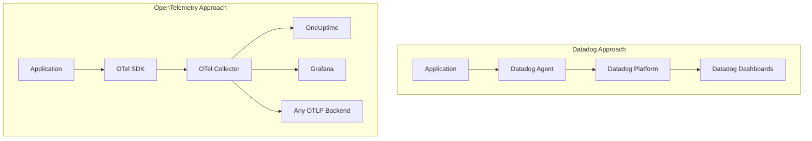

# How to Compare OpenTelemetry vs Datadog for Observability

Author: [nawazdhandala](https://www.github.com/nawazdhandala)

Tags: OpenTelemetry, Datadog, Observability, Comparison, Vendor Lock-in, Cost, Monitoring

Description: A detailed technical comparison of OpenTelemetry and Datadog for observability, covering instrumentation, cost, flexibility, and migration strategies.

---

Choosing between OpenTelemetry and Datadog is one of the most consequential decisions an engineering team makes when building out observability. Both solve the same fundamental problem of getting visibility into distributed systems, but they approach it from opposite directions. Datadog gives you a polished, all-in-one platform with a proprietary agent. OpenTelemetry gives you a vendor-neutral instrumentation standard that works with any backend.

This comparison covers the real technical differences, the cost implications, and the architectural tradeoffs so you can decide which approach fits your organization.

---

## Architecture Overview

The fundamental architectural difference comes down to coupling. Datadog tightly couples instrumentation, collection, and visualization into a single platform. OpenTelemetry decouples instrumentation from the backend entirely.



With Datadog, your application code uses the `ddtrace` library. Telemetry data flows through the Datadog Agent to Datadog's cloud platform. Everything is contained within their ecosystem.

With OpenTelemetry, your application code uses the OTel SDK. Data flows through the OTel Collector, which can route to any compatible backend. You choose where your data goes after collection.

---

## Instrumentation Comparison

Here is how the same service looks when instrumented with each approach. This is a Python web service that processes orders.

### Datadog Instrumentation

The Datadog approach uses their proprietary tracing library. The decorator and tag methods are specific to Datadog's API.

```python
# order_service.py - Datadog instrumentation
from ddtrace import tracer, patch_all

# Automatically patch common libraries (requests, flask, etc.)
patch_all()

@tracer.wrap(service="order-service", resource="create_order")
def create_order(user_id, items):
    # Create a span for order validation
    with tracer.trace("validate_order") as span:
        span.set_tag("user.id", user_id)
        span.set_tag("order.item_count", len(items))
        validated = validate_items(items)

    # Create a span for payment processing
    with tracer.trace("process_payment") as span:
        total = calculate_total(items)
        span.set_tag("payment.amount", total)
        charge_result = charge_card(user_id, total)

    return {"order_id": generate_id(), "status": "created"}
```

### OpenTelemetry Instrumentation

The OpenTelemetry approach uses the standard OTel API. The same instrumentation works regardless of which backend you send data to.

```python
# order_service.py - OpenTelemetry instrumentation
from opentelemetry import trace
from opentelemetry.instrumentation.flask import FlaskInstrumentor

# Auto-instrument Flask (similar libraries exist for Django, FastAPI)
FlaskInstrumentor().instrument()

tracer = trace.get_tracer("order-service")

def create_order(user_id, items):
    # Create a span for order validation
    with tracer.start_as_current_span("validate_order") as span:
        span.set_attribute("user.id", user_id)
        span.set_attribute("order.item_count", len(items))
        validated = validate_items(items)

    # Create a span for payment processing
    with tracer.start_as_current_span("process_payment") as span:
        total = calculate_total(items)
        span.set_attribute("payment.amount", total)
        charge_result = charge_card(user_id, total)

    return {"order_id": generate_id(), "status": "created"}
```

The code looks similar, but the OpenTelemetry version has no vendor dependency. Switching from OneUptime to Grafana or any other backend requires zero application code changes. You only update the collector configuration.

---

## Collector Configuration

OpenTelemetry uses the Collector as a central processing pipeline. This gives you control over how telemetry data is received, processed, and exported. Here is a typical collector configuration that sends data to an OTLP-compatible backend.

```yaml
# otel-collector-config.yaml
receivers:
  otlp:
    protocols:
      grpc:
        endpoint: 0.0.0.0:4317
      http:
        endpoint: 0.0.0.0:4318

processors:
  # Batch spans to reduce export overhead
  batch:
    timeout: 5s
    send_batch_size: 1024

  # Add resource attributes for environment identification
  resource:
    attributes:
      - key: deployment.environment
        value: production
        action: upsert

exporters:
  otlphttp:
    endpoint: https://your-oneuptime-instance.com/otlp

service:
  pipelines:
    traces:
      receivers: [otlp]
      processors: [batch, resource]
      exporters: [otlphttp]
    metrics:
      receivers: [otlp]
      processors: [batch, resource]
      exporters: [otlphttp]
    logs:
      receivers: [otlp]
      processors: [batch, resource]
      exporters: [otlphttp]
```

Datadog's agent configuration is simpler out of the box because it only sends data to Datadog. But that simplicity comes with a constraint: you cannot route data to multiple backends or apply custom processing logic without additional tooling.

---

## Cost Comparison

Datadog's pricing is based on hosts, custom metrics, log volume, and spans ingested. For a mid-size team running 50 hosts with moderate log and trace volume, the monthly bill can easily reach $15,000 to $30,000. Custom metrics are particularly expensive, often adding $5 per metric per month.

OpenTelemetry itself is free. The cost depends entirely on which backend you choose. Open-source backends like Jaeger or Prometheus can run on your own infrastructure. Managed platforms like OneUptime offer predictable pricing without per-host or per-metric charges that escalate quickly.

Here is a rough comparison for a team with 50 hosts:

| Cost Factor | Datadog | OpenTelemetry + Open Backend |
|---|---|---|
| Infrastructure monitoring | $18/host/month | Self-hosted or included |
| APM (traces) | $31/host/month | Self-hosted or included |
| Log management (per GB) | $0.10/GB ingested | Self-hosted or included |
| Custom metrics | $5/metric/month | Self-hosted or included |
| Estimated monthly total | $15,000 - $30,000 | $500 - $5,000 (infra costs) |

The exact numbers vary based on your usage patterns, but the structural difference is clear. Datadog charges per unit of telemetry, which means costs scale with your application's growth. OpenTelemetry with a self-hosted or flat-rate backend gives you more predictable cost scaling.

---

## Data Ownership and Portability

With Datadog, your telemetry data lives on Datadog's platform. You can export it through their APIs, but the data format is Datadog-specific. If you cancel your subscription, you lose access to historical data.

OpenTelemetry uses the OTLP (OpenTelemetry Protocol) standard. Your data is stored in whatever backend you choose, and you can migrate between backends without losing data fidelity. You own the data because you control where it lives.

This matters more than most teams realize upfront. When you have two years of trace data and performance baselines in Datadog, walking away from that investment is painful. With OpenTelemetry, the data format is portable from day one.

---

## When to Choose Datadog

Datadog is genuinely excellent for teams that want a fully managed experience with minimal setup. If your team is small, does not have dedicated SRE capacity, and wants everything to "just work" out of the box, Datadog delivers on that promise. Their dashboards, alerting, and anomaly detection are best-in-class. The machine learning features for log pattern detection and APM correlations are powerful.

If your budget can absorb the cost and you do not anticipate needing to switch vendors, Datadog saves you significant operational overhead.

---

## When to Choose OpenTelemetry

OpenTelemetry is the better choice when vendor flexibility, cost control, or data ownership are priorities. If you are building a multi-cloud or hybrid infrastructure, OpenTelemetry's vendor-neutral approach avoids creating a dependency on any single platform.

Teams that are growing quickly should pay attention to cost scaling. Datadog's per-unit pricing means your observability bill grows with your infrastructure. OpenTelemetry lets you choose backends that match your budget constraints.

For organizations in regulated industries where data residency matters, OpenTelemetry gives you full control over where telemetry data is stored and processed.

---

## Migration Path

If you are currently on Datadog and want to evaluate OpenTelemetry, you can run both in parallel. Datadog supports receiving OTLP data, so you can instrument new services with OpenTelemetry while keeping existing Datadog instrumentation in place.

```yaml
# Collector config for dual-sending during migration
exporters:
  otlphttp/oneuptime:
    endpoint: https://your-oneuptime-instance.com/otlp
  datadog:
    api:
      key: ${DD_API_KEY}

service:
  pipelines:
    traces:
      receivers: [otlp]
      processors: [batch]
      exporters: [otlphttp/oneuptime, datadog]
```

This dual-export approach lets you validate OpenTelemetry's output against Datadog's without any gap in visibility. Once you are confident in the new setup, you can cut over completely.

---

## Conclusion

The choice between OpenTelemetry and Datadog comes down to what you value more: convenience or control. Datadog offers a premium managed experience that works well for teams with budget flexibility. OpenTelemetry offers a standards-based approach that prioritizes long-term flexibility and cost efficiency.

For most teams building modern distributed systems, OpenTelemetry is the safer long-term bet. The initial setup requires more effort, but the freedom to choose and switch backends, control costs, and own your data pays dividends as your organization grows.
