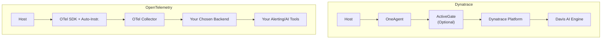

# How to Compare OpenTelemetry vs Dynatrace for Enterprise Observability

Author: [nawazdhandala](https://www.github.com/nawazdhandala)

Tags: OpenTelemetry, Dynatrace, Enterprise Observability, Comparison, AI Ops, OneAgent, Monitoring

Description: A thorough comparison of OpenTelemetry and Dynatrace for enterprise observability, examining AI-driven automation, instrumentation models, cost structures, and integration approaches.

---

Dynatrace occupies a unique position in the observability market. While most monitoring tools require you to configure dashboards, set alert thresholds, and manually correlate signals, Dynatrace built its platform around AI-driven automation with their Davis AI engine. It discovers your topology automatically, detects anomalies without manual baselines, and performs root cause analysis across distributed systems.

OpenTelemetry takes a fundamentally different approach. It provides a vendor-neutral instrumentation standard and leaves the intelligence to your chosen backend. Comparing these two is not just about features. It is about two different philosophies for how enterprises should approach observability.

---

## Architectural Philosophies

Dynatrace uses a single agent called OneAgent that you deploy on every host. This agent automatically discovers processes, maps dependencies, and instruments applications without code changes. It uses deep code-level instrumentation that hooks into the runtime of your application (bytecode injection for Java, CLR instrumentation for .NET, V8 hooks for Node.js).

OpenTelemetry uses SDK libraries and optional auto-instrumentation packages. The telemetry flows through the OTel Collector, which handles processing and export. You choose the backend.



The ActiveGate component in Dynatrace's architecture serves as an intermediary that handles data routing, API access, and integrations. It is roughly analogous to the OTel Collector in terms of its position in the data pipeline, but it is tightly integrated with the Dynatrace platform.

---

## Instrumentation Depth

Dynatrace's OneAgent provides remarkably deep instrumentation out of the box. For a Java application, OneAgent captures method-level timings, SQL query execution, exception details, and thread-level profiling without any code changes. It goes deeper than most APM tools by capturing PurePath traces that show the complete code-level execution path.

Here is what setting up Dynatrace looks like for a Java application:

```bash
# Install OneAgent on the host - that's it
# Dynatrace automatically discovers and instruments Java processes
wget -O Dynatrace-OneAgent.sh \
    "https://your-environment.live.dynatrace.com/api/v1/deployment/installer/agent/unix/default/latest?Api-Token=YOUR_TOKEN"
chmod +x Dynatrace-OneAgent.sh
sudo ./Dynatrace-OneAgent.sh
```

No code changes. No configuration files. No SDK integration. OneAgent handles everything at the runtime level.

OpenTelemetry requires more explicit setup. Here is the equivalent for a Java Spring Boot application.

```java
// build.gradle - Add OpenTelemetry dependencies
dependencies {
    implementation 'io.opentelemetry:opentelemetry-api:1.36.0'
    implementation 'io.opentelemetry:opentelemetry-sdk:1.36.0'
    implementation 'io.opentelemetry:opentelemetry-exporter-otlp:1.36.0'
    implementation 'io.opentelemetry.instrumentation:opentelemetry-spring-boot-starter:2.2.0'
}
```

```yaml
# application.yml - Configure OTel for Spring Boot
otel:
  exporter:
    otlp:
      endpoint: http://otel-collector:4317
  resource:
    attributes:
      service.name: order-service
      deployment.environment: production
  instrumentation:
    spring-web:
      enabled: true
    jdbc:
      enabled: true
```

Alternatively, you can use the Java agent for zero-code instrumentation:

```bash
# Run with the OpenTelemetry Java agent
java -javaagent:opentelemetry-javaagent.jar \
     -Dotel.service.name=order-service \
     -Dotel.exporter.otlp.endpoint=http://collector:4317 \
     -jar my-application.jar
```

The OpenTelemetry Java agent provides solid auto-instrumentation, but it does not match Dynatrace's depth in areas like code-level profiling and memory analysis. Dynatrace captures things like garbage collection impact and CPU hotspots at the method level, which OpenTelemetry's standard tracing does not cover.

---

## AI and Automation

The Davis AI engine is Dynatrace's most significant differentiator. It continuously analyzes the topology of your environment and establishes dynamic baselines for every metric. When something goes wrong, Davis performs automated root cause analysis across all three pillars of observability (traces, metrics, and logs) and tells you exactly which component caused the issue.

This is genuinely powerful for enterprise environments with hundreds of services. Instead of getting a flood of alerts when a database slows down, Davis identifies the database as the root cause and groups all downstream impacts into a single problem card.

OpenTelemetry does not provide AI or analytics. It is an instrumentation and data collection standard. The intelligence comes from whatever backend you use. Some backends offer basic anomaly detection, but none match the depth of Dynatrace's automated root cause analysis out of the box.

If you need Davis-level automation, you have two options: use Dynatrace, or build custom analysis on top of OpenTelemetry data using tools like Apache Flink, custom ML models, or third-party AIOps platforms.

---

## Enterprise Integration

Dynatrace has deep integrations with enterprise platforms that matter for large organizations. It connects natively to ServiceNow for incident management, supports ITSM workflows, and provides compliance reporting. Their Software Intelligence Hub offers pre-built integrations for cloud platforms, CI/CD tools, and business analytics.

OpenTelemetry's integration story is different. The Collector supports a wide range of receivers and exporters, but enterprise workflow integrations depend on your backend choice.

```yaml
# OTel Collector config with multiple enterprise receivers
receivers:
  otlp:
    protocols:
      grpc:
        endpoint: 0.0.0.0:4317
  # Receive metrics from Prometheus endpoints
  prometheus:
    config:
      scrape_configs:
        - job_name: 'kubernetes-pods'
          kubernetes_sd_configs:
            - role: pod
  # Receive logs from FluentBit
  fluentforward:
    endpoint: 0.0.0.0:8006

processors:
  batch:
    timeout: 10s
  # Filter out health check noise
  filter:
    traces:
      span:
        - 'attributes["http.route"] == "/healthz"'

exporters:
  otlphttp:
    endpoint: https://your-backend.com/otlp

service:
  pipelines:
    traces:
      receivers: [otlp]
      processors: [batch, filter]
      exporters: [otlphttp]
    metrics:
      receivers: [otlp, prometheus]
      processors: [batch]
      exporters: [otlphttp]
    logs:
      receivers: [otlp, fluentforward]
      processors: [batch]
      exporters: [otlphttp]
```

The Collector's ability to receive data from multiple sources (OTLP, Prometheus, FluentBit) and process it in a unified pipeline is a genuine strength. Dynatrace can also ingest data from various sources, but the Collector's open architecture makes it more flexible for custom integrations.

---

## Cost at Enterprise Scale

Dynatrace pricing is based on the amount of monitoring consumed across several dimensions: host units, DEM (Digital Experience Monitoring) units, custom metrics, log ingest, and Davis Data Units. For enterprise deployments, annual contracts typically run from $100,000 to well over $1 million depending on scale.

The pricing structure rewards commitment. Enterprise discount agreements with longer terms bring per-unit costs down significantly. But the underlying model still scales with your infrastructure size.

OpenTelemetry eliminates the instrumentation cost entirely. Your expenses come from running the Collector infrastructure and paying for your chosen backend. For enterprises with large environments, the savings can be substantial.

| Component | Dynatrace (Estimated) | OpenTelemetry + Backend |
|---|---|---|
| 200 host units | $140,000/year | N/A |
| Full-stack monitoring | Included | Backend dependent |
| Log management (500 GB/day) | $180,000/year | Backend dependent |
| Davis AI | Included | Not available natively |
| Total estimate | $320,000+ /year | $40,000 - $120,000/year |

The gap narrows if you factor in the engineering time to set up and maintain OpenTelemetry. Dynatrace's zero-config approach genuinely reduces operational overhead. But for cost-conscious enterprises, the difference is hard to ignore.

---

## Dynatrace with OpenTelemetry

Dynatrace supports OpenTelemetry natively. You can send OTLP data to Dynatrace and use it alongside OneAgent data. This is a practical option for teams that want the Davis AI capabilities while standardizing on OpenTelemetry instrumentation.

```bash
# Send OTel data directly to Dynatrace
export OTEL_EXPORTER_OTLP_ENDPOINT="https://your-env.live.dynatrace.com/api/v2/otlp"
export OTEL_EXPORTER_OTLP_HEADERS="Authorization=Api-Token YOUR_TOKEN"
export OTEL_SERVICE_NAME="my-service"

# Run your application with OTel instrumentation
java -javaagent:opentelemetry-javaagent.jar -jar my-app.jar
```

This hybrid approach lets you adopt OpenTelemetry incrementally while retaining Dynatrace's analytics capabilities. It also gives you an exit path if you later decide to move to a different backend.

---

## Making the Decision

Choose Dynatrace if your organization needs automated root cause analysis, code-level visibility, and minimal operational overhead for observability. The platform genuinely delivers on its promise of AI-driven operations for complex enterprise environments. The cost is high, but the automation reduces the need for large SRE teams to manually triage alerts.

Choose OpenTelemetry if vendor independence, cost control, and data portability are priorities. OpenTelemetry gives you complete control over your observability pipeline, but you need to build or buy the analytics capabilities that Dynatrace includes natively.

For many enterprises, the pragmatic path is using OpenTelemetry for instrumentation while evaluating backends (including Dynatrace) based on their analysis capabilities and pricing. This approach preserves flexibility while letting you take advantage of the best tools available today.
