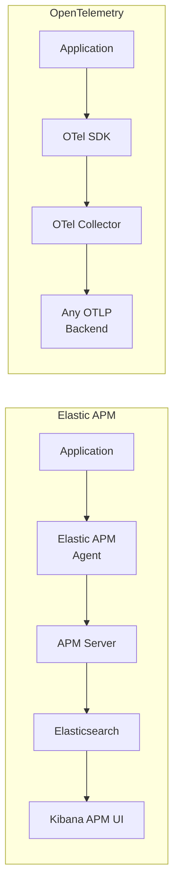
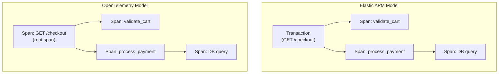

# How to Compare OpenTelemetry vs Elastic APM for Application Tracing

Author: [nawazdhandala](https://www.github.com/nawazdhandala)

Tags: OpenTelemetry, Elastic APM, Tracing, Comparison, Elasticsearch, Observability, Distributed Tracing

Description: A hands-on comparison of OpenTelemetry and Elastic APM for application tracing, covering agent setup, trace data models, storage backends, and practical migration strategies.

---

Elastic APM is built on top of the Elastic Stack (Elasticsearch, Kibana, and the APM Server). It gives you distributed tracing, error tracking, and performance monitoring with the full power of Elasticsearch for querying and analysis. OpenTelemetry provides a vendor-neutral tracing standard that works with any backend, including Elastic.

These two overlap significantly in what they do for application tracing. Both generate spans, propagate context across services, and provide distributed trace visualization. The differences are in how they collect data, where they store it, and how much control you get over the pipeline.

---

## Trace Collection Architecture

Elastic APM uses language-specific agents that are tightly integrated with the Elastic ecosystem. The agents send data to APM Server, which processes it and stores it in Elasticsearch. Kibana's APM UI provides the visualization layer.

OpenTelemetry uses its SDK and Collector to collect traces and send them to any OTLP-compatible backend.



One notable architectural difference: Elastic APM Server is a required component that processes and enriches trace data before indexing. It handles sampling decisions, source mapping for frontend errors, and data transformation. The OTel Collector serves a similar role but with a more modular, configurable pipeline.

---

## Agent Setup and Instrumentation

### Elastic APM Agent (Python)

Elastic APM agents integrate directly with popular frameworks. The Python agent provides automatic instrumentation for Django, Flask, and other frameworks with minimal configuration.

```python
# settings.py - Django with Elastic APM
INSTALLED_APPS = [
    'elasticapm.contrib.django',
    # ... other apps
]

ELASTIC_APM = {
    'SERVICE_NAME': 'order-service',
    'SECRET_TOKEN': 'your-secret-token',
    'SERVER_URL': 'http://apm-server:8200',
    'ENVIRONMENT': 'production',
    # Capture request body for debugging
    'CAPTURE_BODY': 'errors',
    # Sample rate for transactions
    'TRANSACTION_SAMPLE_RATE': 0.5,
}
```

```python
# views.py - Custom spans with Elastic APM
import elasticapm

def checkout_view(request):
    # Elastic APM auto-creates a transaction for each request
    # Add custom context to the current transaction
    elasticapm.set_custom_context({
        'cart_size': len(request.session.get('cart', [])),
        'user_tier': request.user.profile.tier,
    })

    # Create a custom span for a specific operation
    with elasticapm.capture_span('validate_cart', span_type='app'):
        validated = validate_cart_items(request.session['cart'])

    with elasticapm.capture_span('process_payment', span_type='app'):
        payment = charge_customer(request.user, validated.total)

    return JsonResponse({'order_id': payment.order_id})
```

### OpenTelemetry (Python)

The OpenTelemetry equivalent uses the standard SDK and Django auto-instrumentation package.

```python
# otel_setup.py - OpenTelemetry configuration for Django
from opentelemetry import trace
from opentelemetry.sdk.trace import TracerProvider
from opentelemetry.sdk.trace.export import BatchSpanProcessor
from opentelemetry.exporter.otlp.proto.http.trace_exporter import OTLPSpanExporter
from opentelemetry.sdk.resources import Resource
from opentelemetry.instrumentation.django import DjangoInstrumentor

# Configure the tracer provider with service information
resource = Resource.create({
    "service.name": "order-service",
    "deployment.environment": "production",
})

provider = TracerProvider(resource=resource)
provider.add_span_processor(
    BatchSpanProcessor(
        OTLPSpanExporter(endpoint="https://your-backend.com/v1/traces")
    )
)
trace.set_tracer_provider(provider)

# Auto-instrument Django
DjangoInstrumentor().instrument()
```

```python
# views.py - Custom spans with OpenTelemetry
from opentelemetry import trace

tracer = trace.get_tracer("order-service")

def checkout_view(request):
    # Get the current span (auto-created by Django instrumentation)
    current_span = trace.get_current_span()
    current_span.set_attribute("cart.size", len(request.session.get('cart', [])))
    current_span.set_attribute("user.tier", request.user.profile.tier)

    # Create custom child spans for specific operations
    with tracer.start_as_current_span("validate_cart") as span:
        validated = validate_cart_items(request.session['cart'])
        span.set_attribute("cart.validated_items", len(validated.items))

    with tracer.start_as_current_span("process_payment") as span:
        payment = charge_customer(request.user, validated.total)
        span.set_attribute("payment.amount", float(validated.total))

    return JsonResponse({'order_id': payment.order_id})
```

The code patterns are very similar. Both support auto-instrumentation for common frameworks and manual span creation for custom business logic. The main difference is that Elastic APM uses its own API (`elasticapm.capture_span`), while OpenTelemetry uses the standard OTel API (`tracer.start_as_current_span`).

---

## Trace Data Model

Elastic APM and OpenTelemetry model traces differently.

Elastic APM uses a two-tier model: **transactions** and **spans**. A transaction represents a top-level operation (like an HTTP request or a background job). Spans represent sub-operations within a transaction (like database queries or HTTP calls to other services).

OpenTelemetry uses a flat model: everything is a **span**. The root span of a trace is structurally identical to a child span. The parent-child relationship is defined by span context propagation, not by different data types.



In practice, this difference is subtle. When you view traces in Kibana or any OTel-compatible UI, the waterfall visualization looks nearly identical. But the distinction matters when you write queries against the underlying data. In Elasticsearch, transactions and spans are stored in separate indices with different schemas.

---

## Storage and Querying

Elastic APM stores trace data in Elasticsearch, which gives you the full power of Elasticsearch's query DSL. This is a genuine strength. You can write complex aggregations, create custom visualizations in Kibana, and perform full-text search across trace attributes.

```json
// Elasticsearch query - Find slow payment spans
{
  "query": {
    "bool": {
      "must": [
        { "term": { "span.name": "process_payment" } },
        { "range": { "span.duration.us": { "gte": 5000000 } } }
      ],
      "filter": [
        { "range": { "@timestamp": { "gte": "now-1h" } } }
      ]
    }
  },
  "aggs": {
    "by_service": {
      "terms": { "field": "service.name" },
      "aggs": {
        "avg_duration": {
          "avg": { "field": "span.duration.us" }
        },
        "p99_duration": {
          "percentiles": {
            "field": "span.duration.us",
            "percents": [99]
          }
        }
      }
    }
  }
}
```

With OpenTelemetry, your querying capabilities depend on the backend. If you send OTel data to Elasticsearch (which is fully supported), you get the same query power. If you send it to Jaeger, you get Jaeger's simpler query interface. If you use OneUptime, you get their trace exploration tools.

The flexibility cuts both ways. You can choose a backend optimized for your query patterns, but you need to evaluate backends carefully to ensure they meet your analytical needs.

---

## Self-Hosting Considerations

Elastic APM has an advantage for teams that want to self-host. The entire Elastic Stack (Elasticsearch, Kibana, APM Server) runs on your infrastructure with full control over data residency. A basic setup requires just three containers.

OpenTelemetry's self-hosting story is more modular. The Collector is lightweight, but you need separate storage backends for traces (Jaeger, Tempo), metrics (Prometheus, Mimir), and logs (Loki, Elasticsearch). More choices, but also more operational complexity to manage.

---

## Elastic's OpenTelemetry Support

Elastic has invested heavily in OpenTelemetry compatibility. APM Server can receive OTLP data natively, which means you can use OpenTelemetry instrumentation and still store traces in Elasticsearch.

```yaml
# OTel Collector config to send traces to Elastic APM
exporters:
  otlp/elastic:
    endpoint: "apm-server:8200"
    tls:
      insecure: true
    headers:
      Authorization: "Bearer YOUR_SECRET_TOKEN"

service:
  pipelines:
    traces:
      receivers: [otlp]
      processors: [batch]
      exporters: [otlp/elastic]
```

This hybrid approach is compelling. You get OpenTelemetry's vendor-neutral instrumentation with Elasticsearch's powerful storage and querying. If you later decide to switch backends, your application code stays the same.

Elastic also provides an OpenTelemetry-based distribution of their agents (the Elastic Distribution of OpenTelemetry, or EDOT), which is essentially the OTel SDK preconfigured for Elastic backends. This lowers the barrier for teams already using Elastic who want to standardize on OpenTelemetry.

---

## Sampling and Performance

Both Elastic APM agents and OpenTelemetry SDKs introduce comparable overhead. The key factors are sampling rate, batch size, and export frequency. OpenTelemetry gives you more granular control through head-based and tail-based sampling in the Collector.

```yaml
# OTel Collector - Tail-based sampling to reduce storage cost
processors:
  tail_sampling:
    decision_wait: 10s
    policies:
      # Always keep traces with errors
      - name: error-traces
        type: status_code
        status_code: { status_codes: [ERROR] }
      # Always keep slow traces (over 2 seconds)
      - name: slow-traces
        type: latency
        latency: { threshold_ms: 2000 }
      # Sample 10% of everything else
      - name: probabilistic
        type: probabilistic
        probabilistic: { sampling_percentage: 10 }
```

Tail-based sampling is a key advantage of the OTel Collector pipeline. It lets you make sampling decisions based on the complete trace, keeping all error and slow traces while sampling routine requests. Elastic APM's built-in sampling is head-based only, though you can add the OTel Collector in front of APM Server for tail-based sampling.

---

## Making the Decision

Choose Elastic APM if you are already invested in the Elastic Stack, want powerful self-hosted querying with Elasticsearch, or need a tightly integrated tracing and logging solution within the Elastic ecosystem. The APM agents are mature, well-documented, and the Kibana APM UI is genuinely good.

Choose OpenTelemetry if vendor neutrality is important, if you want flexibility in choosing or switching backends, or if you need advanced pipeline features like tail-based sampling. OpenTelemetry also makes more sense if you are using multiple observability backends and want a single instrumentation standard across your organization.

The good news is that you do not have to make an all-or-nothing choice. Elastic's native OTLP support means you can use OpenTelemetry instrumentation and still benefit from Elasticsearch's analytics. Start with OpenTelemetry instrumentation, send data to Elastic, and you preserve the option to change your backend later without touching application code.
