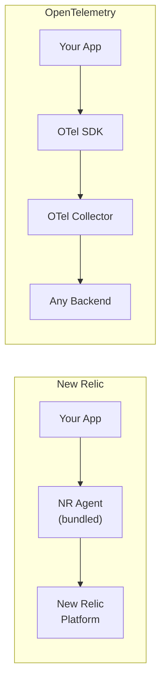

# How to Compare OpenTelemetry vs New Relic for Application Monitoring

Author: [nawazdhandala](https://www.github.com/nawazdhandala)

Tags: OpenTelemetry, New Relic, APM, Application Monitoring, Comparison, Observability, Tracing

Description: A practical comparison of OpenTelemetry and New Relic for application monitoring, covering instrumentation differences, agent behavior, pricing models, and migration approaches.

---

New Relic was one of the first APM tools that made distributed tracing accessible to everyday engineering teams. It pioneered the auto-instrumentation approach where you drop an agent into your application and get instant visibility. OpenTelemetry takes a different path, offering a vendor-neutral standard that separates instrumentation from the backend.

Both approaches get you application monitoring. The question is which set of tradeoffs works better for your team, your budget, and your long-term architecture.

---

## How Each Approach Works

New Relic uses language-specific agents that you install alongside your application. The agent automatically instruments common frameworks and libraries, collects performance data, and sends it to New Relic's cloud platform. The agent handles everything from bytecode injection in Java to monkey-patching in Python.

OpenTelemetry provides SDK libraries and auto-instrumentation packages that generate telemetry data in a standard format. The data flows through the OpenTelemetry Collector, which routes it to any compatible backend.



The key difference is where the intelligence lives. New Relic puts intelligence in the agent and the platform. OpenTelemetry puts it in the standard and the backend you choose.

---

## Auto-Instrumentation Comparison

Both New Relic and OpenTelemetry support auto-instrumentation, but they work differently under the hood.

### New Relic Auto-Instrumentation (Node.js)

New Relic's agent must be required before any other module. It patches libraries at import time to inject tracing automatically.

```javascript
// app.js - New Relic auto-instrumentation
// MUST be the first require in your application
require('newrelic');

const express = require('express');
const app = express();

// New Relic automatically traces Express routes
app.get('/api/users/:id', async (req, res) => {
    const user = await db.findUser(req.params.id);
    res.json(user);
});

// New Relic automatically traces database calls,
// HTTP requests, and other supported libraries
app.listen(3000);
```

The `newrelic.js` config file controls the agent's behavior, specifying the license key, app name, and which libraries to instrument.

### OpenTelemetry Auto-Instrumentation (Node.js)

OpenTelemetry also supports auto-instrumentation, but the setup is more explicit about what is happening. You register instrumentations for specific libraries.

```javascript
// tracing.js - OpenTelemetry auto-instrumentation setup
const { NodeSDK } = require('@opentelemetry/sdk-node');
const { OTLPTraceExporter } = require('@opentelemetry/exporter-trace-otlp-http');
const { getNodeAutoInstrumentations } = require('@opentelemetry/auto-instrumentations-node');

// Initialize the SDK with auto-instrumentation for common libraries
const sdk = new NodeSDK({
    traceExporter: new OTLPTraceExporter({
        url: 'https://your-backend.com/v1/traces',
    }),
    instrumentations: [
        getNodeAutoInstrumentations({
            // Selectively enable/disable specific instrumentations
            '@opentelemetry/instrumentation-fs': { enabled: false },
            '@opentelemetry/instrumentation-express': { enabled: true },
        }),
    ],
});

sdk.start();
```

```javascript
// app.js - Application code remains clean
const express = require('express');
const app = express();

// Express routes are automatically traced by OTel
app.get('/api/users/:id', async (req, res) => {
    const user = await db.findUser(req.params.id);
    res.json(user);
});

app.listen(3000);
```

The OpenTelemetry approach separates tracing setup from application code. You can enable or disable instrumentation for specific libraries without touching your business logic.

---

## Custom Instrumentation

When auto-instrumentation is not enough, you add custom spans. Here is how each approach handles a custom business operation.

### New Relic Custom Spans

```javascript
// New Relic custom instrumentation
const newrelic = require('newrelic');

async function processOrder(orderId) {
    // Create a custom transaction
    return newrelic.startBackgroundTransaction('process-order', async () => {
        const transaction = newrelic.getTransaction();

        // Add custom attributes to the transaction
        newrelic.addCustomAttributes({
            'order.id': orderId,
            'order.source': 'web',
        });

        // Create a custom segment within the transaction
        const result = await newrelic.startSegment('validate-inventory', true, async () => {
            return await checkInventory(orderId);
        });

        transaction.end();
        return result;
    });
}
```

### OpenTelemetry Custom Spans

```javascript
// OpenTelemetry custom instrumentation
const { trace } = require('@opentelemetry/api');

const tracer = trace.getTracer('order-service');

async function processOrder(orderId) {
    // Create a custom span
    return tracer.startActiveSpan('process-order', async (span) => {
        // Add attributes using semantic conventions
        span.setAttribute('order.id', orderId);
        span.setAttribute('order.source', 'web');

        // Create a child span for a sub-operation
        const result = await tracer.startActiveSpan('validate-inventory', async (childSpan) => {
            const inventoryResult = await checkInventory(orderId);
            childSpan.end();
            return inventoryResult;
        });

        span.end();
        return result;
    });
}
```

The OpenTelemetry API is arguably cleaner. The `startActiveSpan` pattern with callback functions makes span lifecycle management straightforward. Context propagation happens automatically through the callback chain.

---

## Pricing Model Differences

New Relic moved to a usage-based pricing model centered on two dimensions: users and data ingest. You get a free tier with 100 GB of data per month and one full-platform user. Beyond that, each full-platform user costs roughly $49/month (standard) or $349/month (pro), and additional data costs $0.30/GB (standard) or $0.50/GB (Data Plus).

This pricing model is friendlier than Datadog's per-host model for some use cases, but it can still get expensive for large teams. A team of 20 engineers on Pro with 500 GB of monthly ingest would pay around $7,000 to $10,000 per month.

OpenTelemetry has no licensing cost. Your expenses come from the backend you choose. Self-hosting with Jaeger and Prometheus keeps costs to infrastructure only. Managed platforms like OneUptime offer flat-rate pricing that does not penalize you for adding team members or ingesting more data.

| Factor | New Relic | OpenTelemetry + Open Backend |
|---|---|---|
| Per-user cost | $49 - $349/month | None (backend dependent) |
| Data ingest | $0.30 - $0.50/GB | Infrastructure cost only |
| Free tier | 100 GB/month, 1 user | N/A (self-hosted is free) |
| 20-person team estimate | $7,000 - $10,000/month | $500 - $3,000/month |

---

## New Relic's OpenTelemetry Support

It is worth noting that New Relic has embraced OpenTelemetry as a data source. You can send OTLP data directly to New Relic's platform, which means you can use OpenTelemetry instrumentation while still using New Relic as your backend.

```yaml
# OTel Collector config to send data to New Relic
exporters:
  otlphttp:
    endpoint: https://otlp.nr-data.net
    headers:
      api-key: ${NEW_RELIC_LICENSE_KEY}

service:
  pipelines:
    traces:
      receivers: [otlp]
      processors: [batch]
      exporters: [otlphttp]
```

This hybrid approach gives you the benefit of vendor-neutral instrumentation while still accessing New Relic's analytics and dashboarding features. It is a practical migration strategy if you want to adopt OpenTelemetry incrementally without abandoning your New Relic investment.

---

## Where New Relic Excels

New Relic has genuine strengths that are hard to replicate with OpenTelemetry alone.

Their errors inbox provides intelligent error grouping and prioritization. It clusters similar errors, tracks error rates over time, and links errors to specific deployments. Building equivalent functionality on top of raw OpenTelemetry data requires significant effort.

The distributed tracing UI in New Relic is polished. Waterfall views of traces, automatic service maps, and anomaly detection are built into the platform. With OpenTelemetry, you depend on your chosen backend for these features, and quality varies.

New Relic's Logs in Context feature automatically correlates log entries with traces, which is genuinely useful for debugging. OpenTelemetry supports trace-log correlation through resource attributes, but the backend needs to implement the correlation UI.

---

## Where OpenTelemetry Excels

OpenTelemetry wins on flexibility and long-term cost management. The ability to switch backends without changing application code is a structural advantage that becomes more valuable over time.

The semantic conventions in OpenTelemetry provide a standardized vocabulary for telemetry data. When you set `http.request.method` or `db.system` as attributes, every tool in the ecosystem understands what those mean. This consistency makes it easier to build cross-service queries and dashboards.

OpenTelemetry's Collector gives you a data processing pipeline that New Relic's agent does not offer. You can filter, transform, sample, and route telemetry data before it reaches any backend. This level of control is valuable for managing costs and compliance.

---

## Making the Decision

Choose New Relic if your team values a managed experience with strong out-of-the-box features, and your usage fits within their pricing tiers. The platform is mature, well-documented, and genuinely good at what it does.

Choose OpenTelemetry if you want vendor independence, cost control at scale, or the ability to send data to multiple backends. The initial investment in setup is higher, but you avoid the long-term constraints of proprietary instrumentation.

For many teams, the best approach is a hybrid: instrument with OpenTelemetry, and use New Relic (or any other backend) as your analysis platform. This gives you the flexibility of open standards with the polish of a managed tool. If your needs change, switching backends is a configuration change rather than a rewrite.
