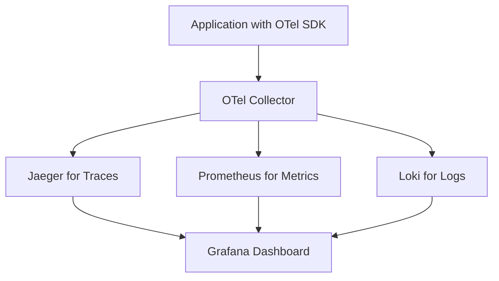

# How to Choose Between OpenTelemetry and Proprietary Instrumentation

Author: [nawazdhandala](https://www.github.com/nawazdhandala)

Tags: OpenTelemetry, Vendor Lock-in, Instrumentation, Comparison, Cost

Description: A practical comparison of OpenTelemetry versus proprietary instrumentation approaches to help you make the right observability choice for your organization.

Every engineering team faces the instrumentation decision eventually. Your application needs observability, but should you adopt OpenTelemetry's vendor-neutral approach or use a vendor's proprietary SDK? The answer shapes your monitoring costs, operational flexibility, and long-term architecture for years.

This isn't a simple "open source good, proprietary bad" argument. Both approaches have genuine tradeoffs. Understanding these differences helps you make an informed choice based on your actual constraints rather than ideology.

## What Makes Instrumentation Proprietary

Proprietary instrumentation means vendor-specific code that only works with that vendor's backend. When you instrument your application with Datadog's SDK, New Relic's agent, or Dynatrace's OneAgent, you're locked to that platform.

The vendor's library collects telemetry data, formats it in their proprietary schema, and sends it to their backend. If you later want to switch vendors, you must replace the instrumentation code throughout your application.

```python
# Example of proprietary Datadog instrumentation
from ddtrace import tracer

@tracer.wrap(service="payment-api", resource="process_payment")
def process_payment(amount, currency):
    # Business logic here
    result = charge_card(amount, currency)
    tracer.set_tag("payment.amount", amount)
    tracer.set_tag("payment.currency", currency)
    return result
```

This code only works with Datadog. The `@tracer.wrap` decorator, tag names, and data format are Datadog-specific. Switching to another vendor means finding every instrumentation point and rewriting it.

OpenTelemetry takes a different approach. You instrument using vendor-neutral APIs. The telemetry data uses standard formats (OTLP protocol, semantic conventions). You can send this data to any backend that supports OpenTelemetry.

```python
# Equivalent OpenTelemetry instrumentation
from opentelemetry import trace

tracer = trace.get_tracer(__name__)

@tracer.start_as_current_span("process_payment")
def process_payment(amount, currency):
    span = trace.get_current_span()
    # Business logic here
    result = charge_card(amount, currency)
    span.set_attribute("payment.amount", amount)
    span.set_attribute("payment.currency", currency)
    return result
```

This OpenTelemetry code works with any backend. Change the exporter configuration and your data flows to a different vendor without touching application code.

## The Real Cost of Vendor Lock-in

Vendor lock-in sounds abstract until you face its concrete impacts. The costs show up in several ways.

### Migration Costs

When contract negotiations break down or pricing becomes unsustainable, you're stuck. One team I worked with spent six months migrating from a proprietary APM tool. Engineers rewrote instrumentation across 47 microservices. The project consumed roughly 12 engineer-months of effort.

With OpenTelemetry, they would have changed the collector configuration and switched backends in a week. The application code would remain unchanged.

### Pricing Leverage

Vendors know switching costs are high. When renewal time comes, they have leverage. You can negotiate, but the vendor knows you can't credibly threaten to leave. Migration would cost hundreds of thousands in engineering time.

OpenTelemetry shifts this dynamic. You can genuinely evaluate alternatives because switching is feasible. Vendors compete on backend capabilities and price rather than leveraging lock-in.

### Feature Dependencies

Proprietary SDKs create dependencies on vendor-specific features. Maybe you built dashboards using Datadog's custom metrics. Or you rely on New Relic's entity synthesis. Or you've integrated deeply with Dynatrace's AI engine.

These features don't exist elsewhere. If you switch vendors, you lose functionality your teams depend on. This creates organizational inertia that's even stronger than technical lock-in.

OpenTelemetry avoids this by standardizing the instrumentation layer. Backend-specific features stay in the backend, not in your application code. You can still use vendor-specific capabilities, but they don't infect your codebase.

## When Proprietary Makes Sense

Despite lock-in concerns, proprietary instrumentation has legitimate advantages in certain situations.

### Zero-Configuration Auto-Instrumentation

Proprietary agents often provide superior auto-instrumentation. Install Datadog's agent, set an environment variable, and your application gets instrumented automatically. No code changes required.

```bash
# Datadog Java auto-instrumentation
java -javaagent:dd-java-agent.jar \
     -Ddd.service=my-service \
     -Ddd.env=production \
     -jar my-application.jar
```

Everything works immediately. The agent patches your application at runtime, instrumenting frameworks, databases, and HTTP clients without configuration.

OpenTelemetry's auto-instrumentation is improving but not always as comprehensive. Some languages and frameworks require manual instrumentation or additional configuration.

### Integrated Experiences

Proprietary instrumentation optimizes for the vendor's platform. The SDK knows exactly what the backend needs. Data arrives in the perfect format. Features integrate seamlessly.

Datadog's profiler connects directly to traces. New Relic's real user monitoring links browser sessions to backend requests. These integrations work smoothly because the same vendor controls both ends.

With OpenTelemetry, you might need additional configuration to get equivalent integration. The standard covers common cases, but vendor-specific optimizations require extra setup.

### Support and Documentation

Proprietary tools come with vendor support. When something breaks, you can open a ticket. The vendor's engineers help debug. Documentation focuses on their specific implementation.

OpenTelemetry is community-driven. Support comes from documentation, GitHub issues, and community forums. This model works well for experienced teams but can be challenging for organizations without deep observability expertise.

### Single-Vendor Commitment

If you've already standardized on a vendor and have no plans to switch, their proprietary SDK might be the path of least resistance. Why add the abstraction layer of OpenTelemetry if you're committed to staying?

This logic makes sense for organizations with long-term vendor relationships and no concerns about pricing or flexibility. Just recognize that you're making a bet on that relationship lasting.

## When OpenTelemetry Wins

OpenTelemetry's advantages show up in different contexts, particularly for organizations valuing flexibility and future-proofing.

### Multi-Vendor and Hybrid Strategies

Many organizations use different backends for different purposes. Traces to one vendor, metrics to another, logs to a third. Or different backends for development, staging, and production to control costs.

```yaml
# OpenTelemetry Collector configuration for multi-vendor export
receivers:
  otlp:
    protocols:
      grpc:
      http:

processors:
  batch:

exporters:
  # Traces to Honeycomb for deep analysis
  otlphttp/traces:
    endpoint: https://api.honeycomb.io/v1/traces
    headers:
      x-honeycomb-team: ${HONEYCOMB_API_KEY}

  # Metrics to Prometheus for long-term storage
  prometheusremotewrite:
    endpoint: https://prometheus.example.com/api/v1/write

  # Logs to Loki for cost-effective storage
  loki:
    endpoint: https://loki.example.com/loki/api/v1/push

service:
  pipelines:
    traces:
      receivers: [otlp]
      processors: [batch]
      exporters: [otlphttp/traces]
    metrics:
      receivers: [otlp]
      processors: [batch]
      exporters: [prometheusremotewrite]
    logs:
      receivers: [otlp]
      processors: [batch]
      exporters: [loki]
```

Proprietary instrumentation can't do this. Each SDK only talks to its own backend. You'd need multiple instrumentation libraries fighting for control of your application.

### Cost Optimization Through Sampling and Filtering

OpenTelemetry gives you control over telemetry data before it reaches expensive backends. The Collector can sample traces, filter metrics, or drop verbose logs.

```yaml
# Cost-optimizing processor configuration
processors:
  # Probabilistic sampling for high-volume services
  probabilistic_sampler:
    sampling_percentage: 10.0

  # Drop high-cardinality metrics
  filter/metrics:
    metrics:
      exclude:
        match_type: regexp
        metric_names:
          - '.*_histogram_bucket'  # Drop histogram details, keep summaries

  # Remove verbose debug logs
  filter/logs:
    logs:
      exclude:
        match_type: strict
        bodies:
          - "Debug: cache hit"
          - "Debug: cache miss"

  # Tail sampling: keep all error traces, sample success
  tail_sampling:
    policies:
      - name: errors
        type: status_code
        status_code: {status_codes: [ERROR]}
      - name: success-sample
        type: probabilistic
        probabilistic: {sampling_percentage: 5}
```

This processing happens before data hits your vendor's billing. You pay only for the data you actually need. Proprietary agents typically send everything to the backend, where vendor-controlled sampling applies. You pay for all the data the agent collects.

### Open Source and Self-Hosted Options

OpenTelemetry works with open-source backends like Jaeger, Prometheus, Grafana Tempo, and Grafana Loki. You can self-host your entire observability stack if data sovereignty, compliance, or cost matters.



Self-hosting isn't free (you pay for infrastructure, maintenance, and operational complexity), but it's an option. Proprietary instrumentation requires the vendor's SaaS platform.

### Future-Proofing Architecture

Technology landscapes change. Vendors get acquired. Products get discontinued. Pricing models shift. OpenTelemetry insulates your application from these changes.

Your instrumentation becomes an infrastructure decision rather than an application code decision. Teams can instrument services without caring which backend receives the data. Platform teams manage backend routing centrally.

## The Decision Framework

Choose your instrumentation approach based on these factors.

### Evaluate Your Vendor Relationship

Are you confident in your current vendor relationship? Have they earned your long-term trust? Are you comfortable betting your application's instrumentation on that relationship continuing?

If yes, proprietary might work. If no, or if you're uncertain, OpenTelemetry provides insurance.

### Assess Your Cost Sensitivity

Observability costs can spiral quickly. If you're sending high volumes of telemetry data, OpenTelemetry's filtering and sampling capabilities become valuable.

Calculate your monthly observability spend. If it's significant relative to your infrastructure budget, OpenTelemetry's cost control matters. If observability is a rounding error, the flexibility might not justify the investment.

### Consider Your Team's Expertise

OpenTelemetry requires more initial configuration than proprietary agents' zero-config approaches. Your team needs to understand receivers, processors, exporters, and the Collector architecture.

If you have strong platform engineering capabilities, this is manageable. If you're a small team wanting observability without becoming observability experts, proprietary auto-instrumentation might be pragmatic.

### Plan for Scale and Complexity

How many services will you instrument? How many teams? As organizations grow, centralized instrumentation control becomes valuable. OpenTelemetry enables platform teams to provide instrumentation standards without each application team becoming experts.

Small applications with a single team might not need this centralization. Large organizations with dozens of services and teams benefit significantly.

### Evaluate Multi-Cloud and Hybrid Requirements

Running workloads across multiple cloud providers or hybrid cloud/on-premises environments complicates observability. OpenTelemetry's vendor neutrality helps maintain consistent instrumentation across diverse infrastructure.

If you're all-in on a single cloud provider and single region, this matters less.

## Migration Considerations

What if you're already using proprietary instrumentation and considering OpenTelemetry?

### Incremental Migration

You can migrate service by service. OpenTelemetry and proprietary agents can coexist during transition.

```python
# Hybrid instrumentation during migration
from opentelemetry import trace
from opentelemetry.instrumentation.requests import RequestsInstrumentor
from ddtrace import tracer as dd_tracer

# Enable OpenTelemetry instrumentation
RequestsInstrumentor().instrument()

# Keep Datadog for now during migration
@dd_tracer.wrap()
def legacy_function():
    pass

# New code uses OpenTelemetry
otel_tracer = trace.get_tracer(__name__)

@otel_tracer.start_as_current_span("new_function")
def new_function():
    pass
```

Migrate high-value services first to prove the approach. Leave low-touch services on proprietary instrumentation longer.

### Cost-Benefit Analysis

Migration has real costs: engineering time, testing, potential bugs during transition. Calculate whether these costs justify the benefits.

For a 10-service architecture with low telemetry volume, migration might not make sense. For 100+ services spending $50k/month on observability, the ROI is clear.

### Vendor Bridge Options

Some vendors provide OpenTelemetry compatibility layers. You can use OpenTelemetry instrumentation while continuing to send data to your existing backend.

This gives you vendor portability without immediately switching backends. You get the flexibility benefits while deferring the backend decision.

## Hybrid Approaches

The choice isn't always binary. Some organizations use both strategically.

**OpenTelemetry for Application Code**: Instrument your services with OpenTelemetry for portability and control.

**Proprietary for Infrastructure**: Use vendor agents for infrastructure monitoring (hosts, containers, cloud services) where auto-discovery and zero-config matter more.

**Vendor-Specific Integrations**: Leverage proprietary integrations for specific capabilities (like real user monitoring or mobile app analytics) where OpenTelemetry standards don't yet exist.

This hybrid approach balances flexibility where it matters most (application code that you control) with convenience where it doesn't (infrastructure that changes less frequently).

## Making the Decision

Start by honestly assessing your situation. Are you locked in today? Does it hurt? Would flexibility solve actual problems or just satisfy abstract preferences?

If vendor lock-in has caused pain (blocked migrations, pricing pressure, feature gaps), OpenTelemetry directly addresses those issues. If you've been happy with your vendor for years and see no reason to change, proprietary instrumentation's convenience might win.

For new projects, OpenTelemetry is usually the better bet. The initial setup cost is modest compared to potential future flexibility. For existing instrumentation, calculate migration costs against expected benefits.

The instrumentation choice shapes your observability strategy for years. Choose based on your actual constraints: team skills, vendor relationships, cost sensitivity, and organizational complexity. Both approaches can work. The right answer depends on your specific context, not universal principles.
