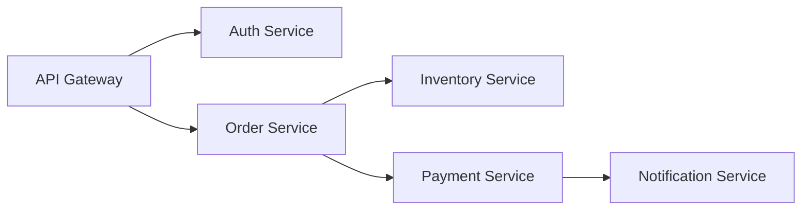

# How to Decide When You Need OpenTelemetry vs Simple Application Logging

Author: [nawazdhandala](https://www.github.com/nawazdhandala)

Tags: OpenTelemetry, Logging, Comparison, Observability, Decision Making

Description: A practical guide for determining whether your application needs the full power of OpenTelemetry or if simple logging is sufficient for your use case.

Choosing between OpenTelemetry and simple application logging is one of the first decisions you'll make when building observability into your system. Both approaches capture what's happening in your application, but they serve different purposes and come with different tradeoffs. Making the wrong choice means either over-engineering your observability or lacking the visibility you need.

## What Simple Application Logging Provides

Application logging has been the standard approach to observability for decades. You write log statements in your code, and those messages go to files, stdout, or a log aggregation service.

```python
import logging

logger = logging.getLogger(__name__)

def process_payment(user_id, amount):
    logger.info(f"Processing payment for user {user_id}, amount ${amount}")

    try:
        result = charge_credit_card(user_id, amount)
        logger.info(f"Payment successful: transaction_id={result.transaction_id}")
        return result
    except PaymentError as e:
        logger.error(f"Payment failed for user {user_id}: {e}", exc_info=True)
        raise
```

This approach is straightforward. You add log statements where you need visibility, and you get text output describing what happened. Logs work everywhere, require minimal setup, and every developer knows how to use them.

Logs give you:
- Timestamped records of events
- Error messages with stack traces
- Debug information about execution flow
- Audit trails of user actions
- Searchable text output

## What OpenTelemetry Provides

OpenTelemetry takes a different approach. Instead of unstructured text, it captures structured telemetry across three signal types: traces, metrics, and logs.

```python
from opentelemetry import trace, metrics
from opentelemetry.trace import Status, StatusCode

tracer = trace.get_tracer(__name__)
meter = metrics.get_meter(__name__)

payment_counter = meter.create_counter(
    "payments.processed",
    description="Number of payments processed"
)

payment_duration = meter.create_histogram(
    "payments.duration",
    description="Payment processing duration in seconds"
)

def process_payment(user_id, amount):
    with tracer.start_as_current_span("process_payment") as span:
        span.set_attribute("user.id", user_id)
        span.set_attribute("payment.amount", amount)

        start_time = time.time()

        try:
            result = charge_credit_card(user_id, amount)

            span.set_attribute("transaction.id", result.transaction_id)
            span.set_status(Status(StatusCode.OK))

            payment_counter.add(1, {"status": "success"})
            payment_duration.record(time.time() - start_time, {"status": "success"})

            return result
        except PaymentError as e:
            span.set_status(Status(StatusCode.ERROR, str(e)))
            span.record_exception(e)

            payment_counter.add(1, {"status": "failed"})
            payment_duration.record(time.time() - start_time, {"status": "failed"})

            raise
```

OpenTelemetry provides:
- Distributed traces showing request flow across services
- Structured metrics for aggregation and alerting
- Correlated logs with trace context
- Standardized instrumentation across languages
- Automatic capture of framework behavior

## When Simple Logging Is Enough

You should stick with simple application logging when your situation matches these characteristics:

**Single application or service**: If you're running a monolith or just one service, distributed tracing provides little value. The complexity of OpenTelemetry outweighs the benefits when there's no distribution to trace.

```python
# For a standalone web application, logs are often sufficient
@app.route('/api/users/<user_id>')
def get_user(user_id):
    logger.info(f"Fetching user {user_id}")
    user = db.query(User).get(user_id)
    if user:
        logger.info(f"User {user_id} found")
        return jsonify(user.to_dict())
    else:
        logger.warning(f"User {user_id} not found")
        return jsonify({"error": "Not found"}), 404
```

**Simple debugging needs**: When you just need to know if code paths executed or what values variables held, logs are direct and effective.

**Low traffic volume**: If your application handles dozens or hundreds of requests per day, you can manually review logs when issues occur. The aggregation and analysis capabilities of OpenTelemetry matter most at scale.

**Limited resources**: Small teams or startups with constrained resources should focus on building product features. The overhead of learning, implementing, and maintaining OpenTelemetry might not pay off early on.

**Straightforward error investigation**: If errors are usually obvious from stack traces and local context, structured telemetry adds little value.

**No performance bottleneck concerns**: When your application is fast enough and you're not hunting for performance issues, metrics and traces provide less value than they would in a performance-sensitive system.

## When You Need OpenTelemetry

OpenTelemetry becomes essential in these scenarios:

**Microservices architecture**: When a single request touches multiple services, logs alone can't show you the complete picture. You need distributed tracing.



Imagine debugging a slow checkout process. Logs from each service show their individual processing, but only a distributed trace shows that the payment service waited 2 seconds for the inventory service to confirm stock, which in turn was waiting on a database query.

**Performance optimization**: When you need to identify bottlenecks, metrics and traces are purpose-built tools. Logs require manual parsing and correlation.

```go
// OpenTelemetry automatically captures detailed timing information
import (
    "go.opentelemetry.io/otel"
    "go.opentelemetry.io/otel/attribute"
)

func processOrder(ctx context.Context, orderID string) error {
    ctx, span := tracer.Start(ctx, "processOrder")
    defer span.End()

    // Each operation is a child span with its own timing
    if err := validateOrder(ctx, orderID); err != nil {
        return err
    }

    if err := chargePayment(ctx, orderID); err != nil {
        return err
    }

    if err := updateInventory(ctx, orderID); err != nil {
        return err
    }

    return nil
}
```

The resulting trace shows exactly where time is spent: validation took 10ms, payment took 250ms, and inventory update took 500ms. You immediately know where to optimize.

**Complex request flows**: When requests fan out to multiple services, aggregate results, or follow conditional paths, traces provide visual representations of execution.

**High traffic volume**: At thousands or millions of requests per day, you can't manually review logs. You need metrics for aggregation and sampling for trace analysis.

**Service Level Objectives (SLOs)**: If you're tracking SLOs for latency or error rates, you need accurate metrics. Computing these from logs is inefficient and imprecise.

```python
# Metrics are purpose-built for SLO tracking
request_duration = meter.create_histogram(
    "http.server.request.duration",
    unit="s",
    description="HTTP request duration"
)

# Automatically calculate percentiles: p50, p95, p99
request_duration.record(
    duration,
    attributes={
        "http.method": request.method,
        "http.route": request.route,
        "http.status_code": response.status_code
    }
)
```

**Multi-team organizations**: When multiple teams own different services, OpenTelemetry's standardization ensures everyone speaks the same observability language.

**Third-party integrations**: If you're integrating with external services or APIs, tracing shows you where external latency impacts your system.

## The Hybrid Approach

You don't have to choose exclusively. Many teams use both logging and OpenTelemetry, leveraging each for what it does best.

```python
from opentelemetry import trace
import logging

tracer = trace.get_tracer(__name__)
logger = logging.getLogger(__name__)

def process_refund(order_id, amount, reason):
    with tracer.start_as_current_span("process_refund") as span:
        span.set_attribute("order.id", order_id)
        span.set_attribute("refund.amount", amount)

        # Use logging for audit trail and detailed messages
        logger.info(
            f"Refund initiated: order={order_id}, amount=${amount}, reason={reason}",
            extra={"order_id": order_id, "amount": amount, "reason": reason}
        )

        try:
            result = issue_refund(order_id, amount)

            # OpenTelemetry captures structured execution data
            span.set_attribute("refund.id", result.refund_id)
            span.set_status(Status(StatusCode.OK))

            # Logs capture business context and audit information
            logger.info(
                f"Refund completed: refund_id={result.refund_id}",
                extra={"refund_id": result.refund_id}
            )

            return result
        except RefundError as e:
            span.record_exception(e)
            span.set_status(Status(StatusCode.ERROR))

            logger.error(
                f"Refund failed: {e}",
                exc_info=True,
                extra={"order_id": order_id}
            )
            raise
```

OpenTelemetry includes support for correlating logs with traces. When you add trace context to log records, your log aggregation tool can link log messages to their corresponding traces.

```python
# Configure logging to include trace context
from opentelemetry.instrumentation.logging import LoggingInstrumentor

LoggingInstrumentor().instrument(set_logging_format=True)

# Now all log records include trace_id and span_id
logger.info("Processing payment")
# Output: 2026-02-06 10:30:45 INFO [trace_id=abc123 span_id=def456] Processing payment
```

## Cost Considerations

Cost often drives the decision between logging and OpenTelemetry.

**Logging costs**: You pay for log ingestion, storage, and retention. Text logs are relatively compact, but high-volume applications generate enormous log data. A single chatty service can produce gigabytes per day.

**OpenTelemetry costs**: Trace data can be expensive because each span includes multiple attributes, events, and timing information. However, sampling reduces costs dramatically. Metrics are generally inexpensive because they're aggregated before export.

You can manage OpenTelemetry costs through sampling:

```python
# Sample only 1% of traces in production
from opentelemetry.sdk.trace.sampling import TraceIdRatioBased

sampler = TraceIdRatioBased(0.01)  # 1% sampling rate

provider = TracerProvider(sampler=sampler)
```

With 1% sampling, you retain visibility into system behavior while reducing data volume by 99%. Logs don't offer equivalent sampling mechanisms without custom code.

## Implementation Complexity

Simple logging requires almost no setup:

```python
import logging

logging.basicConfig(level=logging.INFO)
logger = logging.getLogger(__name__)
```

OpenTelemetry requires configuration:

```python
from opentelemetry import trace, metrics
from opentelemetry.sdk.trace import TracerProvider
from opentelemetry.sdk.trace.export import BatchSpanProcessor
from opentelemetry.exporter.otlp.proto.grpc.trace_exporter import OTLPSpanExporter
from opentelemetry.sdk.resources import Resource

# Configure resource information
resource = Resource.create({"service.name": "my-service"})

# Set up trace provider
provider = TracerProvider(resource=resource)
processor = BatchSpanProcessor(OTLPSpanExporter())
provider.add_span_processor(processor)
trace.set_tracer_provider(provider)
```

The complexity pays off in microservices environments but may be overkill for simple applications.

## Migration Path

You don't need to migrate all at once. A phased approach reduces risk:

**Phase 1**: Keep existing logging, add OpenTelemetry to your highest-traffic or most-critical service. Learn the tools and validate the value.

**Phase 2**: Add automatic instrumentation to frameworks and libraries across all services. This gives you distributed tracing with minimal code changes.

**Phase 3**: Add custom spans and metrics to capture business-specific telemetry.

**Phase 4**: Correlate logs with traces, gradually reducing reliance on logs for debugging.

**Phase 5**: Optimize sampling, retention, and costs based on actual usage patterns.

## Making the Decision

Ask yourself these questions:

1. Do I have multiple services that call each other?
2. Do I need to track performance characteristics beyond simple errors?
3. Am I investigating issues that span multiple services?
4. Do I have the team capacity to learn and maintain OpenTelemetry?
5. Will I benefit from standardized instrumentation across services?

If you answered yes to questions 1-3 and have the capacity (question 4), OpenTelemetry will provide significant value. If you answered no to most questions, stick with logging for now. You can always adopt OpenTelemetry later when your needs evolve.

Neither approach is universally better. Simple logging excels for straightforward applications with modest traffic and simple architectures. OpenTelemetry shines in distributed systems with complex interactions and performance requirements. Choose based on your actual needs, not hype or trends. Start simple, and increase sophistication as your requirements grow.
