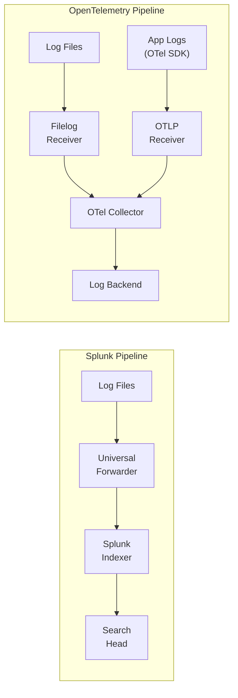

# How to Compare OpenTelemetry vs Splunk for Log Management

Author: [nawazdhandala](https://www.github.com/nawazdhandala)

Tags: OpenTelemetry, Splunk, Log Management, Comparison, Observability, SIEM, Log Collection

Description: A practical comparison of OpenTelemetry and Splunk for log management, covering collection pipelines, query capabilities, cost structures, and when each approach makes sense.

---

Splunk has been the dominant force in log management for over two decades. It built its reputation on the ability to index and search any machine data, making it indispensable for IT operations and security teams. OpenTelemetry entered the logging space more recently, adding log signal support to its existing trace and metrics capabilities.

These two tools are not direct replacements for each other. Splunk is a complete log analytics platform. OpenTelemetry is an instrumentation and collection standard. But they overlap in how they collect, process, and route log data. Understanding where they align and where they diverge helps you build a log management architecture that serves your actual needs.

---

## Log Collection Approaches

Splunk collects logs through Universal Forwarders (lightweight agents) and Heavy Forwarders (full processing agents) that run on your hosts. These forwarders monitor log files, parse them, and send the data to Splunk indexers.

OpenTelemetry collects logs through its SDK (for application logs) and the Collector (for system and file-based logs). The Collector's filelog receiver can tail log files similar to how Splunk's forwarders work.



The structural difference matters. Splunk's pipeline is optimized for getting logs into Splunk. OpenTelemetry's pipeline is designed to collect logs and send them anywhere.

---

## Collecting Application Logs

### Splunk Approach

With Splunk, application logs typically follow this pattern: your application writes logs to files or stdout, and the Splunk forwarder picks them up. You can also use Splunk's HEC (HTTP Event Collector) to send logs directly from your application.

```python
# Sending logs directly to Splunk via HEC
import requests
import json
import time

def send_to_splunk(event_data):
    """Send a log event directly to Splunk's HTTP Event Collector."""
    url = "https://splunk-hec.example.com:8088/services/collector/event"
    headers = {
        "Authorization": "Splunk YOUR_HEC_TOKEN",
        "Content-Type": "application/json"
    }
    payload = {
        "time": time.time(),
        "source": "order-service",
        "sourcetype": "application_json",
        "index": "main",
        "event": event_data
    }
    requests.post(url, headers=headers, data=json.dumps(payload))

# Usage in application code
send_to_splunk({
    "level": "error",
    "message": "Payment processing failed",
    "order_id": "ORD-12345",
    "error_code": "CARD_DECLINED"
})
```

### OpenTelemetry Approach

OpenTelemetry integrates with standard logging frameworks and enriches log records with trace context. This means every log line can be correlated with the trace that produced it.

```python
# OpenTelemetry log integration with Python's logging module
import logging
from opentelemetry import trace
from opentelemetry.sdk._logs import LoggerProvider, LoggingHandler
from opentelemetry.sdk._logs.export import BatchLogRecordProcessor
from opentelemetry.exporter.otlp.proto.http._log_exporter import OTLPLogExporter
from opentelemetry.sdk.resources import Resource

# Set up the OTel log provider
resource = Resource.create({"service.name": "order-service"})
logger_provider = LoggerProvider(resource=resource)
logger_provider.add_log_record_processor(
    BatchLogRecordProcessor(
        OTLPLogExporter(endpoint="https://your-backend.com/v1/logs")
    )
)

# Attach OTel handler to Python's standard logging
handler = LoggingHandler(logger_provider=logger_provider)
logging.getLogger().addHandler(handler)
logging.getLogger().setLevel(logging.INFO)

# Now standard Python logging automatically includes trace context
logger = logging.getLogger("order-service")

def process_order(order_id):
    tracer = trace.get_tracer(__name__)
    with tracer.start_as_current_span("process_order") as span:
        span.set_attribute("order.id", order_id)
        # This log line automatically includes trace_id and span_id
        logger.info("Processing order", extra={"order_id": order_id})
```

The OpenTelemetry approach has a significant advantage here: automatic trace-log correlation. Every log emitted within an active span includes the trace ID and span ID. This makes it trivial to jump from a log line to the full trace, or to find all logs associated with a specific request.

Splunk can achieve similar correlation, but it requires explicit configuration. You need to ensure your application includes trace IDs in log output and configure Splunk to parse and index those fields.

---

## Collecting Infrastructure Logs

For file-based log collection, the OpenTelemetry Collector's filelog receiver provides capabilities similar to Splunk's Universal Forwarder.

```yaml
# OTel Collector config for file-based log collection
receivers:
  filelog:
    include:
      - /var/log/nginx/access.log
      - /var/log/nginx/error.log
      - /var/log/app/*.log
    operators:
      # Parse JSON-formatted log lines
      - type: json_parser
        timestamp:
          parse_from: attributes.timestamp
          layout: '%Y-%m-%dT%H:%M:%S.%LZ'
        severity:
          parse_from: attributes.level
          mapping:
            error: [error, err]
            warn: [warn, warning]
            info: [info]
            debug: [debug]
      # Move parsed fields to log body
      - type: move
        from: attributes.message
        to: body

processors:
  batch:
    timeout: 5s
  resource:
    attributes:
      - key: host.name
        from_attribute: ""
        action: upsert
      - key: service.name
        value: nginx
        action: upsert

exporters:
  otlphttp:
    endpoint: https://your-backend.com/otlp

service:
  pipelines:
    logs:
      receivers: [filelog]
      processors: [batch, resource]
      exporters: [otlphttp]
```

The filelog receiver supports glob patterns, multiline parsing, regex extraction, and JSON parsing. It handles log rotation automatically and tracks file positions to avoid duplicate entries. These are capabilities that Splunk's Universal Forwarder also provides.

---

## Query and Search Capabilities

This is where Splunk genuinely shines. SPL (Search Processing Language) is one of the most powerful log query languages available. It can handle everything from simple keyword searches to complex statistical analysis.

```
# Splunk SPL - Find error patterns in the last hour
index=main sourcetype=application_json level=error earliest=-1h
| stats count by error_code, service
| sort -count
| head 10
```

```
# Splunk SPL - Calculate 95th percentile response time by endpoint
index=main sourcetype=access_log
| rex field=_raw "(?<response_time>\d+)ms"
| stats p95(response_time) as p95_ms by uri_path
| where p95_ms > 500
| sort -p95_ms
```

SPL's ability to chain commands with pipes, perform statistical functions, create visualizations, and build alerts from search results is mature and battle-tested. Enterprise teams have built years of institutional knowledge around SPL queries.

OpenTelemetry does not provide a query language. The query capabilities depend entirely on your backend. If you use Loki, you get LogQL. If you use Elasticsearch, you get KQL or Lucene. If you use OneUptime, you get their query interface. None of these match SPL's breadth of features, though each has strengths in specific areas.

---

## Cost Reality

Splunk's pricing is notoriously expensive. The traditional model charges per GB of daily ingest. For enterprise customers, this can mean hundreds of thousands of dollars annually. Splunk has introduced workload-based pricing options, but the fundamental challenge remains: the more data you index, the more you pay.

Many organizations end up making compromises on what data they send to Splunk. Teams filter out debug logs, reduce retention periods, or route low-priority logs to cheaper storage. These compromises reduce the value of the platform.

OpenTelemetry's Collector can help manage this cost even if you keep Splunk as your backend. The Collector can filter, sample, and route logs before they reach Splunk.

```yaml
# OTel Collector config to reduce Splunk ingest costs
processors:
  # Drop health check logs that add noise
  filter/drop_health:
    logs:
      log_record:
        - 'IsMatch(body, ".*health.*check.*")'
        - 'IsMatch(body, ".*readiness.*probe.*")'

  # Route debug logs to cheap storage, errors to Splunk
  # Using the routing connector
  attributes/severity:
    actions:
      - key: log.severity
        from_attribute: severity_text
        action: upsert

exporters:
  # Send important logs to Splunk
  splunk_hec/important:
    token: ${SPLUNK_HEC_TOKEN}
    endpoint: https://splunk-hec.example.com:8088
    source: otel
    index: main
  # Send debug/info logs to cheaper storage
  otlphttp/archive:
    endpoint: https://cheap-log-storage.example.com/otlp

service:
  pipelines:
    logs/important:
      receivers: [otlp]
      processors: [filter/drop_health, batch]
      exporters: [splunk_hec/important]
    logs/archive:
      receivers: [filelog]
      processors: [batch]
      exporters: [otlphttp/archive]
```

This tiered approach lets you keep Splunk for high-value log analysis while routing bulk logs to a cheaper backend. The OTel Collector acts as an intelligent router that optimizes your log management costs.

---

## Security and Compliance

Splunk has deep roots in security. Splunk Enterprise Security (ES) is a leading SIEM platform used by security teams worldwide. It provides threat detection, incident investigation, and compliance reporting capabilities that go far beyond standard log management.

If your primary use case for log management is security, Splunk has a significant advantage. The security content (correlation searches, threat intelligence integrations, pre-built detections) is extensive.

OpenTelemetry is not a security tool. It collects and routes telemetry data. You can send OpenTelemetry log data to a SIEM platform, but OpenTelemetry itself does not provide security analytics.

For organizations that need both application observability and security log management, a practical architecture uses OpenTelemetry for application telemetry and Splunk for security logs. The Collector can route data to both destinations from a single pipeline.

---

## Making the Decision

Choose Splunk if your primary need is log analytics with powerful search, if you have security/SIEM requirements, or if your team has deep SPL expertise. Splunk remains the gold standard for log search and security use cases.

Choose OpenTelemetry for log collection if you want a unified telemetry pipeline that handles traces, metrics, and logs together. The automatic trace-log correlation alone is worth the adoption effort. OpenTelemetry also makes sense when cost control is a priority, since the Collector can route logs to the most cost-effective backend for each use case.

For many organizations, the best approach combines both. Use OpenTelemetry as the collection layer for its flexibility and trace correlation, and route logs to Splunk (for security), your observability platform (for application debugging), and cheap storage (for compliance retention). The Collector makes this multi-destination routing straightforward.
