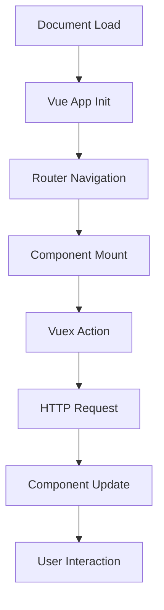

# How to Integrate OpenTelemetry Web Tracing in a Vue.js Application

Author: [nawazdhandala](https://www.github.com/nawazdhandala)

Tags: OpenTelemetry, Vue.js, Web Tracing, JavaScript, Frontend, Browser

Description: Complete guide to implementing OpenTelemetry web tracing in Vue.js applications, including automatic instrumentation, custom spans, and performance monitoring.

Frontend observability is often an afterthought, but it shouldn't be. Your users experience your application through the browser, not your backend logs. When a page loads slowly or an API call hangs, you need to know about it before your users start complaining. OpenTelemetry brings the same level of observability to your Vue.js frontend that you already have on your backend.

## Why Frontend Tracing Matters

Traditional backend tracing tells you what happened on the server, but the story only starts there. After your API returns a response in 50ms, the browser still needs to parse JSON, update the Vue component tree, trigger reactivity, run watchers, update the virtual DOM, and paint to the screen. Any of these steps can bottleneck.

Without frontend tracing, you're missing half the picture. Users report slow experiences, but your backend metrics look fine. The problem is client-side, and you need visibility there.

OpenTelemetry for web gives you:

- Automatic instrumentation for document loads, XHR, and fetch calls
- Custom spans for Vue-specific operations like component lifecycle and reactivity
- Distributed tracing that connects frontend and backend spans
- Performance metrics for navigation timing, resource loading, and rendering

## Installing Dependencies

Start with the core OpenTelemetry packages for web applications:

```bash
npm install @opentelemetry/api \
  @opentelemetry/sdk-trace-web \
  @opentelemetry/instrumentation \
  @opentelemetry/instrumentation-document-load \
  @opentelemetry/instrumentation-fetch \
  @opentelemetry/instrumentation-xml-http-request \
  @opentelemetry/instrumentation-user-interaction \
  @opentelemetry/context-zone \
  @opentelemetry/exporter-trace-otlp-http \
  @opentelemetry/resources \
  @opentelemetry/semantic-conventions
```

These packages provide the SDK, automatic instrumentations, and an OTLP exporter to send traces to your backend collector.

## Creating the Tracing Module

Build a dedicated module to initialize and configure OpenTelemetry. This keeps tracing concerns separate from your application code.

```javascript
// src/utils/tracing.js
import { WebTracerProvider } from '@opentelemetry/sdk-trace-web';
import { BatchSpanProcessor } from '@opentelemetry/sdk-trace-base';
import { OTLPTraceExporter } from '@opentelemetry/exporter-trace-otlp-http';
import { ZoneContextManager } from '@opentelemetry/context-zone';
import { registerInstrumentations } from '@opentelemetry/instrumentation';
import { DocumentLoadInstrumentation } from '@opentelemetry/instrumentation-document-load';
import { FetchInstrumentation } from '@opentelemetry/instrumentation-fetch';
import { XMLHttpRequestInstrumentation } from '@opentelemetry/instrumentation-xml-http-request';
import { UserInteractionInstrumentation } from '@opentelemetry/instrumentation-user-interaction';
import { Resource } from '@opentelemetry/resources';
import { SemanticResourceAttributes } from '@opentelemetry/semantic-conventions';

let tracerProvider;
let vueTracer;

// Initialize OpenTelemetry tracing
export function initTracing(config = {}) {
  const {
    serviceName = 'vue-app',
    serviceVersion = '1.0.0',
    collectorUrl = 'http://localhost:4318/v1/traces',
    environment = 'development',
  } = config;

  // Create a resource that identifies your service
  const resource = new Resource({
    [SemanticResourceAttributes.SERVICE_NAME]: serviceName,
    [SemanticResourceAttributes.SERVICE_VERSION]: serviceVersion,
    [SemanticResourceAttributes.DEPLOYMENT_ENVIRONMENT]: environment,
  });

  // Initialize the tracer provider
  tracerProvider = new WebTracerProvider({
    resource,
  });

  // Configure OTLP exporter to send spans to your collector
  const exporter = new OTLPTraceExporter({
    url: collectorUrl,
    headers: {
      // Add any authentication headers if needed
    },
  });

  // Use BatchSpanProcessor for better performance
  // It batches spans before sending to reduce network calls
  tracerProvider.addSpanProcessor(
    new BatchSpanProcessor(exporter, {
      maxQueueSize: 100,
      maxExportBatchSize: 10,
      scheduledDelayMillis: 500,
    })
  );

  // Register the tracer provider globally
  tracerProvider.register({
    // Zone context manager handles async context propagation
    contextManager: new ZoneContextManager(),
  });

  // Register automatic instrumentations
  registerInstrumentations({
    instrumentations: [
      // Traces document load events (DOMContentLoaded, load, etc.)
      new DocumentLoadInstrumentation(),

      // Traces all fetch API calls
      new FetchInstrumentation({
        propagateTraceHeaderCorsUrls: [/.+/], // Propagate trace context to all URLs
        clearTimingResources: true,
        applyCustomAttributesOnSpan: (span, request, result) => {
          // Add custom attributes to fetch spans
          if (request.url) {
            const url = new URL(request.url);
            span.setAttribute('http.host', url.host);
            span.setAttribute('http.path', url.pathname);
          }
        },
      }),

      // Traces XMLHttpRequest (for libraries that don't use fetch)
      new XMLHttpRequestInstrumentation({
        propagateTraceHeaderCorsUrls: [/.+/],
      }),

      // Traces user interactions like clicks
      new UserInteractionInstrumentation({
        eventNames: ['click', 'submit'],
      }),
    ],
  });

  // Create a tracer for Vue-specific spans
  vueTracer = tracerProvider.getTracer('vue-tracer');

  return vueTracer;
}

// Get the Vue tracer instance
export function getTracer() {
  if (!vueTracer) {
    throw new Error('Tracing not initialized. Call initTracing() first.');
  }
  return vueTracer;
}

// Shutdown tracing (useful for testing or cleanup)
export async function shutdownTracing() {
  if (tracerProvider) {
    await tracerProvider.shutdown();
  }
}
```

## Initializing Tracing in Your Vue App

Initialize OpenTelemetry before creating your Vue app instance. This ensures all operations are traced from the start.

```javascript
// src/main.js
import { createApp } from 'vue';
import App from './App.vue';
import router from './router';
import store from './store';
import { initTracing } from './utils/tracing';

// Initialize tracing first, before Vue
initTracing({
  serviceName: 'my-vue-app',
  serviceVersion: '1.0.0',
  collectorUrl: import.meta.env.VITE_OTEL_COLLECTOR_URL || 'http://localhost:4318/v1/traces',
  environment: import.meta.env.MODE,
});

// Now create and mount the Vue app
const app = createApp(App);

app.use(router);
app.use(store);

app.mount('#app');
```

## Creating a Vue Plugin for Tracing

Build a Vue plugin that provides tracing utilities throughout your application:

```javascript
// src/plugins/tracing-plugin.js
import { trace, context, SpanStatusCode } from '@opentelemetry/api';
import { getTracer } from '../utils/tracing';

export default {
  install(app) {
    const tracer = getTracer();

    // Add tracing utilities to global properties
    app.config.globalProperties.$tracer = tracer;

    // Helper to create a span
    app.config.globalProperties.$createSpan = function(name, fn, options = {}) {
      const span = tracer.startSpan(name, options);

      return context.with(trace.setSpan(context.active(), span), async () => {
        try {
          const result = await fn(span);
          span.setStatus({ code: SpanStatusCode.OK });
          return result;
        } catch (error) {
          span.recordException(error);
          span.setStatus({
            code: SpanStatusCode.ERROR,
            message: error.message,
          });
          throw error;
        } finally {
          span.end();
        }
      });
    };

    // Helper to add events to the current span
    app.config.globalProperties.$addSpanEvent = function(name, attributes = {}) {
      const currentSpan = trace.getActiveSpan();
      if (currentSpan) {
        currentSpan.addEvent(name, attributes);
      }
    };

    // Helper to set span attributes
    app.config.globalProperties.$setSpanAttributes = function(attributes) {
      const currentSpan = trace.getActiveSpan();
      if (currentSpan) {
        Object.entries(attributes).forEach(([key, value]) => {
          currentSpan.setAttribute(key, value);
        });
      }
    };
  },
};
```

Register the plugin in your main.js:

```javascript
// src/main.js (additional code)
import TracingPlugin from './plugins/tracing-plugin';

app.use(TracingPlugin);
```

## Tracing Vue Router Navigation

Vue Router navigation is a critical part of the user experience. Instrument it to track navigation timing and identify slow route transitions.

```javascript
// src/router/tracing.js
import { trace, SpanStatusCode } from '@opentelemetry/api';
import { getTracer } from '../utils/tracing';

export function setupRouterTracing(router) {
  const tracer = getTracer();
  const navigationSpans = new Map();

  // Start span before each navigation
  router.beforeEach((to, from, next) => {
    const span = tracer.startSpan('vue.router.navigation', {
      attributes: {
        'route.from': from.path,
        'route.to': to.path,
        'route.name': to.name,
        'route.params': JSON.stringify(to.params),
        'route.query': JSON.stringify(to.query),
      },
    });

    // Store span using navigation hash
    const navKey = `${from.path}->${to.path}`;
    navigationSpans.set(navKey, span);

    next();
  });

  // End span after navigation completes
  router.afterEach((to, from) => {
    const navKey = `${from.path}->${to.path}`;
    const span = navigationSpans.get(navKey);

    if (span) {
      span.setStatus({ code: SpanStatusCode.OK });
      span.end();
      navigationSpans.delete(navKey);
    }
  });

  // Handle navigation errors
  router.onError((error) => {
    // Find the most recent span
    const spans = Array.from(navigationSpans.values());
    if (spans.length > 0) {
      const span = spans[spans.length - 1];
      span.recordException(error);
      span.setStatus({
        code: SpanStatusCode.ERROR,
        message: error.message,
      });
      span.end();
    }
  });
}
```

Apply router tracing in your router configuration:

```javascript
// src/router/index.js
import { createRouter, createWebHistory } from 'vue-router';
import { setupRouterTracing } from './tracing';
import Home from '../views/Home.vue';

const routes = [
  {
    path: '/',
    name: 'Home',
    component: Home,
  },
  {
    path: '/dashboard',
    name: 'Dashboard',
    component: () => import('../views/Dashboard.vue'),
  },
];

const router = createRouter({
  history: createWebHistory(),
  routes,
});

// Setup tracing after router is created
setupRouterTracing(router);

export default router;
```

## Tracing Component Lifecycle

Vue components go through a well-defined lifecycle. Tracing these hooks helps identify performance issues in component mounting, updating, and unmounting.

```javascript
// src/composables/useComponentTracing.js
import { onBeforeMount, onMounted, onBeforeUpdate, onUpdated, onBeforeUnmount, onUnmounted, getCurrentInstance } from 'vue';
import { trace, context, SpanStatusCode } from '@opentelemetry/api';
import { getTracer } from '../utils/tracing';

export function useComponentTracing(componentName) {
  const instance = getCurrentInstance();
  const tracer = getTracer();
  let mountSpan = null;
  let updateSpan = null;

  // Get component name from instance if not provided
  const name = componentName || instance?.type?.name || 'UnknownComponent';

  onBeforeMount(() => {
    mountSpan = tracer.startSpan(`vue.component.mount.${name}`, {
      attributes: {
        'component.name': name,
        'component.lifecycle': 'mount',
      },
    });
  });

  onMounted(() => {
    if (mountSpan) {
      mountSpan.setStatus({ code: SpanStatusCode.OK });
      mountSpan.end();
    }
  });

  onBeforeUpdate(() => {
    updateSpan = tracer.startSpan(`vue.component.update.${name}`, {
      attributes: {
        'component.name': name,
        'component.lifecycle': 'update',
      },
    });
  });

  onUpdated(() => {
    if (updateSpan) {
      updateSpan.setStatus({ code: SpanStatusCode.OK });
      updateSpan.end();
    }
  });

  onBeforeUnmount(() => {
    const span = tracer.startSpan(`vue.component.unmount.${name}`, {
      attributes: {
        'component.name': name,
        'component.lifecycle': 'unmount',
      },
    });
    span.setStatus({ code: SpanStatusCode.OK });
    span.end();
  });

  // Return tracer for custom spans
  return {
    tracer,
    createSpan: (name, fn) => {
      const span = tracer.startSpan(`${componentName}.${name}`);
      return context.with(trace.setSpan(context.active(), span), async () => {
        try {
          const result = await fn(span);
          span.setStatus({ code: SpanStatusCode.OK });
          return result;
        } catch (error) {
          span.recordException(error);
          span.setStatus({ code: SpanStatusCode.ERROR });
          throw error;
        } finally {
          span.end();
        }
      });
    },
  };
}
```

Use the composable in your components:

```vue
<!-- src/components/UserProfile.vue -->
<template>
  <div class="user-profile">
    <h2>{{ user.name }}</h2>
    <p>{{ user.email }}</p>
    <button @click="updateProfile">Update Profile</button>
  </div>
</template>

<script>
import { ref } from 'vue';
import { useComponentTracing } from '../composables/useComponentTracing';

export default {
  name: 'UserProfile',
  setup() {
    const { createSpan } = useComponentTracing('UserProfile');
    const user = ref({ name: '', email: '' });

    const updateProfile = () => {
      createSpan('updateProfile', async (span) => {
        span.setAttribute('user.id', user.value.id);

        // Simulate API call
        await new Promise(resolve => setTimeout(resolve, 500));

        user.value.name = 'Updated Name';
        span.addEvent('profile_updated');
      });
    };

    return {
      user,
      updateProfile,
    };
  },
};
</script>
```

## Tracing API Calls with Axios

If you're using Axios instead of fetch, you'll need to manually instrument it since there's no automatic instrumentation:

```javascript
// src/api/client.js
import axios from 'axios';
import { trace, context, SpanStatusCode } from '@opentelemetry/api';
import { getTracer } from '../utils/tracing';

const apiClient = axios.create({
  baseURL: import.meta.env.VITE_API_BASE_URL || 'http://localhost:3000/api',
});

const tracer = getTracer();

// Request interceptor to start spans
apiClient.interceptors.request.use(
  (config) => {
    const span = tracer.startSpan('http.request', {
      attributes: {
        'http.method': config.method.toUpperCase(),
        'http.url': config.url,
        'http.target': config.url,
      },
    });

    // Store span in request config to access in response interceptor
    config.metadata = { span, startTime: Date.now() };

    // Propagate trace context in headers
    const activeContext = trace.setSpan(context.active(), span);
    context.with(activeContext, () => {
      // Inject trace context into request headers
      const traceHeaders = {};
      // You would typically use a propagator here
      config.headers = { ...config.headers, ...traceHeaders };
    });

    return config;
  },
  (error) => {
    return Promise.reject(error);
  }
);

// Response interceptor to end spans
apiClient.interceptors.response.use(
  (response) => {
    const { span, startTime } = response.config.metadata || {};

    if (span) {
      const duration = Date.now() - startTime;
      span.setAttribute('http.status_code', response.status);
      span.setAttribute('http.response_time_ms', duration);
      span.setStatus({ code: SpanStatusCode.OK });
      span.end();
    }

    return response;
  },
  (error) => {
    const { span } = error.config?.metadata || {};

    if (span) {
      if (error.response) {
        span.setAttribute('http.status_code', error.response.status);
      }
      span.recordException(error);
      span.setStatus({
        code: SpanStatusCode.ERROR,
        message: error.message,
      });
      span.end();
    }

    return Promise.reject(error);
  }
);

export default apiClient;
```

## Tracing Vuex Store Actions

State management operations can be performance bottlenecks. Trace Vuex actions to understand their impact:

```javascript
// src/store/plugins/tracing.js
import { trace, context, SpanStatusCode } from '@opentelemetry/api';
import { getTracer } from '../../utils/tracing';

export function createTracingPlugin() {
  const tracer = getTracer();

  return (store) => {
    // Subscribe to all mutations
    store.subscribe((mutation, state) => {
      const span = tracer.startSpan(`vuex.mutation.${mutation.type}`, {
        attributes: {
          'vuex.mutation': mutation.type,
          'vuex.payload': JSON.stringify(mutation.payload),
        },
      });
      span.end();
    });

    // Wrap dispatch to trace actions
    const originalDispatch = store.dispatch;
    store.dispatch = function(type, payload) {
      const span = tracer.startSpan(`vuex.action.${type}`, {
        attributes: {
          'vuex.action': type,
          'vuex.payload': JSON.stringify(payload),
        },
      });

      return context.with(trace.setSpan(context.active(), span), async () => {
        try {
          const result = await originalDispatch.call(this, type, payload);
          span.setStatus({ code: SpanStatusCode.OK });
          return result;
        } catch (error) {
          span.recordException(error);
          span.setStatus({ code: SpanStatusCode.ERROR });
          throw error;
        } finally {
          span.end();
        }
      });
    };
  };
}
```

Add the plugin to your store:

```javascript
// src/store/index.js
import { createStore } from 'vuex';
import { createTracingPlugin } from './plugins/tracing';

const store = createStore({
  state: {
    user: null,
  },
  mutations: {
    setUser(state, user) {
      state.user = user;
    },
  },
  actions: {
    async fetchUser({ commit }, userId) {
      // API call here
      const user = await apiClient.get(`/users/${userId}`);
      commit('setUser', user.data);
      return user.data;
    },
  },
  plugins: [createTracingPlugin()],
});

export default store;
```

## Trace Visualization Flow

Here's how traces flow through your Vue application:



## Performance Considerations

OpenTelemetry adds minimal overhead to your application, typically under 5ms per operation. However, there are some best practices to follow:

**Use Batch Processing**: Always use BatchSpanProcessor in production. It reduces network overhead by batching multiple spans into single export requests.

**Sample Strategically**: You don't need to trace every single user action. Implement sampling to reduce data volume while maintaining visibility.

**Filter Sensitive Data**: Be careful not to include passwords, tokens, or PII in span attributes. Scrub sensitive data before it reaches your spans.

**Limit Span Attributes**: Each span can carry attributes, but don't go overboard. Keep attributes focused on debugging information that adds value.

**Monitor Export Performance**: Watch the performance of your span exporter. If exports are slow, they can queue up and cause memory issues.

## Production Configuration

In production, adjust your configuration for optimal performance:

```javascript
// Production tracing config
initTracing({
  serviceName: 'vue-app',
  serviceVersion: '1.0.0',
  collectorUrl: 'https://your-collector.example.com/v1/traces',
  environment: 'production',
  sampling: {
    // Sample 10% of traces
    probability: 0.1,
  },
});
```

OpenTelemetry brings observability to your Vue.js frontend, giving you the insights needed to deliver fast, reliable user experiences. Start with automatic instrumentation to get quick wins, then add custom spans for Vue-specific operations. Your users will thank you when you catch performance issues before they do.
