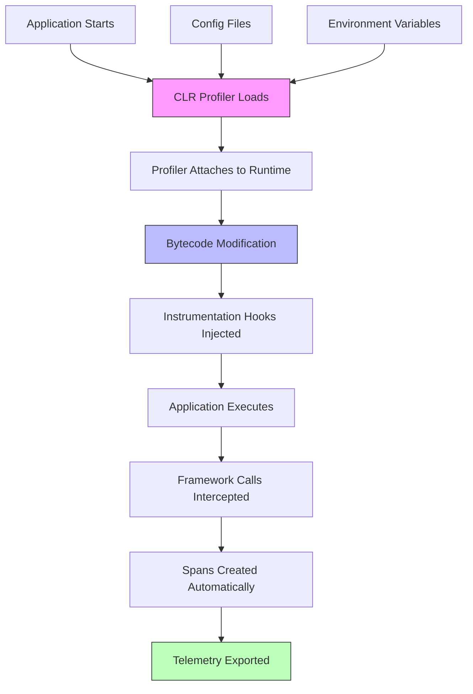

# How to Use OpenTelemetry Zero-Code Instrumentation for .NET Applications

Author: [nawazdhandala](https://www.github.com/nawazdhandala)

Tags: OpenTelemetry, .NET, Zero-Code, Auto-Instrumentation, CLR Profiler

Description: Complete guide to implementing zero-code OpenTelemetry instrumentation in .NET applications using the CLR profiler for automatic tracing without code changes.

Zero-code instrumentation represents a paradigm shift in application observability. Instead of modifying source code to add telemetry, you configure instrumentation at the runtime level using profiling APIs. For .NET applications, this means leveraging the CLR Profiling API to intercept method calls and automatically generate spans for framework operations. This approach is particularly valuable for legacy applications, third-party libraries, or scenarios where you want to add observability without touching the codebase.

## Understanding .NET Auto-Instrumentation

The OpenTelemetry .NET Automatic Instrumentation uses the CLR Profiling API to inject instrumentation code at runtime. When your application starts, the profiler attaches to the .NET runtime and modifies bytecode to add tracing hooks. This process is transparent to your application code and requires no source code changes or recompilation.

The profiler automatically instruments common frameworks and libraries including ASP.NET Core, HttpClient, SQL Client, Entity Framework Core, and many others. You gain distributed tracing capabilities across your entire application stack without writing a single line of instrumentation code.

## How Auto-Instrumentation Works



## Installing the Auto-Instrumentation Agent

The OpenTelemetry .NET Automatic Instrumentation is distributed as a standalone package that you download and extract to your system.

Download the latest release for your platform:

```bash
# For Linux (x64)
curl -L -o otel-dotnet-auto-install.sh https://github.com/open-telemetry/opentelemetry-dotnet-instrumentation/releases/latest/download/otel-dotnet-auto-install.sh

chmod +x otel-dotnet-auto-install.sh
./otel-dotnet-auto-install.sh

# For Windows (PowerShell)
# Download from GitHub releases page or use:
powershell -c "iwr -outf otel-dotnet-auto-install.ps1 https://github.com/open-telemetry/opentelemetry-dotnet-instrumentation/releases/latest/download/otel-dotnet-auto-install.ps1"
.\otel-dotnet-auto-install.ps1

# For macOS (x64)
curl -L -o otel-dotnet-auto-install.sh https://github.com/open-telemetry/opentelemetry-dotnet-instrumentation/releases/latest/download/otel-dotnet-auto-install.sh

chmod +x otel-dotnet-auto-install.sh
./otel-dotnet-auto-install.sh
```

The installation script will download the profiler binaries and set up the necessary files in a default location (typically `$HOME/.otel-dotnet-auto` on Linux/macOS or `%USERPROFILE%\.otel-dotnet-auto` on Windows).

## Configuring Environment Variables

The auto-instrumentation agent is configured entirely through environment variables. Create a script to set up the required variables for your application.

For Linux and macOS, create `start-instrumented.sh`:

```bash
#!/bin/bash

# Path to the auto-instrumentation installation
export OTEL_DOTNET_AUTO_HOME="$HOME/.otel-dotnet-auto"

# Enable the CLR profiler
export CORECLR_ENABLE_PROFILING=1
export CORECLR_PROFILER={918728DD-259F-4A6A-AC2B-B85E1B658318}
export CORECLR_PROFILER_PATH="$OTEL_DOTNET_AUTO_HOME/linux-x64/OpenTelemetry.AutoInstrumentation.Native.so"

# Configure OpenTelemetry
export OTEL_DOTNET_AUTO_PLUGINS="TestApplication.AutoInstrumentation.Plugin, TestApplication"

# Service name and resource attributes
export OTEL_SERVICE_NAME="my-dotnet-app"
export OTEL_RESOURCE_ATTRIBUTES="deployment.environment=production,service.version=1.0.0"

# Configure exporter endpoint
export OTEL_EXPORTER_OTLP_ENDPOINT="http://localhost:4317"
export OTEL_EXPORTER_OTLP_PROTOCOL="grpc"

# Configure tracing
export OTEL_TRACES_EXPORTER="otlp"
export OTEL_METRICS_EXPORTER="otlp"
export OTEL_LOGS_EXPORTER="otlp"

# Log level for troubleshooting
export OTEL_DOTNET_AUTO_LOG_DIRECTORY="./logs"
export OTEL_LOG_LEVEL="info"

# Path to additional instrumentation libraries
export DOTNET_ADDITIONAL_DEPS="$OTEL_DOTNET_AUTO_HOME/AdditionalDeps"
export DOTNET_SHARED_STORE="$OTEL_DOTNET_AUTO_HOME/store"
export DOTNET_STARTUP_HOOKS="$OTEL_DOTNET_AUTO_HOME/net/OpenTelemetry.AutoInstrumentation.StartupHook.dll"

# Start your application
dotnet run --project ./MyApp.csproj
```

For Windows, create `start-instrumented.ps1`:

```powershell
# Path to the auto-instrumentation installation
$env:OTEL_DOTNET_AUTO_HOME = "$env:USERPROFILE\.otel-dotnet-auto"

# Enable the CLR profiler
$env:CORECLR_ENABLE_PROFILING = "1"
$env:CORECLR_PROFILER = "{918728DD-259F-4A6A-AC2B-B85E1B658318}"
$env:CORECLR_PROFILER_PATH = "$env:OTEL_DOTNET_AUTO_HOME\win-x64\OpenTelemetry.AutoInstrumentation.Native.dll"

# Service name and resource attributes
$env:OTEL_SERVICE_NAME = "my-dotnet-app"
$env:OTEL_RESOURCE_ATTRIBUTES = "deployment.environment=production,service.version=1.0.0"

# Configure exporter endpoint
$env:OTEL_EXPORTER_OTLP_ENDPOINT = "http://localhost:4317"
$env:OTEL_EXPORTER_OTLP_PROTOCOL = "grpc"

# Configure exporters
$env:OTEL_TRACES_EXPORTER = "otlp"
$env:OTEL_METRICS_EXPORTER = "otlp"
$env:OTEL_LOGS_EXPORTER = "otlp"

# Log directory
$env:OTEL_DOTNET_AUTO_LOG_DIRECTORY = ".\logs"
$env:OTEL_LOG_LEVEL = "info"

# Additional dependencies
$env:DOTNET_ADDITIONAL_DEPS = "$env:OTEL_DOTNET_AUTO_HOME\AdditionalDeps"
$env:DOTNET_SHARED_STORE = "$env:OTEL_DOTNET_AUTO_HOME\store"
$env:DOTNET_STARTUP_HOOKS = "$env:OTEL_DOTNET_AUTO_HOME\net\OpenTelemetry.AutoInstrumentation.StartupHook.dll"

# Start your application
dotnet run --project .\MyApp.csproj
```

Make the script executable and run it:

```bash
# Linux/macOS
chmod +x start-instrumented.sh
./start-instrumented.sh

# Windows
.\start-instrumented.ps1
```

## Configuring Instrumentation Settings

You can customize which libraries are instrumented and configure specific instrumentation options using environment variables.

```bash
# Enable specific instrumentations (comma-separated list)
export OTEL_DOTNET_AUTO_TRACES_INSTRUMENTATION_ENABLED="true"

# Disable specific instrumentations
export OTEL_DOTNET_AUTO_TRACES_ASPNETCORE_INSTRUMENTATION_ENABLED="false"

# Configure individual instrumentation options
# ASP.NET Core options
export OTEL_DOTNET_AUTO_TRACES_ASPNETCORE_INSTRUMENTATION_RECORD_EXCEPTION="true"

# HTTP Client options
export OTEL_DOTNET_AUTO_TRACES_HTTPCLIENT_INSTRUMENTATION_ENABLED="true"

# SQL Client options
export OTEL_DOTNET_AUTO_TRACES_SQLCLIENT_INSTRUMENTATION_ENABLED="true"
export OTEL_DOTNET_AUTO_TRACES_SQLCLIENT_INSTRUMENTATION_SET_DB_STATEMENT_FOR_TEXT="true"

# Entity Framework Core options
export OTEL_DOTNET_AUTO_TRACES_ENTITYFRAMEWORKCORE_INSTRUMENTATION_ENABLED="true"
export OTEL_DOTNET_AUTO_TRACES_ENTITYFRAMEWORKCORE_INSTRUMENTATION_SET_DB_STATEMENT_FOR_TEXT="true"
```

## Using Configuration Files

For more complex configurations, create a configuration file to manage settings.

Create `otel-config.json`:

```json
{
  "service": {
    "name": "my-dotnet-app",
    "version": "1.0.0"
  },
  "resource": {
    "attributes": {
      "deployment.environment": "production",
      "service.namespace": "my-company",
      "host.name": "${HOSTNAME}"
    }
  },
  "exporter": {
    "otlp": {
      "endpoint": "http://localhost:4317",
      "protocol": "grpc",
      "headers": "authorization=Bearer ${API_TOKEN}"
    }
  },
  "traces": {
    "enabled": true,
    "exporter": "otlp",
    "instrumentations": {
      "aspnetcore": {
        "enabled": true,
        "recordException": true,
        "enableGrpcAspNetCoreSupport": true
      },
      "httpclient": {
        "enabled": true,
        "recordException": true
      },
      "sqlclient": {
        "enabled": true,
        "setDbStatementForText": true,
        "setDbStatementForStoredProcedure": true,
        "recordException": true
      },
      "entityframeworkcore": {
        "enabled": true,
        "setDbStatementForText": true
      },
      "grpcnetclient": {
        "enabled": true
      }
    }
  },
  "metrics": {
    "enabled": true,
    "exporter": "otlp",
    "instrumentations": {
      "aspnetcore": {
        "enabled": true
      },
      "httpclient": {
        "enabled": true
      },
      "netruntime": {
        "enabled": true
      }
    }
  },
  "logs": {
    "enabled": true,
    "exporter": "otlp",
    "includeFormattedMessage": true
  }
}
```

Reference the configuration file with an environment variable:

```bash
export OTEL_DOTNET_AUTO_CONFIG_FILE="./otel-config.json"
```

## Instrumenting ASP.NET Core Applications

Zero-code instrumentation works seamlessly with ASP.NET Core applications. Here's a sample application that will be automatically instrumented.

```csharp
// Program.cs - No instrumentation code needed
var builder = WebApplication.CreateBuilder(args);

builder.Services.AddControllers();
builder.Services.AddEndpointsApiExplorer();
builder.Services.AddSwaggerGen();

// Add database context (EF Core will be auto-instrumented)
builder.Services.AddDbContext<ApplicationDbContext>(options =>
    options.UseSqlServer(builder.Configuration.GetConnectionString("DefaultConnection")));

// Add HTTP client (will be auto-instrumented)
builder.Services.AddHttpClient<ExternalApiService>();

var app = builder.Build();

if (app.Environment.IsDevelopment())
{
    app.UseSwagger();
    app.UseSwaggerUI();
}

app.UseHttpsRedirection();
app.UseAuthorization();
app.MapControllers();

app.Run();
```

Create a sample controller:

```csharp
using Microsoft.AspNetCore.Mvc;
using Microsoft.EntityFrameworkCore;

namespace MyApp.Controllers;

[ApiController]
[Route("api/[controller]")]
public class ProductsController : ControllerBase
{
    private readonly ApplicationDbContext _context;
    private readonly ExternalApiService _externalApi;
    private readonly ILogger<ProductsController> _logger;

    public ProductsController(
        ApplicationDbContext context,
        ExternalApiService externalApi,
        ILogger<ProductsController> logger)
    {
        _context = context;
        _externalApi = externalApi;
        _logger = logger;
    }

    // All operations will be automatically traced
    [HttpGet]
    public async Task<ActionResult<IEnumerable<Product>>> GetProducts()
    {
        _logger.LogInformation("Fetching all products");

        // Database query automatically traced
        var products = await _context.Products
            .Include(p => p.Category)
            .ToListAsync();

        return Ok(products);
    }

    [HttpGet("{id}")]
    public async Task<ActionResult<Product>> GetProduct(int id)
    {
        _logger.LogInformation("Fetching product {ProductId}", id);

        // Database query automatically traced
        var product = await _context.Products
            .Include(p => p.Category)
            .FirstOrDefaultAsync(p => p.Id == id);

        if (product == null)
        {
            return NotFound();
        }

        // External API call automatically traced
        var enrichedData = await _externalApi.GetProductDetailsAsync(id);

        return Ok(new { product, enrichedData });
    }

    [HttpPost]
    public async Task<ActionResult<Product>> CreateProduct(Product product)
    {
        _logger.LogInformation("Creating new product: {ProductName}", product.Name);

        // Database operations automatically traced
        _context.Products.Add(product);
        await _context.SaveChangesAsync();

        return CreatedAtAction(nameof(GetProduct), new { id = product.Id }, product);
    }
}
```

Create a service that makes external HTTP calls:

```csharp
namespace MyApp.Services;

public class ExternalApiService
{
    private readonly HttpClient _httpClient;
    private readonly ILogger<ExternalApiService> _logger;

    public ExternalApiService(
        HttpClient httpClient,
        ILogger<ExternalApiService> logger)
    {
        _httpClient = httpClient;
        _httpClient.BaseAddress = new Uri("https://api.external-service.com");
        _logger = logger;
    }

    // HTTP calls automatically traced
    public async Task<ExternalProductData> GetProductDetailsAsync(int productId)
    {
        _logger.LogInformation("Fetching external product data for {ProductId}", productId);

        try
        {
            var response = await _httpClient.GetAsync($"/products/{productId}");
            response.EnsureSuccessStatusCode();

            return await response.Content.ReadFromJsonAsync<ExternalProductData>()
                ?? new ExternalProductData();
        }
        catch (HttpRequestException ex)
        {
            _logger.LogError(ex, "Failed to fetch external product data");
            throw;
        }
    }
}

public class ExternalProductData
{
    public string? AdditionalInfo { get; set; }
    public decimal ExternalPrice { get; set; }
}
```

## Docker Deployment

Deploy auto-instrumented .NET applications in Docker containers.

Create a `Dockerfile`:

```dockerfile
FROM mcr.microsoft.com/dotnet/aspnet:8.0 AS base
WORKDIR /app
EXPOSE 80
EXPOSE 443

# Install auto-instrumentation
RUN apt-get update && apt-get install -y curl unzip
RUN curl -L -o /tmp/otel-dotnet-auto.zip \
    https://github.com/open-telemetry/opentelemetry-dotnet-instrumentation/releases/latest/download/opentelemetry-dotnet-instrumentation-linux-glibc-x64.zip
RUN unzip /tmp/otel-dotnet-auto.zip -d /otel-auto-instrumentation
RUN rm /tmp/otel-dotnet-auto.zip

FROM mcr.microsoft.com/dotnet/sdk:8.0 AS build
WORKDIR /src
COPY ["MyApp/MyApp.csproj", "MyApp/"]
RUN dotnet restore "MyApp/MyApp.csproj"
COPY . .
WORKDIR "/src/MyApp"
RUN dotnet build "MyApp.csproj" -c Release -o /app/build

FROM build AS publish
RUN dotnet publish "MyApp.csproj" -c Release -o /app/publish

FROM base AS final
WORKDIR /app
COPY --from=publish /app/publish .

# Configure auto-instrumentation environment variables
ENV CORECLR_ENABLE_PROFILING=1
ENV CORECLR_PROFILER={918728DD-259F-4A6A-AC2B-B85E1B658318}
ENV CORECLR_PROFILER_PATH=/otel-auto-instrumentation/linux-x64/OpenTelemetry.AutoInstrumentation.Native.so
ENV DOTNET_ADDITIONAL_DEPS=/otel-auto-instrumentation/AdditionalDeps
ENV DOTNET_SHARED_STORE=/otel-auto-instrumentation/store
ENV DOTNET_STARTUP_HOOKS=/otel-auto-instrumentation/net/OpenTelemetry.AutoInstrumentation.StartupHook.dll
ENV OTEL_DOTNET_AUTO_HOME=/otel-auto-instrumentation

# These will be overridden at runtime
ENV OTEL_SERVICE_NAME=my-dotnet-app
ENV OTEL_EXPORTER_OTLP_ENDPOINT=http://otel-collector:4317

ENTRYPOINT ["dotnet", "MyApp.dll"]
```

Create a `docker-compose.yml` with collector:

```yaml
version: '3.8'

services:
  app:
    build: .
    ports:
      - "8080:80"
    environment:
      - OTEL_SERVICE_NAME=my-dotnet-app
      - OTEL_EXPORTER_OTLP_ENDPOINT=http://otel-collector:4317
      - OTEL_EXPORTER_OTLP_PROTOCOL=grpc
      - OTEL_TRACES_EXPORTER=otlp
      - OTEL_METRICS_EXPORTER=otlp
      - OTEL_RESOURCE_ATTRIBUTES=deployment.environment=docker,service.version=1.0.0
      - ConnectionStrings__DefaultConnection=Server=db;Database=MyAppDb;User=sa;Password=YourStrong@Passw0rd
    depends_on:
      - otel-collector
      - db

  otel-collector:
    image: otel/opentelemetry-collector-contrib:latest
    command: ["--config=/etc/otel-collector-config.yaml"]
    volumes:
      - ./otel-collector-config.yaml:/etc/otel-collector-config.yaml
    ports:
      - "4317:4317"   # OTLP gRPC
      - "4318:4318"   # OTLP HTTP
      - "8888:8888"   # Prometheus metrics
      - "13133:13133" # Health check

  db:
    image: mcr.microsoft.com/mssql/server:2022-latest
    environment:
      - ACCEPT_EULA=Y
      - SA_PASSWORD=YourStrong@Passw0rd
    ports:
      - "1433:1433"
```

## Kubernetes Deployment

Deploy with auto-instrumentation in Kubernetes using init containers.

```yaml
apiVersion: apps/v1
kind: Deployment
metadata:
  name: dotnet-app
spec:
  replicas: 3
  selector:
    matchLabels:
      app: dotnet-app
  template:
    metadata:
      labels:
        app: dotnet-app
    spec:
      # Init container to install auto-instrumentation
      initContainers:
      - name: otel-auto-instrumentation-installer
        image: ghcr.io/open-telemetry/opentelemetry-dotnet-instrumentation/autoinstrumentation-dotnet:latest
        command: ["/bin/sh", "-c"]
        args:
        - cp -r /autoinstrumentation/* /otel-auto-instrumentation
        volumeMounts:
        - name: otel-auto-instrumentation
          mountPath: /otel-auto-instrumentation

      containers:
      - name: app
        image: myregistry/my-dotnet-app:latest
        ports:
        - containerPort: 80
        env:
        # Auto-instrumentation configuration
        - name: CORECLR_ENABLE_PROFILING
          value: "1"
        - name: CORECLR_PROFILER
          value: "{918728DD-259F-4A6A-AC2B-B85E1B658318}"
        - name: CORECLR_PROFILER_PATH
          value: /otel-auto-instrumentation/linux-x64/OpenTelemetry.AutoInstrumentation.Native.so
        - name: DOTNET_ADDITIONAL_DEPS
          value: /otel-auto-instrumentation/AdditionalDeps
        - name: DOTNET_SHARED_STORE
          value: /otel-auto-instrumentation/store
        - name: DOTNET_STARTUP_HOOKS
          value: /otel-auto-instrumentation/net/OpenTelemetry.AutoInstrumentation.StartupHook.dll
        - name: OTEL_DOTNET_AUTO_HOME
          value: /otel-auto-instrumentation

        # Service configuration
        - name: OTEL_SERVICE_NAME
          value: my-dotnet-app
        - name: OTEL_EXPORTER_OTLP_ENDPOINT
          value: http://otel-collector:4317
        - name: OTEL_EXPORTER_OTLP_PROTOCOL
          value: grpc
        - name: OTEL_RESOURCE_ATTRIBUTES
          value: deployment.environment=production,k8s.namespace=$(K8S_NAMESPACE),k8s.pod.name=$(K8S_POD_NAME)

        # Inject Kubernetes metadata
        - name: K8S_NAMESPACE
          valueFrom:
            fieldRef:
              fieldPath: metadata.namespace
        - name: K8S_POD_NAME
          valueFrom:
            fieldRef:
              fieldPath: metadata.name

        volumeMounts:
        - name: otel-auto-instrumentation
          mountPath: /otel-auto-instrumentation

        resources:
          limits:
            memory: "512Mi"
            cpu: "500m"
          requests:
            memory: "256Mi"
            cpu: "250m"

      volumes:
      - name: otel-auto-instrumentation
        emptyDir: {}
```

## Troubleshooting

Enable debug logging to diagnose issues:

```bash
export OTEL_LOG_LEVEL="debug"
export OTEL_DOTNET_AUTO_LOG_DIRECTORY="./logs"
```

Check the log files in the specified directory for detailed information about what's being instrumented.

Verify profiler is loaded:

```bash
# Set environment variable to see profiler status
export CORECLR_PROFILER_LOG_LEVEL=1
export CORECLR_PROFILER_LOG_PATH="./profiler.log"
```

## Limitations and Considerations

Auto-instrumentation adds overhead to application startup and may slightly impact runtime performance. Test thoroughly in staging environments before production deployment.

Not all libraries are automatically instrumented. Check the official documentation for the list of supported libraries. For custom instrumentation, you'll need to add manual instrumentation code.

The CLR profiler can conflict with other profilers like Application Insights or diagnostic tools. Only one profiler can be active at a time.

Zero-code instrumentation is powerful for adding observability to existing applications without source code changes. It's ideal for legacy systems, quick proof-of-concepts, or situations where modifying code isn't practical. However, for new applications or when fine-grained control is needed, consider combining auto-instrumentation with manual instrumentation for custom business logic tracing.
