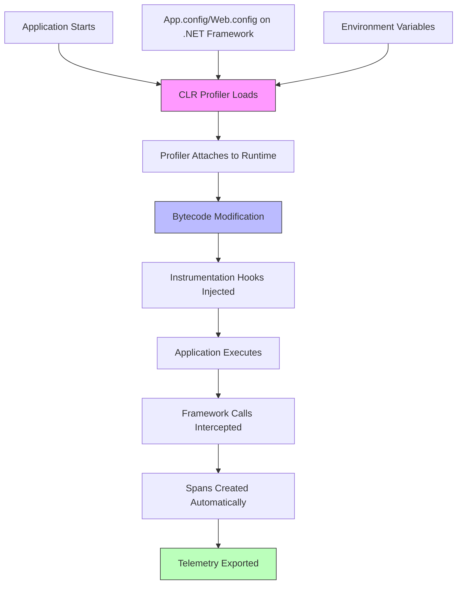

# How to Use OpenTelemetry Zero-Code Instrumentation for .NET Applications

Author: [nawazdhandala](https://www.github.com/nawazdhandala)

Tags: OpenTelemetry, .NET, Zero-Code, Auto-Instrumentation, CLR Profiler

Description: Complete guide to implementing zero-code OpenTelemetry instrumentation in .NET applications using the CLR profiler for automatic tracing without code changes.

Zero-code instrumentation represents a paradigm shift in application observability. Instead of modifying source code to add telemetry, you configure instrumentation at the runtime level using profiling APIs. For .NET applications, this means leveraging the CLR Profiling API to intercept method calls and automatically generate spans for framework operations. This approach is particularly valuable for legacy applications, third-party libraries, or scenarios where you want to add observability without touching the codebase.

## Understanding .NET Auto-Instrumentation

The OpenTelemetry .NET Automatic Instrumentation injects and configures the OpenTelemetry .NET SDK and adds instrumentation for supported packages and APIs. When the CLR profiler is enabled, it can also add bytecode instrumentation at runtime. This process is transparent to your application code and requires no source code changes or recompilation.

The profiler automatically instruments common frameworks and libraries including ASP.NET Core, HttpClient, SQL Client, Entity Framework Core, and many others. You gain distributed tracing capabilities across your entire application stack without writing a single line of instrumentation code.

## How Auto-Instrumentation Works


```mermaid
graph TB
    A[Application Starts] --> B[CLR Profiler Loads]
    B --> C[Profiler Attaches to Runtime]
    C --> D[Bytecode Modification]
    D --> E[Instrumentation Hooks Injected]
    E --> F[Application Executes]
    F --> G[Framework Calls Intercepted]
    G --> H[Spans Created Automatically]
    H --> I[Telemetry Exported]

    J[App.config/Web.config on .NET Framework] --> B
    K[Environment Variables] --> B

    style B fill:#f9f,stroke:#333
    style D fill:#bbf,stroke:#333
    style I fill:#bfb,stroke:#333
```

## Installing the Auto-Instrumentation Agent

The OpenTelemetry .NET Automatic Instrumentation is distributed as a standalone package that you download and extract to your system.

Download the latest release for your platform:

```bash
# For Linux (x64)

curl -L -o otel-dotnet-auto-install.sh https://github.com/open-telemetry/opentelemetry-dotnet-instrumentation/releases/latest/download/otel-dotnet-auto-install.sh

chmod +x otel-dotnet-auto-install.sh
./otel-dotnet-auto-install.sh
```

```powershell
# For Windows (PowerShell 5.1, run as Administrator)
$module_url = "https://github.com/open-telemetry/opentelemetry-dotnet-instrumentation/releases/latest/download/OpenTelemetry.DotNet.Auto.psm1"
$download_path = Join-Path $env:temp "OpenTelemetry.DotNet.Auto.psm1"
Invoke-WebRequest -Uri $module_url -OutFile $download_path -UseBasicParsing
Import-Module $download_path
Install-OpenTelemetryCore
```

```bash
# For macOS
curl -L -o otel-dotnet-auto-install.sh https://github.com/open-telemetry/opentelemetry-dotnet-instrumentation/releases/latest/download/otel-dotnet-auto-install.sh

chmod +x otel-dotnet-auto-install.sh
./otel-dotnet-auto-install.sh
```

The installation script will download the profiler binaries and set up the necessary files in a default location (typically `$HOME/.otel-dotnet-auto` on Linux/macOS). On Windows, the PowerShell module installs to `C:\Program Files\OpenTelemetry .NET AutoInstrumentation` by default.

## Configuring Environment Variables

The auto-instrumentation agent is primarily configured through environment variables. Create a script to set up the required variables for your application.

For Linux x64, create `start-instrumented.sh`:

```bash
#!/bin/bash

# Path to the auto-instrumentation installation
export OTEL_DOTNET_AUTO_HOME="$HOME/.otel-dotnet-auto"

# Enable the CLR profiler
export CORECLR_ENABLE_PROFILING=1
export CORECLR_PROFILER={918728DD-259F-4A6A-AC2B-B85E1B658318}
export CORECLR_PROFILER_PATH="$OTEL_DOTNET_AUTO_HOME/linux-x64/OpenTelemetry.AutoInstrumentation.Native.so"

# Service name and resource attributes
export OTEL_SERVICE_NAME="my-dotnet-app"
export OTEL_RESOURCE_ATTRIBUTES="deployment.environment=production,service.version=1.0.0"

# Configure exporter endpoint
export OTEL_EXPORTER_OTLP_ENDPOINT="http://localhost:4318"
export OTEL_EXPORTER_OTLP_PROTOCOL="http/protobuf"

# Configure tracing
export OTEL_TRACES_EXPORTER="otlp"
export OTEL_METRICS_EXPORTER="otlp"
export OTEL_LOGS_EXPORTER="otlp"

# Log level for troubleshooting
export OTEL_DOTNET_AUTO_LOG_DIRECTORY="./logs"
export OTEL_LOG_LEVEL="info"

# Path to additional instrumentation libraries
export DOTNET_ADDITIONAL_DEPS="$OTEL_DOTNET_AUTO_HOME/AdditionalDeps"
export DOTNET_SHARED_STORE="$OTEL_DOTNET_AUTO_HOME/store"
export DOTNET_STARTUP_HOOKS="$OTEL_DOTNET_AUTO_HOME/net/OpenTelemetry.AutoInstrumentation.StartupHook.dll"

# Start your application
dotnet run --project ./MyApp.csproj
```

On macOS, use the macOS native profiler path instead:

```bash
export CORECLR_PROFILER_PATH="$OTEL_DOTNET_AUTO_HOME/osx-arm64/OpenTelemetry.AutoInstrumentation.Native.dylib"
```

For Windows, create `start-instrumented.ps1`:

```powershell
# Path to the auto-instrumentation installation
$env:OTEL_DOTNET_AUTO_HOME = "C:\Program Files\OpenTelemetry .NET AutoInstrumentation"

# Enable the CLR profiler
$env:CORECLR_ENABLE_PROFILING = "1"
$env:CORECLR_PROFILER = "{918728DD-259F-4A6A-AC2B-B85E1B658318}"
$env:CORECLR_PROFILER_PATH_64 = "$env:OTEL_DOTNET_AUTO_HOME\win-x64\OpenTelemetry.AutoInstrumentation.Native.dll"

# Service name and resource attributes
$env:OTEL_SERVICE_NAME = "my-dotnet-app"
$env:OTEL_RESOURCE_ATTRIBUTES = "deployment.environment=production,service.version=1.0.0"

# Configure exporter endpoint
$env:OTEL_EXPORTER_OTLP_ENDPOINT = "http://localhost:4318"
$env:OTEL_EXPORTER_OTLP_PROTOCOL = "http/protobuf"

# Configure exporters
$env:OTEL_TRACES_EXPORTER = "otlp"
$env:OTEL_METRICS_EXPORTER = "otlp"
$env:OTEL_LOGS_EXPORTER = "otlp"

# Log directory
$env:OTEL_DOTNET_AUTO_LOG_DIRECTORY = ".\logs"
$env:OTEL_LOG_LEVEL = "info"

# Additional dependencies
$env:DOTNET_ADDITIONAL_DEPS = "$env:OTEL_DOTNET_AUTO_HOME\AdditionalDeps"
$env:DOTNET_SHARED_STORE = "$env:OTEL_DOTNET_AUTO_HOME\store"
$env:DOTNET_STARTUP_HOOKS = "$env:OTEL_DOTNET_AUTO_HOME\net\OpenTelemetry.AutoInstrumentation.StartupHook.dll"

# Start your application
dotnet run --project .\MyApp.csproj
```

Make the script executable and run it:

```bash
# Linux/macOS
chmod +x start-instrumented.sh
./start-instrumented.sh

# Windows
.\start-instrumented.ps1
```

## Configuring Instrumentation Settings

You can customize which libraries are instrumented and configure specific instrumentation options using environment variables.

```bash
# Enable all trace instrumentations
export OTEL_DOTNET_AUTO_TRACES_INSTRUMENTATION_ENABLED="true"

# Disable specific instrumentations
export OTEL_DOTNET_AUTO_TRACES_ASPNETCORE_INSTRUMENTATION_ENABLED="false"

# HTTP Client options
export OTEL_DOTNET_AUTO_TRACES_HTTPCLIENT_INSTRUMENTATION_ENABLED="true"

# SQL Client options
export OTEL_DOTNET_AUTO_TRACES_SQLCLIENT_INSTRUMENTATION_ENABLED="true"
export OTEL_DOTNET_AUTO_SQLCLIENT_SET_DBSTATEMENT_FOR_TEXT="true"

# Entity Framework Core options
export OTEL_DOTNET_AUTO_TRACES_ENTITYFRAMEWORKCORE_INSTRUMENTATION_ENABLED="true"
export OTEL_DOTNET_AUTO_ENTITYFRAMEWORKCORE_SET_DBSTATEMENT_FOR_TEXT="true"
```

## Using Configuration Files

For .NET Framework applications, you can also set supported `OTEL_*` settings in `App.config` or `Web.config`. Environment variables take precedence.

Create `App.config` or update `Web.config`:

```xml
<configuration>
  <appSettings>
    <add key="OTEL_SERVICE_NAME" value="my-dotnet-app" />
    <add key="OTEL_RESOURCE_ATTRIBUTES" value="deployment.environment=production,service.version=1.0.0" />
    <add key="OTEL_EXPORTER_OTLP_ENDPOINT" value="http://localhost:4318" />
    <add key="OTEL_EXPORTER_OTLP_PROTOCOL" value="http/protobuf" />
    <add key="OTEL_TRACES_EXPORTER" value="otlp" />
    <add key="OTEL_METRICS_EXPORTER" value="otlp" />
    <add key="OTEL_LOGS_EXPORTER" value="otlp" />
  </appSettings>
</configuration>
```

Only supported `OTEL_*` settings can be configured this way. Runtime and profiler settings such as `OTEL_DOTNET_AUTO_HOME`, `CORECLR_ENABLE_PROFILING`, and `CORECLR_PROFILER_PATH` still need to be set outside the application configuration file.

## Instrumenting ASP.NET Core Applications

Zero-code instrumentation works seamlessly with ASP.NET Core applications. Here's a sample application that will be automatically instrumented.

```csharp
// Program.cs - No instrumentation code needed
var builder = WebApplication.CreateBuilder(args);

builder.Services.AddControllers();
builder.Services.AddEndpointsApiExplorer();
builder.Services.AddSwaggerGen();

// Add database context (EF Core will be auto-instrumented)
builder.Services.AddDbContext<ApplicationDbContext>(options =>
    options.UseSqlServer(builder.Configuration.GetConnectionString("DefaultConnection")));

// Add HTTP client (will be auto-instrumented)
builder.Services.AddHttpClient<ExternalApiService>();

var app = builder.Build();

if (app.Environment.IsDevelopment())
{
    app.UseSwagger();
    app.UseSwaggerUI();
}

app.UseHttpsRedirection();
app.UseAuthorization();
app.MapControllers();

app.Run();
```

Create a sample controller:

```csharp
using Microsoft.AspNetCore.Mvc;
using Microsoft.EntityFrameworkCore;

namespace MyApp.Controllers;

[ApiController]
[Route("api/[controller]")]
public class ProductsController : ControllerBase
{
    private readonly ApplicationDbContext _context;
    private readonly ExternalApiService _externalApi;
    private readonly ILogger<ProductsController> _logger;

    public ProductsController(
        ApplicationDbContext context,
        ExternalApiService externalApi,
        ILogger<ProductsController> logger)
    {
        _context = context;
        _externalApi = externalApi;
        _logger = logger;
    }

    // All operations will be automatically traced
    [HttpGet]
    public async Task<ActionResult<IEnumerable<Product>>> GetProducts()
    {
        _logger.LogInformation("Fetching all products");

        // Database query automatically traced
        var products = await _context.Products
            .Include(p => p.Category)
            .ToListAsync();

        return Ok(products);
    }

    [HttpGet("{id}")]
    public async Task<ActionResult<Product>> GetProduct(int id)
    {
        _logger.LogInformation("Fetching product {ProductId}", id);

        // Database query automatically traced
        var product = await _context.Products
            .Include(p => p.Category)
            .FirstOrDefaultAsync(p => p.Id == id);

        if (product == null)
        {
            return NotFound();
        }

        // External API call automatically traced
        var enrichedData = await _externalApi.GetProductDetailsAsync(id);

        return Ok(new { product, enrichedData });
    }

    [HttpPost]
    public async Task<ActionResult<Product>> CreateProduct(Product product)
    {
        _logger.LogInformation("Creating new product: {ProductName}", product.Name);

        // Database operations automatically traced
        _context.Products.Add(product);
        await _context.SaveChangesAsync();

        return CreatedAtAction(nameof(GetProduct), new { id = product.Id }, product);
    }
}
```

Create a service that makes external HTTP calls:

```csharp
namespace MyApp.Services;

public class ExternalApiService
{
    private readonly HttpClient _httpClient;
    private readonly ILogger<ExternalApiService> _logger;

    public ExternalApiService(
        HttpClient httpClient,
        ILogger<ExternalApiService> logger)
    {
        _httpClient = httpClient;
        _httpClient.BaseAddress = new Uri("https://api.external-service.com");
        _logger = logger;
    }

    // HTTP calls automatically traced
    public async Task<ExternalProductData> GetProductDetailsAsync(int productId)
    {
        _logger.LogInformation("Fetching external product data for {ProductId}", productId);

        try
        {
            var response = await _httpClient.GetAsync($"/products/{productId}");
            response.EnsureSuccessStatusCode();

            return await response.Content.ReadFromJsonAsync<ExternalProductData>()
                ?? new ExternalProductData();
        }
        catch (HttpRequestException ex)
        {
            _logger.LogError(ex, "Failed to fetch external product data");
            throw;
        }
    }
}

public class ExternalProductData
{
    public string? AdditionalInfo { get; set; }
    public decimal ExternalPrice { get; set; }
}
```

## Docker Deployment

Deploy auto-instrumented .NET applications in Docker containers.

Create a `Dockerfile`:

```dockerfile
FROM mcr.microsoft.com/dotnet/aspnet:8.0 AS base
WORKDIR /app
EXPOSE 80
EXPOSE 443

# Install auto-instrumentation
RUN apt-get update && apt-get install -y curl unzip
RUN curl -L -o /tmp/otel-dotnet-auto.zip \
    https://github.com/open-telemetry/opentelemetry-dotnet-instrumentation/releases/latest/download/opentelemetry-dotnet-instrumentation-linux-glibc-x64.zip
RUN unzip /tmp/otel-dotnet-auto.zip -d /otel-auto-instrumentation
RUN rm /tmp/otel-dotnet-auto.zip

FROM mcr.microsoft.com/dotnet/sdk:8.0 AS build
WORKDIR /src
COPY ["MyApp/MyApp.csproj", "MyApp/"]
RUN dotnet restore "MyApp/MyApp.csproj"
COPY . .
WORKDIR "/src/MyApp"
RUN dotnet build "MyApp.csproj" -c Release -o /app/build

FROM build AS publish
RUN dotnet publish "MyApp.csproj" -c Release -o /app/publish

FROM base AS final
WORKDIR /app
COPY --from=publish /app/publish .

# Configure auto-instrumentation environment variables
ENV CORECLR_ENABLE_PROFILING=1
ENV CORECLR_PROFILER={918728DD-259F-4A6A-AC2B-B85E1B658318}
ENV CORECLR_PROFILER_PATH=/otel-auto-instrumentation/linux-x64/OpenTelemetry.AutoInstrumentation.Native.so
ENV DOTNET_ADDITIONAL_DEPS=/otel-auto-instrumentation/AdditionalDeps
ENV DOTNET_SHARED_STORE=/otel-auto-instrumentation/store
ENV DOTNET_STARTUP_HOOKS=/otel-auto-instrumentation/net/OpenTelemetry.AutoInstrumentation.StartupHook.dll
ENV OTEL_DOTNET_AUTO_HOME=/otel-auto-instrumentation

# These will be overridden at runtime
ENV OTEL_SERVICE_NAME=my-dotnet-app
ENV OTEL_EXPORTER_OTLP_ENDPOINT=http://otel-collector:4318

ENTRYPOINT ["dotnet", "MyApp.dll"]
```

Create a `docker-compose.yml` with collector:

```yaml
version: '3.8'

services:
  app:
    build: .
    ports:
      - "8080:80"
    environment:
      - OTEL_SERVICE_NAME=my-dotnet-app
      - OTEL_EXPORTER_OTLP_ENDPOINT=http://otel-collector:4318
      - OTEL_EXPORTER_OTLP_PROTOCOL=http/protobuf
      - OTEL_TRACES_EXPORTER=otlp
      - OTEL_METRICS_EXPORTER=otlp
      - OTEL_RESOURCE_ATTRIBUTES=deployment.environment=docker,service.version=1.0.0
      - ConnectionStrings__DefaultConnection=Server=db;Database=MyAppDb;User=sa;Password=YourStrong@Passw0rd
    depends_on:
      - otel-collector
      - db

  otel-collector:
    image: otel/opentelemetry-collector-contrib:latest
    command: ["--config=/etc/otel-collector-config.yaml"]
    volumes:
      - ./otel-collector-config.yaml:/etc/otel-collector-config.yaml
    ports:
      - "4317:4317"   # OTLP gRPC
      - "4318:4318"   # OTLP HTTP
      - "8888:8888"   # Prometheus metrics
      - "13133:13133" # Health check

  db:
    image: mcr.microsoft.com/mssql/server:2022-latest
    environment:
      - ACCEPT_EULA=Y
      - MSSQL_SA_PASSWORD=YourStrong@Passw0rd
    ports:
      - "1433:1433"
```

## Kubernetes Deployment

Deploy with auto-instrumentation in Kubernetes using the OpenTelemetry Operator. The Operator injects the init container and required environment variables for you.

```yaml
apiVersion: opentelemetry.io/v1alpha1
kind: Instrumentation
metadata:
  name: dotnet-instrumentation
spec:
  exporter:
    endpoint: http://otel-collector:4318
  propagators:
    - tracecontext
    - baggage
  env:
    - name: OTEL_SERVICE_NAME
      value: my-dotnet-app
    - name: OTEL_EXPORTER_OTLP_PROTOCOL
      value: http/protobuf
---
apiVersion: apps/v1
kind: Deployment
metadata:
  name: dotnet-app
spec:
  replicas: 3
  selector:
    matchLabels:
      app: dotnet-app
  template:
    metadata:
      labels:
        app: dotnet-app
      annotations:
        instrumentation.opentelemetry.io/inject-dotnet: "dotnet-instrumentation"
    spec:
      containers:
      - name: app
        image: myregistry/my-dotnet-app:latest
        ports:
        - containerPort: 80
        env:
        - name: K8S_NAMESPACE
          valueFrom:
            fieldRef:
              fieldPath: metadata.namespace
        - name: K8S_POD_NAME
          valueFrom:
            fieldRef:
              fieldPath: metadata.name
        - name: OTEL_RESOURCE_ATTRIBUTES
          value: deployment.environment=production,k8s.namespace=$(K8S_NAMESPACE),k8s.pod.name=$(K8S_POD_NAME)

        resources:
          limits:
            memory: "512Mi"
            cpu: "500m"
          requests:
            memory: "256Mi"
            cpu: "250m"
```

## Troubleshooting

Enable debug logging to diagnose issues:

```bash
export OTEL_LOG_LEVEL="debug"
export OTEL_DOTNET_AUTO_LOG_DIRECTORY="./logs"
```

Check the log files in the specified directory for detailed information about what's being instrumented.

Enable host tracing if you need to diagnose startup or assembly-loading issues:

```bash
export COREHOST_TRACE=1
export COREHOST_TRACEFILE=corehost_verbose_tracing.log
```

## Limitations and Considerations

Auto-instrumentation adds overhead to application startup and may slightly impact runtime performance. Test thoroughly in staging environments before production deployment.

Not all libraries are automatically instrumented. Check the official documentation for the list of supported libraries. For custom instrumentation, you'll need to add manual instrumentation code.

The CLR profiler can conflict with other profilers like Application Insights or diagnostic tools. Only one profiler can be active at a time.

Zero-code instrumentation is powerful for adding observability to existing applications without source code changes. It's ideal for legacy systems, quick proof-of-concepts, or situations where modifying code isn't practical. However, for new applications or when fine-grained control is needed, consider combining auto-instrumentation with manual instrumentation for custom business logic tracing.
