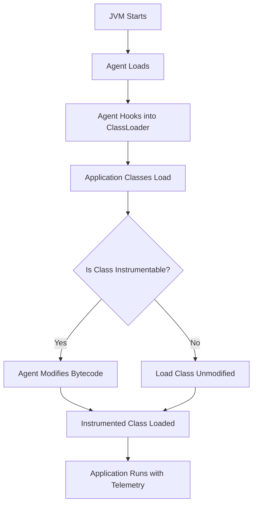

# How to Understand OpenTelemetry's Zero-Code Instrumentation Options

Author: [nawazdhandala](https://www.github.com/nawazdhandala)

Tags: OpenTelemetry, Zero-Code, Auto-Instrumentation, Java Agent, Python

Description: Learn how to instrument your applications with OpenTelemetry without modifying a single line of code using automatic instrumentation agents and techniques.

Getting telemetry data from your applications traditionally requires sprinkling instrumentation code throughout your codebase. OpenTelemetry offers a different path: zero-code instrumentation that automatically captures traces, metrics, and logs without requiring you to modify your application code. This approach dramatically reduces the time and effort needed to gain observability.

## What Zero-Code Instrumentation Means

Zero-code instrumentation, also called automatic instrumentation or auto-instrumentation, captures telemetry by intercepting your application's execution at runtime. Instead of manually adding spans and metrics to your code, an agent or library automatically instruments frameworks, libraries, and common operations.

The key distinction is between explicit and implicit instrumentation:

**Manual instrumentation** requires code changes:
```python
from opentelemetry import trace

tracer = trace.get_tracer(__name__)

def fetch_user(user_id):
    with tracer.start_as_current_span("fetch_user"):
        return database.query(User).get(user_id)
```

**Automatic instrumentation** requires no code changes:
```python
def fetch_user(user_id):
    # No instrumentation code needed
    # The agent automatically creates spans for this function
    return database.query(User).get(user_id)
```

The automatic instrumentation agent detects that you're making a database call and creates appropriate spans without you writing any instrumentation code.

## How Automatic Instrumentation Works

Automatic instrumentation relies on different mechanisms depending on the language and runtime:

**Bytecode manipulation** (Java, .NET): The agent modifies bytecode as classes load, injecting instrumentation code into method calls. Your source code remains unchanged, but the running code includes instrumentation.

**Dynamic patching** (Python, JavaScript, Ruby): The agent modifies objects and functions at runtime, wrapping them with instrumentation logic. When you call a library function, you're actually calling the wrapped version.

**eBPF and kernel instrumentation** (Linux): Emerging approaches use kernel-level tracing to capture telemetry without application-level changes.

## Java Auto-Instrumentation

Java has the most mature zero-code instrumentation story. The OpenTelemetry Java agent is a single JAR file that you attach to your JVM.

Download the agent:
```bash
curl -L https://github.com/open-telemetry/opentelemetry-java-instrumentation/releases/latest/download/opentelemetry-javaagent.jar -o opentelemetry-javaagent.jar
```

Run your application with the agent attached:
```bash
java -javaagent:opentelemetry-javaagent.jar \
     -Dotel.service.name=my-service \
     -Dotel.traces.exporter=otlp \
     -Dotel.exporter.otlp.endpoint=http://localhost:4317 \
     -jar my-application.jar
```

That's it. Your application now exports traces automatically. The agent instruments:

- HTTP servers (Tomcat, Jetty, Undertow, Netty)
- HTTP clients (Apache HttpClient, OkHttp, java.net.HttpURLConnection)
- Database clients (JDBC, Hibernate, MongoDB, Cassandra)
- Message queues (Kafka, RabbitMQ, JMS)
- RPC frameworks (gRPC, Apache Thrift)
- And 100+ other libraries



The Java agent captures distributed traces automatically. When an HTTP request enters your service, the agent creates a span. When your code calls another service or database, the agent creates child spans. Context propagates automatically.

Configuration happens through system properties or environment variables:
```bash
# Via system properties
java -javaagent:opentelemetry-javaagent.jar \
     -Dotel.service.name=payment-service \
     -Dotel.resource.attributes=deployment.environment=production,team=payments \
     -Dotel.traces.exporter=otlp \
     -Dotel.metrics.exporter=otlp \
     -Dotel.logs.exporter=otlp \
     -jar payment-service.jar

# Via environment variables
export OTEL_SERVICE_NAME=payment-service
export OTEL_RESOURCE_ATTRIBUTES=deployment.environment=production
export OTEL_TRACES_EXPORTER=otlp
java -javaagent:opentelemetry-javaagent.jar -jar payment-service.jar
```

## Python Auto-Instrumentation

Python auto-instrumentation uses a different approach because Python lacks Java's bytecode manipulation capabilities. Instead, it relies on monkey-patching at runtime.

Install the base instrumentation package:
```bash
pip install opentelemetry-distro opentelemetry-exporter-otlp
```

Automatically install instrumentation for detected libraries:
```bash
opentelemetry-bootstrap -a install
```

This command scans your installed packages and installs corresponding instrumentation libraries. If you have Flask installed, it installs `opentelemetry-instrumentation-flask`. If you have requests, it installs `opentelemetry-instrumentation-requests`.

Run your application with automatic instrumentation:
```bash
opentelemetry-instrument \
    --traces_exporter otlp \
    --metrics_exporter otlp \
    --service_name my-service \
    --exporter_otlp_endpoint http://localhost:4317 \
    python app.py
```

The `opentelemetry-instrument` wrapper configures OpenTelemetry and activates instrumentation before your application code runs.

Your application code requires no changes:
```python
from flask import Flask
import requests

app = Flask(__name__)

@app.route('/api/users/<user_id>')
def get_user(user_id):
    # HTTP handler is automatically instrumented
    # The requests call is automatically traced
    response = requests.get(f'https://api.example.com/users/{user_id}')
    return response.json()

if __name__ == '__main__':
    app.run()
```

Python auto-instrumentation supports:
- Web frameworks (Flask, Django, FastAPI, Pyramid)
- HTTP clients (requests, httpx, aiohttp)
- Database clients (psycopg2, MySQL, SQLAlchemy, pymongo)
- Redis, Elasticsearch, AWS SDK
- gRPC, Celery, and more

## Node.js Auto-Instrumentation

Node.js auto-instrumentation uses require hooks to intercept module loading and wrap exports with instrumentation.

Install the instrumentation packages:
```bash
npm install --save @opentelemetry/api \
                   @opentelemetry/auto-instrumentations-node \
                   @opentelemetry/sdk-node \
                   @opentelemetry/exporter-trace-otlp-grpc
```

Create an instrumentation file (tracing.js):
```javascript
const { NodeSDK } = require('@opentelemetry/sdk-node');
const { getNodeAutoInstrumentations } = require('@opentelemetry/auto-instrumentations-node');
const { OTLPTraceExporter } = require('@opentelemetry/exporter-trace-otlp-grpc');

const sdk = new NodeSDK({
  traceExporter: new OTLPTraceExporter({
    url: 'http://localhost:4317'
  }),
  instrumentations: [getNodeAutoInstrumentations()],
  serviceName: 'my-service'
});

sdk.start();
```

Load the instrumentation before your application:
```bash
node --require ./tracing.js app.js
```

Your application code needs no modifications:
```javascript
const express = require('express');
const axios = require('axios');

const app = express();

app.get('/api/users/:userId', async (req, res) => {
  // Express route handling is automatically traced
  // Axios HTTP call is automatically traced
  const response = await axios.get(`https://api.example.com/users/${req.params.userId}`);
  res.json(response.data);
});

app.listen(3000);
```

## Go Auto-Instrumentation

Go presents unique challenges for auto-instrumentation because it's a compiled language without runtime code modification capabilities. True zero-code instrumentation isn't possible with standard Go.

However, you can achieve near-zero-code instrumentation using:

**eBPF-based instrumentation**: Tools like Grafana Beyla use eBPF to trace Go applications without code changes. They capture HTTP, gRPC, and database calls at the kernel level.

```bash
# Run Beyla to automatically instrument a Go application
docker run -d --name beyla \
  --pid=host \
  -v /sys/kernel/debug:/sys/kernel/debug \
  -e BEYLA_EXECUTABLE_NAME=my-go-app \
  -e OTEL_EXPORTER_OTLP_ENDPOINT=http://collector:4317 \
  grafana/beyla:latest
```

**Compile-time instrumentation**: Tools like `otel-go-instrumentation` use Go's toolchain to inject instrumentation during compilation.

**Library-level auto-instrumentation**: Some frameworks provide hooks that instrumentation libraries can use. You still need minimal code changes, but they're standardized:

```go
import (
    "go.opentelemetry.io/contrib/instrumentation/net/http/otelhttp"
)

// Wrap your HTTP handler
http.Handle("/api/users", otelhttp.NewHandler(userHandler, "user-api"))
```

Go's auto-instrumentation is less mature than Java or Python, but the ecosystem is evolving rapidly.

## .NET Auto-Instrumentation

.NET auto-instrumentation works similarly to Java, using bytecode injection through CLR profiling APIs.

Download the .NET instrumentation:
```bash
# On Linux
wget https://github.com/open-telemetry/opentelemetry-dotnet-instrumentation/releases/latest/download/opentelemetry-dotnet-instrumentation-linux-x64.zip
unzip opentelemetry-dotnet-instrumentation-linux-x64.zip

# On Windows
Invoke-WebRequest -Uri "https://github.com/open-telemetry/opentelemetry-dotnet-instrumentation/releases/latest/download/opentelemetry-dotnet-instrumentation-windows-x64.zip" -OutFile "opentelemetry-dotnet-instrumentation-windows-x64.zip"
Expand-Archive -Path "opentelemetry-dotnet-instrumentation-windows-x64.zip"
```

Set environment variables to enable the profiler:
```bash
# Linux
export CORECLR_ENABLE_PROFILING=1
export CORECLR_PROFILER={918728DD-259F-4A6A-AC2B-B85E1B658318}
export CORECLR_PROFILER_PATH=/path/to/OpenTelemetry.AutoInstrumentation.Native.so
export DOTNET_STARTUP_HOOKS=/path/to/OpenTelemetry.AutoInstrumentation.StartupHook.dll
export OTEL_SERVICE_NAME=my-service
export OTEL_EXPORTER_OTLP_ENDPOINT=http://localhost:4317

dotnet my-app.dll
```

The profiler intercepts method calls and injects instrumentation for ASP.NET Core, HttpClient, SQL Server, MongoDB, Redis, and more.

## What Gets Instrumented Automatically

Automatic instrumentation focuses on framework and library calls because these represent cross-cutting concerns:

**HTTP servers and clients**: Every incoming request and outgoing HTTP call creates spans automatically. This captures most inter-service communication.

**Database calls**: All database queries generate spans with the query text (sanitized), connection info, and timing.

**Message queues**: Publishing and consuming messages creates spans that maintain trace context across asynchronous boundaries.

**RPC frameworks**: gRPC, Thrift, and similar frameworks are automatically instrumented with full context propagation.

**Caches and data stores**: Redis, Memcached, Elasticsearch calls are traced.

What doesn't get instrumented automatically:

**Business logic**: Your domain-specific functions won't have spans unless you add them manually. Auto-instrumentation handles infrastructure, not application logic.

**Custom libraries**: If you've built internal libraries, they won't be instrumented unless you create custom instrumentation.

**Performance-critical paths**: Some extremely hot code paths might be excluded from automatic instrumentation to avoid overhead.

## Combining Automatic and Manual Instrumentation

The most effective approach combines both techniques. Use automatic instrumentation for framework calls, and add manual instrumentation for business logic.

```python
from opentelemetry import trace

# Automatic instrumentation handles Flask and requests
# Manual instrumentation adds business context

tracer = trace.get_tracer(__name__)

@app.route('/api/checkout')
def checkout():
    # Flask route is automatically traced

    # Add manual span for business operation
    with tracer.start_as_current_span("process_checkout") as span:
        cart = get_cart()  # Database call automatically traced

        span.set_attribute("cart.item_count", len(cart.items))
        span.set_attribute("cart.total", cart.total)

        # Each of these calls is automatically instrumented
        # But we add business context with attributes
        payment_result = charge_payment(cart.total)
        update_inventory(cart.items)
        send_confirmation_email(cart.user_email)

        span.set_attribute("order.id", payment_result.order_id)

        return {"order_id": payment_result.order_id}
```

## Configuration and Tuning

Automatic instrumentation provides configuration options to control behavior:

**Enable or disable specific instrumentations**:
```bash
# Java
-Dotel.instrumentation.jdbc.enabled=true
-Dotel.instrumentation.kafka.enabled=false

# Python
export OTEL_PYTHON_DISABLED_INSTRUMENTATIONS=flask,django
```

**Control span attributes**:
```bash
# Capture HTTP request/response headers
-Dotel.instrumentation.http.capture-headers.client.request=Content-Type,User-Agent
-Dotel.instrumentation.http.capture-headers.server.response=Content-Type

# Capture database query statements
-Dotel.instrumentation.jdbc.statement-sanitizer.enabled=true
```

**Sampling configuration**:
```bash
# Sample only 10% of traces
-Dotel.traces.sampler=traceidratio
-Dotel.traces.sampler.arg=0.1
```

## Performance Impact

Automatic instrumentation adds overhead. The impact varies by language and workload:

**Java**: Typically 5-10% overhead for CPU and memory. Bytecode manipulation happens once during class loading, so runtime overhead is minimal.

**Python**: 10-15% overhead. Dynamic patching happens at runtime and adds a small cost to each instrumented call.

**Node.js**: 5-10% overhead. The event loop architecture minimizes impact.

You can minimize overhead:
- Use sampling to reduce trace volume
- Disable instrumentation for high-frequency, low-value operations
- Tune batch sizes and export intervals

## Limitations and Considerations

Automatic instrumentation isn't a complete solution:

**No business context**: Auto-instrumentation captures technical details but can't understand your business logic. You need manual instrumentation to add attributes like customer ID, transaction type, or feature flags.

**Generic span names**: Automatically generated span names describe the technical operation (HTTP GET, SQL query) but not the business purpose. Manual spans provide meaningful names.

**Library coverage**: Only popular libraries have automatic instrumentation. Custom or niche libraries require manual instrumentation.

**Version compatibility**: Auto-instrumentation depends on library internals. Library updates can break instrumentation until the agent is updated.

**Cold start overhead**: The agent initialization adds time to application startup, which matters for serverless functions or frequently restarted services.

Zero-code instrumentation with OpenTelemetry provides an excellent starting point for observability. You get comprehensive coverage of infrastructure calls without modifying code. As your needs grow, supplement automatic instrumentation with manual instrumentation to capture business context and application-specific operations. The combination gives you complete visibility with reasonable effort.
