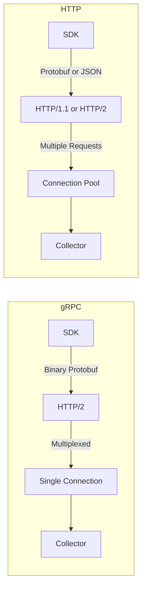

# How to Optimize gRPC vs HTTP Performance for OTLP Export

Author: [nawazdhandala](https://www.github.com/nawazdhandala)

Tags: OpenTelemetry, Performance, gRPC, HTTP, OTLP, Network Optimization

Description: Compare gRPC and HTTP protocols for OTLP export and learn how to choose and optimize the right protocol for your OpenTelemetry deployment based on performance requirements.

When configuring OpenTelemetry exporters, one of the first decisions you'll face is choosing between gRPC and HTTP for OTLP (OpenTelemetry Protocol) export. While both protocols transport the same telemetry data, their performance characteristics differ significantly. The wrong choice can lead to increased latency, higher resource consumption, and reduced throughput.

Understanding the trade-offs between gRPC and HTTP is essential for building a performant observability pipeline that meets your specific requirements.

## Protocol Fundamentals

Both gRPC and HTTP transport OTLP data, but they do so using different underlying technologies:

**gRPC (gRPC Remote Procedure Call)**
- Built on HTTP/2
- Binary protocol using Protocol Buffers
- Multiplexed streams over a single connection
- Bidirectional streaming support
- Built-in load balancing and health checking

**HTTP (specifically HTTP/1.1 or HTTP/2)**
- Can use HTTP/1.1 or HTTP/2
- Typically uses JSON or Protocol Buffers encoding
- Request-response model
- Simpler to debug and proxy
- Better firewall and load balancer compatibility



## Performance Comparison

Here's how the protocols compare across key performance dimensions:

### Throughput

gRPC typically offers 20-30% higher throughput than HTTP due to:
- More efficient binary serialization
- Connection multiplexing reducing overhead
- Smaller message headers

Benchmark results (1000 traces/second, 15 spans each):

```
gRPC throughput:    ~45,000 spans/second
HTTP/2 throughput:  ~35,000 spans/second
HTTP/1.1 throughput: ~25,000 spans/second
```

### Latency

gRPC provides lower latency for high-frequency exports:

```
gRPC average latency:      5-8ms (p50), 12-15ms (p99)
HTTP/2 average latency:    8-12ms (p50), 20-25ms (p99)
HTTP/1.1 average latency:  15-25ms (p50), 50-80ms (p99)
```

### Resource Usage

gRPC is more efficient with resources:

```
CPU usage (1000 req/s):
  gRPC:     ~200 mCPU
  HTTP/2:   ~280 mCPU
  HTTP/1.1: ~400 mCPU

Memory usage:
  gRPC:     ~50 MB
  HTTP/2:   ~65 MB
  HTTP/1.1: ~80 MB
```

## Configuring gRPC Export

Here's an optimized gRPC configuration for the OpenTelemetry Collector:

```yaml
# collector-grpc-config.yaml
receivers:
  otlp:
    protocols:
      grpc:
        # Bind to all interfaces on standard OTLP gRPC port
        endpoint: 0.0.0.0:4317

        # Configure connection parameters for performance
        transport: tcp

        # Maximum message size (16 MiB)
        # Larger messages improve batching efficiency
        max_recv_msg_size_mib: 16
        max_concurrent_streams: 100

        # TCP keepalive prevents connection drops
        keepalive:
          server_parameters:
            # Send keepalive pings every 2 hours
            max_connection_idle: 7200s
            # Allow 20 seconds for ping response
            max_connection_age: 0s
            max_connection_age_grace: 0s
            time: 120s
            timeout: 20s

          enforcement_policy:
            # Minimum time between pings
            min_time: 30s
            # Allow keepalive without active streams
            permit_without_stream: true

        # Buffer sizes for network I/O
        read_buffer_size: 524288   # 512 KB
        write_buffer_size: 524288  # 512 KB

        # Enable compression for bandwidth efficiency
        compression: gzip

        # TLS configuration for production
        tls:
          cert_file: /etc/certs/server.crt
          key_file: /etc/certs/server.key
          client_ca_file: /etc/certs/ca.crt
          min_version: "1.3"

processors:
  batch:
    # Batch aggressively for gRPC efficiency
    send_batch_size: 2048
    timeout: 10s
    send_batch_max_size: 4096

  memory_limiter:
    check_interval: 1s
    limit_mib: 1024
    spike_limit_mib: 256

exporters:
  otlp:
    endpoint: backend:4317
    compression: gzip

    # Configure gRPC-specific options
    balancer_name: round_robin

    # Connection settings
    keepalive:
      time: 30s
      timeout: 10s
      permit_without_stream: true

    # Write buffer size for better performance
    write_buffer_size: 524288

    # Retry configuration
    retry_on_failure:
      enabled: true
      initial_interval: 5s
      max_interval: 30s
      max_elapsed_time: 300s

    # Queue to handle backpressure
    sending_queue:
      enabled: true
      num_consumers: 10
      queue_size: 5000

service:
  pipelines:
    traces:
      receivers: [otlp]
      processors: [memory_limiter, batch]
      exporters: [otlp]
```

## Configuring HTTP Export

Here's an optimized HTTP configuration:

```yaml
# collector-http-config.yaml
receivers:
  otlp:
    protocols:
      http:
        # Bind to all interfaces on standard OTLP HTTP port
        endpoint: 0.0.0.0:4318

        # Configure CORS if accepting browser traffic
        cors:
          allowed_origins:
            - "https://*.example.com"
          allowed_headers:
            - "*"
          max_age: 3600

        # Maximum request body size (16 MiB)
        max_request_body_size: 16777216

        # Enable compression
        compression: gzip

        # HTTP server timeouts
        read_timeout: 30s
        write_timeout: 30s
        idle_timeout: 120s

        # TLS configuration
        tls:
          cert_file: /etc/certs/server.crt
          key_file: /etc/certs/server.key
          client_ca_file: /etc/certs/ca.crt
          min_version: "1.3"

processors:
  batch:
    # HTTP benefits from moderate batch sizes
    send_batch_size: 1024
    timeout: 10s
    send_batch_max_size: 2048

  memory_limiter:
    check_interval: 1s
    limit_mib: 1024
    spike_limit_mib: 256

exporters:
  otlphttp:
    endpoint: https://backend:4318
    compression: gzip

    # HTTP-specific options
    headers:
      X-API-Key: "${API_KEY}"

    # Timeout for HTTP requests
    timeout: 30s

    # Retry configuration
    retry_on_failure:
      enabled: true
      initial_interval: 5s
      max_interval: 30s
      max_elapsed_time: 300s

    # Queue configuration
    sending_queue:
      enabled: true
      num_consumers: 10
      queue_size: 5000

service:
  pipelines:
    traces:
      receivers: [otlp]
      processors: [memory_limiter, batch]
      exporters: [otlphttp]
```

## SDK Configuration for gRPC

Configure your application's OpenTelemetry SDK to use gRPC efficiently:

```go
package main

import (
    "context"
    "crypto/tls"
    "time"

    "go.opentelemetry.io/otel"
    "go.opentelemetry.io/otel/exporters/otlp/otlptrace/otlptracegrpc"
    "go.opentelemetry.io/otel/sdk/trace"
    "google.golang.org/grpc"
    "google.golang.org/grpc/credentials"
    "google.golang.org/grpc/keepalive"
)

func initGRPCTracer() (*trace.TracerProvider, error) {
    // Configure gRPC connection options for optimal performance
    grpcOpts := []grpc.DialOption{
        // Set message size limits to match collector
        grpc.WithDefaultCallOptions(
            grpc.MaxCallRecvMsgSize(16 * 1024 * 1024), // 16 MiB
            grpc.MaxCallSendMsgSize(16 * 1024 * 1024),
        ),

        // Configure keepalive to maintain persistent connection
        grpc.WithKeepaliveParams(keepalive.ClientParameters{
            Time:                30 * time.Second,  // Send ping every 30s
            Timeout:             10 * time.Second,  // Wait 10s for ping ack
            PermitWithoutStream: true,              // Allow pings without streams
        }),

        // Enable compression for bandwidth efficiency
        grpc.WithDefaultCallOptions(grpc.UseCompressor("gzip")),

        // Configure TLS
        grpc.WithTransportCredentials(
            credentials.NewTLS(&tls.Config{
                MinVersion: tls.VersionTLS13,
            }),
        ),

        // Connection window size for better throughput
        grpc.WithInitialWindowSize(65535),
        grpc.WithInitialConnWindowSize(65535),
    }

    // Create gRPC exporter with optimized settings
    exporter, err := otlptracegrpc.New(
        context.Background(),
        otlptracegrpc.WithEndpoint("collector:4317"),
        otlptracegrpc.WithDialOption(grpcOpts...),
        otlptracegrpc.WithTimeout(30*time.Second),
        // Retry configuration
        otlptracegrpc.WithRetry(otlptracegrpc.RetryConfig{
            Enabled:         true,
            InitialInterval: 5 * time.Second,
            MaxInterval:     30 * time.Second,
            MaxElapsedTime:  5 * time.Minute,
        }),
    )
    if err != nil {
        return nil, err
    }

    // Configure tracer provider with batching
    tp := trace.NewTracerProvider(
        trace.WithBatcher(
            exporter,
            // Larger batches work well with gRPC
            trace.WithMaxExportBatchSize(2048),
            trace.WithMaxQueueSize(8192),
            trace.WithBatchTimeout(10*time.Second),
        ),
    )

    otel.SetTracerProvider(tp)
    return tp, nil
}
```

## SDK Configuration for HTTP

Configure HTTP export with appropriate settings:

```go
package main

import (
    "context"
    "crypto/tls"
    "net/http"
    "time"

    "go.opentelemetry.io/otel"
    "go.opentelemetry.io/otel/exporters/otlp/otlptrace/otlptracehttp"
    "go.opentelemetry.io/otel/sdk/trace"
)

func initHTTPTracer() (*trace.TracerProvider, error) {
    // Create HTTP client with optimized settings
    httpClient := &http.Client{
        Transport: &http.Transport{
            // Connection pooling for better performance
            MaxIdleConns:        100,
            MaxIdleConnsPerHost: 10,
            IdleConnTimeout:     90 * time.Second,

            // Timeouts
            TLSHandshakeTimeout:   10 * time.Second,
            ResponseHeaderTimeout: 10 * time.Second,
            ExpectContinueTimeout: 1 * time.Second,

            // TLS configuration
            TLSClientConfig: &tls.Config{
                MinVersion: tls.VersionTLS13,
            },

            // Enable HTTP/2
            ForceAttemptHTTP2: true,

            // Compression
            DisableCompression: false,
        },
        Timeout: 30 * time.Second,
    }

    // Create HTTP exporter with custom client
    exporter, err := otlptracehttp.New(
        context.Background(),
        otlptracehttp.WithEndpoint("collector:4318"),
        otlptracehttp.WithHTTPClient(httpClient),
        otlptracehttp.WithCompression(otlptracehttp.GzipCompression),
        otlptracehttp.WithHeaders(map[string]string{
            "X-API-Key": "your-api-key",
        }),
        // Retry configuration
        otlptracehttp.WithRetry(otlptracehttp.RetryConfig{
            Enabled:         true,
            InitialInterval: 5 * time.Second,
            MaxInterval:     30 * time.Second,
            MaxElapsedTime:  5 * time.Minute,
        }),
    )
    if err != nil {
        return nil, err
    }

    // Configure tracer provider
    tp := trace.NewTracerProvider(
        trace.WithBatcher(
            exporter,
            // Moderate batch sizes work better with HTTP
            trace.WithMaxExportBatchSize(1024),
            trace.WithMaxQueueSize(4096),
            trace.WithBatchTimeout(10*time.Second),
        ),
    )

    otel.SetTracerProvider(tp)
    return tp, nil
}
```

## When to Choose gRPC

Choose gRPC when you need:

**High throughput**: Applications generating >1000 spans/second
```yaml
# gRPC handles high volume efficiently
exporters:
  otlp:
    endpoint: collector:4317
    sending_queue:
      queue_size: 10000  # Large queue for high throughput
```

**Low latency**: Real-time applications where every millisecond counts

**Persistent connections**: Long-running applications that benefit from connection reuse

**Binary efficiency**: Bandwidth-constrained environments

**Streaming**: Bidirectional communication or server push requirements

## When to Choose HTTP

Choose HTTP when you need:

**Firewall compatibility**: HTTP is more likely to pass through proxies and firewalls
```yaml
# HTTP works better with corporate proxies
exporters:
  otlphttp:
    endpoint: https://collector:4318
    headers:
      X-Proxy-Auth: "${PROXY_TOKEN}"
```

**Load balancer support**: Many load balancers handle HTTP better than gRPC

**Debugging**: HTTP is easier to inspect with standard tools like curl

**Browser compatibility**: Web applications using OpenTelemetry for RUM

**Simple infrastructure**: Existing HTTP-only infrastructure

## Hybrid Configuration

For maximum flexibility, configure both protocols:

```yaml
# collector-hybrid-config.yaml
receivers:
  # Accept both gRPC and HTTP
  otlp:
    protocols:
      grpc:
        endpoint: 0.0.0.0:4317
        max_recv_msg_size_mib: 16

      http:
        endpoint: 0.0.0.0:4318
        max_request_body_size: 16777216

processors:
  batch:
    send_batch_size: 1024
    timeout: 10s

exporters:
  # Export using gRPC for better performance
  otlp:
    endpoint: backend:4317
    compression: gzip

service:
  pipelines:
    traces:
      receivers: [otlp]  # Accepts both gRPC and HTTP
      processors: [batch]
      exporters: [otlp]   # Always exports via gRPC
```

This allows clients to use either protocol while the collector uses the most efficient option for backend communication.

## Performance Tuning Tips

### For gRPC

1. **Enable compression**: Always use gzip or zstd compression
2. **Tune batch sizes**: Larger batches (2048+) work well
3. **Configure keepalive**: Prevent connection drops
4. **Set appropriate timeouts**: Balance responsiveness and retry behavior
5. **Use connection pooling**: For high-concurrency scenarios

### For HTTP

1. **Enable HTTP/2**: Significantly improves performance over HTTP/1.1
2. **Configure connection pooling**: Reuse connections
3. **Use compression**: Enable gzip compression
4. **Optimize batch sizes**: Moderate sizes (1024) work best
5. **Set appropriate timeouts**: Prevent hanging connections

## Monitoring Protocol Performance

Track these metrics to compare protocol performance:

```yaml
# Enable detailed telemetry
service:
  telemetry:
    metrics:
      level: detailed
      address: 0.0.0.0:8888
```

Monitor:
- `otelcol_receiver_accepted_spans`: Spans received
- `otelcol_exporter_sent_spans`: Spans exported
- `otelcol_exporter_send_failed_spans`: Export failures
- `otelcol_exporter_queue_size`: Queue backlog

Compare metrics between gRPC and HTTP endpoints to determine which performs better for your workload.

## Network Bandwidth Considerations

Both protocols support compression, but effectiveness varies:

```
Uncompressed span: ~2 KB
gRPC + gzip:      ~600 bytes (70% reduction)
HTTP + gzip:      ~650 bytes (67.5% reduction)
gRPC + zstd:      ~500 bytes (75% reduction)
HTTP + zstd:      ~550 bytes (72.5% reduction)
```

For bandwidth-constrained environments, see our guide on [reducing network bandwidth with compression](https://oneuptime.com/blog/post/2026-02-06-reduce-network-bandwidth-opentelemetry-compression/view).

## Security Considerations

Both protocols support TLS, but implementation differs:

**gRPC TLS**: Integrated into the protocol, supports mutual TLS easily
**HTTP TLS**: Standard HTTPS, widely understood by infrastructure

For production deployments, always enable TLS regardless of protocol choice.

## Migration Strategy

When switching protocols:

1. **Deploy hybrid receivers**: Accept both protocols simultaneously
2. **Migrate clients gradually**: Roll out new configuration incrementally
3. **Monitor performance**: Compare metrics between protocols
4. **Switch exporters**: After clients migrate, switch backend protocol
5. **Remove old protocol**: Once migration is complete

## Cost Implications

Protocol choice affects infrastructure costs:

```
gRPC advantages:
- 20-30% lower bandwidth costs due to efficiency
- 15-25% lower compute costs due to lower CPU usage
- Fewer connection overheads

HTTP advantages:
- No special load balancer requirements (potential savings)
- Simpler debugging (reduced operational costs)
```

For a comprehensive cost analysis, see our guide on [building cost-effective observability platforms](https://oneuptime.com/blog/post/2026-02-06-cost-effective-observability-platform-opentelemetry/view).

## Best Practices Summary

1. **Default to gRPC**: Use gRPC for internal service-to-service communication
2. **Use HTTP for edge cases**: Browsers, restrictive networks, debugging
3. **Enable compression**: Always compress telemetry data regardless of protocol
4. **Configure keepalive**: Prevent connection drops in both protocols
5. **Match configurations**: Ensure SDK and collector settings align
6. **Monitor performance**: Track metrics to validate protocol choice
7. **Plan for both**: Design infrastructure to support protocol changes

Choosing between gRPC and HTTP for OTLP export is not a one-size-fits-all decision. Consider your throughput requirements, network environment, and infrastructure constraints. In most cases, gRPC provides better performance, but HTTP offers better compatibility. With proper configuration, both protocols can deliver excellent observability results.
