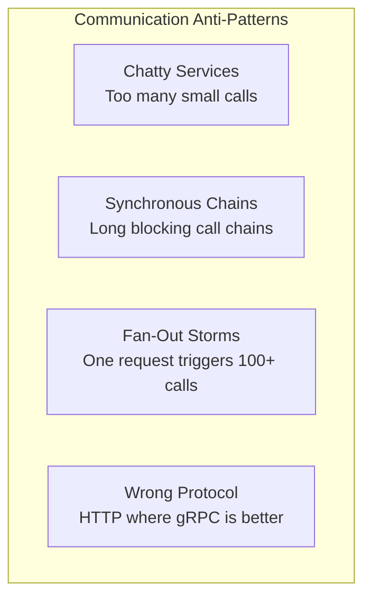

# How to Use OpenTelemetry to Optimize Microservice Communication Patterns

Author: [nawazdhandala](https://www.github.com/nawazdhandala)

Tags: OpenTelemetry, Microservices, Communication Patterns, gRPC, HTTP, Performance, Distributed Systems, Tracing

Description: Learn how to use OpenTelemetry tracing and metrics to analyze, optimize, and improve communication patterns between microservices in distributed systems.

---

Microservice architectures introduce a fundamental challenge: services need to talk to each other, and how they communicate has a huge impact on overall system performance. A single user request might trigger a chain of ten inter-service calls, and if any of those calls are slow, poorly designed, or unnecessarily chatty, your users feel it.

OpenTelemetry gives you unprecedented visibility into how your services communicate. By analyzing trace data and communication metrics, you can identify inefficient patterns, reduce unnecessary calls, and choose the right protocol for each interaction. This is not theoretical optimization. It is looking at real production data and making concrete improvements.

---

## Common Communication Problems



Each of these problems shows up clearly in OpenTelemetry trace data. The trick is knowing what to look for and how to measure it.

---

## Instrumenting Service Communication

Start by making sure all your inter-service communication is properly instrumented. Most OpenTelemetry auto-instrumentation libraries handle HTTP and gRPC automatically, but you should add custom attributes that help with analysis.

```python
# communication_metrics.py
from opentelemetry import metrics, trace
from opentelemetry.sdk.metrics import MeterProvider
from opentelemetry.sdk.metrics.export import PeriodicExportingMetricReader
from opentelemetry.exporter.otlp.proto.http.metric_exporter import OTLPMetricExporter
from opentelemetry.sdk.resources import Resource, SERVICE_NAME

resource = Resource.create({SERVICE_NAME: "order-service"})
reader = PeriodicExportingMetricReader(
    OTLPMetricExporter(endpoint="https://otel.oneuptime.com/v1/metrics"),
    export_interval_millis=10000,
)
provider = MeterProvider(resource=resource, metric_readers=[reader])
metrics.set_meter_provider(provider)

meter = metrics.get_meter("service.communication")
tracer = trace.get_tracer("service.communication")

# Track inter-service call duration
call_duration = meter.create_histogram(
    name="service.call.duration",
    description="Duration of inter-service calls",
    unit="ms",
)

# Track payload sizes to identify oversized responses
payload_size = meter.create_histogram(
    name="service.call.payload_size",
    description="Size of inter-service call payloads",
    unit="bytes",
)

# Track number of calls per request to detect chattiness
calls_per_request = meter.create_histogram(
    name="service.calls_per_request",
    description="Number of inter-service calls triggered by a single inbound request",
    unit="calls",
)

# Track retries to identify flaky connections
retry_count = meter.create_counter(
    name="service.call.retries",
    description="Number of retried inter-service calls",
    unit="retries",
)
```

These metrics give you a quantitative view of your communication patterns. The `calls_per_request` histogram is particularly valuable because it reveals chatty services, and the `payload_size` histogram helps you find interactions where you are sending more data than necessary.

---

## Detecting Chatty Services

A chatty service makes many small calls when fewer, larger calls would be more efficient. This is a common problem when services make individual database-style lookups instead of batch requests.

```python
# chattiness_analyzer.py
from collections import defaultdict
from datetime import datetime

class ChattinessAnalyzer:
    """
    Analyzes trace data to identify chatty communication patterns
    between services.
    """

    def analyze_trace(self, trace_spans: list) -> dict:
        """
        Count inter-service calls within a single trace and identify
        repeated call patterns that suggest chattiness.
        """
        # Group spans by (caller_service, callee_service, operation)
        call_patterns = defaultdict(int)
        service_calls = defaultdict(int)

        span_map = {s["span_id"]: s for s in trace_spans}

        for span in trace_spans:
            parent_id = span.get("parent_span_id")
            if not parent_id or parent_id not in span_map:
                continue

            parent = span_map[parent_id]
            caller = parent.get("resource", {}).get("service.name", "unknown")
            callee = span.get("resource", {}).get("service.name", "unknown")

            if caller != callee:
                operation = span.get("name", "unknown")
                call_patterns[(caller, callee, operation)] += 1
                service_calls[(caller, callee)] += 1

        # Find patterns where the same call is made 5+ times
        chatty_patterns = []
        for (caller, callee, op), count in call_patterns.items():
            if count >= 5:
                chatty_patterns.append({
                    "caller": caller,
                    "callee": callee,
                    "operation": op,
                    "count": count,
                    "recommendation": (
                        f"Consider batching these {count} calls into a single "
                        f"batch request from {caller} to {callee}"
                    ),
                })

        return {
            "total_inter_service_calls": sum(service_calls.values()),
            "unique_service_pairs": len(service_calls),
            "chatty_patterns": chatty_patterns,
        }
```

Run this analyzer on your traces and look for patterns where the same call is repeated many times within a single request. These are prime candidates for batching.

---

## Identifying Synchronous Call Chains

Long synchronous call chains are a latency killer. If Service A calls Service B, which calls Service C, which calls Service D, the total latency is the sum of all four calls plus network overhead. Even worse, any failure in the chain fails the entire request.

```python
# chain_analyzer.py
def find_critical_path(trace_spans: list) -> list:
    """
    Find the longest synchronous call chain in a trace.
    This is the critical path that determines overall request latency.
    """
    span_map = {s["span_id"]: s for s in trace_spans}

    # Build adjacency list (parent -> children)
    children = defaultdict(list)
    root = None
    for span in trace_spans:
        parent_id = span.get("parent_span_id")
        if parent_id:
            children[parent_id].append(span)
        else:
            root = span

    if not root:
        return []

    # Find the longest path using DFS
    def find_longest_path(span):
        """Recursively find the longest synchronous path from this span."""
        span_children = children.get(span["span_id"], [])

        if not span_children:
            return [span]

        longest_child_path = []
        for child in span_children:
            child_path = find_longest_path(child)
            if len(child_path) > len(longest_child_path):
                longest_child_path = child_path

        return [span] + longest_child_path

    critical_path = find_longest_path(root)

    # Extract service hops on the critical path
    service_chain = []
    for span in critical_path:
        service = span.get("resource", {}).get("service.name", "unknown")
        duration_ms = span.get("duration_ns", 0) / 1_000_000

        if not service_chain or service_chain[-1]["service"] != service:
            service_chain.append({
                "service": service,
                "operation": span.get("name"),
                "duration_ms": duration_ms,
            })

    return service_chain
```

When this analyzer shows you a chain of 6 or 7 services, consider where you can introduce asynchronous communication. Can Service A fire an event to a message queue instead of making a synchronous HTTP call to Service B? That breaks the chain and reduces latency.

---

## Protocol Comparison Metrics

Different communication protocols have different performance characteristics. Use OpenTelemetry to compare them empirically in your environment.

```python
# protocol_metrics.py
from opentelemetry import metrics

meter = metrics.get_meter("protocol.comparison")

# Track per-protocol performance
protocol_latency = meter.create_histogram(
    name="protocol.call.duration",
    description="Call duration by protocol type",
    unit="ms",
)

protocol_throughput = meter.create_counter(
    name="protocol.call.count",
    description="Number of calls by protocol type",
    unit="calls",
)

protocol_errors = meter.create_counter(
    name="protocol.call.errors",
    description="Number of failed calls by protocol type",
    unit="errors",
)

def record_service_call(protocol: str, target_service: str, duration_ms: float, success: bool):
    """Record metrics for a service-to-service call."""
    attributes = {
        "rpc.protocol": protocol,  # "http", "grpc", "kafka"
        "target.service": target_service,
    }

    protocol_latency.record(duration_ms, attributes)
    protocol_throughput.add(1, attributes)

    if not success:
        protocol_errors.add(1, attributes)
```

After collecting this data for a few days, you can compare the P50, P95, and P99 latencies for HTTP vs. gRPC between the same service pairs. If gRPC is consistently 40% faster for your high-throughput internal calls, that is a strong argument for migrating those endpoints.

---

## Optimizing Fan-Out Patterns

Fan-out happens when a single service needs to call multiple downstream services to fulfill a request. The optimization opportunity is in parallelizing these calls instead of making them sequentially.

```python
# fanout_optimizer.py
import asyncio
from opentelemetry import trace

tracer = trace.get_tracer("fanout.optimizer")

async def optimized_fanout(service_calls: list):
    """
    Execute multiple service calls in parallel instead of sequentially.
    Each call gets its own span for independent timing.
    """
    with tracer.start_as_current_span("fanout.parallel") as parent_span:
        parent_span.set_attribute("fanout.call_count", len(service_calls))

        # Execute all calls concurrently
        tasks = []
        for call in service_calls:
            task = asyncio.create_task(
                execute_with_span(call["service"], call["method"], call["params"])
            )
            tasks.append(task)

        # Wait for all to complete
        results = await asyncio.gather(*tasks, return_exceptions=True)

        # Check for failures
        failures = [r for r in results if isinstance(r, Exception)]
        parent_span.set_attribute("fanout.failures", len(failures))

        return results

async def execute_with_span(service: str, method: str, params: dict):
    """Execute a single service call with its own trace span."""
    with tracer.start_as_current_span(f"call.{service}.{method}") as span:
        span.set_attribute("target.service", service)
        span.set_attribute("rpc.method", method)
        result = await make_service_call(service, method, params)
        return result
```

The `fanout.parallel` span captures the total time for the fan-out, while each child span captures individual call timings. If you see that 3 out of 5 parallel calls complete in 20ms but the other 2 take 200ms, you know exactly which downstream services are the bottleneck.

---

## Summary

Optimizing microservice communication is a continuous process. The patterns you identify today will change as your system evolves, traffic patterns shift, and new services are added. OpenTelemetry gives you a living record of how your services actually communicate, not how they were designed to communicate. Use trace data to find chatty services and batch their calls. Use critical path analysis to break up long synchronous chains with async messaging. Use protocol comparison metrics to choose the right tool for each interaction. The data is already there in your traces. You just need to look at it systematically.
