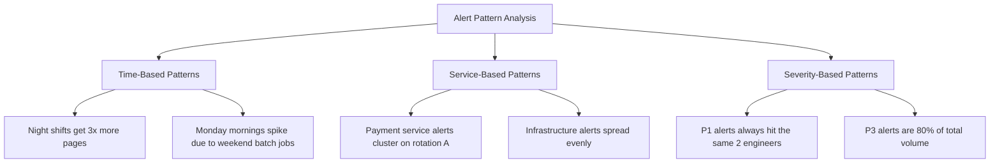

# How to Optimize On-Call Rotations by Analyzing Alert Patterns from OpenTelemetry Metrics

Author: [nawazdhandala](https://www.github.com/nawazdhandala)

Tags: OpenTelemetry, On-Call, Alert Patterns, SRE

Description: Use OpenTelemetry metrics to analyze alert frequency and timing patterns, then restructure on-call rotations for fairness and efficiency.

On-call rotations are supposed to be fair. In practice, some shifts get paged constantly while others are quiet. Some engineers absorb the bulk of incidents because their rotation happens to overlap with peak failure windows. Without data, you cannot fix this. OpenTelemetry gives you that data by capturing alerting metrics that reveal when, how often, and for which services alerts fire.

## Recording Alert Events as OpenTelemetry Metrics

The first step is instrumenting your alerting pipeline to emit metrics through OpenTelemetry. Every time an alert fires, record it as a metric data point with attributes that capture the alert name, severity, affected service, and the on-call engineer who was paged.

```python
# Instrument alert firing events as OTel metrics
from opentelemetry import metrics
from datetime import datetime

meter = metrics.get_meter("alerting.pipeline")

# Counter for total alerts fired
alerts_fired = meter.create_counter(
    "alerts.fired.total",
    description="Total number of alerts that fired",
    unit="1"
)

# Histogram for time-of-day distribution analysis
alert_hour_histogram = meter.create_histogram(
    "alerts.fired.hour_of_day",
    description="Hour of day when alerts fire",
    unit="hour"
)

def on_alert_fired(alert):
    now = datetime.utcnow()

    # Record the alert with rich attributes for later analysis
    alerts_fired.add(1, attributes={
        "alert.name": alert.name,
        "alert.severity": alert.severity,
        "service.name": alert.service,
        "oncall.engineer": alert.paged_engineer,
        "oncall.rotation": alert.rotation_name,
        "alert.day_of_week": now.strftime("%A"),
    })

    # Record the hour for time-distribution analysis
    alert_hour_histogram.record(now.hour, attributes={
        "alert.severity": alert.severity,
        "oncall.rotation": alert.rotation_name,
    })
```

## Collector Pipeline for Alert Analytics

Configure the OpenTelemetry Collector to receive these alert metrics and route them to an analytics backend. The connector processor aggregates counts that you can query later.

```yaml
# otel-collector-alert-analytics.yaml
receivers:
  otlp:
    protocols:
      grpc:
        endpoint: 0.0.0.0:4317

processors:
  # Add environment context
  resource:
    attributes:
      - key: pipeline
        value: alert-analytics
        action: upsert

  # Aggregate alert counts per rotation per hour
  metricstransform:
    transforms:
      - include: alerts.fired.total
        action: update
        operations:
          - action: aggregate_labels
            aggregation_type: sum
            label_set:
              - oncall.rotation
              - alert.severity
              - alert.day_of_week

  batch:
    send_batch_size: 256
    timeout: 10s

exporters:
  prometheusremotewrite:
    endpoint: "http://prometheus:9090/api/v1/write"

service:
  pipelines:
    metrics:
      receivers: [otlp]
      processors: [resource, metricstransform, batch]
      exporters: [prometheusremotewrite]
```

## Analyzing Alert Distribution Across Rotations

Once you have a few weeks of data, query the metrics to understand how alerts distribute across time and rotations. This PromQL query shows the alert load per rotation over the last 30 days.

```promql
# Total alerts per rotation in the last 30 days
sum by (oncall.rotation) (
  increase(alerts_fired_total[30d])
)
```

To see the hourly distribution and find peak paging windows:

```promql
# Alert rate by hour of day, averaged over 30 days
avg by (le) (
  rate(alerts_fired_hour_of_day_bucket[30d])
)
```

## Identifying Unfair Load Distribution

The data typically reveals patterns like these:



## Building a Rotation Scoring Model

Use the collected metrics to compute a fairness score for each rotation slot. This Python script queries the metric backend and calculates a load score that accounts for alert severity weighting.

```python
# Compute rotation fairness scores from OTel alert metrics
import requests

SEVERITY_WEIGHTS = {
    "critical": 5,    # Critical pages are high-stress
    "warning": 2,     # Warnings require attention but lower urgency
    "info": 0.5       # Informational alerts have minimal impact
}

def get_rotation_scores(prometheus_url, lookback="30d"):
    # Query alert counts grouped by rotation and severity
    query = f'sum by (oncall_rotation, alert_severity) (increase(alerts_fired_total[{lookback}]))'
    response = requests.get(
        f"{prometheus_url}/api/v1/query",
        params={"query": query}
    )
    results = response.json()["data"]["result"]

    scores = {}
    for result in results:
        rotation = result["metric"]["oncall_rotation"]
        severity = result["metric"]["alert_severity"]
        count = float(result["value"][1])

        weight = SEVERITY_WEIGHTS.get(severity, 1)
        weighted_load = count * weight

        if rotation not in scores:
            scores[rotation] = {"total_alerts": 0, "weighted_load": 0}

        scores[rotation]["total_alerts"] += count
        scores[rotation]["weighted_load"] += weighted_load

    return scores

def suggest_rotation_adjustments(scores):
    avg_load = sum(s["weighted_load"] for s in scores.values()) / len(scores)

    adjustments = []
    for rotation, data in scores.items():
        deviation = ((data["weighted_load"] - avg_load) / avg_load) * 100
        if abs(deviation) > 20:  # More than 20% deviation from average
            adjustments.append({
                "rotation": rotation,
                "current_load": data["weighted_load"],
                "deviation_pct": round(deviation, 1),
                "suggestion": "reduce scope" if deviation > 0 else "can absorb more"
            })

    return adjustments
```

## Actionable Rotation Changes

After analyzing the data, common optimizations include:

- **Shift timing adjustments.** If 70% of alerts fire between 2 AM and 6 AM, consider splitting the night shift into two shorter rotations or adding a follow-the-sun rotation with a team in another timezone.
- **Service re-assignment.** If one service generates disproportionate alerts, move it to a dedicated rotation rather than burdening a general on-call pool.
- **Alert consolidation.** The metrics often reveal that many pages are duplicates or cascading alerts from the same root cause. Grouping these in the alerting pipeline reduces the per-engineer page count without losing coverage.
- **Compensation balancing.** Use the weighted load scores to adjust compensation, time-off, or rotation frequency so that engineers who absorb heavier shifts are recognized.

## Continuous Monitoring

Set up a recurring report that queries these metrics weekly and flags rotations where the load deviation exceeds your threshold. This keeps rotations fair as systems evolve and alert patterns shift over time. The key insight is that on-call fairness is a measurable property, not a subjective feeling, and OpenTelemetry gives you the instrumentation to measure it.
