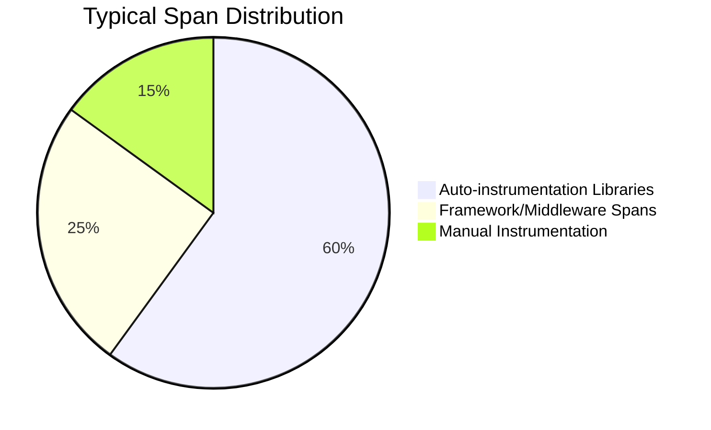
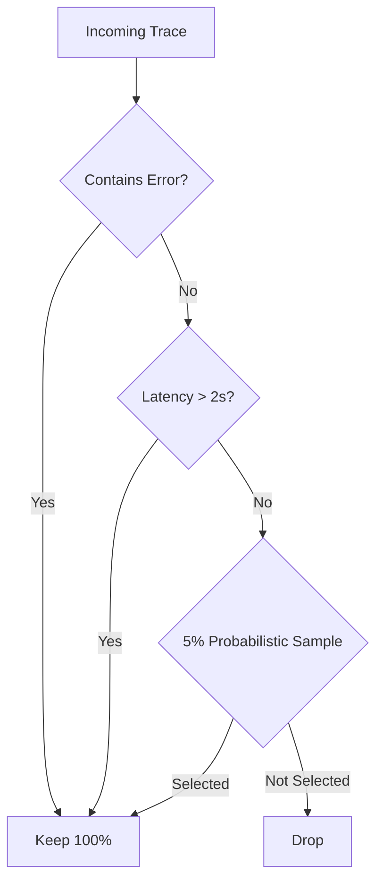
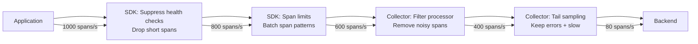

# How to Optimize Trace Span Count Without Losing Visibility

Author: [nawazdhandala](https://www.github.com/nawazdhandala)

Tags: OpenTelemetry, Tracing, Performance, Sampling, Observability

Description: Practical strategies to reduce OpenTelemetry trace span counts while preserving the visibility you need for debugging and performance analysis.

---

Traces are the most powerful signal in observability. They show you exactly what happened during a request, which services were involved, how long each operation took, and where things went wrong. But they are also the most expensive signal to collect and store. A single HTTP request in a microservices architecture can generate dozens or even hundreds of spans as it flows through your system.

At scale, this adds up fast. A service handling 10,000 requests per second with an average of 40 spans per trace produces 400,000 spans per second. That is roughly 34 billion spans per day. No matter what backend you use, storing and querying that volume is going to cost real money.

The challenge is reducing span count without creating blind spots. You need to be strategic about what you cut. This post covers practical techniques that work in production environments.

## Understanding Where Spans Come From

Before you start cutting, you need to understand where your spans originate. Most applications generate spans from three sources:



Auto-instrumentation libraries are usually the biggest contributor. When you add the OpenTelemetry HTTP, database, or messaging instrumentation libraries, they create spans for every single operation. Every SQL query, every HTTP call, every message published. Most of these are useful, but not all of them need to be exported.

## Strategy 1: Head-Based Sampling at the SDK Level

The simplest way to reduce span volume is to not create traces for every request. Head-based sampling makes a decision at the start of a trace about whether to record it.

The built-in TraceIdRatioBased sampler in OpenTelemetry works well for this. It uses the trace ID to deterministically decide whether to sample, which means all services in a distributed trace make the same decision.

```python
# Python SDK configuration with 10% sampling rate
from opentelemetry import trace
from opentelemetry.sdk.trace import TracerProvider
from opentelemetry.sdk.trace.sampling import TraceIdRatioBased

# Sample 10% of traces - the ratio is between 0.0 and 1.0
sampler = TraceIdRatioBased(0.1)

provider = TracerProvider(sampler=sampler)
trace.set_tracer_provider(provider)
```

This drops your span volume by 90% immediately. The downside is obvious: you lose visibility into 90% of your requests. For high-traffic services, this is often acceptable because the 10% you keep is statistically representative. For low-traffic services or critical paths, you might want a higher rate or a different approach entirely.

## Strategy 2: Tail-Based Sampling in the Collector

Tail-based sampling is smarter. Instead of deciding at the start of a trace, it waits until the trace is complete and then makes a decision based on the actual content. You can keep all traces that contain errors while aggressively sampling successful ones.

Configure this in the OpenTelemetry Collector using the tail_sampling processor:

```yaml
# collector-config.yaml - Tail-based sampling configuration
processors:
  tail_sampling:
    # How long to wait for a trace to complete before making a decision
    decision_wait: 10s
    # Number of traces to keep in memory during the decision window
    num_traces: 100000
    policies:
      # Always keep traces that have errors
      - name: errors-policy
        type: status_code
        status_code:
          status_codes:
            - ERROR

      # Always keep traces slower than 2 seconds
      - name: latency-policy
        type: latency
        latency:
          threshold_ms: 2000

      # Sample 5% of remaining successful traces
      - name: probabilistic-policy
        type: probabilistic
        probabilistic:
          sampling_percentage: 5

service:
  pipelines:
    traces:
      receivers: [otlp]
      processors: [tail_sampling]
      exporters: [otlp/backend]
```

This configuration gives you 100% of error traces, 100% of slow traces, and 5% of everything else. In practice, this means you never miss the traces that matter for debugging while still cutting volume dramatically.



## Strategy 3: Suppress Unnecessary Internal Spans

Many auto-instrumentation libraries create spans that you do not actually need. Health check endpoints, internal DNS lookups, connection pool management calls - these add noise to your traces without adding insight.

You can suppress these at the SDK level. In Java, for example:

```java
// Java SDK - Suppress spans for specific URL patterns
// This prevents health check and readiness probe spans from being created
SdkTracerProvider tracerProvider = SdkTracerProvider.builder()
    .setSampler(Sampler.parentBased(
        new FilteringSampler(
            Sampler.alwaysOn(),
            // Drop spans for health check endpoints
            span -> !span.getName().contains("/health") &&
                    !span.getName().contains("/ready") &&
                    !span.getName().contains("/metrics")
        )
    ))
    .build();
```

In the Collector, you can filter these out with the filter processor:

```yaml
# collector-config.yaml - Filter out noisy spans before export
processors:
  filter/traces:
    traces:
      span:
        - 'attributes["http.target"] == "/health"'
        - 'attributes["http.target"] == "/ready"'
        - 'attributes["http.target"] == "/favicon.ico"'
        - 'attributes["http.target"] == "/robots.txt"'
        - 'attributes["db.statement"] matches "^SELECT 1$"'
```

That last rule is particularly useful. Many database connection pools send `SELECT 1` as a heartbeat query, and the database instrumentation creates a span for every single one. Filtering these out can cut database span volume by 30% or more.

## Strategy 4: Reduce Span Depth With Span Limits

Sometimes a single trace generates an unreasonable number of spans. A recursive function, a loop that makes HTTP calls, or a batch database operation can create thousands of child spans under a single parent. You do not need all of them.

OpenTelemetry SDKs let you set a maximum number of spans per trace:

```python
# Python SDK - Limit the number of spans per trace
from opentelemetry.sdk.trace import TracerProvider, SpanLimits

# Cap each trace at 512 spans maximum
# Also limit events and links per span to prevent memory bloat
limits = SpanLimits(
    max_span_attributes=128,
    max_events_per_span=128,
    max_links_per_span=128,
)

provider = TracerProvider(span_limits=limits)
```

For the loop problem specifically, a better approach is to replace per-iteration spans with a single parent span that carries aggregate information:

```python
# Instead of creating a span for each item in a batch...
# BAD: This creates 1000 spans for a batch of 1000 items
for item in batch:
    with tracer.start_as_current_span(f"process_item") as span:
        process(item)

# GOOD: Create one span for the entire batch with summary attributes
with tracer.start_as_current_span("process_batch") as span:
    # Record batch size as an attribute instead of creating per-item spans
    span.set_attribute("batch.size", len(batch))
    results = process_batch(batch)
    span.set_attribute("batch.success_count", results.successes)
    span.set_attribute("batch.failure_count", results.failures)
```

This single change can eliminate thousands of spans per trace while giving you the same information through attributes.

## Strategy 5: Use the Span Processor Pipeline

The OpenTelemetry SDK has a span processor pipeline that lets you intercept spans before they are exported. You can build custom processors that drop spans based on your own logic.

```go
// Go SDK - Custom span processor that drops short-lived internal spans
type FilteringSpanProcessor struct {
    next trace.SpanProcessor
    // Minimum duration to keep a span (in nanoseconds)
    minDuration time.Duration
}

func (f *FilteringSpanProcessor) OnEnd(s trace.ReadOnlySpan) {
    // Only forward spans that lasted longer than the minimum duration
    // This removes trivially fast operations that add no debugging value
    duration := s.EndTime().Sub(s.StartTime())
    if duration >= f.minDuration {
        f.next.OnEnd(s)
    }
}
```

Dropping spans shorter than, say, 1 millisecond can remove a surprising amount of noise. In-memory cache lookups, local function calls that were instrumented too aggressively, and other trivial operations produce spans that almost never help with debugging.

## Combining Strategies for Maximum Impact

These strategies are not mutually exclusive. In fact, the best results come from layering them:



Starting from 1000 spans per second, each layer removes a different kind of unnecessary data. The final output is 80 spans per second, a 92% reduction, but you still have every error trace, every slow trace, and statistically representative samples of normal traffic.

## Measuring What You Cut

Any time you reduce trace volume, you should validate that your alerts and debugging workflows still function. Here are the things to check:

- Can you still find error traces within 30 seconds of an incident starting?
- Do your p99 latency calculations still match reality? (Compare with metrics-based latency if available.)
- Are service dependency maps still complete?
- Can you trace a request end-to-end through all your services?

Set up a comparison period. Run your old configuration and your new configuration side by side for a week. Export to two different backends or use the collector's fan-out capability to send full-fidelity data to one backend and sampled data to another.

## Practical Guidelines by Service Type

Different services warrant different approaches. High-traffic API gateways can tolerate aggressive sampling (1-5%) because they handle so many requests that even a small sample is statistically valid. Backend services that process critical business logic should use tail-based sampling to ensure error and slow traces are always captured. Batch processing jobs should use the batch-span pattern rather than per-item spans. Services with low traffic (under 100 requests per minute) should keep all traces because the volume is already manageable.

## Wrapping Up

Optimizing span count is not about blindly cutting data. It is about understanding which spans carry information you actually use and which ones are noise. Start by measuring your current span distribution, apply the strategies that target your biggest sources of waste, and validate that you still have the visibility you need. In most real-world deployments, you can achieve a 5-10x reduction in span volume without losing any meaningful observability.
