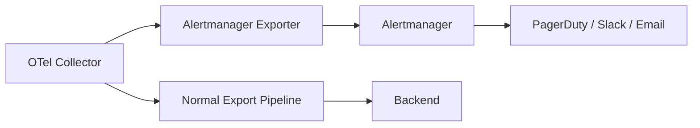

# How to Configure OpenTelemetry Collector Alertmanager Exporter for Prometheus-Style Alerts

Author: [nawazdhandala](https://www.github.com/nawazdhandala)

Tags: OpenTelemetry, Alertmanager, Prometheus, Collector Exporter

Description: Configure the OpenTelemetry Collector to send alerts directly to Prometheus Alertmanager without running a separate Prometheus server for rule evaluation.

The standard alerting flow with OpenTelemetry metrics goes through Prometheus for rule evaluation and then to Alertmanager. But there are situations where you want the Collector itself to push alerts directly to Alertmanager, skipping the Prometheus server entirely. This is useful when you already have metric evaluation logic in the Collector pipeline or when you want to alert on conditions detected during data processing (like dropped spans or pipeline errors).

This post covers how to configure the OpenTelemetry Collector to send alerts to Prometheus Alertmanager using the alertmanager exporter from the contrib distribution.

## When to Use This Approach

The Alertmanager exporter makes sense when:

- You want to alert on Collector-level events (pipeline failures, buffer overflows, data drops)
- You are using the Collector's routing or filtering processors and want to alert when specific conditions trigger
- You want a lightweight alerting path without deploying a full Prometheus instance
- You need to convert OpenTelemetry log events into Alertmanager alerts

For standard metric-based alerting (like error rate > 5%), you are better off using Prometheus with recording rules. The Alertmanager exporter handles event-driven alerts, not metric-threshold alerts.

## Architecture



## Installing the Collector with Alertmanager Exporter

The alertmanager exporter is available in the `otelcol-contrib` distribution. If you are building a custom Collector, add it to your builder manifest:

```yaml
# builder-config.yaml
# OpenTelemetry Collector Builder manifest with alertmanager exporter

dist:
  name: custom-otelcol
  output_path: ./dist

exporters:
  - gomod: github.com/open-telemetry/opentelemetry-collector-contrib/exporter/alertmanagerexporter v0.96.0
  - gomod: go.opentelemetry.io/collector/exporter/otlpexporter v0.96.0

receivers:
  - gomod: go.opentelemetry.io/collector/receiver/otlpreceiver v0.96.0

processors:
  - gomod: go.opentelemetry.io/collector/processor/batchprocessor v0.96.0
  - gomod: github.com/open-telemetry/opentelemetry-collector-contrib/processor/filterprocessor v0.96.0
```

Build the custom Collector:

```bash
# Build a custom Collector binary with the alertmanager exporter included
go install go.opentelemetry.io/collector/cmd/builder@latest
builder --config builder-config.yaml
```

## Basic Alertmanager Exporter Configuration

The alertmanager exporter converts OpenTelemetry log records into Alertmanager alerts. Each log record becomes an alert, with log attributes mapped to alert labels and annotations.

```yaml
# otel-collector-config.yaml
# Basic configuration for the alertmanager exporter

exporters:
  alertmanager:
    # Alertmanager HTTP endpoint
    endpoint: http://alertmanager:9093

    # How to extract alert fields from log records
    # The exporter looks for specific attributes on log records
    # to construct Alertmanager-compatible alerts

    # Default severity if not specified in the log record
    default_severity: "warning"

    # Timeout for HTTP requests to Alertmanager
    timeout: 10s

    # Optional: generator URL shown in Alertmanager UI
    generator_url: "https://collector.example.com"
```

## Creating Alerts from Log Records

The alertmanager exporter expects log records with specific attributes that map to Alertmanager alert fields. You can use the transform processor to shape your data into the expected format.

Here is a complete pipeline that watches for specific error conditions and creates alerts:

```yaml
# otel-collector-config.yaml
# Pipeline that generates Alertmanager alerts from error conditions

receivers:
  otlp:
    protocols:
      grpc:
        endpoint: 0.0.0.0:4317

processors:
  # Filter to only pass through severe log records
  filter/alerts-only:
    logs:
      log_record:
        # Only forward logs with severity ERROR or higher
        - 'severity_number >= 17'

  # Transform log records into the format expected by the alertmanager exporter
  transform/alert-format:
    log_statements:
      - context: log
        statements:
          # Set the alertname label from the log event name
          - set(attributes["alertname"], attributes["event.name"])
            where attributes["event.name"] != nil

          # Set severity from the log severity text
          - set(attributes["severity"], severity_text)

          # Add service context
          - set(attributes["service"], resource.attributes["service.name"])

          # Set alert description from log body
          - set(attributes["description"], body)

  batch:
    send_batch_size: 1
    timeout: 1s

exporters:
  alertmanager:
    endpoint: http://alertmanager:9093
    default_severity: "critical"
    timeout: 10s

  # Normal export path for all telemetry
  otlp:
    endpoint: "backend:4317"
    tls:
      insecure: true

service:
  pipelines:
    # Main log pipeline - exports everything to backend
    logs:
      receivers: [otlp]
      processors: [batch]
      exporters: [otlp]

    # Alert pipeline - filters for errors and sends to Alertmanager
    logs/alerts:
      receivers: [otlp]
      processors: [filter/alerts-only, transform/alert-format, batch]
      exporters: [alertmanager]

    traces:
      receivers: [otlp]
      processors: [batch]
      exporters: [otlp]
```

## Sending Alerts from Application Code

To trigger an alert from your application, emit a structured log record with the expected attributes:

```python
# alert_from_app.py
# Emit a structured log record that the Collector will convert to an Alertmanager alert

import logging
from opentelemetry import _logs
from opentelemetry.sdk._logs import LoggerProvider
from opentelemetry.sdk._logs.export import BatchLogRecordProcessor
from opentelemetry.exporter.otlp.proto.grpc._log_exporter import OTLPLogExporter

# Set up the OTel log provider
provider = LoggerProvider()
provider.add_log_record_processor(
    BatchLogRecordProcessor(OTLPLogExporter(endpoint="localhost:4317", insecure=True))
)
_logs.set_logger_provider(provider)

logger = logging.getLogger("alert-emitter")

# Emit an alert-worthy log record
# The Collector's filter and transform processors will pick this up
# and forward it to Alertmanager
logger.error(
    "Database connection pool exhausted",
    extra={
        "event.name": "DatabasePoolExhausted",
        "db.system": "postgresql",
        "db.connection_pool.max": 50,
        "db.connection_pool.active": 50,
    }
)
```

## Alertmanager Configuration for Collector Alerts

Configure Alertmanager to route alerts from the Collector to the appropriate channels:

```yaml
# alertmanager.yaml
# Route Collector-generated alerts to appropriate receivers

route:
  receiver: default-slack
  group_by: [alertname, service]
  group_wait: 10s
  group_interval: 5m
  repeat_interval: 1h

  routes:
    # Database alerts go to the DBA team
    - match_re:
        alertname: "Database.*"
      receiver: dba-pagerduty

    # All other critical alerts go to the platform team
    - match:
        severity: critical
      receiver: platform-pagerduty

receivers:
  - name: default-slack
    slack_configs:
      - api_url: "https://hooks.slack.com/services/YOUR/WEBHOOK"
        channel: "#collector-alerts"
        title: '{{ .CommonLabels.alertname }}'
        text: '{{ .CommonAnnotations.description }}'

  - name: dba-pagerduty
    pagerduty_configs:
      - routing_key: "DBA_TEAM_PAGERDUTY_KEY"
        severity: '{{ .CommonLabels.severity }}'

  - name: platform-pagerduty
    pagerduty_configs:
      - routing_key: "PLATFORM_TEAM_PAGERDUTY_KEY"
        severity: '{{ .CommonLabels.severity }}'
```

## Monitoring the Exporter Itself

The alertmanager exporter exposes its own metrics that you should monitor to make sure alerts are being delivered:

```promql
# Rate of alerts successfully sent to Alertmanager
rate(otelcol_exporter_sent_log_records{exporter="alertmanager"}[5m])

# Rate of failed alert deliveries - this should be zero
rate(otelcol_exporter_send_failed_log_records{exporter="alertmanager"}[5m])
```

Set up a separate alert (via Prometheus, not the Collector) for failed alert deliveries. You do not want your alerting pipeline to fail silently.

## Limitations

The alertmanager exporter works well for event-driven alerts, but it has limitations:

- It does not evaluate metric thresholds. For "error rate > 5% for 5 minutes" style alerts, use Prometheus.
- Alert resolution depends on receiving a corresponding "resolved" log record. If your application does not emit one, the alert stays firing until Alertmanager's resolve timeout kicks in.
- Each log record maps to one alert. There is no built-in aggregation or deduplication at the Collector level (Alertmanager handles deduplication on its end).

For most teams, the best approach is to use both paths: Prometheus for metric-threshold alerting and the Collector's alertmanager exporter for event-driven alerting. They complement each other and both feed into the same Alertmanager instance for unified routing.
