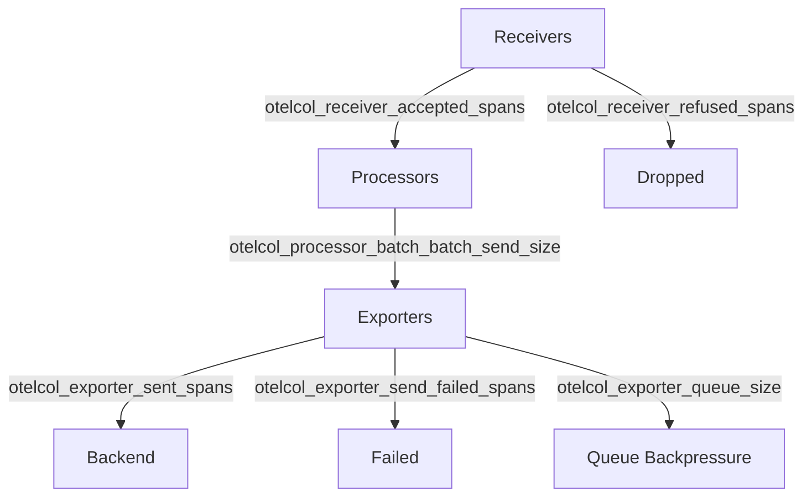

# How to Create an OpenTelemetry Collector Pipeline Health Dashboard in Grafana

Author: [nawazdhandala](https://www.github.com/nawazdhandala)

Tags: OpenTelemetry, Grafana, Observability, Collector

Description: Monitor the health of your OpenTelemetry Collector pipelines with a Grafana dashboard tracking throughput, drops, and errors.

The OpenTelemetry Collector is the backbone of most telemetry pipelines. It receives, processes, and exports traces, metrics, and logs. But who monitors the monitor? If the collector silently drops data or backs up due to exporter failures, you lose visibility right when you need it most.

The collector exposes internal telemetry about its own operation - things like how many spans it received, how many it dropped, exporter queue sizes, and processor latency. This post covers how to capture those internal metrics and build a pipeline health dashboard in Grafana.

## Enabling Internal Telemetry

By default, the collector exposes its own metrics on a Prometheus endpoint. You need to configure the `telemetry` section in the collector config to control this behavior.

```yaml
# otel-collector-config.yaml
# The telemetry section controls the collector's own observability
service:
  telemetry:
    metrics:
      # Expose internal metrics on this address
      address: "0.0.0.0:8888"
      # Level can be: none, basic, normal, detailed
      level: detailed
    logs:
      level: info

  pipelines:
    traces:
      receivers: [otlp]
      processors: [batch, memory_limiter]
      exporters: [otlp/backend]
    metrics:
      receivers: [otlp]
      processors: [batch]
      exporters: [prometheusremotewrite]
```

## Scraping Collector Metrics

You need a way to get these internal metrics into your monitoring backend. The simplest approach is to have Prometheus scrape the collector's metrics endpoint directly.

```yaml
# prometheus.yaml
# Add this scrape config to your Prometheus instance
scrape_configs:
  - job_name: "otel-collector"
    scrape_interval: 15s
    static_configs:
      - targets:
          # Each collector instance's internal metrics port
          - "otel-collector-0:8888"
          - "otel-collector-1:8888"
    metric_relabel_configs:
      # Keep only otelcol_* metrics to reduce cardinality
      - source_labels: [__name__]
        regex: "otelcol_.*"
        action: keep
```

## Key Internal Metrics

The collector exposes dozens of internal metrics. Here are the ones that matter most for pipeline health.



The critical metrics to track:

- `otelcol_receiver_accepted_spans` / `otelcol_receiver_accepted_metric_points` - Data successfully received
- `otelcol_receiver_refused_spans` - Data rejected at the receiver level
- `otelcol_exporter_sent_spans` / `otelcol_exporter_sent_metric_points` - Data successfully exported
- `otelcol_exporter_send_failed_spans` - Export failures
- `otelcol_exporter_queue_size` - Current exporter queue depth
- `otelcol_exporter_queue_capacity` - Maximum queue capacity
- `otelcol_processor_batch_batch_send_size` - Batch sizes being sent

## Building the Dashboard Panels

**Throughput Overview** - A time series showing data flowing through each stage of the pipeline:

```promql
# Receiver throughput - spans accepted per second
rate(otelcol_receiver_accepted_spans_total[5m])
```

```promql
# Exporter throughput - spans sent per second
rate(otelcol_exporter_sent_spans_total[5m])
```

**Data Loss Indicator** - The difference between received and exported data reveals drops:

```promql
# Difference between accepted and sent spans per second
# A growing gap indicates data loss in the pipeline
rate(otelcol_receiver_accepted_spans_total[5m])
  - rate(otelcol_exporter_sent_spans_total[5m])
```

**Exporter Queue Saturation** - A gauge showing how full the exporter queue is:

```promql
# Queue utilization as a percentage
(otelcol_exporter_queue_size / otelcol_exporter_queue_capacity) * 100
```

**Export Failure Rate** - Track how often exports fail, broken down by exporter:

```promql
# Failed exports per second, grouped by exporter name
sum by (exporter) (rate(otelcol_exporter_send_failed_spans_total[5m]))
```

**Memory Limiter Drops** - If you use the memory_limiter processor, monitor how often it triggers:

```promql
# Data dropped by the memory limiter
rate(otelcol_processor_refused_spans_total{processor="memory_limiter"}[5m])
```

## Alert Rules

Beyond visualization, set up alerts for critical conditions:

```yaml
# alerting-rules.yaml
# Prometheus alerting rules for collector health
groups:
  - name: otel-collector-health
    rules:
      # Alert when the exporter queue is more than 80% full
      - alert: OtelCollectorQueueNearCapacity
        expr: >
          (otelcol_exporter_queue_size / otelcol_exporter_queue_capacity) > 0.8
        for: 5m
        labels:
          severity: warning
        annotations:
          summary: "Collector exporter queue is {{ $value | humanizePercentage }} full"

      # Alert when spans are being dropped
      - alert: OtelCollectorDroppingSpans
        expr: >
          rate(otelcol_exporter_send_failed_spans_total[5m]) > 0
        for: 2m
        labels:
          severity: critical
        annotations:
          summary: "Collector is failing to export spans"
```

## Dashboard Layout

Organize the dashboard into three rows:

1. **Pipeline Overview** - Total throughput gauges for each signal type (traces, metrics, logs), overall health status
2. **Receiver and Processor Detail** - Per-receiver acceptance rates, batch sizes, memory limiter activity
3. **Exporter Health** - Per-exporter send rates, failure rates, queue depth over time

This dashboard becomes essential once you scale beyond a single collector instance. It turns the collector from an opaque black box into a well-understood component with clear failure modes and performance characteristics.
