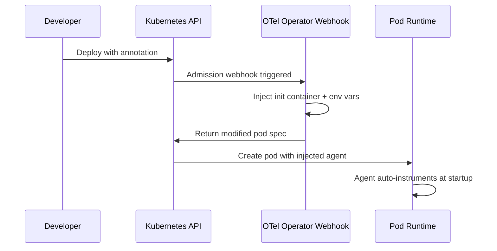

# How to Use OpenTelemetry Operator for Zero-Touch Instrumentation in Your Platform

Author: [nawazdhandala](https://www.github.com/nawazdhandala)

Tags: OpenTelemetry, Kubernetes, Operator, Auto-Instrumentation

Description: Use the OpenTelemetry Operator in Kubernetes to automatically inject instrumentation into services without requiring any code changes from development teams.

Zero-touch instrumentation means developers deploy their application and telemetry just works. No SDK imports, no initialization code, no dependency changes. The OpenTelemetry Operator for Kubernetes makes this possible by injecting instrumentation agents into pods at deployment time through a mutating admission webhook.

This is especially valuable in platform engineering where you want baseline observability across all services without depending on every team to manually add OpenTelemetry to their codebase.

## How the Operator Works

The OpenTelemetry Operator watches for pod creation events. When a pod has the right annotation, the operator's webhook modifies the pod spec to inject an init container that installs the instrumentation agent, along with the environment variables needed for the agent to function.



## Installing the Operator

Install the OpenTelemetry Operator using Helm. The operator manages two custom resources: `OpenTelemetryCollector` for running collectors and `Instrumentation` for configuring auto-instrumentation.

```bash
# Add the OpenTelemetry Helm repository
helm repo add open-telemetry https://open-telemetry.github.io/opentelemetry-helm-charts

# Install the operator with cert-manager dependency
# cert-manager is required for the webhook certificates
helm install opentelemetry-operator \
  open-telemetry/opentelemetry-operator \
  --namespace otel-system \
  --create-namespace \
  --set "manager.collectorImage.repository=otel/opentelemetry-collector-contrib" \
  --set "admissionWebhooks.certManager.enabled=true"
```

## Creating an Instrumentation Resource

The `Instrumentation` custom resource defines how auto-instrumentation behaves for each language. Create one resource per language you want to support.

```yaml
# instrumentation/python-instrumentation.yaml
apiVersion: opentelemetry.io/v1alpha1
kind: Instrumentation
metadata:
  name: python-instrumentation
  namespace: otel-system
spec:
  # Where to send telemetry
  exporter:
    endpoint: http://otel-collector.otel-system.svc.cluster.local:4317

  # Propagation formats to use
  propagators:
    - tracecontext
    - baggage
    - b3

  # Sampler configuration
  sampler:
    type: parentbased_traceidratio
    argument: "0.25"

  # Python-specific settings
  python:
    image: ghcr.io/open-telemetry/opentelemetry-operator/autoinstrumentation-python:latest
    env:
      # Resource attributes applied to all telemetry from Python services
      - name: OTEL_RESOURCE_ATTRIBUTES
        value: "telemetry.auto_instrumented=true"
      # Exclude health check endpoints from tracing to reduce noise
      - name: OTEL_PYTHON_EXCLUDED_URLS
        value: "/health,/ready,/live"

  # Java-specific settings
  java:
    image: ghcr.io/open-telemetry/opentelemetry-operator/autoinstrumentation-java:latest
    env:
      - name: OTEL_RESOURCE_ATTRIBUTES
        value: "telemetry.auto_instrumented=true"

  # Node.js-specific settings
  nodejs:
    image: ghcr.io/open-telemetry/opentelemetry-operator/autoinstrumentation-node:latest
    env:
      - name: OTEL_RESOURCE_ATTRIBUTES
        value: "telemetry.auto_instrumented=true"
```

## Annotating Deployments for Auto-Instrumentation

Teams opt into auto-instrumentation by adding a single annotation to their deployment. The annotation specifies the language runtime so the operator knows which agent to inject.

```yaml
# Example: A Python Flask service that gets auto-instrumented
apiVersion: apps/v1
kind: Deployment
metadata:
  name: order-service
spec:
  replicas: 3
  selector:
    matchLabels:
      app: order-service
  template:
    metadata:
      labels:
        app: order-service
      annotations:
        # This single annotation triggers auto-instrumentation
        instrumentation.opentelemetry.io/inject-python: "otel-system/python-instrumentation"
    spec:
      containers:
        - name: order-service
          image: registry.internal/order-service:1.4.2
          ports:
            - containerPort: 8080
          env:
            - name: OTEL_SERVICE_NAME
              value: "order-service"
            - name: OTEL_RESOURCE_ATTRIBUTES
              value: "team.name=commerce,service.tier=critical"
```

## Platform-Wide Auto-Injection with Namespace Labels

Instead of annotating every deployment, you can configure auto-instrumentation at the namespace level. This is useful when the platform team wants to ensure all services in a team's namespace are instrumented.

```yaml
# Namespace-level configuration for Team Alpha
apiVersion: v1
kind: Namespace
metadata:
  name: team-alpha
  labels:
    # Custom label that your admission controller watches
    platform.internal/auto-instrument: "true"
    platform.internal/default-language: "python"
```

Then use a small admission webhook or a policy engine like Kyverno to automatically add annotations:

```yaml
# kyverno-policy/auto-instrument.yaml
apiVersion: kyverno.io/v1
kind: ClusterPolicy
metadata:
  name: auto-instrument-pods
spec:
  rules:
    - name: inject-otel-annotation
      match:
        resources:
          kinds:
            - Deployment
          namespaces:
            - "team-*"
      mutate:
        patchStrategicMerge:
          spec:
            template:
              metadata:
                annotations:
                  # Default to Python instrumentation
                  # Teams can override by setting this annotation explicitly
                  instrumentation.opentelemetry.io/inject-python: "otel-system/python-instrumentation"
```

## Deploying a Collector with the Operator

The Operator also manages Collector deployments. Define a Collector as a custom resource and the operator handles the lifecycle.

```yaml
# collector/gateway-collector.yaml
apiVersion: opentelemetry.io/v1alpha1
kind: OpenTelemetryCollector
metadata:
  name: gateway
  namespace: otel-system
spec:
  mode: deployment  # Can be deployment, daemonset, or sidecar
  replicas: 3
  config: |
    receivers:
      otlp:
        protocols:
          grpc:
            endpoint: 0.0.0.0:4317
          http:
            endpoint: 0.0.0.0:4318

    processors:
      batch:
        timeout: 5s
        send_batch_size: 1024
      memory_limiter:
        check_interval: 1s
        limit_mib: 512
        spike_limit_mib: 128

    exporters:
      otlphttp:
        endpoint: https://telemetry-backend.internal:443

    service:
      pipelines:
        traces:
          receivers: [otlp]
          processors: [memory_limiter, batch]
          exporters: [otlphttp]
        metrics:
          receivers: [otlp]
          processors: [memory_limiter, batch]
          exporters: [otlphttp]
```

## Limitations and Workarounds

Auto-instrumentation covers the common cases well - HTTP servers, database clients, gRPC calls, and messaging systems. But it cannot instrument custom business logic. If a team needs spans around specific functions or wants to add business-specific attributes, they still need to add manual instrumentation alongside the auto-injected agent.

The recommended pattern is to start with zero-touch auto-instrumentation for baseline coverage, then add targeted manual instrumentation where deeper visibility into business operations is needed. The two approaches work together because the auto-injected agent and manual SDK calls share the same trace context.

Monitor the operator's health and the injection success rate. Failed injections (often caused by resource limits or incompatible base images) should trigger alerts so the platform team can investigate before a team discovers their service has no telemetry.
