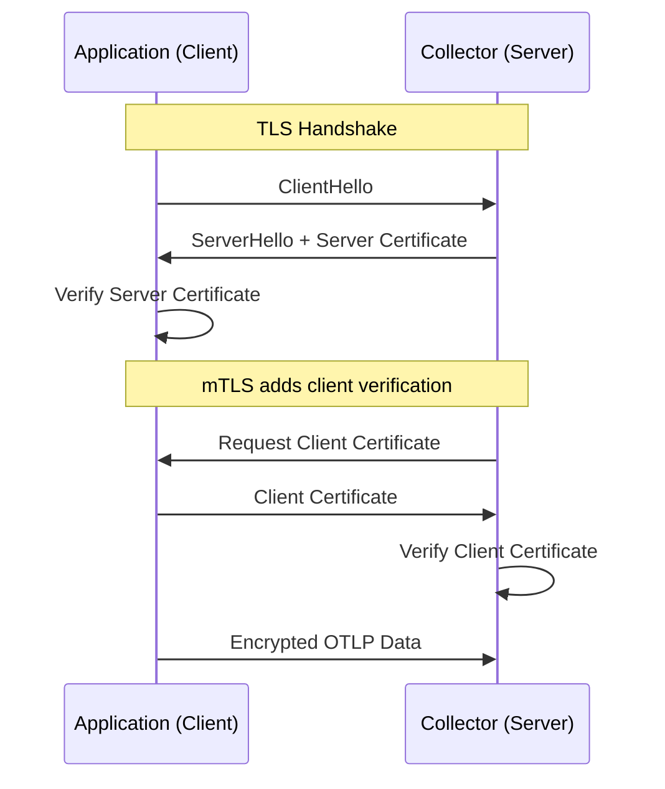

# How to Configure OTLP Export with TLS/mTLS for Any Language

Author: [nawazdhandala](https://www.github.com/nawazdhandala)

Tags: OpenTelemetry, OTLP, TLS, mTLS, Security, Encryption, Certificates

Description: Learn how to configure TLS and mutual TLS (mTLS) for OTLP exporters in Java, Python, Go, and Node.js to secure telemetry data in transit.

---

Telemetry data often contains sensitive information. Span attributes might include user IDs, request parameters, or database queries. Metrics can reveal infrastructure details and business KPIs. Sending this data unencrypted between your applications and the OpenTelemetry Collector, or between the collector and your backend, is a security risk that grows as your infrastructure spans multiple networks and cloud regions.

TLS (Transport Layer Security) encrypts the connection between the client and server. mTLS (mutual TLS) goes further by requiring both sides to present certificates, ensuring that only authorized applications can send telemetry to your collector. This post walks through configuring both TLS and mTLS for OTLP export across the most popular OpenTelemetry languages.

## Understanding TLS vs mTLS

Standard TLS is one-way authentication. The client verifies that the server is who it claims to be by checking the server's certificate against a trusted CA (Certificate Authority). This is the same mechanism your browser uses when connecting to HTTPS websites.

mTLS adds a second layer: the server also verifies the client's identity. Both sides present certificates, and both sides validate them. This prevents unauthorized applications from sending telemetry to your collector.



## Generating Certificates

Before configuring any SDK, you need certificates. For production, use your organization's PKI or a tool like cert-manager in Kubernetes. For testing, you can generate self-signed certificates with OpenSSL:

```bash
# Generate a CA (Certificate Authority) key and certificate.
# This CA will sign both the server and client certificates.
openssl genrsa -out ca.key 4096
openssl req -new -x509 -days 365 -key ca.key -out ca.crt \
  -subj "/CN=OTel CA/O=MyCompany"

# Generate the server certificate for the collector.
# The CN and SAN must match the hostname clients use to connect.
openssl genrsa -out server.key 4096
openssl req -new -key server.key -out server.csr \
  -subj "/CN=otel-collector.observability.svc"

# Sign the server certificate with our CA
openssl x509 -req -days 365 -in server.csr -CA ca.crt -CAkey ca.key \
  -CAcreateserial -out server.crt \
  -extfile <(printf "subjectAltName=DNS:otel-collector.observability.svc,DNS:localhost")

# Generate a client certificate for mTLS.
# Each application or team can have its own client certificate.
openssl genrsa -out client.key 4096
openssl req -new -key client.key -out client.csr \
  -subj "/CN=my-application/O=MyCompany"

# Sign the client certificate with the same CA
openssl x509 -req -days 365 -in client.csr -CA ca.crt -CAkey ca.key \
  -CAcreateserial -out client.crt
```

You now have three sets of files: the CA certificate (`ca.crt`), the server certificate and key (`server.crt`, `server.key`), and the client certificate and key (`client.crt`, `client.key`).

## Collector TLS Configuration

Configure the collector to accept TLS connections and optionally require client certificates:

```yaml
# otel-collector-config.yaml
# Configure OTLP receivers with TLS and optional mTLS
receivers:
  otlp:
    protocols:
      grpc:
        endpoint: 0.0.0.0:4317
        tls:
          # Server certificate and key for TLS
          cert_file: /etc/otel/certs/server.crt
          key_file: /etc/otel/certs/server.key
          # CA certificate to verify client certificates (enables mTLS)
          client_ca_file: /etc/otel/certs/ca.crt
      http:
        endpoint: 0.0.0.0:4318
        tls:
          cert_file: /etc/otel/certs/server.crt
          key_file: /etc/otel/certs/server.key
          client_ca_file: /etc/otel/certs/ca.crt
```

When `client_ca_file` is set, the collector requires clients to present a valid certificate signed by that CA. Remove this line if you only want server-side TLS without client authentication.

## Go SDK Configuration

The Go SDK provides fine-grained TLS configuration through the standard `crypto/tls` package:

```go
package main

import (
    "context"
    "crypto/tls"
    "crypto/x509"
    "os"

    "go.opentelemetry.io/otel/exporters/otlp/otlptrace/otlptracegrpc"
    "google.golang.org/grpc/credentials"
)

// createTLSExporter sets up an OTLP gRPC exporter with mTLS.
// Both the server certificate is verified and a client certificate is presented.
func createTLSExporter(ctx context.Context) (*otlptracegrpc.Exporter, error) {
    // Load the CA certificate to verify the collector's identity
    caCert, err := os.ReadFile("/etc/otel/certs/ca.crt")
    if err != nil {
        return nil, err
    }
    certPool := x509.NewCertPool()
    certPool.AppendCertsFromPEM(caCert)

    // Load the client certificate and key for mTLS
    clientCert, err := tls.LoadX509KeyPair(
        "/etc/otel/certs/client.crt",
        "/etc/otel/certs/client.key",
    )
    if err != nil {
        return nil, err
    }

    tlsConfig := &tls.Config{
        RootCAs:      certPool,
        Certificates: []tls.Certificate{clientCert},
        MinVersion:   tls.VersionTLS12,
    }

    return otlptracegrpc.New(ctx,
        otlptracegrpc.WithEndpoint("otel-collector.observability.svc:4317"),
        otlptracegrpc.WithTLSCredentials(credentials.NewTLS(tlsConfig)),
    )
}
```

If you only need TLS (without client certificates), remove the `Certificates` field from the TLS config. If you only need to skip the `client.crt` and `client.key` loading, just set `RootCAs` to verify the server.

## Java SDK Configuration

For the Java agent, TLS is configured through system properties or environment variables:

```bash
# Configure the Java agent with TLS for the OTLP exporter.
# The agent supports both system properties and environment variables.
java -javaagent:opentelemetry-javaagent.jar \
  -Dotel.exporter.otlp.endpoint=https://otel-collector.observability.svc:4317 \
  -Dotel.exporter.otlp.certificate=/etc/otel/certs/ca.crt \
  -Dotel.exporter.otlp.client.key=/etc/otel/certs/client.key \
  -Dotel.exporter.otlp.client.certificate=/etc/otel/certs/client.crt \
  -jar myapp.jar
```

If you are configuring the SDK programmatically instead of using the agent:

```java
import io.opentelemetry.exporter.otlp.trace.OtlpGrpcSpanExporter;
import io.grpc.netty.shaded.io.netty.handler.ssl.SslContext;
import io.grpc.netty.shaded.io.netty.handler.ssl.SslContextBuilder;

import java.io.File;

// Build a gRPC span exporter with mTLS support.
// This configures both server verification and client certificate presentation.
public OtlpGrpcSpanExporter createSecureExporter() throws Exception {
    SslContext sslContext = SslContextBuilder.forClient()
        // Trust the CA that signed the collector's certificate
        .trustManager(new File("/etc/otel/certs/ca.crt"))
        // Present client certificate for mTLS
        .keyManager(
            new File("/etc/otel/certs/client.crt"),
            new File("/etc/otel/certs/client.key")
        )
        .build();

    return OtlpGrpcSpanExporter.builder()
        .setEndpoint("https://otel-collector.observability.svc:4317")
        .setSslContext(sslContext)
        .build();
}
```

## Python SDK Configuration

Python uses environment variables for TLS configuration:

```bash
# Configure the Python OTLP exporter with TLS certificates.
# These environment variables are read by the SDK automatically.
export OTEL_EXPORTER_OTLP_ENDPOINT="https://otel-collector.observability.svc:4318"
export OTEL_EXPORTER_OTLP_CERTIFICATE="/etc/otel/certs/ca.crt"
export OTEL_EXPORTER_OTLP_CLIENT_KEY="/etc/otel/certs/client.key"
export OTEL_EXPORTER_OTLP_CLIENT_CERTIFICATE="/etc/otel/certs/client.crt"
```

For programmatic configuration:

```python
import ssl
from opentelemetry.exporter.otlp.proto.grpc.trace_exporter import OTLPSpanExporter

# Create an SSL context with mTLS configuration.
# The CA cert verifies the server, and the client cert/key authenticate us.
ssl_context = ssl.create_default_context(
    cafile="/etc/otel/certs/ca.crt"
)
ssl_context.load_cert_chain(
    certfile="/etc/otel/certs/client.crt",
    keyfile="/etc/otel/certs/client.key",
)

# Pass the SSL credentials to the gRPC exporter
from grpc import ssl_channel_credentials

credentials = ssl_channel_credentials(
    root_certificates=open("/etc/otel/certs/ca.crt", "rb").read(),
    private_key=open("/etc/otel/certs/client.key", "rb").read(),
    certificate_chain=open("/etc/otel/certs/client.crt", "rb").read(),
)

exporter = OTLPSpanExporter(
    endpoint="otel-collector.observability.svc:4317",
    credentials=credentials,
)
```

## Node.js SDK Configuration

Node.js supports TLS through environment variables or programmatic configuration:

```bash
# Configure TLS for the Node.js OTLP exporter using environment variables
export OTEL_EXPORTER_OTLP_ENDPOINT="https://otel-collector.observability.svc:4318"
export OTEL_EXPORTER_OTLP_CERTIFICATE="/etc/otel/certs/ca.crt"
export OTEL_EXPORTER_OTLP_CLIENT_KEY="/etc/otel/certs/client.key"
export OTEL_EXPORTER_OTLP_CLIENT_CERTIFICATE="/etc/otel/certs/client.crt"
```

For programmatic mTLS with the gRPC exporter:

```javascript
// Configure the OTLP gRPC exporter with mTLS in Node.js.
// This reads certificate files and passes them as gRPC credentials.
const fs = require('fs');
const grpc = require('@grpc/grpc-js');
const { OTLPTraceExporter } = require('@opentelemetry/exporter-trace-otlp-grpc');

const rootCert = fs.readFileSync('/etc/otel/certs/ca.crt');
const clientKey = fs.readFileSync('/etc/otel/certs/client.key');
const clientCert = fs.readFileSync('/etc/otel/certs/client.crt');

// Create gRPC credentials with mutual TLS
const credentials = grpc.credentials.createSsl(rootCert, clientKey, clientCert);

const exporter = new OTLPTraceExporter({
  url: 'https://otel-collector.observability.svc:4317',
  credentials: credentials,
});
```

## Certificate Rotation in Kubernetes

In production Kubernetes environments, use cert-manager to automate certificate lifecycle:

```yaml
# cert-manager Certificate resource for the collector
apiVersion: cert-manager.io/v1
kind: Certificate
metadata:
  name: otel-collector-cert
  namespace: observability
spec:
  secretName: otel-collector-tls
  duration: 2160h    # 90 days
  renewBefore: 360h  # renew 15 days before expiry
  issuerRef:
    name: internal-ca
    kind: ClusterIssuer
  commonName: otel-collector.observability.svc
  dnsNames:
    - otel-collector.observability.svc
    - otel-collector.observability.svc.cluster.local
```

Mount the resulting secret into the collector pod and configure it to reload certificates when they change.

## Troubleshooting TLS Issues

Common problems and their solutions when setting up TLS for OTLP export:

**Certificate name mismatch.** The hostname in the endpoint must match the CN or SAN in the server certificate. If you connect to `otel-collector:4317` but the certificate says `otel-collector.observability.svc`, the handshake will fail.

**Expired certificates.** Set up alerts for certificate expiration. In Kubernetes, cert-manager handles this automatically, but in other environments you need to monitor certificate validity yourself.

**Wrong CA certificate.** If the client uses a different CA than the one that signed the server certificate, verification will fail. Make sure both sides reference the same CA chain.

**Protocol mismatch.** When using TLS, the endpoint URL should start with `https://` for HTTP exporters. For gRPC, some SDKs infer TLS from the scheme while others require explicit TLS configuration.

## Conclusion

Securing OTLP export with TLS and mTLS is straightforward once you understand the certificate chain. Every OpenTelemetry SDK supports TLS configuration through environment variables, making it possible to use the same approach regardless of programming language. For production environments, mTLS adds a strong authentication layer that ensures only authorized applications can send telemetry to your collector. Combined with certificate automation through tools like cert-manager, you get a secure telemetry pipeline that requires minimal ongoing maintenance.
