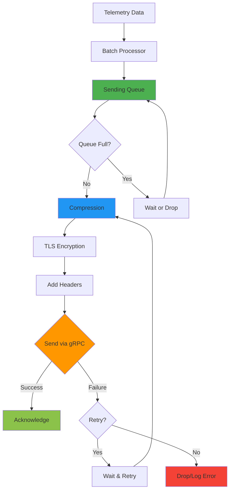

# How to Configure the OTLP gRPC Exporter in the OpenTelemetry Collector

Author: [nawazdhandala](https://www.github.com/nawazdhandala)

Tags: OpenTelemetry, Collector, OTLP, gRPC, Exporters, Configuration

Description: Master the configuration of the OTLP gRPC exporter in the OpenTelemetry Collector for reliable telemetry data transmission to observability backends.

The OTLP (OpenTelemetry Protocol) gRPC exporter is the standard way to send telemetry data from the OpenTelemetry Collector to observability backends. As the native protocol for OpenTelemetry, OTLP over gRPC provides efficient, reliable, and feature-rich telemetry transmission with built-in support for compression, authentication, and retry logic.

## Understanding OTLP and gRPC

OTLP (OpenTelemetry Protocol) is the native protocol of OpenTelemetry, designed specifically for transmitting traces, metrics, and logs. It supports two transport mechanisms:

- **OTLP/gRPC**: Uses gRPC for high-performance, bidirectional streaming
- **OTLP/HTTP**: Uses HTTP/1.1 or HTTP/2 for broader compatibility

gRPC offers several advantages:

- Binary protocol for efficient data transmission
- Built-in compression support
- Connection multiplexing
- Streaming capabilities
- Strong typing with Protocol Buffers

## Basic OTLP gRPC Exporter Configuration

Here's the simplest configuration for the OTLP gRPC exporter:

```yaml
# Basic OTLP gRPC exporter configuration
exporters:
  otlp:
    # The endpoint of your observability backend
    # Default port for OTLP/gRPC is 4317
    endpoint: backend.example.com:4317

service:
  pipelines:
    # Configure for logs
    logs:
      receivers: [otlp]
      processors: [batch]
      exporters: [otlp]

    # Configure for traces
    traces:
      receivers: [otlp]
      processors: [batch]
      exporters: [otlp]

    # Configure for metrics
    metrics:
      receivers: [otlp]
      processors: [batch]
      exporters: [otlp]
```

This basic configuration sends all telemetry types (logs, traces, metrics) to the same endpoint.

## TLS Configuration

For production deployments, always use TLS to encrypt data in transit:

```yaml
# OTLP gRPC exporter with TLS
exporters:
  otlp:
    endpoint: backend.example.com:4317
    tls:
      # Use system CA certificates
      insecure: false

      # Verify server certificate
      insecure_skip_verify: false

      # Optional: Specify custom CA certificate
      ca_file: /etc/ssl/certs/ca-bundle.crt

      # Optional: Use client certificates for mutual TLS
      cert_file: /etc/ssl/certs/client.crt
      key_file: /etc/ssl/private/client.key

      # Optional: Server name for certificate validation
      server_name_override: backend.example.com
```

For development or testing environments only, you can disable TLS:

```yaml
# Development only - NOT for production
exporters:
  otlp:
    endpoint: localhost:4317
    tls:
      insecure: true
```

## Authentication Configuration

Most observability backends require authentication:

### Using API Keys via Headers

```yaml
# Authentication using API key in headers
exporters:
  otlp:
    endpoint: api.observability-backend.com:4317
    tls:
      insecure: false
    headers:
      # Common header patterns for API keys
      "api-key": "your-api-key-here"
      # Or
      "authorization": "Bearer your-token-here"
      # Or
      "x-api-key": "your-api-key-here"
```

### Using Environment Variables for Secrets

Never hardcode secrets in configuration files:

```yaml
# Reference environment variables for secrets
exporters:
  otlp:
    endpoint: api.observability-backend.com:4317
    tls:
      insecure: false
    headers:
      "api-key": "${env:OTLP_API_KEY}"
```

Set the environment variable:

```bash
# Set environment variable
export OTLP_API_KEY="your-api-key-here"

# Run collector
./otelcol --config=config.yaml
```

### Using Basic Authentication

```yaml
# Basic authentication
exporters:
  otlp:
    endpoint: backend.example.com:4317
    tls:
      insecure: false
    headers:
      "authorization": "Basic ${env:BASIC_AUTH_CREDENTIALS}"
```

Generate the credentials:

```bash
# Generate base64 encoded credentials
echo -n "username:password" | base64
# Output: dXNlcm5hbWU6cGFzc3dvcmQ=

export BASIC_AUTH_CREDENTIALS="dXNlcm5hbWU6cGFzc3dvcmQ="
```

## Compression Configuration

Compression reduces bandwidth usage and transmission time:

```yaml
# Configure compression
exporters:
  otlp:
    endpoint: backend.example.com:4317
    tls:
      insecure: false
    # Compression algorithm: gzip, zstd, snappy, or none
    compression: gzip

    # Optional: Compression level (gzip only)
    # Values: 1-9 (1=fastest, 9=best compression)
    # Default is usually sufficient
```

Compression algorithms comparison:

- **gzip**: Widely supported, good compression ratio, moderate CPU usage
- **zstd**: Better compression and speed than gzip, may not be supported everywhere
- **snappy**: Fast compression, lower ratio, good for high-throughput scenarios
- **none**: No compression, use when CPU is constrained or data is already compressed

## Timeout and Retry Configuration

Configure timeouts and retry behavior for reliability:

```yaml
# Timeout and retry configuration
exporters:
  otlp:
    endpoint: backend.example.com:4317
    tls:
      insecure: false

    # Timeout for export requests
    timeout: 30s

    # Retry on failure configuration
    retry_on_failure:
      # Enable retry mechanism
      enabled: true

      # Initial wait time before retry
      initial_interval: 5s

      # Maximum wait time between retries
      max_interval: 30s

      # Maximum elapsed time for retries
      max_elapsed_time: 300s

    # Queue settings for handling bursts
    sending_queue:
      # Enable persistent queue
      enabled: true

      # Number of items in the queue
      num_consumers: 10

      # Maximum queue size
      queue_size: 5000

      # Enable persistence to disk (survives restarts)
      storage: file_storage
```

Configure the file storage extension:

```yaml
extensions:
  file_storage:
    directory: /var/lib/otelcol/queue
    timeout: 10s

service:
  extensions: [file_storage]
  pipelines:
    logs:
      receivers: [otlp]
      processors: [batch]
      exporters: [otlp]
```

## Resource Detection and Attributes

Add resource attributes to identify the source:

```yaml
# Resource detection and attribute configuration
processors:
  # Detect resource attributes automatically
  resourcedetection:
    detectors: [env, system, docker, ec2]
    timeout: 5s
    override: false

  # Add custom resource attributes
  resource:
    attributes:
      # Add deployment environment
      - key: deployment.environment
        value: production
        action: insert

      # Add cluster identifier
      - key: k8s.cluster.name
        value: production-us-east-1
        action: insert

exporters:
  otlp:
    endpoint: backend.example.com:4317
    tls:
      insecure: false

service:
  pipelines:
    logs:
      receivers: [otlp]
      processors: [resourcedetection, resource, batch]
      exporters: [otlp]
```

## Multiple Exporters Configuration

Send telemetry to multiple backends:

```yaml
# Multiple OTLP exporters
exporters:
  # Primary backend
  otlp/primary:
    endpoint: primary-backend.example.com:4317
    tls:
      insecure: false
    headers:
      "api-key": "${env:PRIMARY_API_KEY}"
    compression: gzip

  # Secondary backend for backup
  otlp/secondary:
    endpoint: secondary-backend.example.com:4317
    tls:
      insecure: false
    headers:
      "api-key": "${env:SECONDARY_API_KEY}"
    compression: gzip

  # Local development backend
  otlp/debug:
    endpoint: localhost:4317
    tls:
      insecure: true

service:
  pipelines:
    logs:
      receivers: [otlp]
      processors: [batch]
      # Send to multiple exporters
      exporters: [otlp/primary, otlp/secondary]
```

## Signal-Specific Endpoints

Some backends use different endpoints for different signal types:

```yaml
# Signal-specific endpoint configuration
exporters:
  otlp:
    # Default endpoint
    endpoint: backend.example.com:4317

    # Override endpoint for specific signals
    endpoint_override:
      traces_endpoint: traces.backend.example.com:4317
      metrics_endpoint: metrics.backend.example.com:4317
      logs_endpoint: logs.backend.example.com:4317

    tls:
      insecure: false

    headers:
      "api-key": "${env:API_KEY}"
```

Alternatively, use separate exporters:

```yaml
exporters:
  # Dedicated traces exporter
  otlp/traces:
    endpoint: traces.backend.example.com:4317
    tls:
      insecure: false

  # Dedicated metrics exporter
  otlp/metrics:
    endpoint: metrics.backend.example.com:4317
    tls:
      insecure: false

  # Dedicated logs exporter
  otlp/logs:
    endpoint: logs.backend.example.com:4317
    tls:
      insecure: false

service:
  pipelines:
    traces:
      receivers: [otlp]
      processors: [batch]
      exporters: [otlp/traces]

    metrics:
      receivers: [otlp]
      processors: [batch]
      exporters: [otlp/metrics]

    logs:
      receivers: [otlp]
      processors: [batch]
      exporters: [otlp/logs]
```

## Complete Production Configuration

Here's a comprehensive production-ready configuration:

```yaml
# Complete production OTLP gRPC exporter configuration

# Extensions for additional capabilities
extensions:
  # Health check endpoint
  health_check:
    endpoint: 0.0.0.0:13133

  # Performance profiling
  pprof:
    endpoint: localhost:1777

  # Persistent queue storage
  file_storage:
    directory: /var/lib/otelcol/queue
    timeout: 10s

# Receivers
receivers:
  # OTLP receiver for incoming telemetry
  otlp:
    protocols:
      grpc:
        endpoint: 0.0.0.0:4317
      http:
        endpoint: 0.0.0.0:4318

  # Host metrics
  hostmetrics:
    collection_interval: 30s
    scrapers:
      cpu:
      memory:
      disk:
      network:

# Processors
processors:
  # Memory limiter to prevent OOM
  memory_limiter:
    check_interval: 1s
    limit_mib: 512
    spike_limit_mib: 128

  # Resource detection
  resourcedetection:
    detectors: [env, system, docker, ec2]
    timeout: 5s

  # Add resource attributes
  resource:
    attributes:
      - key: deployment.environment
        value: ${env:ENVIRONMENT}
        action: insert
      - key: service.namespace
        value: ${env:SERVICE_NAMESPACE}
        action: insert

  # Batch processor for efficiency
  batch:
    timeout: 10s
    send_batch_size: 1024
    send_batch_max_size: 2048

  # Transform processor for data manipulation
  transform:
    log_statements:
      - context: log
        statements:
          # Add processing timestamp
          - set(attributes["collector.processed_at"], UnixMicro(time_now()))

          # Ensure environment is set
          - set(attributes["environment"], resource.attributes["deployment.environment"]) where attributes["environment"] == nil

# Exporters
exporters:
  # Primary OTLP exporter
  otlp:
    endpoint: ${env:OTLP_ENDPOINT}
    tls:
      insecure: false
      ca_file: /etc/ssl/certs/ca-bundle.crt

    headers:
      "api-key": "${env:OTLP_API_KEY}"
      "tenant-id": "${env:TENANT_ID}"

    compression: gzip

    timeout: 30s

    retry_on_failure:
      enabled: true
      initial_interval: 5s
      max_interval: 30s
      max_elapsed_time: 300s

    sending_queue:
      enabled: true
      num_consumers: 10
      queue_size: 5000
      storage: file_storage

  # Debug exporter for troubleshooting
  debug:
    verbosity: basic
    sampling_initial: 5
    sampling_thereafter: 200

  # Prometheus exporter for collector metrics
  prometheus:
    endpoint: 0.0.0.0:8889

# Service configuration
service:
  # Enable extensions
  extensions: [health_check, pprof, file_storage]

  # Configure telemetry for the collector itself
  telemetry:
    logs:
      level: info
      output_paths:
        - /var/log/otelcol/collector.log
        - stdout

    metrics:
      level: detailed
      address: 0.0.0.0:8888

  # Define pipelines
  pipelines:
    # Traces pipeline
    traces:
      receivers: [otlp]
      processors: [memory_limiter, resourcedetection, resource, batch]
      exporters: [otlp]

    # Metrics pipeline
    metrics:
      receivers: [otlp, hostmetrics]
      processors: [memory_limiter, resourcedetection, resource, batch]
      exporters: [otlp, prometheus]

    # Logs pipeline
    logs:
      receivers: [otlp]
      processors: [memory_limiter, resourcedetection, resource, transform, batch]
      exporters: [otlp]
```

## OTLP Exporter Data Flow

Here's how data flows through the OTLP exporter:



## Performance Tuning

Optimize the OTLP exporter for your workload:

### High Throughput Configuration

```yaml
# Optimized for high throughput
exporters:
  otlp:
    endpoint: backend.example.com:4317
    tls:
      insecure: false

    # Fast timeout
    timeout: 10s

    # Aggressive batching
    batch:
      timeout: 5s
      send_batch_size: 2048
      send_batch_max_size: 4096

    # Large queue
    sending_queue:
      enabled: true
      num_consumers: 20
      queue_size: 10000

    # Efficient compression
    compression: snappy
```

### Low Latency Configuration

```yaml
# Optimized for low latency
exporters:
  otlp:
    endpoint: backend.example.com:4317
    tls:
      insecure: false

    # Short timeout
    timeout: 5s

    # Small batches for quick sending
    batch:
      timeout: 1s
      send_batch_size: 100

    # Smaller queue
    sending_queue:
      enabled: true
      num_consumers: 5
      queue_size: 1000

    # Light compression
    compression: gzip
```

### Resource-Constrained Configuration

```yaml
# Optimized for limited resources
exporters:
  otlp:
    endpoint: backend.example.com:4317
    tls:
      insecure: false

    timeout: 30s

    # Moderate batching
    batch:
      timeout: 10s
      send_batch_size: 512

    # Small queue with disk persistence
    sending_queue:
      enabled: true
      num_consumers: 2
      queue_size: 1000
      storage: file_storage

    # No compression to save CPU
    compression: none
```

## Monitoring and Troubleshooting

Monitor your OTLP exporter health:

```yaml
# Enable collector self-monitoring
service:
  telemetry:
    logs:
      level: info

    metrics:
      level: detailed
      address: 0.0.0.0:8888

exporters:
  # Export collector metrics
  prometheus:
    endpoint: 0.0.0.0:8889

  otlp:
    endpoint: backend.example.com:4317
    tls:
      insecure: false

service:
  pipelines:
    metrics:
      receivers: [otlp]
      processors: [batch]
      exporters: [otlp, prometheus]
```

Key metrics to monitor:

- `otelcol_exporter_sent_spans`: Number of spans exported
- `otelcol_exporter_sent_metric_points`: Number of metric points exported
- `otelcol_exporter_sent_log_records`: Number of log records exported
- `otelcol_exporter_send_failed_spans`: Failed span exports
- `otelcol_exporter_queue_size`: Current queue size
- `otelcol_exporter_queue_capacity`: Queue capacity

## Common Configuration Patterns

### Pattern 1: Development Setup

```yaml
exporters:
  otlp:
    endpoint: localhost:4317
    tls:
      insecure: true
    compression: none

exporters:
  debug:
    verbosity: detailed

service:
  pipelines:
    logs:
      receivers: [otlp]
      processors: [batch]
      exporters: [otlp, debug]
```

### Pattern 2: Staging Environment

```yaml
exporters:
  otlp:
    endpoint: staging-backend.example.com:4317
    tls:
      insecure: false
    headers:
      "api-key": "${env:STAGING_API_KEY}"
    compression: gzip
    retry_on_failure:
      enabled: true
      initial_interval: 5s

service:
  pipelines:
    logs:
      receivers: [otlp]
      processors: [batch]
      exporters: [otlp]
```

### Pattern 3: Production with HA

```yaml
exporters:
  # Primary backend
  otlp/primary:
    endpoint: ${env:PRIMARY_ENDPOINT}
    tls:
      insecure: false
    headers:
      "api-key": "${env:PRIMARY_API_KEY}"
    compression: gzip
    sending_queue:
      enabled: true
      storage: file_storage

  # Failover backend
  otlp/failover:
    endpoint: ${env:FAILOVER_ENDPOINT}
    tls:
      insecure: false
    headers:
      "api-key": "${env:FAILOVER_API_KEY}"
    compression: gzip

service:
  pipelines:
    logs:
      receivers: [otlp]
      processors: [batch]
      exporters: [otlp/primary, otlp/failover]
```

## Best Practices

1. **Always Use TLS in Production**: Encrypt data in transit to protect sensitive information.

2. **Use Environment Variables for Secrets**: Never hardcode API keys or credentials in configuration files.

3. **Enable Retry Logic**: Configure retry_on_failure to handle transient network issues.

4. **Use Batching**: The batch processor reduces network overhead and improves efficiency.

5. **Configure Timeouts Appropriately**: Balance between allowing enough time for transmission and preventing hung connections.

6. **Enable Persistent Queues**: Use file_storage for sending_queue to survive collector restarts.

7. **Monitor Exporter Metrics**: Watch for failed exports, queue growth, and latency issues.

8. **Use Compression**: gzip compression typically reduces bandwidth by 70-90%.

9. **Test Before Production**: Validate configuration in development and staging environments.

10. **Implement Proper Resource Limits**: Use memory_limiter to prevent OOM conditions.

## Conclusion

The OTLP gRPC exporter is the cornerstone of OpenTelemetry observability pipelines, providing reliable, efficient transmission of telemetry data to backends. By properly configuring TLS, authentication, compression, retry logic, and queuing, you can build robust telemetry pipelines that handle production workloads reliably.

Combined with processors like [transform](https://oneuptime.com/blog/post/transform-log-bodies-ottl-opentelemetry-collector/view), [batch](https://opentelemetry.io/docs/collector/configuration/#processors), and resource detection, the OTLP exporter enables comprehensive observability solutions that scale from development to production.

For more information on the OTLP exporter and OpenTelemetry Collector configuration, refer to the [OpenTelemetry Collector documentation](https://opentelemetry.io/docs/collector/configuration/) and [OTLP specification](https://opentelemetry.io/docs/specs/otlp/).
