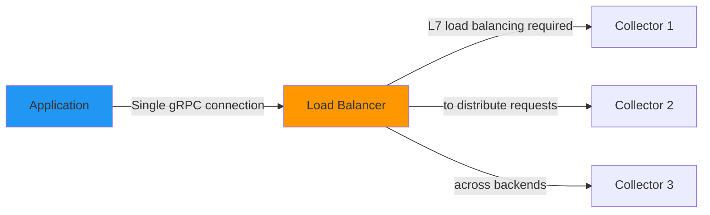
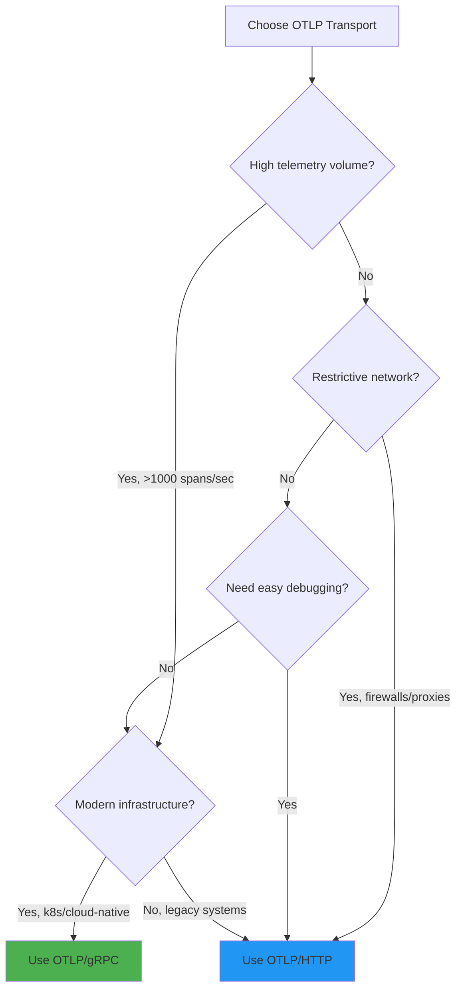

# How to Choose Between OTLP/gRPC and OTLP/HTTP for Your Application

Author: [nawazdhandala](https://www.github.com/nawazdhandala)

Tags: OpenTelemetry, OTLP, gRPC, HTTP, Performance, Configuration

Description: Choosing between OTLP/gRPC and OTLP/HTTP impacts performance, reliability, and operational complexity. This guide breaks down when to use each transport.

You've decided to export telemetry using OTLP. Smart choice. Now you face another decision: gRPC or HTTP? Both are fully supported OTLP transports, both work with the same backends, and both will get your telemetry from point A to point B. So which one should you use?

The answer isn't "one is better." It's "one is better for your specific context." The right choice depends on your infrastructure, performance requirements, network environment, and operational constraints. This guide gives you the framework to make an informed decision.

## Quick Comparison Table

| Factor | OTLP/gRPC | OTLP/HTTP |
|--------|-----------|-----------|
| Encoding | Protobuf only | Protobuf or JSON |
| Protocol | HTTP/2 (binary) | HTTP/1.1 or HTTP/2 |
| Connection | Long-lived, multiplexed | Request-response |
| Latency | Lower (connection reuse) | Slightly higher |
| Throughput | Higher (streaming, flow control) | Lower |
| Network efficiency | Better (binary + compression) | Good (with protobuf + gzip) |
| Debugging | Harder (binary protocol) | Easier (especially with JSON) |
| Firewall/proxy compatibility | Can be problematic | Excellent |
| Corporate network friendly | Sometimes blocked | Always works |
| Infrastructure complexity | Requires gRPC support | Standard HTTP |
| Client resource usage | Higher (connection management) | Lower |
| Retry semantics | Built-in (gRPC retries) | SDK-level retries |
| Load balancing | Requires L7 load balancer | Works with L4 or L7 |

## When to Use OTLP/gRPC

gRPC is the high-performance option. It's designed for efficient RPC communication between services. If you control your infrastructure and need maximum throughput, gRPC is often the better choice.

### Use gRPC when:

**High telemetry volume**: You're exporting thousands of spans or millions of metric data points per second. gRPC's streaming and multiplexing give you better throughput.

**Low latency matters**: You want minimal overhead between span creation and export. gRPC's persistent connections eliminate TCP handshake overhead on every export.

**Modern infrastructure**: You're running on Kubernetes, have service mesh (Istio, Linkerd), or use modern cloud-native tooling that handles gRPC well.

**Backend supports it**: Your observability backend has a native gRPC OTLP endpoint. Most modern backends do.

**Resource efficiency**: You want to minimize serialization overhead. Protobuf encoding is faster than JSON parsing.

### Example: Configuring OTLP/gRPC in Node.js

```javascript
import { OTLPTraceExporter } from '@opentelemetry/exporter-trace-otlp-grpc';
import { OTLPMetricExporter } from '@opentelemetry/exporter-metrics-otlp-grpc';
import { CompressionAlgorithm } from '@opentelemetry/exporter-trace-otlp-grpc';

// Configure gRPC trace exporter with compression
const traceExporter = new OTLPTraceExporter({
  url: 'grpc://oneuptime.com:4317', // Default gRPC port
  headers: {
    'x-oneuptime-token': process.env.ONEUPTIME_TOKEN,
  },
  compression: CompressionAlgorithm.GZIP,
});

// Configure gRPC metric exporter
const metricExporter = new OTLPMetricExporter({
  url: 'grpc://oneuptime.com:4317',
  headers: {
    'x-oneuptime-token': process.env.ONEUPTIME_TOKEN,
  },
  compression: CompressionAlgorithm.GZIP,
});
```

Note the port: gRPC OTLP typically uses port 4317, while HTTP uses 4318 or 443.

## When to Use OTLP/HTTP

HTTP is the compatibility option. It works everywhere, it's easy to debug, and it doesn't require special infrastructure. If you value operational simplicity or need to work through restrictive networks, HTTP is often the pragmatic choice.

### Use HTTP when:

**Corporate networks**: Your application runs behind corporate proxies, firewalls, or VPNs that block non-HTTP traffic. HTTP goes through anything.

**Legacy infrastructure**: Your load balancers, proxies, or API gateways don't handle gRPC well. HTTP works with any HTTP infrastructure.

**Debugging needs**: You want to inspect telemetry payloads with standard tools (browser dev tools, curl, tcpdump). JSON over HTTP is human-readable.

**Simpler ops**: You don't want to deal with gRPC client libraries, connection pooling nuances, or HTTP/2 quirks. HTTP is boring technology that just works.

**Moderate volume**: Your telemetry volume is reasonable (hundreds of spans per second, not thousands). The efficiency gap doesn't matter.

**Mixed environments**: You have some services on old platforms (serverless functions, embedded systems) where gRPC client libraries are immature or unavailable.

### Example: Configuring OTLP/HTTP in Node.js

```javascript
import { OTLPTraceExporter } from '@opentelemetry/exporter-trace-otlp-http';
import { OTLPMetricExporter } from '@opentelemetry/exporter-metrics-otlp-http';

// Configure HTTP trace exporter with protobuf encoding (default)
const traceExporter = new OTLPTraceExporter({
  url: 'https://oneuptime.com/otlp/v1/traces',
  headers: {
    'x-oneuptime-token': process.env.ONEUPTIME_TOKEN,
  },
  compression: 'gzip',
});

// Configure HTTP metric exporter
const metricExporter = new OTLPMetricExporter({
  url: 'https://oneuptime.com/otlp/v1/metrics',
  headers: {
    'x-oneuptime-token': process.env.ONEUPTIME_TOKEN,
  },
  compression: 'gzip',
});
```

OTLP/HTTP uses standard HTTPS (port 443) with specific paths (`/v1/traces`, `/v1/metrics`, `/v1/logs`).

## Performance Deep Dive

Performance differences matter at scale. Here's what you need to know.

### Latency

**gRPC advantage**: Persistent connections mean no TCP handshake, TLS negotiation, or DNS lookup on every export. Typical export latency: 1-5ms (local network).

**HTTP disadvantage**: Each export is a new request (unless you use HTTP/2 keep-alive, which helps but isn't guaranteed). Typical export latency: 5-20ms (local network).

At low export frequencies (once per minute), this doesn't matter. At high frequencies (multiple times per second), gRPC saves significant overhead.

### Throughput

**gRPC advantage**: HTTP/2 multiplexing lets multiple requests share a single connection. Flow control prevents overwhelming slow receivers. Streaming support (not yet used by OTLP, but available) enables continuous telemetry flow.

Measured throughput: 10,000-50,000 spans/sec per exporter instance (depending on span size, compression, network).

**HTTP advantage**: Simpler request-response model is easier to reason about. No connection state to manage.

Measured throughput: 5,000-20,000 spans/sec per exporter instance.

Real-world example: A microservice generating 1,000 spans/sec can use either transport comfortably. A high-traffic API gateway generating 10,000 spans/sec benefits from gRPC.

### Resource usage

**gRPC cost**: Maintaining persistent connections consumes memory. The gRPC client library is larger and uses more CPU for connection management.

**HTTP cost**: Creating new connections for every export uses more network resources (SYN/ACK packets, ephemeral ports, connection tracking in firewalls).

In practice, the difference is small unless you're running on very constrained environments (embedded devices, serverless functions with tight memory limits).

### Compression

Both transports support gzip compression. Enable it.

```javascript
// gRPC
import { CompressionAlgorithm } from '@opentelemetry/exporter-trace-otlp-grpc';

const exporter = new OTLPTraceExporter({
  compression: CompressionAlgorithm.GZIP,
});

// HTTP
const exporter = new OTLPTraceExporter({
  compression: 'gzip',
});
```

Compression reduces payload size by 5-10x for typical traces. The CPU cost is negligible compared to serialization. Always enable compression in production.

## Network and Infrastructure Considerations

Your choice often comes down to what your network allows and what your infrastructure supports.

### Firewalls and proxies

**gRPC challenge**: Many corporate firewalls inspect HTTP traffic and block non-HTTP protocols. gRPC uses HTTP/2, which some middleboxes don't handle well. Symptoms: connections hang, slow negotiation, or outright blocking.

**HTTP advantage**: Standard HTTPS traffic goes through any proxy. Use the same proxy configuration as your other HTTP clients.

```bash
# HTTP works through standard proxies
export HTTPS_PROXY=http://corporate-proxy.example.com:8080
```

gRPC proxies require CONNECT tunneling or HTTP/2 proxy support, which isn't universal.

### Load balancers

**gRPC challenge**: HTTP/2 multiplexes requests over a single connection. If you have multiple backend replicas, a naive L4 (TCP) load balancer will route all requests from one client to one backend. You need L7 (HTTP/2-aware) load balancing for proper distribution.



**HTTP advantage**: Each request is independent. L4 load balancers work fine. Even simple DNS round-robin works.

Modern cloud load balancers (AWS ALB, GCP Load Balancer, Azure Application Gateway) handle gRPC properly. But if you're using older infrastructure or self-hosted load balancers, HTTP is simpler.

### TLS and certificates

Both transports support TLS. Configuration is similar.

**gRPC**: Uses TLS for encryption. Certificate validation is mandatory (or you explicitly disable it for testing, which you shouldn't do in production).

```javascript
import { credentials } from '@grpc/grpc-js';

const exporter = new OTLPTraceExporter({
  url: 'grpc://oneuptime.com:4317',
  credentials: credentials.createSsl(), // Use system CA certs
});
```

**HTTP**: Standard HTTPS. Works like any other HTTP client.

```javascript
const exporter = new OTLPTraceExporter({
  url: 'https://oneuptime.com/otlp/v1/traces', // Standard HTTPS
});
```

If you have custom CA certificates or mutual TLS requirements, both transports support it. Consult your SDK's documentation.

## Debugging and Troubleshooting

Debugging telemetry pipelines is easier with HTTP.

### HTTP debugging advantages

**Inspect with curl**: Test the endpoint directly.

```bash
curl -X POST https://oneuptime.com/otlp/v1/traces \
  -H "Content-Type: application/json" \
  -H "x-oneuptime-token: YOUR_TOKEN" \
  -d '{"resourceSpans":[]}'
```

You get immediate feedback on connectivity, authentication, and endpoint correctness.

**Human-readable payloads**: Use JSON encoding (less efficient, but useful for debugging).

```javascript
const exporter = new OTLPTraceExporter({
  url: 'https://oneuptime.com/otlp/v1/traces',
  headers: { 'Content-Type': 'application/json' },
  // JSON encoding is used when Content-Type is application/json
});
```

Print the payload to see exactly what's being sent.

**Standard tools**: Use browser dev tools, Postman, or HTTP debugging proxies (Charles, Fiddler) to inspect requests and responses.

### gRPC debugging challenges

**Binary protocol**: Payloads are protobuf-encoded. You can't just read them.

**Specialized tools**: Use `grpcurl` (like curl for gRPC) or Wireshark with protobuf dissectors.

```bash
# Test gRPC endpoint with grpcurl
grpcurl -plaintext oneuptime.com:4317 list
```

**More opaque errors**: gRPC status codes (UNAVAILABLE, DEADLINE_EXCEEDED, etc.) are less intuitive than HTTP status codes (503, 504).

If you're debugging a failing pipeline and you're not sure why telemetry isn't flowing, HTTP makes diagnosis faster.

## Encoding: Protobuf vs JSON

OTLP/HTTP supports both protobuf and JSON encoding. OTLP/gRPC only supports protobuf.

### Protobuf (default for both transports)

**Pros:**
- Compact binary format (5-10x smaller than JSON)
- Fast serialization and deserialization
- Schema validation (protobuf definitions enforce structure)

**Cons:**
- Not human-readable
- Requires protobuf libraries

Use protobuf in production. It's the default for a reason.

### JSON (OTLP/HTTP only)

**Pros:**
- Human-readable (great for debugging)
- Works with any JSON parser
- Easy to test with curl or Postman

**Cons:**
- 5-10x larger payloads
- Slower serialization
- Higher bandwidth usage

Use JSON only for debugging. Switch back to protobuf for production.

```javascript
// Force JSON encoding (debugging only)
import { OTLPTraceExporter } from '@opentelemetry/exporter-trace-otlp-http';

const exporter = new OTLPTraceExporter({
  url: 'https://oneuptime.com/otlp/v1/traces',
  headers: {
    'Content-Type': 'application/json', // Request JSON encoding
  },
});
```

## Retry and Error Handling

Both transports implement retries, but the mechanisms differ.

### gRPC retries

gRPC has built-in retry logic. You configure retry policies in the gRPC client.

```javascript
const exporter = new OTLPTraceExporter({
  url: 'grpc://oneuptime.com:4317',
  // gRPC retry configuration (varies by SDK)
  metadata: {
    'grpc.max_receive_message_length': 4 * 1024 * 1024, // 4MB
    'grpc.keepalive_time_ms': 120000,
  },
});
```

gRPC handles transient errors (UNAVAILABLE, DEADLINE_EXCEEDED) with exponential backoff automatically.

### HTTP retries

HTTP retries are implemented at the SDK level. The exporter catches network errors and retries with exponential backoff.

```javascript
const exporter = new OTLPTraceExporter({
  url: 'https://oneuptime.com/otlp/v1/traces',
  timeoutMillis: 10000, // Request timeout
  // Retry logic is internal to the SDK
});
```

Both work fine in practice. gRPC's retries are more integrated with the protocol. HTTP retries are more transparent (you can see them in logs).

## Cloud Provider Specifics

Some cloud platforms have quirks that favor one transport over the other.

### AWS

**Lambda**: HTTP is simpler. gRPC works but requires careful connection management (Lambda freezes/thaws execution contexts, which can break persistent connections).

**ECS/EKS**: Both work well. Use gRPC if you're running a Collector sidecar. Use HTTP if exporting directly to a backend.

**Firewall rules**: AWS security groups work with both. Use HTTPS (443) for HTTP, or open custom ports (4317) for gRPC.

### Google Cloud

**Cloud Run**: HTTP is better. Cloud Run has request timeout limits that can conflict with persistent gRPC connections.

**GKE**: Both work well. gRPC is common in GCP's ecosystem.

**VPC**: GCP's network infrastructure handles gRPC natively. No issues.

### Azure

**App Service**: HTTP is more reliable. Azure's proxy layer sometimes has issues with long-lived gRPC connections.

**AKS**: Both work well.

**Virtual Network**: No issues with either transport.

### General cloud advice

If you're exporting to a managed observability service (OneUptime, Datadog, New Relic), check their documentation. Most support both, but they may recommend one over the other for their infrastructure.

Related reading: [How to Understand OTLP (OpenTelemetry Protocol) and Why It Matters](https://oneuptime.com/blog/post/2026-02-06-otlp-opentelemetry-protocol-explained/view)

## Real-World Decision Framework

Here's a practical decision tree.



**Scenario 1: High-scale microservice on Kubernetes**
- 10,000 spans/sec
- Modern infrastructure (k8s, service mesh)
- Backend supports gRPC

**Recommendation**: gRPC. You'll benefit from the efficiency.

**Scenario 2: Enterprise app behind corporate proxy**
- 100 spans/sec
- Corporate network with HTTP proxy
- Need to troubleshoot occasionally

**Recommendation**: HTTP. It will just work, and performance is fine at this scale.

**Scenario 3: Serverless functions (AWS Lambda)**
- Variable load (bursty traffic)
- Short-lived execution contexts
- Cost-conscious (minimize memory usage)

**Recommendation**: HTTP. Simpler, lower overhead, no persistent connection issues.

**Scenario 4: High-frequency trading system**
- Ultra-low latency requirements
- Dedicated infrastructure
- Very high telemetry volume

**Recommendation**: gRPC. Squeeze out every millisecond.

## Migration Between Transports

Switching between gRPC and HTTP is easy. It's a configuration change, not a code change.

### Step 1: Install the new exporter package

```bash
# Switching from gRPC to HTTP
npm uninstall @opentelemetry/exporter-trace-otlp-grpc
npm install @opentelemetry/exporter-trace-otlp-http
```

### Step 2: Update import and configuration

```javascript
// Before (gRPC)
import { OTLPTraceExporter } from '@opentelemetry/exporter-trace-otlp-grpc';

const exporter = new OTLPTraceExporter({
  url: 'grpc://oneuptime.com:4317',
});

// After (HTTP)
import { OTLPTraceExporter } from '@opentelemetry/exporter-trace-otlp-http';

const exporter = new OTLPTraceExporter({
  url: 'https://oneuptime.com/otlp/v1/traces',
});
```

### Step 3: Test and deploy

Test in a dev environment first. Monitor export success rates and latency. Roll out gradually.

You can also run both exporters temporarily (send to two backends) to validate that the migration works before fully switching over.

## Using Environment Variables

The cleanest way to make the transport configurable is via environment variables.

```bash
# For HTTP
export OTEL_EXPORTER_OTLP_PROTOCOL=http/protobuf
export OTEL_EXPORTER_OTLP_ENDPOINT=https://oneuptime.com/otlp

# For gRPC
export OTEL_EXPORTER_OTLP_PROTOCOL=grpc
export OTEL_EXPORTER_OTLP_ENDPOINT=grpc://oneuptime.com:4317
```

The SDK reads these variables and configures the appropriate exporter automatically.

Related reading: [How to Set Up OpenTelemetry with Environment Variables (Zero-Code Configuration)](https://oneuptime.com/blog/post/2026-02-06-opentelemetry-environment-variables-zero-code/view)

## Key Takeaways

Choosing between OTLP/gRPC and OTLP/HTTP is not about picking the "best" option. It's about picking the right option for your context.

**Use gRPC when:**
- You have high telemetry volume
- You control your infrastructure
- You need maximum performance
- Your network and load balancers support it

**Use HTTP when:**
- You need broad compatibility (firewalls, proxies)
- You value operational simplicity
- You need easy debugging
- Your volume is moderate

**In doubt?** Start with HTTP. It's the pragmatic choice. If you hit performance bottlenecks later, migrate to gRPC. The migration is straightforward.

Both transports are production-ready, vendor-neutral, and fully supported. You can't make a wrong choice, only a suboptimal one. Use this guide to make the optimal choice for your situation.

**Related Reading:**
- [How to Understand OTLP (OpenTelemetry Protocol) and Why It Matters](https://oneuptime.com/blog/post/2026-02-06-otlp-opentelemetry-protocol-explained/view)
- [What is OpenTelemetry Collector and why use one?](https://oneuptime.com/blog/post/2025-09-18-what-is-opentelemetry-collector-and-why-use-one/view)
- [How to Set Up OpenTelemetry with Environment Variables (Zero-Code Configuration)](https://oneuptime.com/blog/post/2026-02-06-opentelemetry-environment-variables-zero-code/view)
