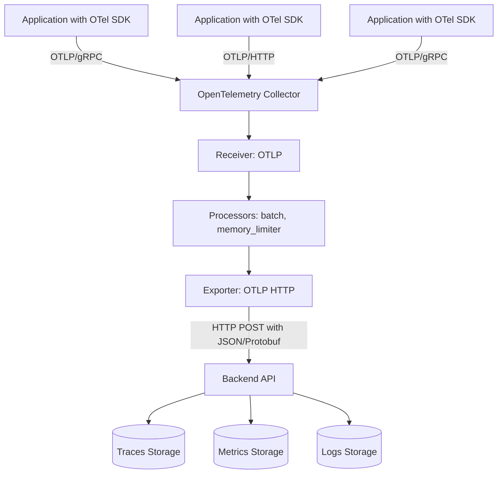

# How to Configure the OTLP HTTP Exporter in the OpenTelemetry Collector

Author: [nawazdhandala](https://www.github.com/nawazdhandala)

Tags: OpenTelemetry, Collector, Exporters, OTLP, HTTP, Observability

Description: A practical guide to configuring the OTLP HTTP exporter in OpenTelemetry Collector with real YAML examples, authentication patterns, retry logic, compression options, and production-ready configurations for sending telemetry to OTLP-compatible backends.

---

The OTLP HTTP exporter is one of the most widely used exporters in the OpenTelemetry Collector ecosystem. It sends telemetry data (traces, metrics, and logs) over HTTP to any OTLP-compatible backend using the standardized OpenTelemetry Protocol. This makes it the default choice for shipping observability data to modern backends like OneUptime, Grafana Cloud, and other OTLP-native platforms.

This guide covers everything you need to configure the OTLP HTTP exporter in production, from basic setup to advanced authentication, compression, retry policies, and performance tuning.

---

## Why Use the OTLP HTTP Exporter?

The OTLP HTTP exporter offers several advantages over proprietary export formats:

**Vendor neutrality**: OTLP is the standard wire format for OpenTelemetry. Any backend that speaks OTLP can receive your data without custom adapters or conversions.

**HTTP-friendly infrastructure**: Unlike gRPC (OTLP's binary alternative), HTTP works seamlessly through most proxies, load balancers, and corporate firewalls without special configuration.

**Built-in resiliency**: The exporter includes automatic retries with exponential backoff, request timeouts, and queue management to handle transient failures gracefully.

**Flexibility**: Supports all three telemetry signals (traces, metrics, logs) through a single endpoint or separate signal-specific endpoints depending on your backend's requirements.

---

## Basic Configuration

Here is a minimal OTLP HTTP exporter configuration. This sends telemetry to a backend listening at the specified endpoint:

```yaml
# receivers configuration (how telemetry enters the Collector)
receivers:
  otlp:
    protocols:
      grpc:        # Accept OTLP over gRPC from instrumented apps
      http:        # Accept OTLP over HTTP from instrumented apps

# exporters configuration (where telemetry is sent)
exporters:
  otlphttp:
    endpoint: https://api.example.com/v1/traces  # OTLP HTTP endpoint

# service pipelines (wire receivers to exporters)
service:
  pipelines:
    traces:
      receivers: [otlp]
      exporters: [otlphttp]
```

The `endpoint` should point to your OTLP-compatible backend. Many platforms provide signal-specific endpoints:

- Traces: `https://api.example.com/v1/traces`
- Metrics: `https://api.example.com/v1/metrics`
- Logs: `https://api.example.com/v1/logs`

If your backend supports a unified endpoint for all signals, you can omit the signal path and the exporter will append it automatically.

---

## Data Flow Architecture

This diagram shows how telemetry flows from your applications through the Collector to the backend using the OTLP HTTP exporter:



---

## Authentication Patterns

Most production backends require authentication. The OTLP HTTP exporter supports multiple authentication methods through custom headers.

### API Token Authentication

The most common pattern uses a bearer token or API key in HTTP headers:

```yaml
exporters:
  otlphttp:
    endpoint: https://api.example.com/v1/traces
    headers:
      # Bearer token authentication
      authorization: "Bearer ${OTEL_API_TOKEN}"

      # Or custom header authentication
      x-api-key: "${OTEL_API_KEY}"
```

Using environment variables (like `${OTEL_API_TOKEN}`) keeps secrets out of configuration files. Set these variables before starting the Collector:

```bash
export OTEL_API_TOKEN="your-secret-token-here"
./otelcol-contrib --config=config.yaml
```

### OneUptime Configuration

For OneUptime specifically, use the `x-oneuptime-token` header:

```yaml
exporters:
  otlphttp_oneuptime:
    endpoint: https://oneuptime.com/otlp
    headers:
      x-oneuptime-token: "${ONEUPTIME_TOKEN}"
```

### Basic Authentication

Some backends use HTTP Basic Auth:

```yaml
exporters:
  otlphttp:
    endpoint: https://api.example.com/v1/traces
    headers:
      # Base64-encoded username:password
      authorization: "Basic ${BASIC_AUTH_CREDENTIALS}"
```

Generate the Basic Auth header:

```bash
echo -n "username:password" | base64
# Output: dXNlcm5hbWU6cGFzc3dvcmQ=
export BASIC_AUTH_CREDENTIALS="dXNlcm5hbWU6cGFzc3dvcmQ="
```

---

## Compression Configuration

Compression reduces bandwidth usage and speeds up data transfer, especially important when sending high volumes of telemetry. The OTLP HTTP exporter supports multiple compression algorithms:

```yaml
exporters:
  otlphttp:
    endpoint: https://api.example.com/v1/traces
    compression: gzip  # Options: gzip, zstd, snappy, none

    headers:
      authorization: "Bearer ${OTEL_API_TOKEN}"
```

**Compression algorithm comparison:**

- **gzip** (default): Universal support, good compression ratio (60-80% size reduction), moderate CPU usage. Best for most use cases.
- **zstd**: Better compression and speed than gzip, but requires backend support. Use if your backend supports it.
- **snappy**: Very fast but lower compression ratio. Good for high-throughput scenarios where CPU matters more than bandwidth.
- **none**: No compression. Only use for debugging or when the network is fast and CPU-constrained.

For most production deployments, stick with `gzip` unless you have specific requirements.

---

## Timeout and Retry Configuration

Network failures happen. The OTLP HTTP exporter includes sophisticated retry logic with exponential backoff to handle transient failures:

```yaml
exporters:
  otlphttp:
    endpoint: https://api.example.com/v1/traces

    # HTTP request timeout - how long to wait for a response
    timeout: 30s

    # Retry configuration for failed requests
    retry_on_failure:
      enabled: true
      initial_interval: 5s      # Wait 5s after first failure
      max_interval: 30s          # Cap backoff at 30s
      max_elapsed_time: 300s     # Give up after 5 minutes total

    # Queue configuration for buffering during outages
    sending_queue:
      enabled: true
      num_consumers: 10          # Parallel export workers
      queue_size: 5000           # Buffer up to 5000 batches
```

**How retry logic works:**

1. First request fails (network error, 5xx response, timeout)
2. Wait `initial_interval` (5 seconds)
3. Retry. If it fails again, double the wait time (10s)
4. Continue doubling up to `max_interval` (30s)
5. Keep retrying until `max_elapsed_time` (5 minutes) is reached
6. If still failing, drop the data and log an error

The `sending_queue` buffers batches in memory during outages. If the queue fills up, the Collector will start dropping data. Size this based on your traffic volume and acceptable data loss tolerance.

---

## TLS Configuration

When sending telemetry over the internet, always use TLS encryption. The exporter supports custom TLS settings:

```yaml
exporters:
  otlphttp:
    endpoint: https://api.example.com/v1/traces

    tls:
      # Skip TLS verification (ONLY for testing, never in production)
      insecure_skip_verify: false

      # Use system certificate pool
      insecure: false

      # Custom CA certificate for self-signed or internal CAs
      ca_file: /etc/otel/ca.crt

      # Mutual TLS (mTLS) - client certificate authentication
      cert_file: /etc/otel/client.crt
      key_file: /etc/otel/client.key
```

For most cloud backends, you do not need custom TLS settings. The default system certificates work fine. Use custom settings when:

- Your backend uses a self-signed certificate (development environments)
- You need mutual TLS for enhanced security
- You are connecting to an internal service with a private CA

---

## Production-Ready Configuration

Here is a complete production configuration that combines all best practices:

```yaml
receivers:
  # Accept telemetry from instrumented applications
  otlp:
    protocols:
      grpc:
        endpoint: 0.0.0.0:4317
      http:
        endpoint: 0.0.0.0:4318

processors:
  # Protect Collector memory from overload
  memory_limiter:
    check_interval: 1s
    limit_mib: 512
    spike_limit_mib: 128

  # Batch telemetry to reduce network overhead
  batch:
    send_batch_size: 8192        # Send when batch reaches 8192 spans
    timeout: 10s                  # Or send every 10 seconds
    send_batch_max_size: 10000   # Hard limit per batch

  # Add resource attributes for identification
  resource:
    attributes:
      - key: deployment.environment
        value: production
        action: upsert

exporters:
  # Primary OTLP HTTP exporter to OneUptime
  otlphttp_oneuptime:
    endpoint: https://oneuptime.com/otlp

    # Authentication
    headers:
      x-oneuptime-token: "${ONEUPTIME_TOKEN}"

    # Compression for bandwidth efficiency
    compression: gzip

    # Request timeout
    timeout: 30s

    # Retry failed requests with exponential backoff
    retry_on_failure:
      enabled: true
      initial_interval: 5s
      max_interval: 30s
      max_elapsed_time: 300s

    # Queue batches during outages
    sending_queue:
      enabled: true
      num_consumers: 10
      queue_size: 5000
      storage: file_storage  # Persist queue to disk (requires extension)

  # Backup exporter for redundancy (optional)
  otlphttp_backup:
    endpoint: https://backup.example.com/v1/traces
    headers:
      authorization: "Bearer ${BACKUP_TOKEN}"
    compression: gzip

# Extensions for additional functionality
extensions:
  # Persist sending queue to disk to survive restarts
  file_storage:
    directory: /var/lib/otelcol/queue
    timeout: 10s

# Service configuration
service:
  extensions: [file_storage]

  pipelines:
    # Traces pipeline
    traces:
      receivers: [otlp]
      processors: [memory_limiter, resource, batch]
      exporters: [otlphttp_oneuptime]

    # Metrics pipeline
    metrics:
      receivers: [otlp]
      processors: [memory_limiter, resource, batch]
      exporters: [otlphttp_oneuptime]

    # Logs pipeline
    logs:
      receivers: [otlp]
      processors: [memory_limiter, resource, batch]
      exporters: [otlphttp_oneuptime]
```

This configuration includes:

- Memory protection to prevent OOM crashes
- Efficient batching to reduce network calls
- Resource attributes for environment tagging
- Compression to save bandwidth
- Retry logic with exponential backoff
- Persistent queue storage to survive Collector restarts
- Separate pipelines for traces, metrics, and logs

---

## Multi-Backend Routing

You can send telemetry to multiple backends simultaneously by configuring multiple exporters:

```yaml
exporters:
  # Primary backend (all signals)
  otlphttp_primary:
    endpoint: https://primary.example.com/otlp
    headers:
      authorization: "Bearer ${PRIMARY_TOKEN}"

  # Secondary backend (traces only for long-term storage)
  otlphttp_archive:
    endpoint: https://archive.example.com/v1/traces
    headers:
      x-api-key: "${ARCHIVE_KEY}"

service:
  pipelines:
    traces:
      receivers: [otlp]
      processors: [batch]
      exporters: [otlphttp_primary, otlphttp_archive]  # Send to both

    metrics:
      receivers: [otlp]
      processors: [batch]
      exporters: [otlphttp_primary]  # Only primary gets metrics
```

This pattern is useful for:

- Sending traces to a fast query backend and a cheap archive backend
- Routing sensitive logs to a secure backend while general logs go elsewhere
- Migrating between backends (send to both during transition)

---

## Troubleshooting Common Issues

### Connection Refused

**Problem**: Collector logs show "connection refused" errors.

**Solution**: Check that:
- The endpoint URL is correct
- The backend service is running and reachable
- Firewall rules allow outbound HTTPS traffic
- DNS resolution works (`nslookup api.example.com`)

### Authentication Failures (401/403)

**Problem**: Backend rejects requests with authentication errors.

**Solution**:
- Verify the API token is correct and not expired
- Check that environment variables are set correctly
- Ensure the header name matches backend requirements (case-sensitive)
- Test authentication with curl:

```bash
curl -H "authorization: Bearer YOUR_TOKEN" \
     https://api.example.com/v1/traces
```

### Data Not Appearing

**Problem**: Collector runs without errors but data does not appear in backend.

**Solution**:
- Check that pipeline configuration connects receivers to exporters
- Verify processor chain does not filter out all data
- Enable debug logging to see what the Collector receives and sends:

```yaml
service:
  telemetry:
    logs:
      level: debug  # Verbose logging for troubleshooting
```

### High Memory Usage

**Problem**: Collector memory grows until OOM crash.

**Solution**:
- Configure `memory_limiter` processor with appropriate limits
- Reduce `sending_queue` size if buffering too much data
- Increase `batch` processor timeout to send data faster
- Check for backend slowness causing queue buildup

---

## Performance Tuning

For high-throughput environments, tune these parameters:

```yaml
exporters:
  otlphttp:
    endpoint: https://api.example.com/v1/traces

    # Increase workers for parallel exports
    sending_queue:
      num_consumers: 20  # More workers = higher throughput

    # Larger batches reduce network overhead
    batch:
      send_batch_size: 16384
      send_batch_max_size: 20000

processors:
  batch:
    # Aggressive batching for high volume
    send_batch_size: 16384
    timeout: 5s  # Send more frequently
```

Monitor Collector internal metrics to tune effectively:

- `otelcol_exporter_sent_spans`: Spans successfully exported
- `otelcol_exporter_send_failed_spans`: Failed exports (should be near zero)
- `otelcol_exporter_queue_size`: Current queue depth (should stay well below max)

See our guide on [collecting OpenTelemetry Collector internal metrics](https://oneuptime.com/blog/post/2025-01-22-how-to-collect-opentelemetry-collector-internal-metrics/view) for monitoring the Collector itself.

---

## Related Resources

- [What is the OpenTelemetry Collector and Why Use One?](https://oneuptime.com/blog/post/2025-09-18-what-is-opentelemetry-collector-and-why-use-one/view)
- [How to Configure the Debug Exporter in the OpenTelemetry Collector](https://oneuptime.com/blog/post/debug-exporter-opentelemetry-collector/view)
- [How to Configure the Prometheus Exporter in the OpenTelemetry Collector](https://oneuptime.com/blog/post/prometheus-exporter-opentelemetry-collector/view)

---

## Summary

The OTLP HTTP exporter is the standard way to send OpenTelemetry data from the Collector to modern observability backends. Key takeaways:

- Use environment variables for sensitive credentials
- Enable compression (gzip) to reduce bandwidth
- Configure retry logic and queues for resiliency
- Batch aggressively to reduce network overhead
- Monitor Collector metrics to catch export failures early
- Use TLS for security (enabled by default with https://)

Start with the basic configuration and add complexity as needed. The defaults work well for most deployments, but tuning batch size, queue depth, and worker count can significantly improve throughput for high-volume environments.

For a production-ready OpenTelemetry backend that natively supports OTLP, check out [OneUptime](https://oneuptime.com).
