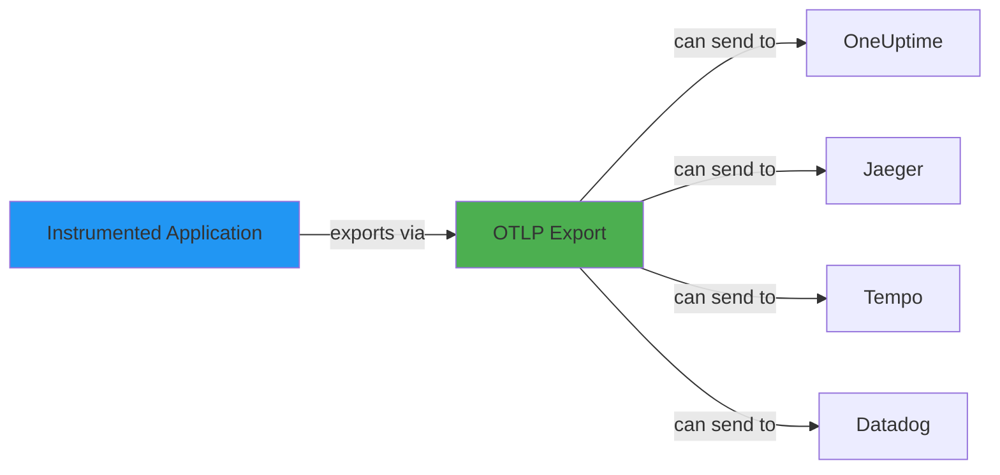
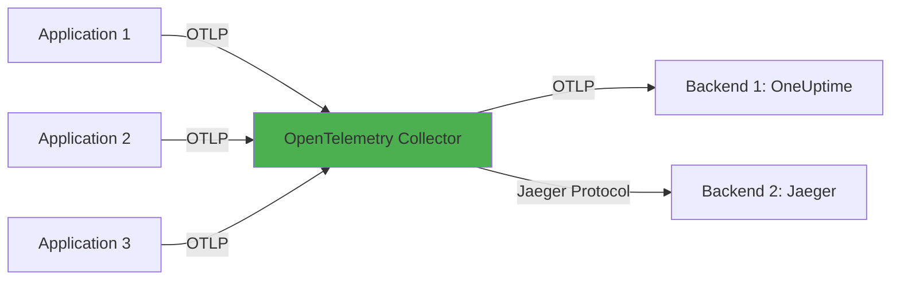

# How to Understand OTLP (OpenTelemetry Protocol) and Why It Matters

Author: [nawazdhandala](https://www.github.com/nawazdhandala)

Tags: OpenTelemetry, OTLP, Protocol, gRPC, HTTP, Data Export

Description: OTLP is the vendor-neutral wire protocol that makes OpenTelemetry truly portable. Understanding how it works helps you build telemetry pipelines that don't lock you into a single backend.

You instrument your application with OpenTelemetry. Spans are created, metrics are recorded, logs are emitted. Then what? How does that telemetry data get from your application to your observability backend?

The answer is OTLP: OpenTelemetry Protocol. It's the standard wire format for transmitting traces, metrics, and logs from instrumented applications to collectors and backends. OTLP is what makes OpenTelemetry vendor-neutral. You export OTLP, and any compatible backend can receive it- Jaeger, Prometheus, Tempo, Loki, Datadog, New Relic, OneUptime, and dozens of others.

Understanding OTLP helps you make better decisions about exporter configuration, network efficiency, debugging telemetry pipelines, and maintaining portability. This isn't just an academic protocol spec- it's the foundation of modern observability interoperability.

## What Problem Does OTLP Solve?

Before OpenTelemetry, every observability vendor had their own proprietary format. Jaeger had its own protocol. Zipkin had its own. Prometheus had its own. If you wanted to switch vendors, you had to rewrite your instrumentation or run translation layers.

This fragmentation was painful. Multi-vendor setups required multiple agents. Testing a new backend meant significant integration work. Migrating between vendors meant risky rewrites.

OTLP solves this by defining a single, open standard for telemetry transmission. Instrument once with OpenTelemetry, export OTLP, and route to any compatible backend. Swap backends by changing configuration, not code.



## OTLP Transports: gRPC and HTTP

OTLP is not a single protocol. It's a specification with two transport implementations: gRPC and HTTP.

### OTLP/gRPC

Uses gRPC as the transport layer. gRPC is built on HTTP/2, uses Protocol Buffers for serialization, and provides built-in streaming, flow control, and connection multiplexing.

**Pros:**
- Efficient binary encoding (protobuf)
- Bidirectional streaming support
- Built-in load balancing and retry logic
- Lower latency due to connection reuse
- Better throughput for high-volume telemetry

**Cons:**
- Requires gRPC infrastructure (not all proxies/firewalls support it well)
- More complex debugging (binary protocol)
- Slightly higher resource usage on client side

### OTLP/HTTP

Uses HTTP/1.1 or HTTP/2 as the transport layer. Supports both JSON and protobuf encoding. More compatible with existing web infrastructure.

**Pros:**
- Works through standard HTTP proxies and load balancers
- Easier debugging (especially with JSON encoding)
- Better firewall/corporate network compatibility
- No special infrastructure requirements

**Cons:**
- Higher overhead (especially with JSON encoding)
- No built-in streaming (each export is a new request)
- Slightly higher latency compared to gRPC

Both transports are fully specified and supported. The choice depends on your environment and performance requirements. We'll cover the tradeoffs in detail in a separate post.

Related reading: [How to Choose Between OTLP/gRPC and OTLP/HTTP for Your Application](https://oneuptime.com/blog/post/2026-02-06-otlp-grpc-vs-http-comparison/view)

## OTLP Signal Types

OTLP defines separate data models for each telemetry signal type: traces, metrics, and logs. Each signal has its own endpoint, schema, and semantics.

### Traces

Traces represent distributed request flows. An OTLP trace export contains:

- **ResourceSpans**: Groups spans by originating resource (service, host, etc.)
- **ScopeSpans**: Groups spans by instrumentation library
- **Spans**: Individual units of work with timing, attributes, events, links, status

Each span includes:
- Trace ID and Span ID (for correlation)
- Parent span ID (for hierarchy)
- Start and end timestamps
- Span kind (SERVER, CLIENT, PRODUCER, CONSUMER, INTERNAL)
- Attributes (key-value metadata)
- Events (timestamped log-like records)
- Links (relationships to other traces)
- Status (OK, ERROR, UNSET)

### Metrics

Metrics represent numerical measurements over time. An OTLP metric export contains:

- **ResourceMetrics**: Groups metrics by originating resource
- **ScopeMetrics**: Groups metrics by instrumentation library
- **Metrics**: Individual metric streams

Each metric has a type:
- **Gauge**: Point-in-time measurement (temperature, queue depth)
- **Sum**: Cumulative or delta value (request count, bytes sent)
- **Histogram**: Distribution of values (latency distribution)
- **Summary**: Pre-calculated quantiles (deprecated, use histogram)
- **ExponentialHistogram**: Logarithmic bucket histogram (better precision)

Metrics include aggregation temporality (cumulative vs delta) and exemplar support (linking metrics to traces).

### Logs

Logs represent structured or unstructured event records. An OTLP log export contains:

- **ResourceLogs**: Groups logs by originating resource
- **ScopeLogs**: Groups logs by instrumentation library
- **LogRecords**: Individual log entries

Each log record includes:
- Timestamp
- Severity level
- Message body
- Attributes
- Trace context (trace_id, span_id for correlation)
- Resource and scope information

## Protocol Buffers: The Encoding

OTLP uses Protocol Buffers (protobuf) as its primary encoding format. Protobuf is a binary serialization format developed by Google. It's language-agnostic, compact, and fast.

When you export OTLP over gRPC, protobuf encoding is mandatory. When you export OTLP over HTTP, you can choose between protobuf and JSON.

### Why protobuf?

**Efficiency**: Binary encoding is much smaller than JSON. A typical trace might be 60-70% smaller encoded as protobuf vs JSON.

**Speed**: Serialization and deserialization are faster. Critical when you're exporting thousands of spans per second.

**Schema enforcement**: Protobuf requires a schema (`.proto` files). This prevents accidental data corruption and ensures compatibility.

**Backward compatibility**: Protobuf handles schema evolution gracefully. Adding new fields doesn't break old consumers.

### Example protobuf definition (simplified)

This is a simplified excerpt from the OTLP spec. The real definitions are more complex.

```protobuf
// Trace data export
message ExportTraceServiceRequest {
  repeated ResourceSpans resource_spans = 1;
}

message ResourceSpans {
  Resource resource = 1;
  repeated ScopeSpans scope_spans = 2;
}

message ScopeSpans {
  InstrumentationScope scope = 1;
  repeated Span spans = 2;
}

message Span {
  bytes trace_id = 1;
  bytes span_id = 2;
  string name = 3;
  SpanKind kind = 4;
  fixed64 start_time_unix_nano = 5;
  fixed64 end_time_unix_nano = 6;
  repeated KeyValue attributes = 7;
  repeated Event events = 8;
  Status status = 9;
  bytes parent_span_id = 10;
}
```

You never write this manually. The OpenTelemetry SDK generates and serializes it automatically.

## OTLP Endpoints

When you configure an OTLP exporter, you specify an endpoint URL. Each signal type has its own endpoint path.

### Default endpoint paths

For OTLP/gRPC:
```
opentelemetry.proto.collector.trace.v1.TraceService/Export
opentelemetry.proto.collector.metrics.v1.MetricsService/Export
opentelemetry.proto.collector.logs.v1.LogsService/Export
```

For OTLP/HTTP:
```
POST /v1/traces
POST /v1/metrics
POST /v1/logs
```

Most backends provide a single base URL. You configure it, and the SDK appends the appropriate path.

### Example configuration

Configure OTLP exporter to send to OneUptime.

```javascript
// Node.js example
import { OTLPTraceExporter } from '@opentelemetry/exporter-trace-otlp-http';
import { OTLPMetricExporter } from '@opentelemetry/exporter-metrics-otlp-http';

const traceExporter = new OTLPTraceExporter({
  url: 'https://oneuptime.com/otlp/v1/traces',
  headers: {
    'x-oneuptime-token': process.env.ONEUPTIME_TOKEN,
  },
});

const metricExporter = new OTLPMetricExporter({
  url: 'https://oneuptime.com/otlp/v1/metrics',
  headers: {
    'x-oneuptime-token': process.env.ONEUPTIME_TOKEN,
  },
});
```

Or use environment variables for zero-code configuration.

```bash
export OTEL_EXPORTER_OTLP_ENDPOINT="https://oneuptime.com/otlp"
export OTEL_EXPORTER_OTLP_HEADERS="x-oneuptime-token=YOUR_TOKEN"
export OTEL_TRACES_EXPORTER="otlp"
export OTEL_METRICS_EXPORTER="otlp"
export OTEL_LOGS_EXPORTER="otlp"
```

The SDK automatically appends `/v1/traces`, `/v1/metrics`, `/v1/logs`.

Related reading: [How to Set Up OpenTelemetry with Environment Variables (Zero-Code Configuration)](https://oneuptime.com/blog/post/2026-02-06-opentelemetry-environment-variables-zero-code/view)

## OTLP Request-Response Flow

OTLP exporters batch telemetry and send it periodically. Here's the typical flow for traces (metrics and logs work similarly).

### Client-side (Application)

1. SDK collects spans as they're created
2. Spans are passed to a SpanProcessor (usually BatchSpanProcessor)
3. Processor batches spans (e.g., 512 spans or 5 seconds, whichever comes first)
4. Processor passes batch to Exporter
5. Exporter serializes spans into OTLP format (protobuf)
6. Exporter sends ExportTraceServiceRequest to backend via gRPC or HTTP
7. Exporter waits for ExportTraceServiceResponse

### Server-side (Backend or Collector)

1. Receive ExportTraceServiceRequest
2. Deserialize protobuf payload into spans
3. Validate spans (check required fields, trace IDs, timestamps)
4. Process spans (store in database, forward to another backend, etc.)
5. Send ExportTraceServiceResponse (success or partial failure)

The response indicates success or failure. If the export fails (network error, backend down, etc.), the SDK may retry based on its retry policy.

### Backpressure and retries

OTLP exporters implement backpressure. If the backend is slow or unavailable, the exporter queues batches in memory (up to a limit). If the queue fills, new spans are dropped (with a warning logged).

Retry logic varies by SDK implementation, but most follow exponential backoff: wait 1 second, then 2, then 4, etc., up to a max retry interval.

## OTLP Compression

Telemetry data is repetitive and compresses well. OTLP supports gzip compression out of the box.

For OTLP/gRPC, compression is negotiated via gRPC's built-in compression support. You enable it in exporter config:

```javascript
import { OTLPTraceExporter } from '@opentelemetry/exporter-trace-otlp-grpc';
import { CompressionAlgorithm } from '@opentelemetry/exporter-trace-otlp-grpc';

const exporter = new OTLPTraceExporter({
  url: 'https://oneuptime.com/otlp',
  compression: CompressionAlgorithm.GZIP,
});
```

For OTLP/HTTP, the exporter sets the `Content-Encoding: gzip` header, and the server decompresses the payload.

Compression ratios are often 5:1 or better for traces. It significantly reduces network bandwidth, especially in high-volume environments.

## Collector as OTLP Gateway

The OpenTelemetry Collector is the canonical OTLP receiver. You configure your applications to export OTLP to the Collector, and the Collector forwards telemetry to backends.



The Collector speaks OTLP on both sides: it receives OTLP from applications and can export OTLP to backends. But it can also translate OTLP into other formats (Jaeger, Zipkin, Prometheus Remote Write, etc.) for legacy systems.

This decoupling is powerful. Applications only need to know how to speak OTLP. The Collector handles routing, transformation, sampling, and multi-backend fanout.

Related reading: [What is OpenTelemetry Collector and why use one?](https://oneuptime.com/blog/post/2025-09-18-what-is-opentelemetry-collector-and-why-use-one/view)

## Example OTLP Exporter Configuration

Here's a complete example of configuring OTLP exporters in different languages.

### Node.js (JavaScript/TypeScript)

```javascript
import { NodeSDK } from '@opentelemetry/sdk-node';
import { OTLPTraceExporter } from '@opentelemetry/exporter-trace-otlp-http';
import { OTLPMetricExporter } from '@opentelemetry/exporter-metrics-otlp-http';
import { PeriodicExportingMetricReader } from '@opentelemetry/sdk-metrics';
import { Resource } from '@opentelemetry/resources';
import { SemanticResourceAttributes } from '@opentelemetry/semantic-conventions';

const resource = new Resource({
  [SemanticResourceAttributes.SERVICE_NAME]: 'my-service',
});

// Configure OTLP exporters
const traceExporter = new OTLPTraceExporter({
  url: 'https://oneuptime.com/otlp/v1/traces',
  headers: { 'x-oneuptime-token': process.env.ONEUPTIME_TOKEN },
  compression: 'gzip',
});

const metricExporter = new OTLPMetricExporter({
  url: 'https://oneuptime.com/otlp/v1/metrics',
  headers: { 'x-oneuptime-token': process.env.ONEUPTIME_TOKEN },
  compression: 'gzip',
});

const sdk = new NodeSDK({
  resource,
  traceExporter,
  metricReader: new PeriodicExportingMetricReader({
    exporter: metricExporter,
    exportIntervalMillis: 60000,
  }),
});

sdk.start();
```

### Python

```python
from opentelemetry import trace, metrics
from opentelemetry.sdk.trace import TracerProvider
from opentelemetry.sdk.trace.export import BatchSpanProcessor
from opentelemetry.sdk.metrics import MeterProvider
from opentelemetry.sdk.metrics.export import PeriodicExportingMetricReader
from opentelemetry.exporter.otlp.proto.http.trace_exporter import OTLPSpanExporter
from opentelemetry.exporter.otlp.proto.http.metric_exporter import OTLPMetricExporter
from opentelemetry.sdk.resources import Resource

# Define resource attributes
resource = Resource.create({"service.name": "my-service"})

# Configure OTLP trace exporter
trace_exporter = OTLPSpanExporter(
    endpoint="https://oneuptime.com/otlp/v1/traces",
    headers={"x-oneuptime-token": os.environ["ONEUPTIME_TOKEN"]},
)

# Set up tracing
tracer_provider = TracerProvider(resource=resource)
tracer_provider.add_span_processor(BatchSpanProcessor(trace_exporter))
trace.set_tracer_provider(tracer_provider)

# Configure OTLP metric exporter
metric_exporter = OTLPMetricExporter(
    endpoint="https://oneuptime.com/otlp/v1/metrics",
    headers={"x-oneuptime-token": os.environ["ONEUPTIME_TOKEN"]},
)

# Set up metrics
metric_reader = PeriodicExportingMetricReader(metric_exporter, export_interval_millis=60000)
meter_provider = MeterProvider(resource=resource, metric_readers=[metric_reader])
metrics.set_meter_provider(meter_provider)
```

### Go

```go
package main

import (
    "context"
    "os"
    "time"

    "go.opentelemetry.io/otel"
    "go.opentelemetry.io/otel/exporters/otlp/otlptrace/otlptracehttp"
    "go.opentelemetry.io/otel/exporters/otlp/otlpmetric/otlpmetrichttp"
    "go.opentelemetry.io/otel/sdk/metric"
    "go.opentelemetry.io/otel/sdk/resource"
    "go.opentelemetry.io/otel/sdk/trace"
    semconv "go.opentelemetry.io/otel/semconv/v1.17.0"
)

func initOTLP(ctx context.Context) error {
    // Define resource
    res, err := resource.New(ctx,
        resource.WithAttributes(semconv.ServiceName("my-service")),
    )
    if err != nil {
        return err
    }

    // Configure OTLP trace exporter with authentication header
    traceExporter, err := otlptracehttp.New(ctx,
        otlptracehttp.WithEndpoint("oneuptime.com"),
        otlptracehttp.WithURLPath("/otlp/v1/traces"),
        otlptracehttp.WithHeaders(map[string]string{
            "x-oneuptime-token": os.Getenv("ONEUPTIME_TOKEN"),
        }),
        otlptracehttp.WithCompression(otlptracehttp.GzipCompression),
    )
    if err != nil {
        return err
    }

    // Set up trace provider
    tp := trace.NewTracerProvider(
        trace.WithBatcher(traceExporter),
        trace.WithResource(res),
    )
    otel.SetTracerProvider(tp)

    // Configure OTLP metric exporter
    metricExporter, err := otlpmetrichttp.New(ctx,
        otlpmetrichttp.WithEndpoint("oneuptime.com"),
        otlpmetrichttp.WithURLPath("/otlp/v1/metrics"),
        otlpmetrichttp.WithHeaders(map[string]string{
            "x-oneuptime-token": os.Getenv("ONEUPTIME_TOKEN"),
        }),
        otlpmetrichttp.WithCompression(otlpmetrichttp.GzipCompression),
    )
    if err != nil {
        return err
    }

    // Set up metric provider
    mp := metric.NewMeterProvider(
        metric.WithReader(metric.NewPeriodicReader(metricExporter, metric.WithInterval(60*time.Second))),
        metric.WithResource(res),
    )
    otel.SetMeterProvider(mp)

    return nil
}
```

All three examples follow the same pattern: configure exporter with endpoint and auth headers, attach to SDK, start exporting.

## Debugging OTLP Exports

When telemetry isn't showing up in your backend, debugging OTLP exports helps isolate the problem.

### Enable SDK debug logging

Most SDKs have a debug or verbose mode that logs export attempts.

```bash
# Node.js
export OTEL_LOG_LEVEL=debug

# Python
export OTEL_LOG_LEVEL=debug

# Go
export OTEL_LOG_LEVEL=debug
```

You'll see logs like:

```
[OTLP Trace Exporter] Sending 42 spans to https://oneuptime.com/otlp/v1/traces
[OTLP Trace Exporter] Export succeeded (HTTP 200)
```

Or error messages:

```
[OTLP Trace Exporter] Export failed: connection refused
[OTLP Trace Exporter] Export failed: HTTP 401 Unauthorized
```

### Use the console exporter

Temporarily replace your OTLP exporter with a console exporter. It prints telemetry to stdout instead of sending over the network.

```javascript
import { ConsoleSpanExporter } from '@opentelemetry/sdk-trace-base';

const exporter = new ConsoleSpanExporter();
```

If you see spans in the console but they're not reaching your backend, the problem is network/configuration. If you don't see spans in the console, the problem is instrumentation.

### Check network connectivity

Test the endpoint directly with curl.

```bash
# For OTLP/HTTP
curl -X POST https://oneuptime.com/otlp/v1/traces \
  -H "Content-Type: application/json" \
  -H "x-oneuptime-token: YOUR_TOKEN" \
  -d '{"resourceSpans":[]}'
```

You should get an HTTP 200 response (or a validation error if your payload is malformed). If you get connection refused, DNS errors, or timeouts, you have a network issue.

### Inspect OTLP payloads with tcpdump

For deeper debugging, capture network traffic.

```bash
# Capture OTLP/HTTP traffic
sudo tcpdump -i any -s 0 -A 'tcp port 443 and host oneuptime.com'
```

You'll see raw HTTP requests/responses. Combine with Wireshark for easier analysis.

For OTLP/gRPC (which is HTTP/2), use tools like `grpcurl` or Wireshark with HTTP/2 dissectors.

## OTLP vs Legacy Protocols

OTLP is not the first telemetry protocol. How does it compare to predecessors?

### OTLP vs Jaeger Protocol

Jaeger originally used Thrift and later protobuf over gRPC. Jaeger now supports OTLP natively. If you're using Jaeger, prefer OTLP. Jaeger's native protocol is stable but deprecated.

### OTLP vs Zipkin Protocol

Zipkin uses JSON or Thrift over HTTP. Zipkin also supports OTLP. Prefer OTLP for new deployments. Zipkin protocol is simpler but less efficient and lacks some OTLP features (resource attributes, span events, etc.).

### OTLP vs Prometheus Remote Write

Prometheus uses its own remote write protocol for ingesting metrics. It's specific to Prometheus and not designed for general-purpose telemetry. OTLP is more expressive and works across vendors.

Some backends support both (Prometheus for metrics, OTLP for traces/logs). Use what makes sense for your stack.

### OTLP vs Vendor Agents

Datadog, New Relic, Dynatrace, and others have proprietary agents and protocols. OTLP lets you avoid those agents entirely. Export OTLP from your application, and use the vendor's OTLP ingestion endpoint.

This keeps your instrumentation vendor-neutral. Switching backends is a configuration change, not a code change.

## OTLP Maturity and Adoption

OTLP reached stability (1.0) in February 2021 for traces, and shortly after for metrics and logs. It's production-ready and widely adopted.

**Supported by backends:**
- Open-source: Jaeger, Tempo, Loki, Prometheus (via Collector), Elastic APM, SigNoz
- Commercial: OneUptime, Datadog, New Relic, Honeycomb, Lightstep, Dynatrace, Splunk, AWS X-Ray

**Supported by SDKs:**
- JavaScript, Python, Go, Java, .NET, Ruby, PHP, Rust, C++, Swift, Erlang

If you're building new instrumentation today, OTLP should be your default choice. It's the standard, and it's not going away.

## Security Considerations

OTLP transmits telemetry data, which may include sensitive information (user IDs, request parameters, SQL queries, etc.). Secure your OTLP pipeline.

### Use TLS

Always use HTTPS for OTLP/HTTP and TLS for OTLP/gRPC. Don't send telemetry in plaintext over public networks.

```javascript
const exporter = new OTLPTraceExporter({
  url: 'https://oneuptime.com/otlp/v1/traces', // HTTPS, not HTTP
});
```

### Authenticate with headers

Most backends require authentication tokens. Pass them via HTTP headers.

```javascript
const exporter = new OTLPTraceExporter({
  headers: {
    'x-oneuptime-token': process.env.ONEUPTIME_TOKEN,
  },
});
```

Never hardcode tokens in source code. Use environment variables or secret management systems.

### Redact sensitive attributes

Before exporting, redact PII or secrets from span attributes.

```javascript
import { Span } from '@opentelemetry/sdk-trace-base';

class RedactingSpanProcessor {
  onStart(span: Span) {}

  onEnd(span: Span) {
    const attrs = span.attributes;
    if (attrs['http.request.header.authorization']) {
      span.setAttribute('http.request.header.authorization', '[REDACTED]');
    }
  }
}
```

This processor runs before export and scrubs sensitive data.

### Network isolation

In production, run the OpenTelemetry Collector as a sidecar or daemonset. Applications export to localhost, and the Collector forwards to backends over a secured network. This reduces attack surface.

## Key Takeaways

OTLP is the wire protocol that makes OpenTelemetry useful. It's the contract between instrumented applications and observability backends. By standardizing on OTLP, you gain:

- **Portability**: Swap backends without changing code
- **Efficiency**: Binary encoding and compression reduce bandwidth
- **Interoperability**: Any OTLP-compliant tool can participate in your telemetry pipeline
- **Future-proofing**: OTLP is stable and widely adopted

When configuring exporters, understand the tradeoffs between OTLP/gRPC and OTLP/HTTP. Use compression. Secure your endpoints. And leverage the Collector for routing and transformation.

OTLP is not just a technical detail. It's the reason OpenTelemetry succeeds where previous standards failed. Learn it, use it, and benefit from the ecosystem it enables.

**Related Reading:**
- [How to Choose Between OTLP/gRPC and OTLP/HTTP for Your Application](https://oneuptime.com/blog/post/2026-02-06-otlp-grpc-vs-http-comparison/view)
- [What is OpenTelemetry Collector and why use one?](https://oneuptime.com/blog/post/2025-09-18-what-is-opentelemetry-collector-and-why-use-one/view)
- [How to Set Up OpenTelemetry with Environment Variables (Zero-Code Configuration)](https://oneuptime.com/blog/post/2026-02-06-opentelemetry-environment-variables-zero-code/view)
