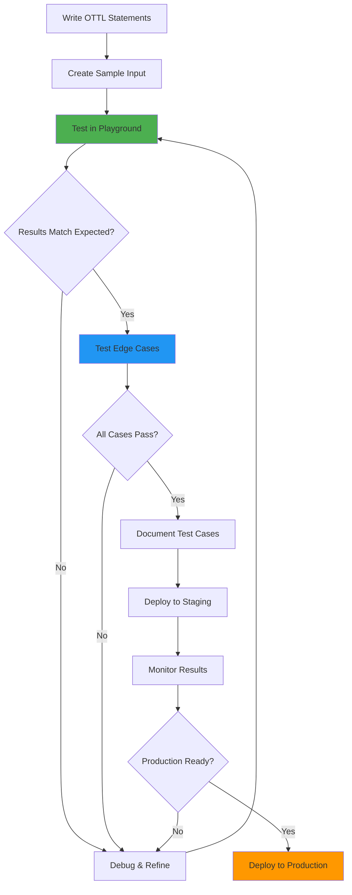

# How to Use the OTTL Playground to Test OpenTelemetry Collector Transformations

Author: [nawazdhandala](https://www.github.com/nawazdhandala)

Tags: OpenTelemetry, Collector, OTTL, Testing, Playground, Development, Transform Processor

Description: Learn how to use the OTTL Playground to test and validate your OpenTelemetry Collector transformations before deploying them to production environments.

Testing telemetry transformations before deploying them to production is critical for ensuring data quality and preventing data loss. The OTTL (OpenTelemetry Transformation Language) Playground provides an interactive environment where you can test your transformations with sample data, validate complex logic, and iterate quickly without affecting your production systems.

## Why Use the OTTL Playground?

Testing transformations in production is risky and inefficient. The OTTL Playground offers several advantages:

- **Immediate Feedback**: See transformation results instantly without deploying
- **Safe Experimentation**: Test risky transformations without affecting production data
- **Rapid Iteration**: Quickly refine your OTTL statements based on results
- **Debugging**: Identify issues with transformations before deployment
- **Learning**: Explore OTTL capabilities and syntax in a forgiving environment
- **Documentation**: Generate examples for team knowledge sharing

## Accessing the OTTL Playground

The OTTL Playground is available as a web-based tool that you can access through your browser. Some observability platforms also provide built-in OTTL testing environments.

For local development, you can also run the OpenTelemetry Collector with the debug exporter to test transformations:

```yaml
# Local testing configuration
receivers:
  otlp:
    protocols:
      grpc:
        endpoint: localhost:4317

processors:
  transform:
    log_statements:
      - context: log
        statements:
          # Your OTTL statements to test here
          - set(attributes["test"], "value")

exporters:
  # Debug exporter shows transformation results
  debug:
    verbosity: detailed

service:
  pipelines:
    logs:
      receivers: [otlp]
      processors: [transform]
      exporters: [debug]
```

## Understanding the Playground Interface

The OTTL Playground typically consists of several key sections:

1. **Context Selector**: Choose the telemetry type (logs, traces, or metrics)
2. **Input Data Panel**: Define sample telemetry data in JSON format
3. **OTTL Statements Panel**: Write your transformation statements
4. **Output Panel**: View the transformed data
5. **Error Messages**: See any errors or validation issues

## Basic Playground Workflow

Here's the typical workflow for testing transformations:

### Step 1: Define Sample Input Data

Start by creating sample telemetry that represents your actual data:

```json
{
  "body": "User login failed for user@example.com",
  "severity_text": "error",
  "severity_number": 17,
  "attributes": {
    "service.name": "auth-service",
    "environment": "production",
    "user_id": "12345",
    "ip_address": "192.168.1.100"
  },
  "resource": {
    "attributes": {
      "service.name": "auth-service",
      "service.version": "1.2.3",
      "host.name": "auth-01"
    }
  },
  "timestamp": "2026-02-06T10:30:00Z"
}
```

### Step 2: Write OTTL Statements

Add your transformation statements:

```ottl
# Extract email from body
- set(attributes["user_email"], ExtractPatterns(body, "\\b[A-Za-z0-9._%+-]+@[A-Za-z0-9.-]+\\.[A-Z|a-z]{2,}\\b"))

# Add alert flag
- set(attributes["alert_required"], true) where severity_number >= 17

# Categorize the event
- set(attributes["event_type"], "auth_failure")
```

### Step 3: Review Output

Check the transformed output to verify your statements work as expected:

```json
{
  "body": "User login failed for user@example.com",
  "severity_text": "error",
  "severity_number": 17,
  "attributes": {
    "service.name": "auth-service",
    "environment": "production",
    "user_id": "12345",
    "ip_address": "192.168.1.100",
    "user_email": "user@example.com",
    "alert_required": true,
    "event_type": "auth_failure"
  },
  "resource": {
    "attributes": {
      "service.name": "auth-service",
      "service.version": "1.2.3",
      "host.name": "auth-01"
    }
  },
  "timestamp": "2026-02-06T10:30:00Z"
}
```

## Testing Common Transformation Scenarios

### Testing Attribute Renaming

Input data:

```json
{
  "body": "Request processed",
  "attributes": {
    "status": "200",
    "method": "GET",
    "url": "/api/users"
  }
}
```

OTTL statements to test:

```ottl
# Rename to semantic conventions
- set(attributes["http.status_code"], attributes["status"])
- delete_key(attributes, "status")
- set(attributes["http.method"], attributes["method"])
- delete_key(attributes, "method")
- set(attributes["http.url"], attributes["url"])
- delete_key(attributes, "url")
```

Expected output:

```json
{
  "body": "Request processed",
  "attributes": {
    "http.status_code": "200",
    "http.method": "GET",
    "http.url": "/api/users"
  }
}
```

### Testing JSON Parsing

Input data:

```json
{
  "body": "{\"level\":\"error\",\"message\":\"Database connection failed\",\"db\":\"users\",\"error\":{\"code\":\"CONN_TIMEOUT\",\"details\":\"Connection timeout after 30s\"}}",
  "attributes": {}
}
```

OTTL statements:

```ottl
# Parse JSON body
- set(body, ParseJSON(body)) where IsString(body)

# Extract fields to attributes
- set(attributes["log.level"], body["level"])
- set(attributes["log.message"], body["message"])
- set(attributes["db.name"], body["db"])
- set(attributes["error.code"], body["error"]["code"]) where body["error"] != nil
- set(attributes["error.details"], body["error"]["details"]) where body["error"] != nil
```

### Testing Conditional Logic

Input data (create multiple test cases):

```json
{
  "body": "Request completed",
  "severity_number": 17,
  "attributes": {
    "environment": "production",
    "http.status_code": "500",
    "duration_ms": "1500"
  }
}
```

OTTL statements:

```ottl
# Severity-based classification
- set(attributes["priority"], "high") where severity_number >= 17
- set(attributes["priority"], "medium") where severity_number >= 9 and severity_number < 17
- set(attributes["priority"], "low") where attributes["priority"] == nil

# Status-based classification
- set(attributes["status_type"], "success") where Int(attributes["http.status_code"]) >= 200 and Int(attributes["http.status_code"]) < 300
- set(attributes["status_type"], "client_error") where Int(attributes["http.status_code"]) >= 400 and Int(attributes["http.status_code"]) < 500
- set(attributes["status_type"], "server_error") where Int(attributes["http.status_code"]) >= 500

# Performance classification
- set(attributes["performance"], "slow") where Int(attributes["duration_ms"]) > 1000

# Alert logic
- set(attributes["alert"], true) where attributes["environment"] == "production" and (attributes["status_type"] == "server_error" or attributes["performance"] == "slow")
```

### Testing Redaction

Input data:

```json
{
  "body": "User authentication: email=user@example.com, password=secret123, api_key=ak_live_12345abcde, card=4532-1234-5678-9010",
  "attributes": {}
}
```

OTTL statements:

```ottl
# Redact sensitive information
- replace_pattern(body, "password=[^,\\s]+", "password=[REDACTED]")
- replace_pattern(body, "api_key=[^,\\s]+", "api_key=[REDACTED]")
- replace_pattern(body, "\\b\\d{4}[- ]?\\d{4}[- ]?\\d{4}[- ]?\\d{4}\\b", "****-****-****-****")

# Extract email before redacting
- set(attributes["user_email"], ExtractPatterns(body, "\\b[A-Za-z0-9._%+-]+@[A-Za-z0-9.-]+\\.[A-Z|a-z]{2,}\\b"))
```

## Creating Comprehensive Test Suites

For production deployments, create multiple test cases covering different scenarios:

### Test Case 1: Happy Path

```json
{
  "body": "User login successful",
  "severity_text": "info",
  "attributes": {
    "user_id": "12345",
    "environment": "production"
  }
}
```

### Test Case 2: Error Scenario

```json
{
  "body": "Database query failed: timeout",
  "severity_text": "error",
  "severity_number": 17,
  "attributes": {
    "query_duration_ms": "30000",
    "environment": "production"
  }
}
```

### Test Case 3: Missing Data

```json
{
  "body": "Event occurred",
  "attributes": {}
}
```

### Test Case 4: Edge Cases

```json
{
  "body": "",
  "severity_number": 0,
  "attributes": {
    "user_id": null,
    "environment": ""
  }
}
```

Test each case with your OTTL statements to ensure they handle all scenarios gracefully.

## Testing Complex Transformation Pipelines

For complex pipelines with multiple transformation steps, test them incrementally:

```ottl
# Step 1: Parse JSON (test this first)
- set(body, ParseJSON(body)) where IsString(body)

# Step 2: Extract basic fields (test with Step 1)
- set(attributes["level"], body["level"])
- set(attributes["message"], body["message"])

# Step 3: Extract nested fields (test with Steps 1-2)
- set(attributes["error.code"], body["error"]["code"]) where body["error"] != nil

# Step 4: Apply conditional logic (test with Steps 1-3)
- set(attributes["alert"], true) where attributes["level"] == "error"

# Step 5: Clean up (test complete pipeline)
- delete_key(attributes, "temp_field")
```

Test each step individually, then together, to isolate any issues.

## Debugging with the Playground

### Identifying Parsing Errors

If parsing fails, test with simpler input:

```json
{
  "body": "{\"simple\": \"test\"}",
  "attributes": {}
}
```

Then gradually add complexity:

```json
{
  "body": "{\"nested\": {\"field\": \"value\"}}",
  "attributes": {}
}
```

### Testing Nil Handling

Create test cases specifically for nil values:

```json
{
  "body": "Test log",
  "attributes": {
    "field1": null,
    "field2": ""
  }
}
```

Test your nil checks:

```ottl
# This should not error
- set(attributes["extracted"], attributes["field1"]) where attributes["field1"] != nil

# This should execute
- set(attributes["has_field2"], true) where attributes["field2"] != nil
```

### Validating Type Conversions

Test type conversion functions:

```json
{
  "body": "Test",
  "attributes": {
    "status_code": "200",
    "duration": "123.45",
    "is_error": "true"
  }
}
```

```ottl
# Test integer conversion
- set(attributes["status_int"], Int(attributes["status_code"]))

# Test float conversion (if available)
- set(attributes["duration_float"], Int(attributes["duration"]))

# Test boolean logic
- set(attributes["error_flag"], attributes["is_error"] == "true")
```

## Best Practices for Using the Playground

### 1. Use Realistic Sample Data

Base your test data on actual logs from your systems:

```bash
# Export a sample log from your collector for testing
kubectl logs pod-name -n namespace | head -n 1 | jq '.'
```

Use this real data in the playground to ensure your transformations work with production format.

### 2. Test Edge Cases

Always test boundary conditions:

- Empty strings
- Nil/null values
- Very long strings
- Special characters
- Nested structures at maximum depth
- Arrays with zero, one, and many elements

### 3. Validate Performance

While the playground doesn't measure performance directly, you can estimate complexity:

```ottl
# Simple, fast operations
- set(attributes["simple"], "value")

# More complex regex operations (slower)
- replace_pattern(body, "complex(regex|pattern)*", "replacement")

# Nested field access (medium complexity)
- set(attributes["field"], body["level1"]["level2"]["level3"])
```

Minimize complex operations for better collector performance.

### 4. Document Your Test Cases

Keep a collection of test cases for your transformations:

```yaml
# test-cases.yaml
test_cases:
  - name: "Parse JSON log"
    input:
      body: '{"level":"error","message":"Failed"}'
    expected:
      attributes:
        level: "error"
        message: "Failed"

  - name: "Handle missing fields"
    input:
      body: '{"message":"Test"}'
    expected:
      attributes:
        message: "Test"
        level: null  # Should not be set
```

### 5. Test Transformation Order

Order matters in OTTL. Test that transformations execute in the correct sequence:

```ottl
# Test: Does this extract before deletion?
- set(attributes["backup"], attributes["original"])
- delete_key(attributes, "original")

# Verify backup contains the original value
```

## Integrating Playground Testing into Development

### Create a Testing Workflow

1. **Design**: Plan transformations on paper
2. **Prototype**: Test in playground with sample data
3. **Validate**: Test all edge cases
4. **Document**: Save test cases
5. **Deploy**: Add to collector configuration
6. **Verify**: Monitor production results

### Share Test Cases with Your Team

Create a repository of test cases:

```markdown
# Transformation Test Cases

## User Email Extraction

**Input:**
```json
{
  "body": "Login from user@example.com"
}
```

**OTTL:**
```ottl
- set(attributes["email"], ExtractPatterns(body, "[a-z]+@[a-z]+\\.[a-z]+"))
```

**Expected Output:**
```json
{
  "attributes": {
    "email": "user@example.com"
  }
}
```
```

## Testing Flow Diagram

Here's how playground testing fits into the development workflow:



## Advanced Playground Techniques

### Testing with Multiple Records

Test how transformations handle batches:

```json
[
  {
    "body": "Log 1",
    "attributes": {"type": "A"}
  },
  {
    "body": "Log 2",
    "attributes": {"type": "B"}
  },
  {
    "body": "Log 3",
    "attributes": {"type": "A"}
  }
]
```

Verify conditional logic applies correctly to each record.

### Testing Resource vs. Record Attributes

Understand the difference:

```json
{
  "resource": {
    "attributes": {
      "service.name": "api",
      "service.version": "1.0"
    }
  },
  "body": "Request processed",
  "attributes": {
    "request_id": "123"
  }
}
```

```ottl
# This affects all records from this resource
- set(resource.attributes["environment"], "prod")

# This affects only this record
- set(attributes["processed"], true)
```

### Testing Transformation Reusability

Create reusable transformation patterns:

```ottl
# Reusable: HTTP status classification
- set(attributes["status_class"], Concat([Substring(String(attributes["http.status_code"]), 0, 1), "xx"], ""))
- set(attributes["is_error"], Int(attributes["http.status_code"]) >= 400)

# Reusable: Environment normalization
- set(attributes["env"], Lower(attributes["environment"]))
- set(attributes["env"], "production") where attributes["env"] == "prod"
- set(attributes["env"], "development") where attributes["env"] == "dev"
```

Test these patterns with various inputs to ensure they're truly reusable.

## Common Playground Testing Patterns

### Pattern 1: Extract-Transform-Load

```ottl
# Extract
- set(temp_data, ParseJSON(body))

# Transform
- set(attributes["field"], Upper(temp_data["value"]))

# Load (clean up)
- delete_key(temp_data, "")
```

### Pattern 2: Validate-Then-Transform

```ottl
# Validate
- set(temp_valid, body != nil and IsString(body))

# Transform only if valid
- set(body, ParseJSON(body)) where temp_valid

# Clean up
- delete_key(temp_valid, "")
```

### Pattern 3: Conditional Enrichment

```ottl
# Set flag based on conditions
- set(temp_enrich, attributes["user_id"] != nil and attributes["environment"] == "production")

# Enrich if flag is true
- set(attributes["tracking_enabled"], true) where temp_enrich
- set(attributes["analytics_enabled"], true) where temp_enrich

# Clean up
- delete_key(temp_enrich, "")
```

## Conclusion

The OTTL Playground is an essential tool for developing, testing, and validating OpenTelemetry Collector transformations. By testing transformations with realistic data before deployment, you can catch errors early, iterate quickly, and ensure your telemetry pipeline processes data correctly.

Whether you're implementing [attribute modifications](https://oneuptime.com/blog/post/rename-modify-attributes-ottl-opentelemetry-collector/view), [JSON parsing](https://oneuptime.com/blog/post/parse-json-logs-ottl-opentelemetry-collector/view), [conditional logic](https://oneuptime.com/blog/post/conditional-logic-ottl-opentelemetry-collector/view), or [log body transformations](https://oneuptime.com/blog/post/transform-log-bodies-ottl-opentelemetry-collector/view), the playground provides a safe, fast environment for testing and validation.

Make the OTTL Playground a standard part of your development workflow to build reliable, well-tested telemetry pipelines that handle production data correctly from day one.

For more information on OTTL and testing, refer to the [OpenTelemetry Collector documentation](https://opentelemetry.io/docs/collector/transforming-telemetry/).
